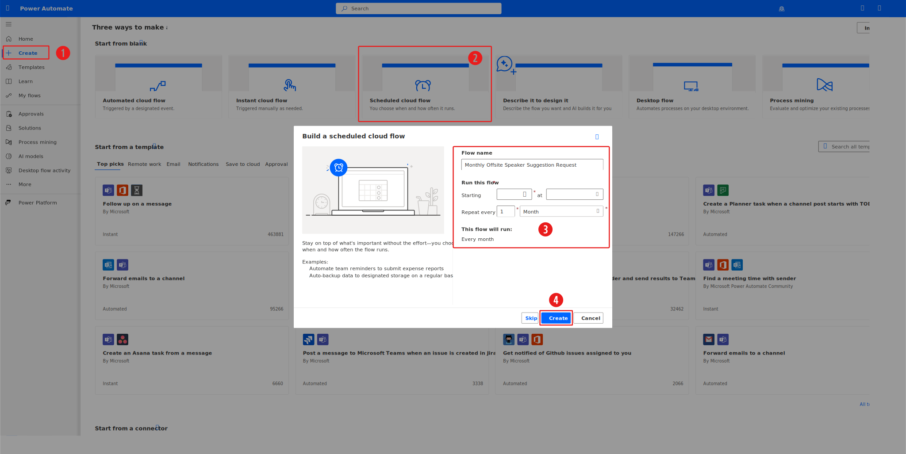

In this exercise, you apply your learned knowledge to share the card that you created in the [**Create a card to capture employee suggestions**](/training/modules/introduction-power-apps-cards/create-card-suggestions/?azure-portal=true) exercise. 

## Scenario

Your organization has multiple offsite events planned in the upcoming year. You plan to request a new list of keynote speaker suggestions from the employees prior to these events.

The events occur monthly. Your plan is to send the inquiry on the first day of each month in a Teams channel that all employees have access to.

## Preparation

Create or identify a Teams channel where you post this card. Install or confirm that Power Apps is installed in your Teams environment where the card is sent.

## Exercise steps (video)

The following video demonstrates the steps for this exercise. Detailed instructions are included in the following sections.

> [!VIDEO https://www.microsoft.com/videoplayer/embed/RW1g0l2]

## Exercise

Before you begin this exercise, sign in to [Power Automate studio](https://make.powerautomate.com/?azure-portal=true) and then select an environment where you have **Create** permissions, such as a developer environment.

To begin creating the monthly scheduled cloud flow, follow these steps:

1. Select **+ Create** from the left navigation pane.

1. Select the **Scheduled cloud flow** tile.

1. Provide a flow name and a starting date and time. Then, select **Month** as the **Repeat every** frequency option.

1. Select **Create** to complete this process.

   > [!div class="mx-imgBorder"]
   > 

Next, add the **Create card instance** action from the **Cards for Power Apps** connector after the **Recurrence** trigger. Select **Employee Suggestions** as the **Card** parameter for this action.

Add the **Post card in a chat or channel** action from the **Microsoft Teams** connector after the previous action. Select the following values as the **parameters** for this action:

1. Select **Power Apps (Preview)** from the **Post As** dropdown menu.

1. Select **Channel** from the **Post In** dropdown menu.

   > [!NOTE]
   > You can select other options if you want to send this card to a chat, for example.

1. Select the **Team** (**Group Chat** or recipient if you selected a different **Post In** parameter).

1. Select the channel where you want the card to be sent.

1. Select the **lightning bolt** icon to enter data from a previous step.

1. Select **body/Card** from the **Create card instance** action for **Card**.

   > [!div class="mx-imgBorder"]
   > 

1. Save and test the flow to avoid waiting for the schedule occurrence. The card should appear in the Teams location that you selected in the cloud flow action.

   > [!div class="mx-imgBorder"]
   > 

## Optional exercise

The following video demonstrates the steps for creating a cloud flow that sends the card that's connected to Dataverse, as explained in the optional exercise from the [**Create a card to capture employee suggestions**](/training/modules/introduction-power-apps-cards/create-card-suggestions/?azure-portal=true) unit.

> [!VIDEO https://www.microsoft.com/videoplayer/embed/RW1fXKY]

## Next steps

You've now learned how to send a card by using a Power Automate cloud flow. Next, you have the opportunity to validate the learned concepts for this module.
