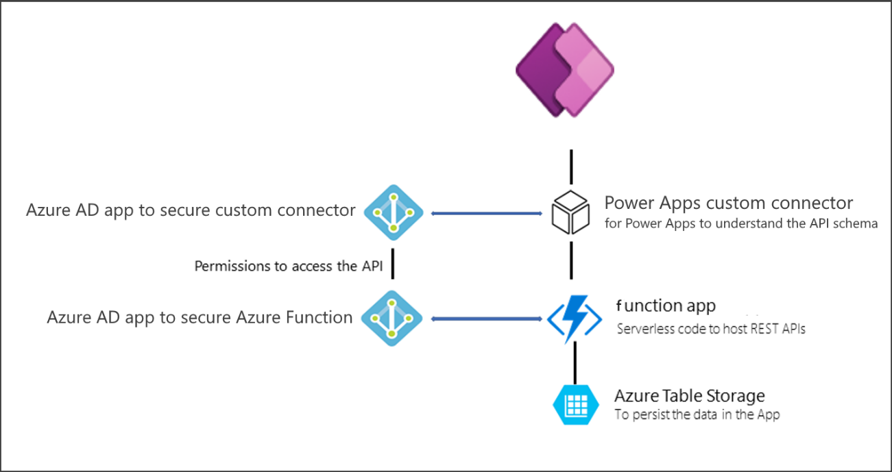

Azure cloud services provide a wealth of functionality and enable Microsoft Power Platform developers to harness its capabilities through various extensibility points. This unit reviews a few Azure technologies in the context of how they play, or potentially play, a role in a Microsoft Power Platform focused implementation. Azure includes many services, and all Microsoft Power Platform developers should be familiar with what Azure has to offer. For an overview of all Azure technologies, see the [Azure website](https://azure.microsoft.com/?azure-portal=true). For more in-depth training that will prepare you for taking the [Microsoft Azure Fundamentals exam](/certifications/exams/az-900/?azure-portal=true), consider completing the [Azure fundamentals](/training/paths/azure-fundamentals/?azure-portal=true) learning path.

Developers should become familiar with the low-code capabilities of Microsoft Power Platform, so they don't rebuild something that it already does well. If you're coming from an Azure developer background, it might be easy to start with an Azure component instead of a Microsoft Power Platform component. For example, if you were asked to build a chatbot you might first look to Azure Bot Framework. As a Microsoft Power Platform focused developer, you could first look to Power Virtual Agents to implement the chatbot. Then use an Azure Bot Framework Skill to augment the capabilities of the Power Virtual Agent chatbot that you built. Using this approach, solutions are built using the rapid application development of Microsoft Power Platform but still take advantage of the deep customizations that is possible by including Azure services and custom code.

## Azure functions

[Azure Functions](https://azure.microsoft.com/services/functions/?azure-portal=true) is a supported extensibility endpoint for Power Platform. Extracting custom logic into an Azure function enables you to offload complex logic outside of your transactional application, thus providing a much more stable and effective user experience. Azure Functions can also be used to build APIs that are exposed to Microsoft Power Platform as a custom connector. As a custom connector the Azure Function business logic can easily be invoked from apps and flows. The following diagram illustrates an application using an Azure function from a Power Apps canvas app.

> [!div class="mx-imgBorder"]
> 

## API management

[Azure API Management](https://azure.microsoft.com/services/api-management/?azure-portal=true) allows you to manage APIs across clouds and on-premises. In addition, API Management can export API definitions directly to Microsoft Power Platform. When exported, the API is configured as a custom connector available in Power Apps and Power Automate. The following video shows how to create a custom connector.

> [!VIDEO https://www.microsoft.com/videoplayer/embed/RE4XUuO]

## Service bus

[Azure Service Bus](https://azure.microsoft.com/services/service-bus/?azure-portal=true) is a reliable messaging-as-a-service (MaaS) framework that enables real-time, asynchronous messaging across systems. In specific use cases, this is a valuable feature that provides the ability to integrate with both cloud and on-premises systems in a serverless, distributed fashion.

Developers can configure Microsoft Dataverse to publish events to Azure Service Bus queues and topics. Events can be published automatically on Dataverse data modifications or on demand from developer's custom logic. 

Service bus can store the message until the consuming party is ready to receive the messages allowing you to architect solutions that are less dependent.

## Event Grid

[Event Grid](https://azure.microsoft.com/services/event-grid/?azure-portal=true) is a fully managed single service for managing routing for all events from any source for any destination. It simplifies the development of event-based applications and the creation of serverless workflows. Event Grid can be used to route events between Microsoft Power Platform and other Azure services like Azure Functions, for example.

## Logic apps

[Logic Apps](https://azure.microsoft.com/services/logic-apps/?azure-portal=true) is a cloud service that helps you schedule, automate, and orchestrate tasks, business processes, and workflows when you need to integrate apps, data, systems, and services across enterprises or organizations.

Microsoft Power Platform has Power Automate service that is built on Logic Apps and includes integration with Power Apps and Dataverse. Developers familiar with Logic Apps will find Power Automate familiar as well.

Logic Apps can be helpful as part of a Microsoft Power Platform solution when the automation needs support that isn't available in Power Automate; for example, to use the Enterprise Integration Pack or SOAP connectors. Compared to Power Automate, Logic Apps offers a different deployment and consumption model that can be more efficient in certain scenarios.

## AI services

[Azure AI Services](https://azure.microsoft.com/products/ai-services?activetab=pivot:azureopenaiservicetab&azure-portal=true) is a family of AI and cognitive APIs to help build intelligent apps. Microsoft Power Platform has the AI Builder service that implements a low code option for some of the APIs. AI Builder empowers a broader set of app builders to implement intelligent processing. Developers can help augment Microsoft Power Platform solutions with Azure AI Services when the solution requirements or usage becomes too complex for AI Builder or needs an API that AI Builder doesn't offer.

Azure AI Services includes APIs, SDKs, and services that are available to help developers add cognitive features to their applications. The Power Platform's extensibility framework makes it possible for users to incorporate these features into apps and flows. The catalog of services within Azure AI Services can be categorized into five main pillars: vision, speech, language, web search, and decision.

For more in-depth training on how to use some of the Cognitive Services features, review the various available [Learn modules and Learning Paths](/training/browse/?expanded=azure&products=ai-services) that are tagged with the AI Services product. For more information, see the [Azure AI Services Documentation](/azure/ai-services/?azure-portal=true).

## Azure Data Lake and Azure Synapse analytics

Microsoft Power Platform data seamlessly supports [Azure Data Lake storage](https://azure.microsoft.com/services/storage/data-lake-storage/?azure-portal=true) with its Microsoft Dataverse and Common Data Model framework. Building on Microsoft Power Platform enables complex analytics scenarios where you can use industrialized big data tools such as Power BI, Azure HDInsight, or Azure Synapse.

The Azure Synapse Link for Dataverse service supports initial and incremental writes for table data and metadata. Any data or metadata changes in Dataverse are automatically pushed to the Azure Synapse metastore and Azure Data Lake, depending on the configuration, without any additional action. This is a push, rather than pull, operation. Changes are pushed to the destination without you needing to set up refresh intervals.

For more information, see [What is Azure Synapse Link for Dataverse](/power-apps/maker/data-platform/export-to-data-lake/?azure-portal=true).

## Azure SQL Database

Dataverse itself is built on top of [Azure SQL Database](https://azure.microsoft.com/services/sql-database/?azure-portal=true) engine and includes a SQL data connection that provides read-only access to the table data of the target Dataverse environment. Experienced SQL Server developers can use the familiar technology to be immediately more productive with Dataverse. 

Power Apps and Power Automate can work with data in Azure SQL via the Azure SQL connector.

## Other services

Azure includes many other services that can be used to extend Power Platform functionality when required. Examples of other frequently used services include:

- App Service for cloud apps for web and mobile

- Identity Management with Microsoft Entra ID and Microsoft Entra ID B2C

- Internet of Things for integration with Microsoft Power Platform solutions like Dynamics 365 Field Service

- DevOps with reliable tools for continuous delivery

- Developer Tools

Microsoft Power Platform developers should be familiar with Azure capabilities to help building and extending effective Microsoft Power Platform solutions.
