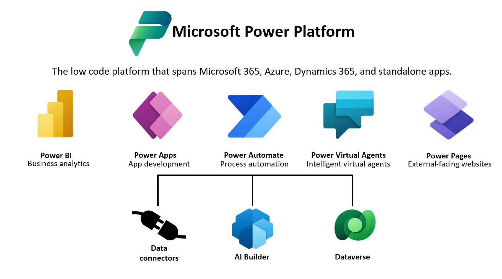

Dataverse lets you securely store and manage data that business applications use. Dataverse stores the business application data within a set of tables (formerly referred to as entities). A table is a set of rows (formerly referred to as records) and columns (formerly referred to as fields/attributes). Each column in the table stores a certain type of data, for example, name, age, salary, etc. Dataverse includes a base set of standard tables that cover typical scenarios, and you can also create custom tables specific to your organization and populate them with data using Power Query. App makers can then use Power Apps to build end-user applications that use this data.

> [!div class="mx-imgBorder"]
> 

## Benefits of Dataverse

Dataverse is built on multiple Azure data storage capabilities, including Azure SQL, Cosmos DB, and Azure storage. Dataverse abstracts the underlying technologies to provide a unified set of features that enable you to create business-focused definitions of your organization's data and business processes within various applications. Because data and metadata are both stored in the cloud, applications are simple to manage and administer. Additionally, a built-in security model allows you to control access to tables and functionality based on user's roles within your organization.

Microsoft has built several first-party apps on Dataverse, including Dynamics 365 for Sales, Service, Field Service, and Customer Insights - Journeys. By building your apps on top of the same Dataverse platform, you can extend other apps or interact with their data within Dataverse.

### Work with any type of data

Dataverse is designed to work with the most common data types and incorporates all the major categories of data technologies your organization needs: relational, nonrelational, file, image, search, and data lake. Typically, this would require developers to work with multiple APIs from different data engines. Dataverse provides a unified API in front of all data, ensuring consistent execution of any custom business logic that extends the default behavior.

Dataverse includes a set of visual designers to create, edit, and interact with data and data models. The designers make it easy to quickly define the tables, relationships, business rules, forms, views, and workflows that represent your business. Developers can also use the API to programmatically interact with the platform metadata, such as creating tables and columns.

Dataverse also supports virtual tables. Virtual tables map data in an external data source so that it appears to exist in Dataverse. Virtual tables enable Dataverse to execute real-time data operations against the external data source. Developers can create data providers using code to facilitate connecting to external data sources. More information: [Create and edit virtual tables that contain data from an external data source](/power-apps/maker/data-platform/create-edit-virtual-entities/?azure-portal=true).

### Work with any type of app

When an organization wants to create a new app, it can realize other productivity gains by using Dataverse with Power Apps. Power Apps understands the rich metadata included in Dataverse and uses it in multiple ways to help you rapidly build great-looking apps that are secure and scalable, and make them available across desktop, web, mobile, and Microsoft Teams.

For developers who want to integrate Dataverse data into existing apps or write new apps by using custom code, Dataverse provides a REST-based API to make integration easier. This REST API provides full coverage of Dataverse capabilities thus providing an unrestricted extensibility model for building fully customized experiences.

## Built-in security model

As a developer building an application, you're used to having to design and create your own security model for the application. Dataverse includes a prebuilt set of constructs to allow the configuration of an application security model. Dataverse uses role-based security to put together a collection of privileges that cover both data access with row-level granularity and business functions that can span multiple tables. These security roles can be associated directly with users, or they can be associated with Dataverse teams and business units.

Because row-level control of access may not be sufficient in some business scenarios, Dataverse has a column-level security feature to allow more granular control of security at the column level.

Dataverse also includes two security constructs that can be used for hierarchies: the manager hierarchy and the position hierarchy. With the manager hierarchy, a manager must be within the same business unit as the report, or in the parent business unit of the report's business unit, to have access to the report's data. The position hierarchy allows data access across business units. These can be helpful in building more complex security models.

Developers can also automate security tasks using the API.

## When to write code

As a Power Platform developer, you need to understand the gaps that exist between what can be accomplished through configuration versus code. Sometimes, existing features might not provide the functionality needed to meet a requirement, and Dataverse provides various extension points where developers can extend the common functionality by using code.

To identify gaps where features don't already exist, it's crucial that all Power Platform developers familiarize themselves with the capabilities of Dataverse. If you aren't familiar with building apps with Power Apps that use Dataverse, we recommend that you complete the [Create a model-driven application in Power Apps](/training/paths/create-app-models-business-processes/?azure-portal=true) learning path and [Create a canvas app from scratch using Microsoft Dataverse](/power-apps/maker/canvas-apps/data-platform-create-app-scratch/?azure-portal=true) walkthrough in the Power Apps maker documentation.

## Types of extensibility

Typically, any code-based customization activities are referred to as "extending" an application. Therefore, if you notice terms like extensibility, it generally means code in terms of Power Apps development. Within the extensibility model, activities are grouped into two broader sets: extending the user experience and extending the platform or Dataverse itself.

### Extending the user experience of Power Apps

To extend the user experience of a Power Apps app, you can use Power Apps Component Framework (PCF) to create code components that are used across all Power Apps types. Model-driven Power Apps also exposes a JavaScript client API that allows you to interact with application pages to implement business logic on the application forms.

While canvas apps don't offer scripting capabilities, their logic is built using [Microsoft Power Fx](/power-platform/power-fx/overview/?azure-portal=true). Power Fx is the low-code language that is used across Microsoft Power Platform. It's a general-purpose, strong-typed, declarative, and functional programming language. Proficient platform developers should be comfortable in using the language, editing it in source files if necessary, and able to debug the apps using tooling like Monitor. For more information, see [Overview of Power Apps with Monitor](/power-apps/maker/monitor-overview/?azure-portal=true).

TypeScript is a recommended language to use in many scripting scenarios. Because TypeScript is transpiled to JavaScript, both languages are generalized into the term of "client script." With client script, you can configure form event handlers in the same way that you would an HTML form element. You can also call script functions from within a command bar (ribbon) and can consume client script web resources from within HTML web resources.

HTML web resources are the predecessor to PCF code components and are also used to display custom presentation logic within a form in model-driven apps when more advanced requirements exist that can't be achieved by using the standard out-of-the-box forms. You might encounter these when working with apps built prior to PCF code components being available.

### Extending Dataverse 

Extending Dataverse as a platform is required whenever there's a need for some level of automation or behavior not supported by the existing features. These types of extensibility points run as server-side code through a construct called a plug-in. Power Automate and other options enable asynchronous automation and logic, but they haven't been able to do everything that plug-ins can do in terms of synchronous behavior. When requirements for synchronous operations exist within an application, plug-ins are still required. Synchronous processing by plug-ins allows any Dataverse modifications to be treated as a single unit of work in a transaction. 

Developers can also use the custom API capability to create their own APIs in Dataverse. You can consolidate one or more operations into a custom API that you can call from code, Power Apps canvas apps, or Power Automate.

Plug-in development is an essential skill and a common task that a Power Platform developer performs.

## Dataverse solutions

One of the fundamental concepts when it comes to developing and extending Dataverse is the solutions construct. Dataverse solutions are containers for apps and other components such as site maps, tables, processes, web resources, choices, flows, and more. Solutions are used to transport apps and components from one environment to another or to apply a set of customizations to existing apps. Solutions are also how the first-party apps from Microsoft and apps from independent software vendors are installed in your environment.

Solutions are the mechanism for implementing application lifecycle management (ALM) in the Power Platform. For detailed information about the solution concepts, see [Solutions in Power Apps](/power-apps/maker/data-platform/solutions-overview/?azure-portal=true) in the Dataverse documentation. Power Platform build tools can be used with Azure Dev Ops or GitHub to automate Power Platform ALM operations. For more information how solutions are used for application lifecycle management, see [Overview of ALM with Microsoft Power Platform](/power-platform/alm/overview-alm/?azure-portal=true) in Microsoft Power Platform ALM guide.

## Common Data Model overview

Microsoft has published a Common Data Model comprised of an extensible collection of schemas representing common business concepts. By using a common schema across all business applications such as Contacts, Leads, Accounts, or Products, data interoperability is greatly simplified.

The following infographic effectively represents the provided current state of the base Common Data Model schemas. The Common Data Model is an evolving ecosystem; numerous others will surface as time progresses.

> [!div class="mx-imgBorder"]
> 

## Consuming the Common Data Model

Common Data Model is influenced by data schemas that are present in Dynamics 365, covering a range of business areas. If you're a customer or a partner using Dynamics 365, you're already using the Common Data Model. Dataverse implements the Common Data Model standard entities, such as Account and Contact. Some standard entities in the Common Data Model are built into each Dataverse database. Other standard entities are installed as part of a solution, including first-party applications (such as Dynamics 365 Field Service) or industry solution accelerators (such as the Dynamics 365 Automotive Accelerator).

The Common Data Model is maintained in [GitHub](https://github.com/microsoft/CDM/?azure-portal=true). Schemas are maintained as JSON files. An entire entity reference can be found at [Overview of applicationCommon](/common-data-model/schema/core/applicationCommon/overview/?azure-portal=true). Microsoft also provides a [Visual Entity Navigator](https://microsoft.github.io/CDM/?azure-portal=true) that allows users to visually navigate Common Data Model entities.

When building against the Common Data Model, you need to understand the layering approach that is taken to build out your custom application's schema. At the base of a Common Data Model application, resides a core schema that contains commonly used entities such as Account and Contact. From there, you can layer function or industry-specific models to further accelerate the development of your own custom application, after which you can build your own models. 
