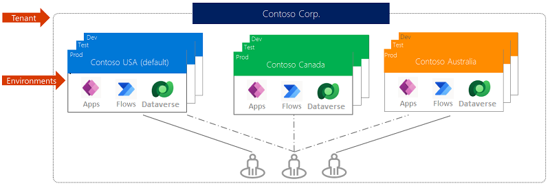
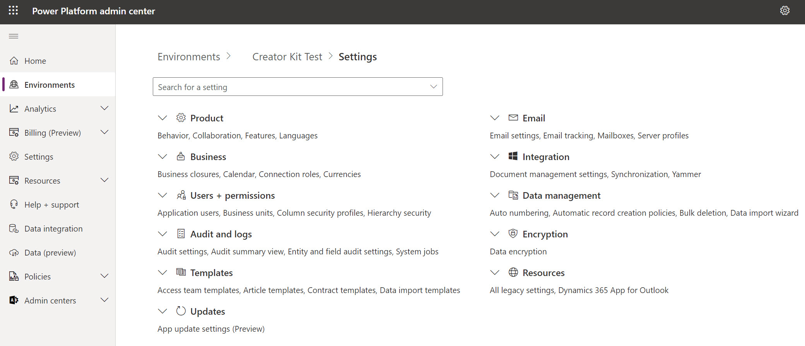

Developers building solutions for the Power Platform should understand Power Platform Environments and how to create and use them as part of building components. Developers should also be familiar with the environment settings and be able to configure their environment to support their development efforts.

Power Platform environments manage and share your organization's data, apps, automations, and other Power Platform components. An organization can have multiple Power Platform environments used for different purposes. For example, you might have some development environments where you build assets, and you might use others for testing and, finally, some to support production use of the assets. Environments can be security boundaries controlling who has access to the assets and data.

Environments are created in an Entra ID (formerly Microsoft Entra ID) tenant and are tied to a geographic location. The location also applies to the resources you create in the environment. For example, if you create an app in an environment, that app is routed only to data centers in that geographic location.

> [!div class="mx-imgBorder"]
> 

There are multiple [types of environments](/power-platform/admin/environments-overview?azure-portal=true), like developer, trial, sandbox, and production. Each has different characteristics. Developer environments are a place to build your assets. It's primarily for a solo developer to isolate their work. Some teams collaborate in an environment of type sandbox or production, depending on the required environment features. 

>[!Note]
> Environment type determines the features and capabilities of the environment and not the purpose. So you can have an environment of type production used for testing, which doesn't mean you're testing in your production environment.

Environments can be created manually via the [admin portal.](https://admin.powerplatform.microsoft.com/?azure-portal=true), using the Power Platform CLI, from PowerShell, or using the admin API. Your organization's administrator can restrict who can create the different types of environments, so you may have to collaborate with them to gain access or create the necessary environments.

## Environment settings
Each environment has its own unique settings that configure the features and behaviors of that environment. Environment settings can be configured from the environment settings option using the Power Platform admin portal.

> [!div class="mx-imgBorder"]
> 

As you can see in the above image, the settings are categorized to make it easier to locate the different settings. If you know what you are looking for, the search feature can provide a quick path to navigate directly to the setting you wish to modify. If you're new to the Power Platform, browsing the different settings pages is a good idea to get an idea of the different options you can configure. Many of the options link to additional information to allow you to learn about the setting. Often, when setting up a development environment, there can be some settings used in test and production that you want to be consistent within your development environment.

The following are some of the more common settings developers may want to adjust:

- Product->Behavior->Release Channel

- Product->Feature->Embedded Content

- Product->Feature->Hosted RPA

- Product->Feature->Power Apps component framework

- Product->Feature->Create in Dataverse solutions

- Product->Feature->TDS endpoint

- Product->Languages

- Product->Currencies

- Users + permissions

- Audit and logs -> Audit Settings
