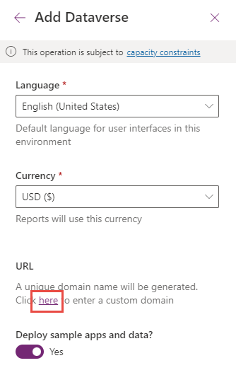
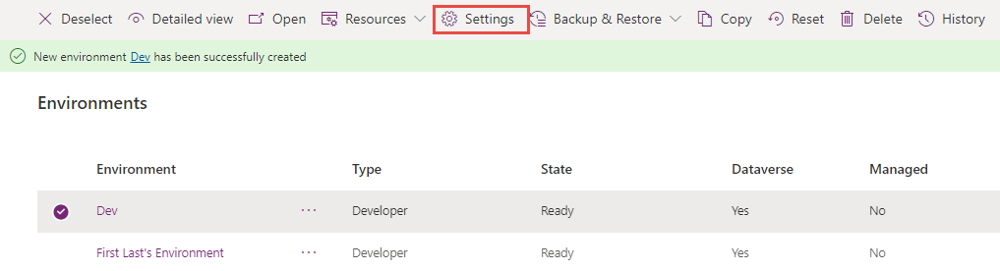

In this exercise, you'll sign up for a Power Apps Developer Plan and learn how to create Power Platform environments and configure their settings.

## Task 1: Sign up for the developer plan

1.  Navigate to [Power Apps Developer Plan](https://powerapps.microsoft.com/developerplan/?azure-portal=true) and select **Add a dev environment**.

1.  Select **Sign up for a Community Plan**.

	> [!div class="mx-imgBorder"]
	> 

1. Select your region and then **Accept**.

1. Navigate to [Power Platform admin center](https://admin.powerplatform.microsoft.com/?azure-portal=true) and select **Environments**.

1. You should see the newly created environment.

1. You'll now create a new developer environment. Select **+ New** environment button.

1. Enter **Dev** for Name, select your region, select **Developer** for Type, and then select **Next**.

1. Select a language, select a currency, select **Yes** for Deploy sample apps and data, and then select the **here** button under the **URL**.

	> [!div class="mx-imgBorder"]
	> 

1. You may provide your own unique URL here. Providing your own URL will make it easier to remember. Select **Save**

	> [!div class="mx-imgBorder"]
	> 

1. You should now see your new environment listed with the list of environments.

1. Don't navigate away from this page.

## Task 2: Review and configure environment settings

1.  Wait until the environment state changes to **Ready**. You should see a notification when your new environment is ready.

1. Select the Dev environment you created and then select the environment **Settings** button.

	> [!div class="mx-imgBorder"]
	> 

1. Take a minute or two to review all the different environment settings available to you.

1. Expand the **Audit and logs** section and select **Audit settings**.

1. Check the **Start auditing** checkbox and select **Save**.

	> [!div class="mx-imgBorder"]
	> 

1. Go back to the environment settings.

1. Expand the **Product** section and select **Features**.

1. Scroll down to the **Power Apps component framework for canvas apps** section.

1. Turn **On** Allow publishing of canvas apps with code components.

	> [!div class="mx-imgBorder"]
	> 

1. Scroll down and select **Save**.

## Task 3: Run sample Power Apps from maker portal

1.  Navigate to [Power Apps maker portal](https://make.powerapps.com/?azure-portal=true) and select the **Dev** environment you created.

1. Select **Apps**, select the **Asset Checkout** model-driven application, and then select **Edit**.

	> [!div class="mx-imgBorder"]
	> 

1. Take a few minutes to review the different areas of the model-driven app designer.

1. After you're done, select the **<-** Back button.

1. You should now be back on the list of apps. Select the **Asset Checkout** application and then select **Play** to launch the application.

1. Take some time to familiarize yourself with the user experience of the model-driven application if you're new to model-driven applications.

1. Close the model-driven application.

## Task 4: Import and review the Creator Kit

1.  Download the **Creator Kit Core** solution from [here](https://aka.ms/creatorkitdownload) and save it to your machine.

1. Download the **Creator Kit Reference (MDA)** from [here](https://aka.ms/creatorkitreferencemda) and save it to your machine.

1. Navigate to [Power Apps maker portal](https://make.powerapps.com/?azure-portal=true) and select the **Dev** environment you created.

1. Select **Solutions** and then select the **Import solution** button.

	> [!div class="mx-imgBorder"]
	> 

1. Select the **Browse** button.

1. Select the **CreatorKitCore** solution you downloaded and then select **Open**.

1. Select **Next**.

1. Select **Import** and wait for the solution import to complete. You should see a notification when the import is completed.

1.  After the solution import completes, select **Solutions** and then select the **Import solution** button again.

1. Select the **Browse** button.

1. Select the **CreatorKitReferencesMDA** solution you downloaded and then select **Open**.

1. Select **Next**.

1. Select **Import** and wait for the solution import to complete. You should see a notification when the import is completed.

1. You should now have both solutions you imported in listed in the solutions view.

	> [!div class="mx-imgBorder"]
	> 

1. Select **Apps** and launch the **Creator Kit Reference App**.

1. Select **Allow** if prompted for permission.

1. The application showcases several PCF components. Go to the **Basic** category and select **Icon**.

1. Read the description and best practices.

	> [!div class="mx-imgBorder"]
	> 

1. See the different use cases for the icon components.

1. Take a few minutes to review some of the other components.

1. You can review the code for different components on [GitHub](https://github.com/microsoft/PowerApps-Samples/?azure-portal=true).

