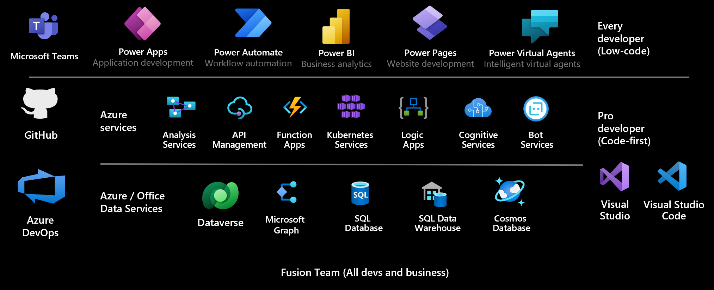

Microsoft Power Platform is a low-code platform for building business apps quickly. It includes five main components: Power Apps, Power Automate, Power BI, Power Pages, and Power Virtual Agents. You can use each Power Platform component individually or together. When used together, their design allows them to interact with each other to achieve business objectives, be it building analytics, process automation, or data-driven productivity apps.

> [!div class="mx-imgBorder"]
> 

The platform uses a low-code approach to build solutions rapidly. It allows everyone in an organization, from frontline workers to professional developers, to participate in building apps that drive positive business outcomes. Developers can work seamlessly with the makers in an organization to help fill gaps and solve complex challenges using a rich extensibility model provided by the platform components. Using native integration with Azure, developers can also use their cloud development skills to extend Microsoft Power Platform. This approach to low-code development is a transformative way to quickly achieve application development objectives within an organization.

You can be a more efficient developer by learning the basics of what the platform offers. The following is a high-level overview of the core components and their key extensibility points.

## Power Apps applications

Apps created with Power Apps are consumed by users using their desktop or mobile device. There are different types of Power Apps: canvas and model-driven.

**Canvas applications** give the maker complete control over the pixel-perfect screen contents and navigation between multiple screens. Canvas applications use connectors to work with data and services. You can embed canvas applications into SharePoint, Teams, Power BI, and Dynamics 365 applications.

**Model-driven applications** are data-driven applications that you can build on top of Microsoft Dataverse. Model-driven applications can use other data sources and services by embedding a canvas application that uses connectors to access those data sources.

The following are the key developer extensibility points for Power Apps:

-   Building custom visual controls using Power Apps Component Framework (PCF)

-   Implementing client business logic using JavaScript and the client API

-   Building custom connectors for external data sources and services using tools like Azure Functions and Azure API Management

-   Building HTML web resources

To learn about creating canvas apps, see the [Create a canvas app in Power Apps](/training/paths/create-powerapps/?azure-portal=true) learning path. For a high-level introduction on creating model-driven apps, see the [Create a model-driven application in Power Apps](/training/paths/create-app-models-business-processes/?azure-portal=true) learning path. 

## Power Automate

Power Automate is used to automate tasks and orchestrate activities across various services using connectors. Using Power Automate, you can create cloud flows or desktop flows.

**Cloud flows** can be triggered manually, configured to run when specific events occur, such as when a record is created, or scheduled to run at a specific time. Power Automate is built on top of Azure Logic Apps but offers unique integration with Microsoft Power Platform.

**Desktop flows**, as the name suggests, are used to automate repetitive interactive tasks on the web or the desktop.

The following are the key developer extensibility points:

-   Building custom connectors using tools like Azure Functions and Azure API Management

-   Use workflow definition functions to build complex expressions

To learn more about building cloud flows with Power Automate, see the [Automate a business process using Power Automate](/training/paths/automate-process-using-flow/?azure-portal=true) learning path. For an introduction to desktop flows, see the [Get started with Power Automate for desktop](/training/paths/pad-get-started/?azure-portal=true) learning path.

## Power BI

Power BI is Microsoft's business analytics solution that provides interactive data visualization BI tools to help users visualize and share data and insights across their organization.

The following are the key developer extensibility points:

-   Embed Power BI in apps, websites, and portals

-   Create custom visuals using the open-source SDK

-   Use Power BI REST API to run automatic data refresh, augmentation, and transformation processes, autoscale the resources, automate application lifecycle management (ALM), and more

-   Develop Power Query custom connectors to connect to and access data from proprietary applications, services, or data sources

For an introduction on how to create Power BI reports, see the [Create and use analytics reports with Power BI](/training/paths/create-use-analytics-reports-power-bi/?azure-portal=true) learning path.

## Power Pages 

Power Pages allow you to create external-facing business websites that allow users outside an organization to sign in with a wide variety of identities, create and view data from Dataverse, or even browse content anonymously. Makers can use low code to customize the websites, and developers can use extensibility points to handle advanced requirements.

The following are the key developer extensibility points:

-   Custom web page templates built with HTML, CSS, and Liquid

-   Create code components for websites using Power Apps component framework

-   Extend site integration with Dataverse with the Web API

-   Use Visual Studio Code and the Power Platform CLI to enable metadata editing and CI/CD (Continuous Integration/Continuous Deployment) of site configurations

To learn more about building websites with Power Pages, see the [Get Started with Power Pages](/training/paths/power-pages-get-started/?azure-portal=true) learning path.

## Power Virtual Agents

Power Virtual Agents lets you create powerful chatbots that can answer questions from your customers, other employees, or visitors to your website or service. Power Virtual Agents is built on Microsoft Bot Framework and provides a low-code experience to build and manage chatbots.

The following are the key developer extensibility points:

-   Build Bot Framework Skills

-   Extend bots with Bot Framework Composer

For an introduction on how to create Power Virtual Agent chatbots, see the [Create bots with Power Virtual Agents learning path](/training/paths/work-power-virtual-agents/?azure-portal=true).

## Connectors

Connectors are a key component allowing access to data and services. A connector is a proxy or a wrapper around an API that allows the underlying service to talk to Microsoft Power Automate, Microsoft Power Apps, and Azure Logic Apps. It provides a way for users to connect their accounts and use a set of prebuilt actions and triggers to build their apps and workflows. 

There are hundreds of prebuilt connectors available for use in apps and flows. You can build custom connectors for any REST API. Developers can also implement code that transforms request and response payloads beyond the scope of existing policy templates. 

You can learn more about custom connectors in the [connectors documentation](/connectors/?azure-portal=true) or from the [Get started with Power Automate for desktop](/training/paths/build-custom-connectors/?azure-portal=true) learning path.

## Dataverse

Dataverse is a cloud-scale data store that builds on Microsoft's data technologies and abstracts away data management complexity from the app maker. It lets you securely store and manage data that your business applications use. Business data within Dataverse is stored within a set of data tables. Role-based security allows businesses to control access to the data tables and even individual records for different users within your organization. You can define calculated table columns, business rules, workflows, and business process flows to ensure data quality and drive business processes. Developers can extend or customize Dataverse functionality by adding custom business logic.

The following are the key developer extensibility points:

-   Create plug-ins, similar to event handlers, that customize or extend Dataverse data processing with custom business logic (code)

-   Use webhooks and Azure Service Bus to integrate with external systems

-   Extend the Dataverse API with your own custom API that implements your business logic

-   Use virtual tables to integrate data stored in external systems into Dataverse without replicating the data

For a more in-depth look at Common Data Service, see the [Get started with Dataverse](/training/modules/get-started-with-powerapps-common-data-service/?azure-portal=true) module.

## Common Data Model

The Common Data Model is an open-sourced standard definition of entities that represent commonly used concepts and activities. When built with a Dataverse application, a core set of entities is available upon which application builders can add their own custom entities to support specific business scenarios.

The following are the key developer extensibility points:

-   Use the Common Data Model Library to work with data stored in Azure Data Lake.

To learn more about how to use the Common Data Model, see the [Common Data Model documentation](/common-data-model/schema/core/applicationCommon/overview/?azure-portal=true).
