In this exercise, you'll build a Dataverse custom API to execute some custom logic. You'll then use the custom API from a step in a Power Automate flow.

> [!IMPORTANT]
> Use a test environment with Microsoft Dataverse provisioned. If you do not have one you can sign up for the [community plan](https://powerapps.microsoft.com/communityplan/?azure-portal=true).

## Task 1: Create the custom API project

1.  Download and install [Power Platform CLI](https://aka.ms/PowerAppsCLI/?azure-portal=true).

1.  Run the powerapps-cli file to start installation.

1.  Use the setup wizard to complete the setup and select **Finish**.

1.  Open **Command Prompt**.

1.  Run the command below to create a new folder named **CustomAPILab**.

	`md CustomAPILab`

1.  Change directory to the folder you created.

	`cd CustomAPILab`

1.  You should now be in the CustomAPIlAB folder. Run the command below to initialize a new Dataverse plugin class library.

	`pac plugin init`

1.  Dataverse plugin class library creation should be successful.

	> [!div class="mx-imgBorder"]
	> 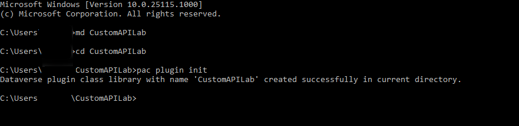

1.  Run the command below to open the project in Visual Studio.

	`start CustomAPILab.csproj`

1. The project should open in Visual Studio.

1. Right click on the Plugin1.cs file and rename it **MatchPlugin.cs**.

1. Select **Yes** to you're renaming a file dialog.

1. Right click on the CustomAPILab Project and select **Manage NuGet Packages**.

1. Search for **System.Text.RegularExpressions** and select **Install**.

	> [!div class="mx-imgBorder"]
	> 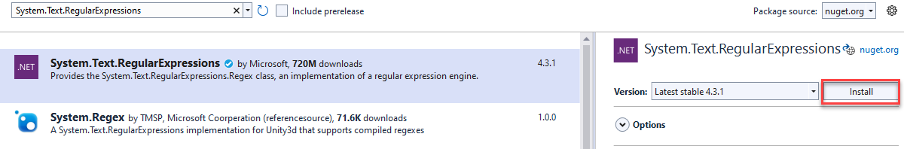

1. Open the **MatchPlugin.cs** file.

1. Add the following statement below.

	`using System.Text.RegularExpressions;`

1. Add the following lines inside the ExecuteDataversePlugin method and after the var context line. These lines get the value from the input parameters passed on the custom API invocation.

    `string input = (string)context.InputParameters["StringIn"];`

    `string pattern = (string)context.InputParameters["Pattern"];`

1. Add the following line after to get the tracing service.

	`ITracingService tracingService = (ITracingService)localPluginContext.ServiceProvider.GetService(typeof(ITracingService));`

1.  Add the below line to will Write the input value into trace.

	`tracingService.Trace("Provided input: " + input);`

2. Add the following line after to call the Regex.Match method.

    `var result = Regex.Match(input, pattern);`

1. Write the result to trace.

	`tracingService.Trace("Matching result: " + result.Success);`

1. And finally, add the following line to set the output parameter Matched.

    `context.OutputParameters["Matched"] = result.Success;`

1. Your execute method should now look like the following.

	> [!div class="mx-imgBorder"]
	> 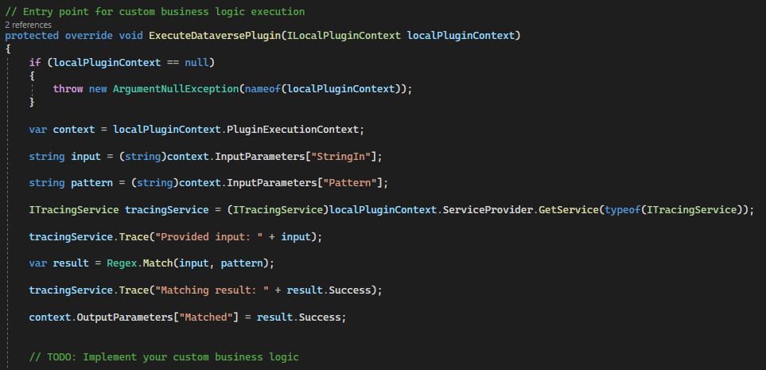

1. Select **Build > Build Solution**.

1. The project should build successfully.

## Task 2: Register the custom API plugin

1. Open command prompt and run the command below to launch the Plugin Registration Tool.

	`pac tool prt`

1.  Select **+ Create New Connection**.

1.  Select **Office 365**, provide your credentials and select **Login**.

1.  Select the correct environment.

1. Choose **Register | Register New Assembly**.

	> [!div class="mx-imgBorder"]
	> 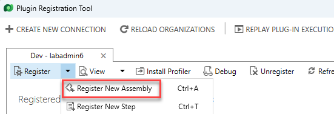

1.  Select ... and then browse to the **CustomAPILab\\bin\\Debug\\net462** folder.

1.  Select **CustomAPILab.dll**.

1.  Select **OK**.

	> [!div class="mx-imgBorder"]
	> 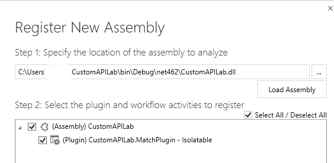

1.  Select **Register Selected Plugins**.

1. Select **OK** to the success message. Your plugin is ready to connect to the custom API we'll create in the next task.

## Task 3: Create the custom API

1.  Navigate to [Power Apps maker portal](https://make.powerapps.com/?azure-portal=true) and make sure you are in the correct environment.

1.  Select **Solutions** on the left navigation.

1.  Select **+ New Solution**.

1.  Enter **Custom API Lab** in the Display Name.

1.  Select **CDS Default Publisher** in the Publisher dropdown.

1.  Select **Create**. This creates a custom solution that will contain our components.

1.  Select **+ New | More | Other | Custom API**

1.  Enter the following information:

	- **Unique Name:** contoso_match

	- **Name**: Match

	- **Display Name:** Match

	- **Description**: Match a string

	- **Binding Type**: Global

1. In Plugin Type select the search icon and locate your plugin.

	> [!div class="mx-imgBorder"]
	> 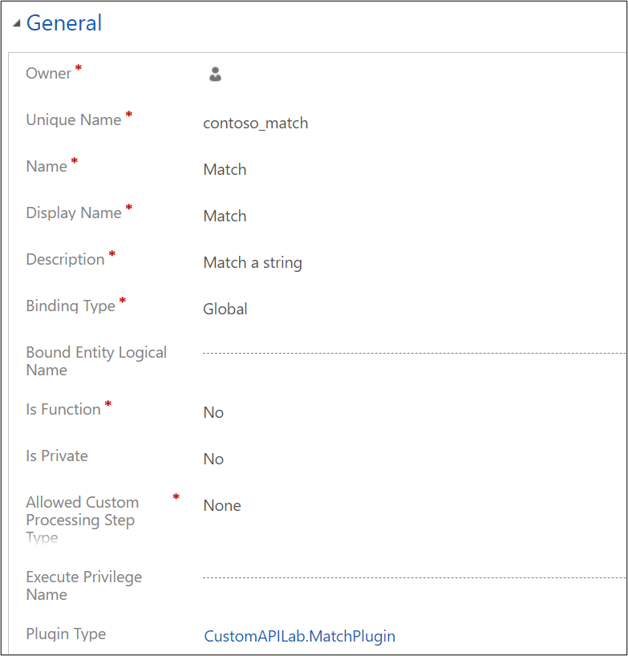

1. Select **Save and Close**.

1. Select **Done**.

1. Select **+** **New | More| Other | Custom API Request Parameter**.

1. For **Custom API**, select the **Search** icon and select **Match** (your Custom API).

1. Enter **StringIn** for Unique Name, Name, Display Name and Description for simplicity.

1. Select **String** for Type.

1. Select **Save and Close**.

1. Select **Done**.

1. Repeat steps **13-17** and add another **Custom API Request Parameter** named **Pattern**.

1. Select **New | More | Other| Custom API Response Property**.

1. For **Custom API**, select the **Search** icon and select **Match** (your Custom API).

1. Enter **Matched** for **Unique Name**, **Name, Display Name** and **Description** for simplicity.

1. Select **Boolean** for **Type**.

1. Select **Save and Close**.

1. Your solution component list should look like the following.

	> [!div class="mx-imgBorder"]
	> 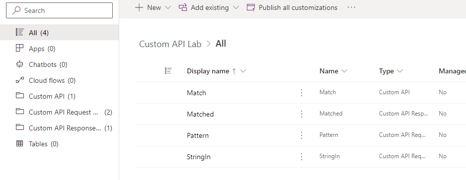

## Task 4: Use custom API from Power Automate

1.  In the solution, select **+ New | Automation | Cloud Flow | Instant**.

	> [!div class="mx-imgBorder"]
	> 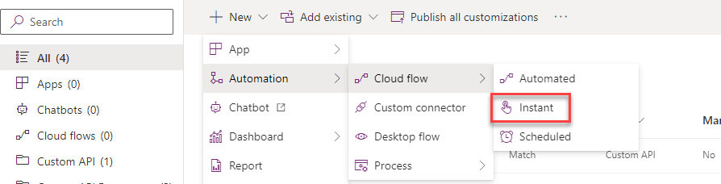

1.  Enter **String match** for Flow name, select **Manually trigger a flow** trigger, and select **Create**.

1.  Select the **+ New Step**.

1.  Search for perform and choose **Perform an unbound action**.

	> [!div class="mx-imgBorder"]
	> 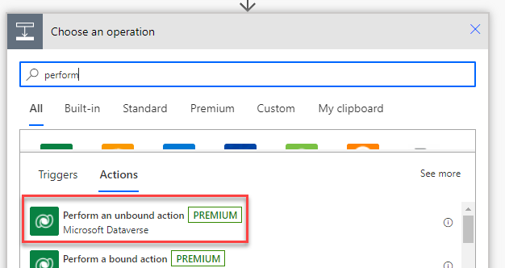

1.  In the Action Name list, locate and select **contoso_match**.

1.  Enter any valid email address in **StringIn**.

1.  Enter the following Regular expression in Pattern. This is a simple email pattern. Other [examples](https://regexlib.com/DisplayPatterns.aspx/?azure-portal=true) are available.

	`^\w+@[a-zA-Z_]+?\.[a-zA-Z]{2,3}$`

1.  Your flow should look like the following.

	> [!div class="mx-imgBorder"]
	> 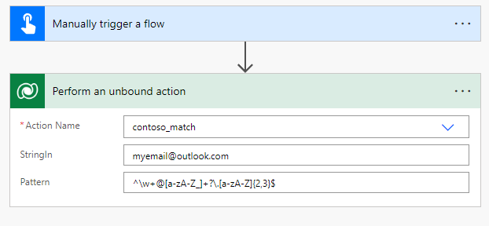

1.  Select **Save**.

1. After save is complete, select **Test**.

1. Select **Manually**, then select **Test**.

1. Select **Run flow**.

1. Select **Done**.

1. After your flow completes, select the **Perform an unbound action** to expand and see results.

	> [!div class="mx-imgBorder"]
	> 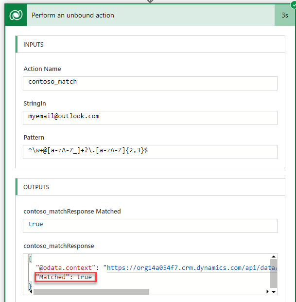

You have now completed building a custom action and using it from a Power Automate flow. The custom API action contoso_match is now also available for calling directly using the platform API.
