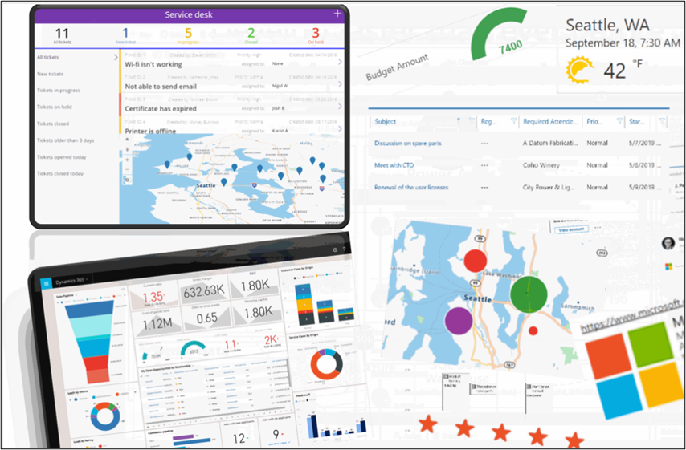
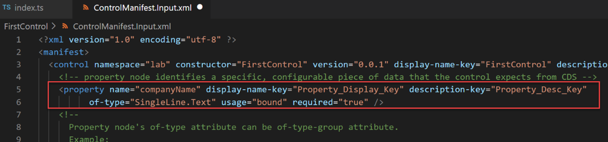

Developers are commonly involved when the desired user experience is difficult or impossible to achieve using low-code approach. Two of the most common approaches for a developer to enhance the user experience is to create a Power Apps Component Framework code component or implement some client scripting. Code components allow you to implement a custom visual that can be used by canvas or model driven apps just like any of the out of the box controls. Client scripting isn't intended to be visual but intended to implement business rules in a programmatic way. Client scripting only applies to model-driven apps. Both techniques follow prescriptive patterns and object models that you must be aware of when using either for extensibility. In the rest of this topic, we'll explore more on these options in more detail.

## Power Apps component framework

Code components are implemented using HTML, CSS, and TypeScript. While not required that you use any particular UI Framework, [React](https://reactjs.org/?azure-portal=true) is a popular choice.

> [!div class="mx-imgBorder"]
> [](../media/component-framework.png#lightbox)

To create a code component, you need to implement an interface that provides a consistent way for the hosting app to interact with your component. To start developing a code component that implements that interface you use the Power Platform command line interface (CLI) tool to initialize your component files from a template of either a column or dataset. That template contains placeholders for the required interface implementation.

The CLI tool creates a manifest file that describes what files make up your component as resources. The manifest also identifies any properties that are available for use by the application hosting the component. In the following example, a companyName property has been defined.

> [!div class="mx-imgBorder"]
> [](../media/manifest.png#lightbox)

When this component is used by app makers, they'll have options of either statically setting a value for the company name or dynamically binding it to one of the available data columns in the application. Properties allow the application and the component to communicate about data without the app having to understand the implementation of the component.

The manifest also allows you to enable features. When a feature is enabled by marking it required in the manifest the code component logic can use the native API associated with the feature. For example, enabling Device.captureAudio feature allows code control to invoke the device microphone to record audio.

`
<feature-usage>
   <uses-feature name="Device.captureAudio" required="true" />
    <uses-feature name="Device.captureImage" required="true" />
    <uses-feature name="Device.captureVideo" required="true" />
    <uses-feature name="Device.getBarcodeValue" required="true" />
    <uses-feature name="Device.getCurrentPosition" required="true" />
    <uses-feature name="Device.pickFile" required="true" />
    <uses-feature name="Utility" required="true" />
    <uses-feature name="WebAPI" required="true" />
 </feature-usage>
`

The app runtime manages the lifecycle and communication with the hosted code component. This is accomplished by your code component class implementing the StandardControl interface.

`export class FirstControl implements ComponentFramework.StandardControl<IInputs, IOutputs> {}`

This interface requires you to implement the following methods:

-   **init** - Used to initialize the component instance. Components can kick off remote server calls and other initialization actions.

-   **updateView** - This method will be called when any value in the property bag has changed. This includes column values, datasets, global values such as container height and width, offline status, component metadata values such as label, visible, etc.

-   **destroy** - This method is invoked when the component is to be removed from the DOM tree. Use it for the cleanup and to release any memory that the component is using.

-   **getOutputs (optional)** - It's called by the framework prior to a component receiving the new data. Returns an object based on nomenclature defined in the manifest, expecting objects for the property marked as bound.

Code components only require you to implement the minimum necessary to allow consistent communication and experience with the hosting app.

## Client scripting

Client scripting allows you to use JavaScript in Power Apps model-driven apps to implement business rules. Client scripting should be used as an alternative when declarative business rules don't meet the requirements. Client scripting runs on a model-driven form in response to the following form events:

-   Form load

-   Data in a column changes

-   Form is saved

In addition, a command bar button can be configured to invoke a client script when pressed.

While you're writing your logic in JavaScript, it's important to note that even though the form is just HTML you aren't allowed to directly manipulate the form contents. Client scripting provides an object model with method calls for interacting with the various form components. This ensures your business logic is insulated from any changes in the layout or specific HTML used on the form rendering.

The following is an example of client scripting that handles both form load and column change.

```
// A namespace defined for the sample code
// As a best practice, you should always define 
// a unique namespace for your libraries
var Sdk = window.Sdk || {};
(function () {
    // Define some global variables
    var myUniqueId = "_myUniqueId"; // Define an ID for the notification
    var currentUserName = Xrm.Utility.getGlobalContext().userSettings.userName; // get current user name
    var message = currentUserName + ": Your JavaScript code in action!";

    // Code to run in the form OnLoad event
    this.formOnLoad = function (executionContext) {
        var formContext = executionContext.getFormContext();

        // display the form level notification as an INFO
        formContext.ui.setFormNotification(message, "INFO", myUniqueId);

        // Wait for 5 seconds before clearing the notification
        window.setTimeout(function () { formContext.ui.clearFormNotification(myUniqueId); }, 5000);
    }

    // Code to run in the attribute OnChange event 
    this.attributeOnChange = function (executionContext) {
        var formContext = executionContext.getFormContext();

        // Automatically set some column values if the account name contains "Contoso"
        var accountName = formContext.getAttribute("name").getValue();
        if (accountName.toLowerCase().search("contoso") != -1) {
            formContext.getAttribute("websiteurl").setValue("https://www.contoso.com");
            formContext.getAttribute("telephone1").setValue("425-555-0100");
            formContext.getAttribute("description").setValue("Website URL, Phone and Description set using custom script.");
        }
    }

    // Code to run in the form OnSave event 
    this.formOnSave = function () {
        // Display an alert dialog
        Xrm.Navigation.openAlertDialog({ text: "Record saved." });
    }
}).call(Sdk);
```

You can follow the [complete walkthrough](/power-apps/developer/model-driven-apps/clientapi/walkthrough-write-your-first-client-script/?azure-portal=true) of this example for specifics on how it hooks up to the form.

Using client scripting a developer can make a form more approachable by a user by hiding and showing appropriate columns, validating data, and other common tasks required to improve the user experience.
