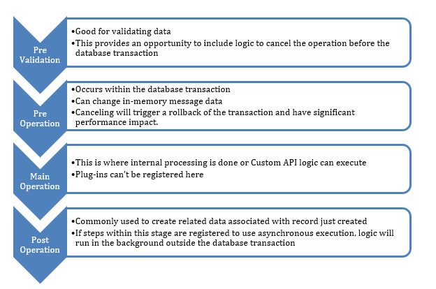

In this topic, we're going to explore the extensibility points of Dataverse available to developers. The architecture of Dataverse puts in place a message-driven architecture for processing of requests. Each request message is processed through an event pipeline that has extension points for running custom business logic implemented by plugins. There are many messages provided out of the box and each time a new table is created new messages are added to support that table. By creating a custom API, you also create a new message.

A key concept is that regardless of how data is accessed it's always processed as a message through the event pipeline, and any custom business logic is executed. This is true whether you use the user interface of an app, or one of the APIs, or perform admin operations like data import. There's no way to modify Dataverse data directly that would bypass running system or registered custom logic.

## Using the Dataverse API

Dataverse provides two styles of APIs that developers can use to interact with data: Web API and Organization Service. The following provides a high-level overview of each:

### Dataverse Web API

The [Web API](/power-apps/developer/data-platform/webapi/overview/?azure-portal=true) is available at an OData v4 RESTful endpoint. Use this for any programming language that supports HTTP requests and authentication using OAuth 2.0. Find more [examples](https://github.com/microsoft/PowerApps-Samples/tree/master/dataverse/webapi?azure-portal=true).

### Dataverse Organization Service

The [Organization Service](/power-apps/developer/data-platform/org-service/overview/?azure-portal=true) is a .NET SDK with .NET assemblies provided by Microsoft along with typed class generators for table classes. 

When the Organization Service from a Dataverse plugin the service is instantiated and available to the plugin code without the need to authenticate. To get an instance from your plugin logic, you would use the serviceProvider that is passed to the plugin to get an instance the Organization service factory (IOrganizationService). Using the factory you can get an instance of the Organization service. The following is an example from a simple plugin that gets an instance and uses it to create an account table row.

```
public void Execute(IServiceProvider serviceProvider)
{
    IPluginExecutionContext pluginContext = serviceProvider.Get<IPluginExecutionContext>();
    IOrganizationServiceFactory factory = serviceProvider.Get<IOrganizationServiceFactory>();
    IOrganizationService orgService = serviceProvider.GetOrganizationService(pluginContext.UserId);

    Entity newAccount = new Entity("account");                  
    newAccount["name"] = "Fourth Coffee";
    Guid accountid = orgService.Create(newAccount);
}
```
You can also use the Organization service outside of plugins, for example from an ASP.NET custom portal, an Azure Function, or even a console application. From these type of applications you would use the Organization Service from the Dataverse ServiceClient, which provides support for applications using .NET full framework 4.6.2, 4.7.2, 4.8 and .NET Core 3.0, 3.1, 5.0, 6.0. The ServiceClient class implements the IOrganizationService interface. The ServiceClient also implements the IOrganizationServiceAsync2, which makes asynchronous versions of the methods available also.

The following example gets an instance of ServiceClient and creates a new account table row.

```
ServiceClient serviceClient =
    new ServiceClient("Url=https://yourenv.crm.dynamics.com;AuthType=OAuth;AppId=51f81489-12ee-4a9e-aaae-a2591f45987d;RedirectUri=http://localhost ;LoginPrompt=Always");

    Entity newAccount = new Entity("account");                  
    newAccount["name"] = "Fourth Coffee";
    Guid accountid = serviceClient.Create(newAccount);
```

More [examples](https://github.com/microsoft/PowerApps-Samples/tree/master/dataverse/orgsvc?azure-portal=true) of using the organization service are available. You can also review more [details](/power-apps/developer/data-platform/xrm-tooling/use-connection-strings-xrm-tooling-connect?azure-portal=true) about connection strings and options available.

The APIs support their own approaches to building data queries in addition to supporting [FetchXML](/power-apps/developer/data-platform/use-fetchxml-construct-query/?azure-portal=true). FetchXML is a proprietary query language that is used in Dataverse. The FetchXML language allows complex queries to be crafted across related tables and use Dataverse-specific conditions and operators. The Power Automate Dataverse connector also supports FetchXML.

## Event pipeline

When you perform an action like create a record in an app or create a record using the API, a Create message is processed by Dataverse. The message is processed in the event pipeline that provides a consistent set of stages that the message goes through. Each stage except for the main operation can have a plugin attached to it to run custom logic. The following are the stages supported as a message starts at the top and progresses through the stages of the pipeline:

> [!div class="mx-imgBorder"]
> [](../media/stages.png#lightbox)

Having a strong understanding of how messages are processed can help you understand behaviors, and how and where best to implement custom logic. Understanding the pipeline is also essential to recognizing how plugins and custom APIs fit in. Read more about [event framework details](/power-apps/developer/data-platform/event-framework/?azure-portal=true).

## Building plugins

Plugins are .NET classes that implement a **IPlugin** interface provided by the Dataverse SDK assemblies. That interface requires you implement only one method named Execute. The following is an example of a minimal implementation:

```
    public sealed class MyFirstPlugin : IPlugin
    {
        public void Execute(IServiceProvider serviceProvider)
        {
               //Business Logic 
         }
    }
```

The **Execute** method has one parameter of type **IServiceProvider**. This interface has one method **GetService** that you can use to retrieve services available to a plugin. The following are examples of the services available:

-   **IPluginExecutionContext** - this gives you access to the message being processed and information about the requestor.

-   **ITracingService** - this gives you access to write to the Tracelog for diagnostic purposes.

-   **IOrganizationServiceFactory** - this gives you access to retrieve an **OrganizationService** for use in accessing data from the plugin.

The following is an example of using **GetService** to get the execution context:

```
IPluginExecutionContext context = (IPluginExecutionContext)                        serviceProvider.GetService(typeof(IPluginExecutionContext));
```

Using context.InputParameters can give you access to the originating message and context.OutputParameters can give you access to what is being returned to the caller.

A good understanding of the execution context is fundamental for a plugin developer. Learn more about the [execution context](/power-apps/developer/data-platform/understand-the-data-context/?azure-portal=true).

To have a plugin execute, it must be registered to run for a specific message. This can be accomplished using the Plugin Registration tool.

## Custom APIs

Operations in Dataverse are defined as messages. Custom APIs offer a code-first way to define new messages that you can extend Dataverse web services. These messages can then be invoked, just like the system messages, but to execute custom business logic. For example, if you have specific requirements to search for a customer using a predefined sequence of API calls then, instead of having each API caller implement that sequence, you could implement a *findcustomer* custom API. The *findcustomer* API would now implement the required logic to search for the customer and return the results. This would ensure that instead of each app having to figure out how to find a customer and doing it inconsistently they could call the custom API that would process the search requests the same way on each occasion. And if any changes are required, they would need to be implemented in one place only.

To define a new custom API, you start by creating a custom API record. This can be done through the maker portal, through code, or using Dataverse solutions. As part of creating the record you identify the custom API name, and the request and response parameters.

To implement the logic of the custom API, you create a plugin and register it on the Main Operation stage of the pipeline. Custom API implementation is the only scenario where a plugin can be registered on the Main Operation stage. You'll see an example of doing this later in the exercise. 

Once implemented you can use the custom message from the Dataverse APIs, Power Apps and Power Automate. The following is an example of using the *findcustomer* custom API from C#.

```
var req = new OrganizationRequest("fabrikam_findcustomer")
{
    ["CustomerName"] = "Contoso",
    ["CustomerAddress"] = "1 Redmond Way"
};

var resp = serviceClient.Execute(req);
```

You also can't implement a plugin and allow the custom API to be used to trigger other automation. For example, creating a Custom API that contains data about an event that occurred in another system would allow that system to call that API in Dataverse, where many different integration points with Azure, or Web Hooks, or Power Automate, or asynchronous plugins on the API will be able to initiate other automations.
