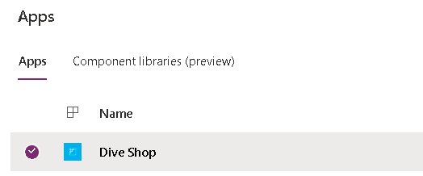
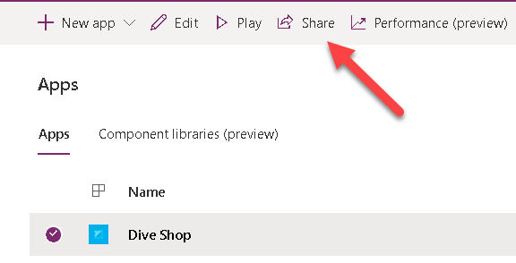
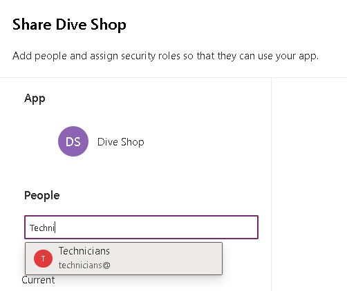
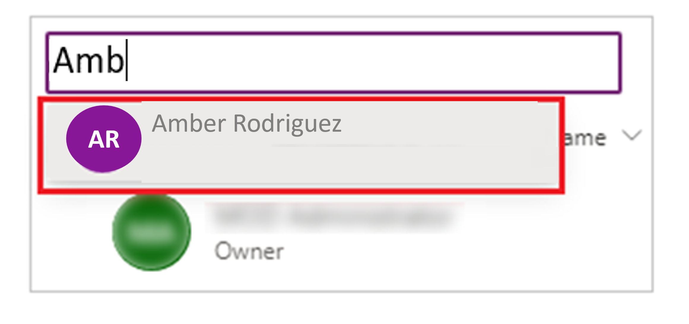
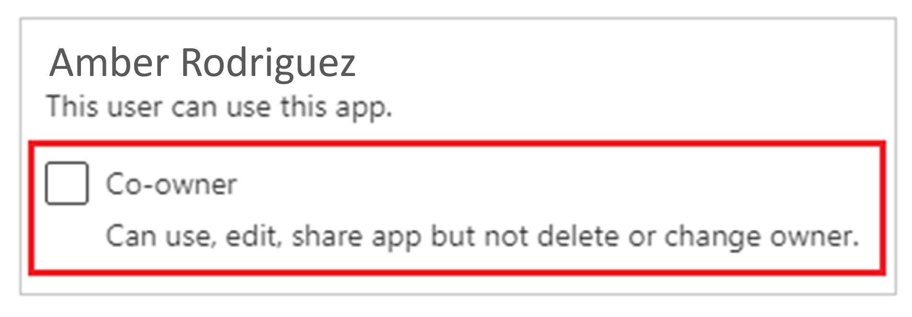
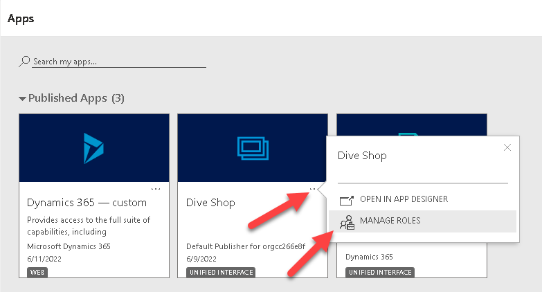

In this exercise, you specify the users whom you identified in a previous phase to run the canvas app. You can also specify who can modify the app and even reshare it with other users. Additionally, you can share the app with the entire organization if the app was built to be used by everyone.

Follow these steps to share your canvas app:

1. Sign in to [Power Apps](https://make.powerapps.com/?azure-portal=true).

1. On the left pane, select **Apps**.

   > [!div class="mx-imgBorder"]
   > 

1. Select the app that you want to share by selecting its icon.

   > [!div class="mx-imgBorder"]
   > 

1. On the command bar, select **Share**.

   > [!div class="mx-imgBorder"]
   > 

1. Specify, by name or alias, the users or security groups in Microsoft Entra ID with whom you want to share the app.

    In this case, you allow your technicians to run the app (but not modify or share it). Enter **Technicians** in the sharing panel. Users who are inside the Technicians group can find this app by setting the apps list filter to **Org apps**.

   > [!div class="mx-imgBorder"]
   > 

    You can share an app with a list of aliases, friendly names, or a combination of the two (for example, Amber Rodriguez `amber.rodriguez@contoso.com`), if the items are separated by semicolons. If several people have the same name but different aliases, the first person who's found is added to the list. A tooltip appears if a name or alias already has permission or can't be resolved.

   > [!div class="mx-imgBorder"]
   > 

   > [!NOTE]
   > You can't share an app with a distribution group in your organization or with a group outside your organization.

1. If you want to allow users to edit and share the app, select the **Co-owner** check box.

   > [!div class="mx-imgBorder"]
   > 

   In the sharing UI, you can't grant co-owner permission to a security group if you [created the app from within a solution](/power-apps/maker/canvas-apps/add-app-solution/?azure-portal=true). However, you can grant co-owner permission to a security group for apps in a solution by using the [Set-PowerAppRoleAssignment cmdlet](/powershell/module/microsoft.powerapps.administration.powershell/set-adminpowerapproleassignment/?azure-portal=true).

   > [!NOTE]
   > Regardless of the permissions, no two people can edit an app at the same time. If one person opens the app for editing, other people can run it but not edit it.

1. If your app connects to data for which users need access permissions, specify security roles as appropriate.

   For example, your app might connect to a table in a Dataverse database. When you share such an app, the sharing panel prompts you to manage security for that table.

   > [!div class="mx-imgBorder"]
   > 

   For more information, see [Manage table permissions for Dataverse](/power-apps/maker/canvas-apps/share-app?azure-portal=true#manage-table-permissions).

   If your app uses connections to other data sources, such as an Excel file that's hosted on OneDrive for Business, make sure that you share these data sources with the users you shared the app with.

   > [!div class="mx-imgBorder"]
   > 

   For more information, see [Share resources used by canvas apps](/power-apps/maker/canvas-apps/share-app-resources/?azure-portal=true).

1. If you want to help people find your app, select the **Send an email invitation to new users** check box.

   > [!div class="mx-imgBorder"]
   > 

1. In the lower part of the share panel, select **Share**.

   Now, users can run the app by using Power Apps for mobile devices on a mobile device or from the Microsoft commercial marketplace on [Microsoft 365](https://www.office.com/apps/?azure-portal=true) in a browser. Co-owners can edit and share the app in [Power Apps](https://make.powerapps.com/?azure-portal=true).

If you sent an email invitation, users can also run the app by selecting the link in the invitation email:

- If a user selects the link on a mobile device, the app opens in Power Apps for mobile devices.

- If a user selects the link on a desktop computer, the app opens in a browser.

Co-owners who receive an invitation get another link that opens the app for editing in Power Apps Studio.

## Recommended content

For more information, see the following articles:

- [Privileges required to view and access apps](/power-apps/maker/model-driven-apps/app-visibility-privileges/?azure-portal=true)

- [Share a canvas app with guest users](/power-apps/maker/canvas-apps/share-app-guests/?azure-portal=true)

## Model-driven apps

Model-driven apps use role-based security for sharing. The fundamental concept in role-based security is that a security role contains privileges that define a set of actions that users can perform on tables within the app. This approach means that, while two people are able to use the app, only one user might be able to read records or records that they've created. The other user might be able to view all records and have the rights to delete those records.

Make sure that you assign all app users with one or more predefined or custom security roles. Alternatively, you can assign security roles to teams. When a user or team is assigned to one of these roles, the person or team members are granted the set of privileges that are associated with that role.

The process for sharing a model-driven app is different from sharing a canvas app. Model-driven app sharing depends on how Microsoft Dataverse data table privileges are assigned for the tables that are in the app.

For this exercise, you grant access to your new model-driven app to any user with the **Dive Shop App Access** security role.

1. Sign in to [Power Apps](https://make.powerapps.com/?azure-portal=true).

1. On the left pane, select **Apps** and then open the model-driven app that you want to set security for.

   > [!div class="mx-imgBorder"]
   > 

1. Select the app name to open the menu of available apps.

   > [!div class="mx-imgBorder"]
   > 

1. Open the **More Options** menu (**..**.) and then select **Manage Roles**.

   > [!div class="mx-imgBorder"]
   > 

1. Select the roles that you want to grant access to and then select **Save**.

   > [!div class="mx-imgBorder"]
   > 

> [!NOTE]
> If your app contains custom tables that haven't had privileges assigned in a security role, you'll need to complete this action for users to access those records in your app. However, you don't have to create a security role if existing roles grant access to the table data in your app.

For more information, see [Share a model-driven app using Power Apps](/power-apps/maker/model-driven-apps/share-model-driven-app/?azure-portal=true).
