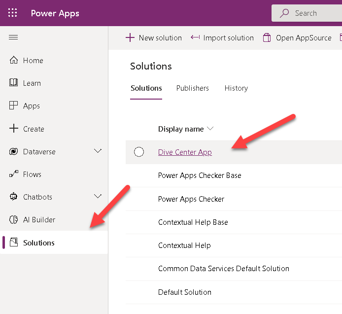
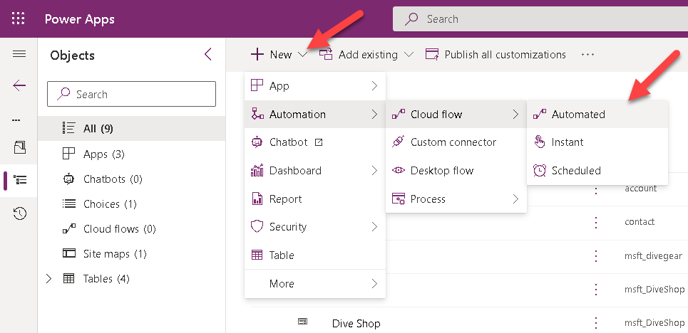
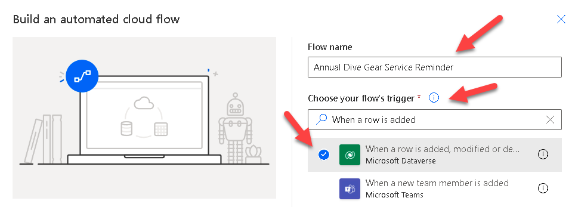
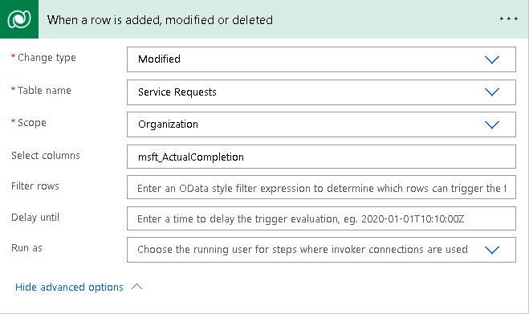
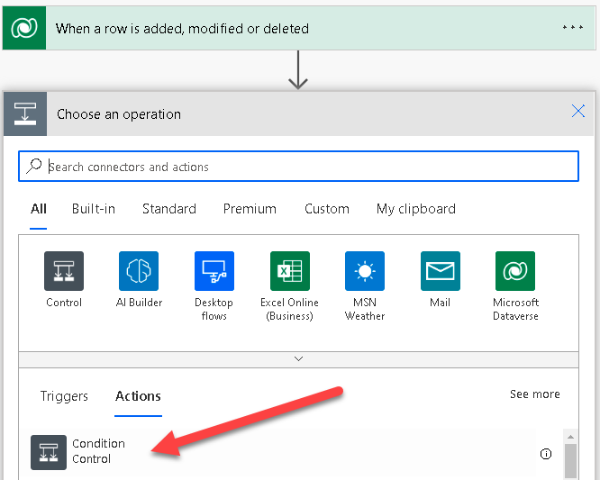

For this exercise, you create a Power Automate flow that starts automatically when a user adds a date into the **Actual Completion Date** column of the service request records in Dataverse. When a date has been added, your flow starts and waits for 11 months before it sends a reminder to your customer to bring back the gear for another service appointment.

1. Sign in to [Power Apps](https://make.powerapps.com/?azure-portal=true).

1. On the left pane, select **Solutions** and then open the **Dive Center App** solution that you previously created.

   > [!div class="mx-imgBorder"]
   > 

1. Select the **New** dropdown menu and then select **Automation > Cloud flow > Automated**.

   > [!div class="mx-imgBorder"]
   > 

1. Enter **Annual Dive Gear Service Reminder** as the flow name, search for and select the **When a row is added, modified, or deleted** trigger, and then select **Create**.

   > [!div class="mx-imgBorder"]
   > 

1. Enter details as shown in the following image.

   > [!div class="mx-imgBorder"]
   > 

1. Add a step by selecting **+ New step**.

   > [!div class="mx-imgBorder"]
   > 

1. Select **Condition** as your new step.

   > [!div class="mx-imgBorder"]
   > 

1. Select the **Actual Completion Date** column, select **is not equal to**, and then set the value as **null**.

   > [!div class="mx-imgBorder"]
   > 

1. Under **If yes**, select **Add an action**.

   > [!div class="mx-imgBorder"]
   > 

1. Search for and select **Delay**, populate the new action as shown in the following screenshot, and then select **Add an action**.

   > [!div class="mx-imgBorder"]
   > 

1. Complete the flow to send an email reminder or to send a text message reminder for the customers to call the shop and schedule their next service appointment.

## Business rules

You can create business rules and recommendations to apply logic and validations without writing code or creating plug-ins. Business rules provide a simple interface to implement and maintain fast-changing and commonly used rules.

For example, you could create a business rule to set the serial number as a required field when you're capturing some types of dive gear. Additionally, the rule could indicate that other items that don't typically get a serial number, such as masks, fins, and exposure suits, would have an optional serial number field.

You can also define business rules for a table that apply to all table forms and at the server level. Business rules that are defined for a table apply to canvas apps and model-driven apps if the table is used in the app.

For more information, see [Create a business rule for a table](/power-apps/maker/data-platform/data-platform-create-business-rule/?azure-portal=true).

### Workflows

Occasionally, you might require automation to be instantaneous, even before an action takes place, such as checking for a condition before a record is deleted or assigned to another user. A good example in this case would be to check if the customer has paid for service before you release the gear to them.

Make sure that you're careful when working with real-time workflows. For example, you can create logic in a real-time workflow that initiates an infinite loop, which consumes server resources and affects performance. The typical situation where an infinite loop might occur is when you have a real-time workflow that's set up to start when a column is updated and then updates that column in the logic of the workflow. The update action triggers the same real-time workflow that updates the record and triggers the real-time workflow continuously.

The workflows that you create include logic to detect and stop infinite loops. If a real-time workflow process is run more than periodically on a specific record in a short period of time, the process fails with the following error: **This workflow job was canceled because the workflow that started it included an infinite loop. Correct the workflow logic and try again**. The limit of times that the workflow can loop is 16.

You should be aware of more [best practices](/power-apps/maker/data-platform/best-practices-workflow-processes/?azure-portal=true) when working with real-time workflows, such as working with child workflows and keeping records of workflows that failed to be used during troubleshooting.

For more information, see [Microsoft Dataverse real-time workflows](/power-apps/maker/data-platform/overview-realtime-workflows/?azure-portal=true).

## Recommended content

For more information, see the following articles:

- [Defining the business value of solving the problem](/power-apps/guidance/planning/defining-business-value/?azure-portal=true)

- [Measuring success against the business value](/power-apps/guidance/planning/measuring-success/?azure-portal=true)
