In this exercise, you apply your learned knowledge by creating a Dive Center canvas app.

## Scenario

You work at a dive center. You manage the organization's Dataverse environment.

The service department employees require a Power Apps app that allows them to proceed with the check-in and check-out processes for customers who bring in dive gear for repairs.

To support these processes, the employees require the following features:

- A list of customers for the repair services

- The ability to store check-ins

- A list of dive gear to identify the type of equipment to be registered

The users have expressed other requests and you may also want to include the following features:

- Enable the ability to proceed with check-outs for completed service requests.

- Create new dive gear with picture, color, and gear type specified.

- Capture pictures and the type of service at time of check-in.

- Capture a signature to complete a checkout.

- Create new customers.

## Exercise

**Prerequisite**: The solution and data source referred to in this exercise are explained in the previous unit **Exercise - Prepare for the Dive Center canvas app**.

In a Dataverse environment that contains a solution where the data source for the canvas app is defined, follow these steps:

1. Create a new canvas app named **Dive Center App**.

   > [!div class="mx-imgBorder"]
   > [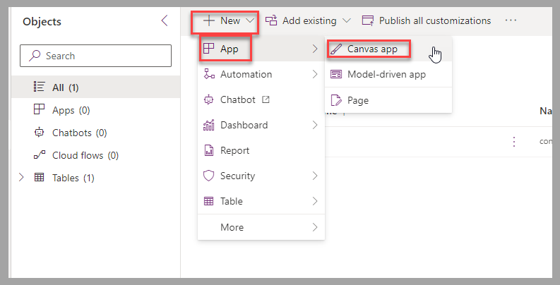](../media/create-canvas-app.png#lightbox)

   Select **phone** as the format of the canvas app.

   > [!div class="mx-imgBorder"]
   > [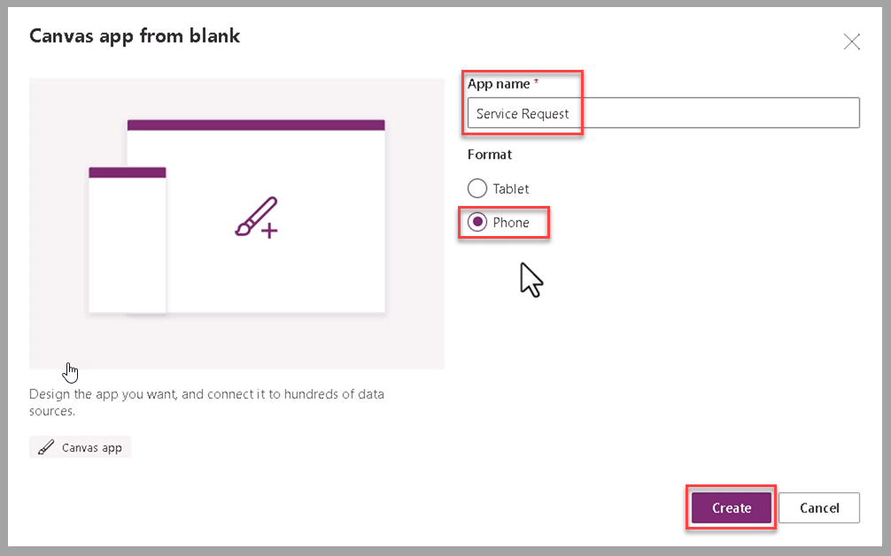](../media/select-phone-format.png#lightbox)

1. In the Power Apps canvas studio, insert an image to use as the main logo. Position and size the image based on available screen estate and other components to include in the app. You can also adjust the background of the screen to the logo color by using the **Fill** property.

   > [!div class="mx-imgBorder"]
   > [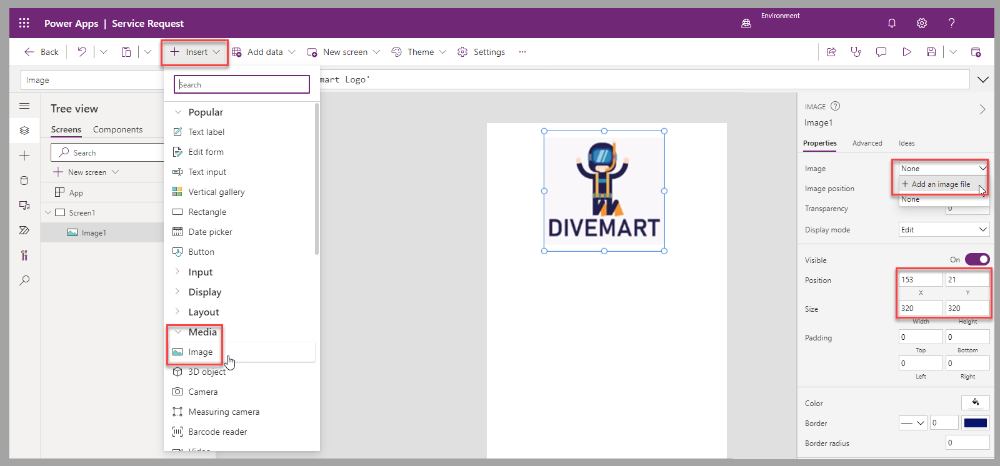](../media/add-image.png#lightbox)

1. To provide navigation to subsequent screens, add three buttons for **Check In**, **Check Out**, and **Exit**. Define colors, positions, and size based on the expected user experience.

   > [!div class="mx-imgBorder"]
   > [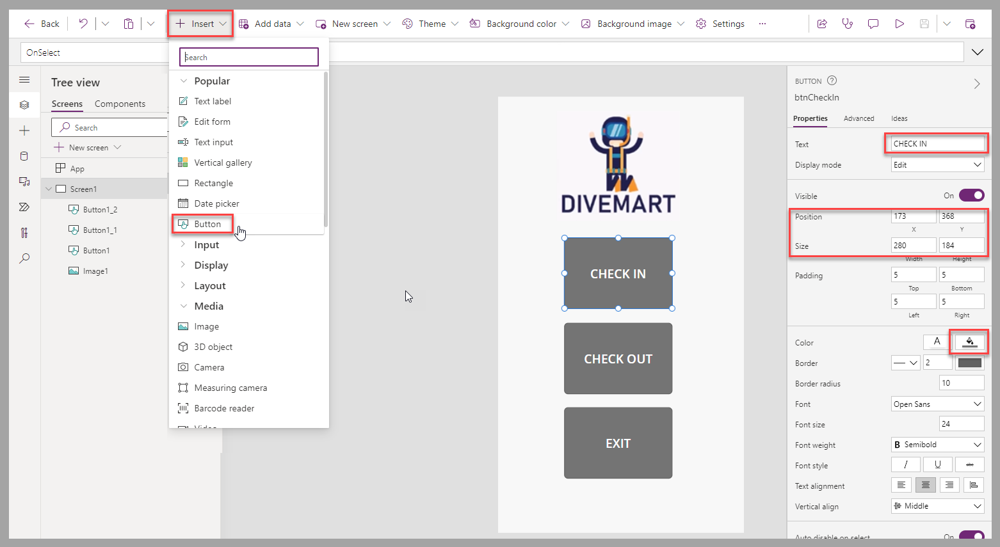](../media/add-buttons.png#lightbox)

1. Rename default controls and screens by using names that represent their usage. This is best practice to identify them more easily.

   > [!div class="mx-imgBorder"]
   > [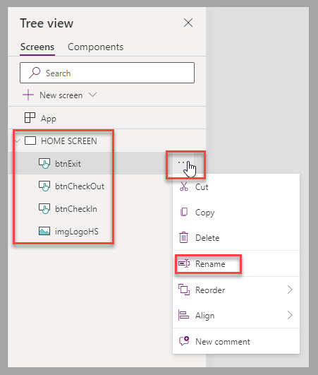](../media/rename.png#lightbox)

1. Create the check-in screen by selecting **Duplicate Screen** from the Home Screen you renamed.

   > [!div class="mx-imgBorder"]
   > [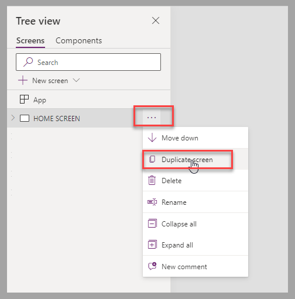](../media/duplicate-screen.png#lightbox)

1. Remove the buttons from the new screen, and then resize the main image to provide room for the form that is added for the check-in process. Rename components with names relevant to their use.

   > [!div class="mx-imgBorder"]
   > [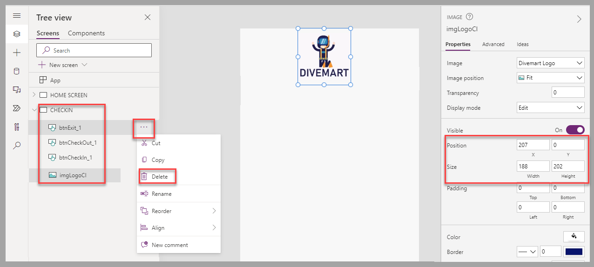](../media/clean-up-check-screen.png#lightbox)

1. Add the check-in edit form, rename it **frmCheckIn**, and connect the data source to the **Service Requests** table. Set the **Default mode** property of the form to **New**.

   > [!div class="mx-imgBorder"]
   > [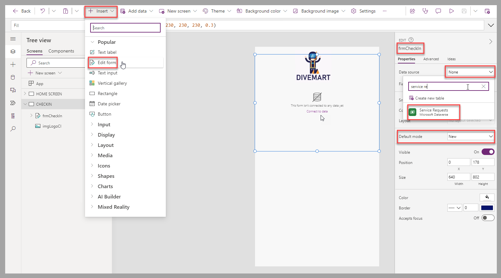](../media/connect-data-source.png#lightbox)

1. On the form, remove the fields that aren't required.

   > [!div class="mx-imgBorder"]
   > [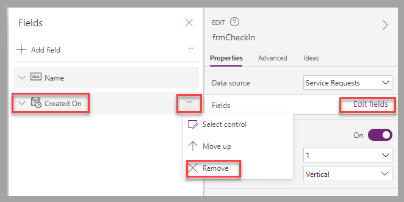](../media/remove-fields.png#lightbox)

1. Add fields to the form required for the check-in process and organize them in a logical sequence for the app users. Set the position and size of the form to render all the fields as visible.

   > [!div class="mx-imgBorder"]
   > [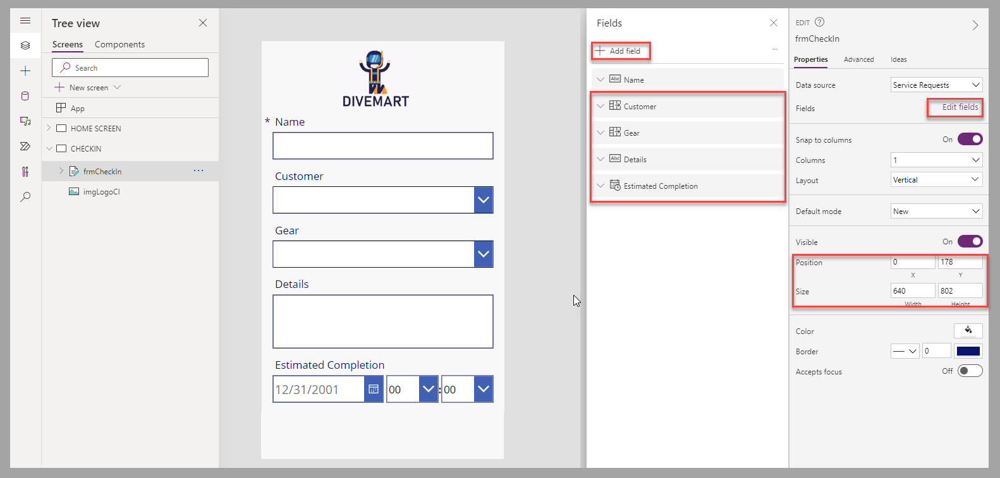](../media/add-fields.png#lightbox)

1. To provide update and navigation functionality to the users, add two buttons at the bottom of the canvas screen.

   > [!div class="mx-imgBorder"]
   > [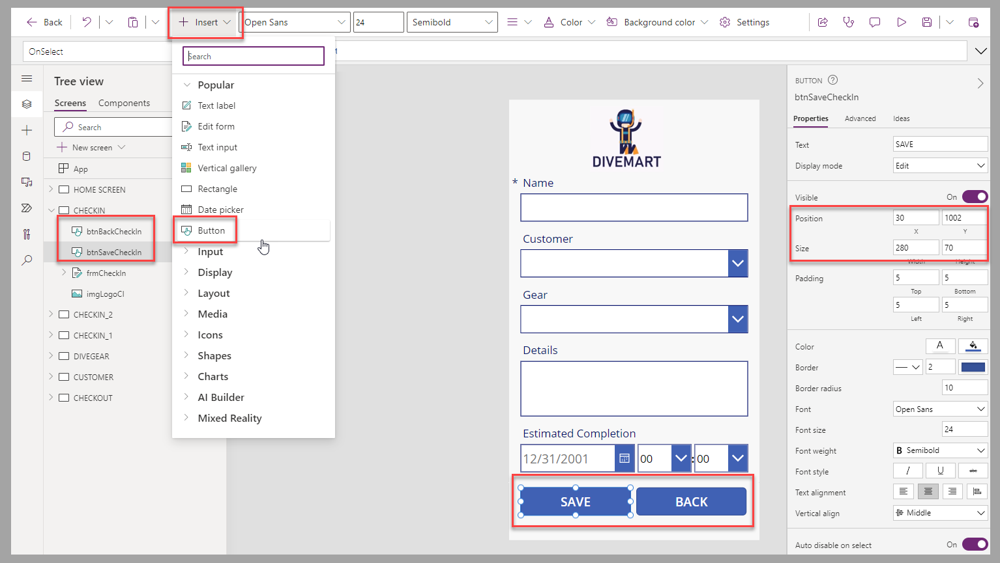](../media/add-button.png#lightbox)

1. To update the form when the **btnSaveCheckIn** button is selected and allow a new check in to be processed, enter the following PowerFx script in the **OnSelect** property of the button:

   `SubmitForm(frmCheckIn); NewForm(frmCheckIn);`

1. To navigate back to the **HOME SCREEN** when the **btnBackCheckIn** button is selected, enter the following PowerFx script in the **OnSelect** property of the button:

   `Navigate('HOME SCREEN',ScreenTransition.Fade);`

1. To navigate to the **CHECKIN** screen from the **HOME SCREEN** when the **btnCheckIn** button of the **HOME SCREEN** is selected, enter the following PowerFx script in the **OnSelect** property of the button:

   `Navigate(CHECKIN,ScreenTransition.Fade);`

1. To allow the users to close the app when the **btnExit** button of the **HOME SCREEN** is selected, enter the following PowerFx script in the **OnSelect** property of the button:

   `Exit();`

1. At this point, you can save and play the app to test the navigation between the screens and the creation of new check-in entries.

## Optional features

The following section provides the steps required to proceed with the optional features of the app. Some of these features require tables and columns defined in the unit **Exercise - Prepare for the Dive Center canvas app** earlier in this module.

### Check-out feature

To provide check-out functionality to the users of the app, follow these steps:

1. Create a duplicate of the **CHECKIN** screen and rename it **CHECKOUT**. Rename the screen components, and then perform the following actions:

    1. Edit the **frmCheckOut** properties to remove the **Name** field.

    1. Add the optional **Attachments** field.

    1. Set the size and position to allocate space for an extra component above the form.

    1. Set the **Default mode** to **View** so the form displays as Read-Only.

   > [!div class="mx-imgBorder"]
   > [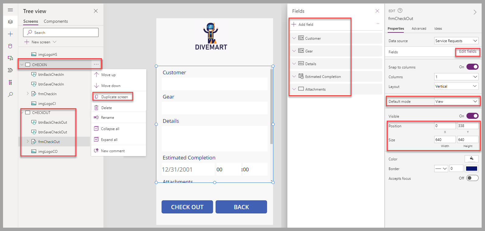](../media/duplicate-check.png#lightbox)

1. To provide a list of service requests that are available to check out, add a **Drop down** input to the screen, and then perform the following actions:

    1. Rename the drop-down to **ddServiceRequestForCheckOut**.

    1. Set the size and position to be above the **frmCheckOut** form.

    1. Set the **Items** property to the **Service Requests** table.

    1. Set the **Value** property to be the **Name** column.

   > [!div class="mx-imgBorder"]
   > [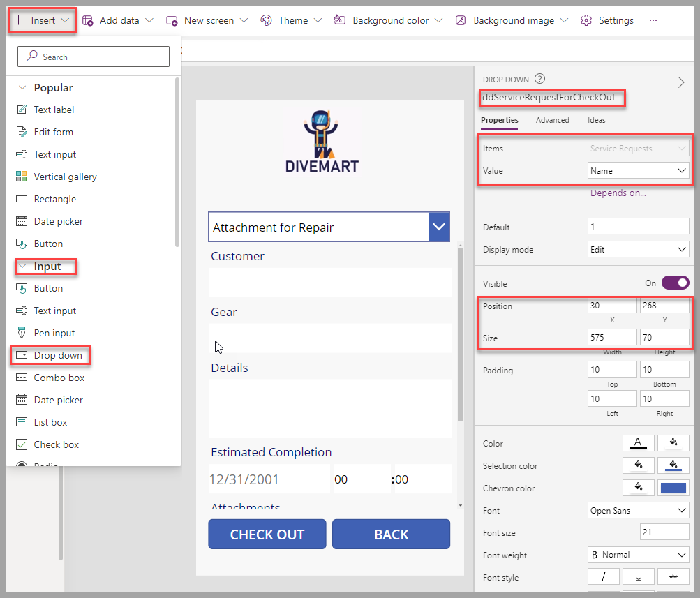](../media/list-service-requests.png#lightbox)

1. To display the selected **Service Request** from the drop-down control, enter the following PowerFx script in the **Item** property of the **frmCheckOut** form:

   `ddServiceRequestForCheckOut.Selected`

1. To display only the list of service requests that are available for checkout, enter the following PowerFx script in the **Items** property of the drop-down input:

   `Filter('Service Requests',IsBlank('Actual Completion'))`

1. So the service request appears as checked out when the **btnSaveCheckOut** button is selected, enter the following PowerFx script in the **OnSelect** property of the button:

   `Patch('Service Requests',ddServiceRequestForCheckOut.Selected,{'Actual Completion':Now()});`

1. To navigate back to the **HOME SCREEN** when the **btnBackCheckOut** button is selected, enter the following PowerFx script in the **OnSelect** property of the button:

   `Navigate('HOME SCREEN',ScreenTransition.Fade);`

1. To navigate to the **CHECKOUT** screen from the **HOME SCREEN** when the **btnCheckOut** button on the **HOME SCREEN** is selected, enter the following PowerFx script in the **OnSelect** property of the button:

   `Navigate(CHECKOUT,ScreenTransition.Fade);`

1. At this point, you can save and play the app to test the navigation between the screens and the check-out process.

### Create dive gear feature

To let users create new dive gear with color, gear type, and a picture, follow these steps:

1. Create a duplicate of the **CHECKIN** screen and rename it **DIVEGEAR**. Rename the screen components, and then perform the following actions:

    1. Edit the **frmGear** properties to use the **Dive Gear** table as the data source

    1. Select the different fields that you want to provide to the users, including the **Picture** field.

   > [!div class="mx-imgBorder"]
   > [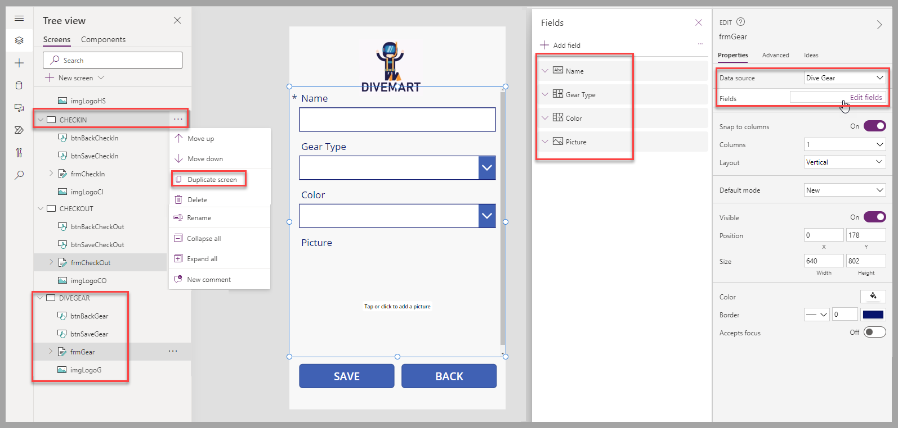](../media/duplicate-check-in.png#lightbox)

1. To create the dive gear when the **btnSaveGear** button is selected and allow creation of new dive gear, enter the following PowerFx script in the **OnSelect** property of the button:

   `SubmitForm(frmGear); NewForm(frmGear); Refresh ('Dive Gear');

1. To navigate back to the **CHECKIN** screen when the **btnBackGear** button is selected, enter the following PowerFx script in the **OnSelect** property of the button:

   `Navigate(CHECKIN,ScreenTransition.Fade);`

1. To navigate from the **CHECKIN** to the new Dive Gear creation you built, unlock the properties of the data card for the **Type of Service** field of the **frmCheckIn** form. Resize the combo box of the data card to provide space to insert an **Add** icon next to it.

   > [!div class="mx-imgBorder"]
   > [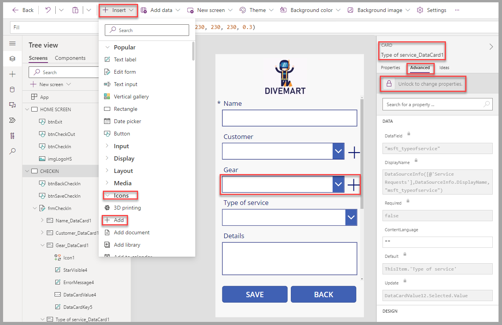](../media/create-dive-gear.png#lightbox)

1. To navigate to the **DIVEGEAR** screen, enter the following PowerFx script in the **OnSelect** property of the icon:

   `Navigate(DIVEGEAR,ScreenTransition.Fade);`

1. To ensure that the list of gear is updated when new gear is created, change the data source property of the Combo box to the **Dive Gear** table.

   > [!div class="mx-imgBorder"]
   > [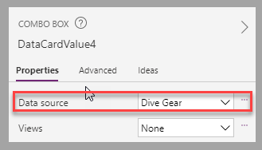](../media/data-source.png#lightbox)

1. At this point, you can save and play the app to test the navigation between the screens and the creation of new dive gear.

### Capture pictures and service type feature

To let users capture pictures and type of service at time of check-in, follow these steps:

1. Add **Type of service**, **Attachments**, and **Accepted On** as fields to the **frmCheckin** form.

   > [!div class="mx-imgBorder"]
   > [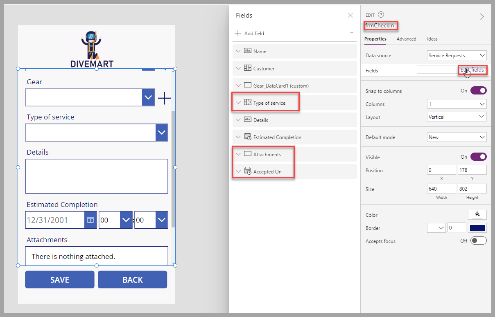](../media/add-field.png#lightbox)

1. To set the **Accepted On** value to the date and time the service request is created, unlock the **Accepted On** data card, and then set the **Update** property with the following PowerFx script:

   `Now()`

1. At this point, you can save and play the app to test the addition of pictures as attachments to the service request.

### Capture signature feature

To let users capture a signature to complete a check-out, follow these steps:

1. Add the following **Text label** controls to the **CHECKOUT** screen.

   | Name | Text | Position/Size | Other info |
   |------|------|---------------|------------|
   | lbl_greyout | \<empty> | **X**: 0 <br> **Y**: 0 <br> **Width**: 640 <br> **Height**: 1136 | **Fill**: RGBA(149,149,149,0.4) |
   | lbl_SignatureCapture | \<empty> | **X**: 0 <br> **Y**: 338 <br> **Width**: 640 <br> **Height**: 384 | **Fill**: RGBA(255, 255, 255, 1) |
   | lbl_SignatureLine | \<empty> | **X**: 0 <br> **Y**: 587 <br> **Width**: 640 <br> **Height**: 13 | **Fill**: RGBA(0,0,0,1) |
   | lbl_CustomerSignature | Customer Signature | **X**: 21 <br> **Y**: 600 <br> **Width**: 560 <br> **Height**: 70 | **Font size**: 21 |
   | lbl_OK | OK | **X**: 388 <br> **Y**: 599 <br> **Width**: 60 <br> **Height**: 70 | **Font size**: 21 |
   | lbl_Cancel | Cancel | **X**: 492 <br> **Y**: 599 <br> **Width**: 122 <br> **Height**: 70 | **Font size**: 21 |

   The result should be similar to the following screenshot.

   > [!div class="mx-imgBorder"]
   > [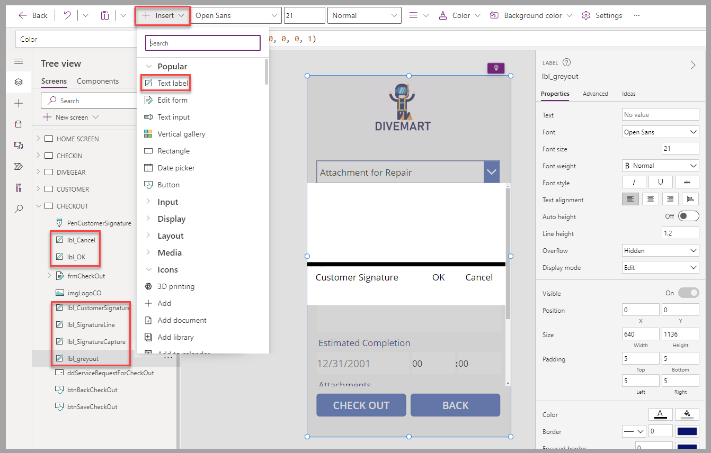](../media/add-labels.png#lightbox)

1. Add the following **Icons** controls to the **CHECKOUT** screen.

   | Name | Icon | Position/Size | Color |
   |------|------|---------------|-------|
   | ico_Cancel | Cancel | **X**: 448 <br> **Y**: 615 <br> **Width**: 35 <br> **Height**: 39 | RGBA(255,0,0,1)   |
   | ico_OK | Check | **X**: 346 <br> **Y**: 615 <br> **Width**: 35 <br> **Height**: 39 | RGBA(51,176,75,1) |

   The result should be similar to the following screenshot.

   > [!div class="mx-imgBorder"]
   > [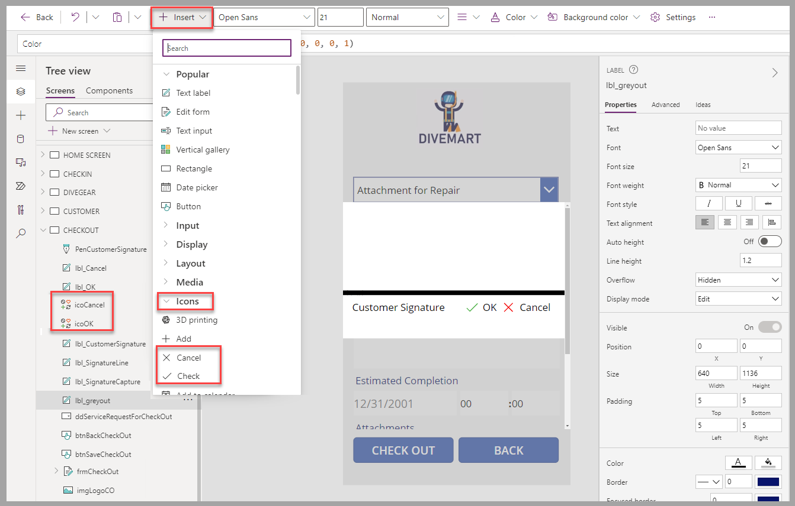](../media/add-icons.png#lightbox)

1. To capture the customer signature, add a **Pen input** control. Rename it **PenCustomerSignature** and set the properties for **Show controls** to **Off**. Set the position and size so it is above the **lbl_SignatureLine** control.

   > [!div class="mx-imgBorder"]
   > [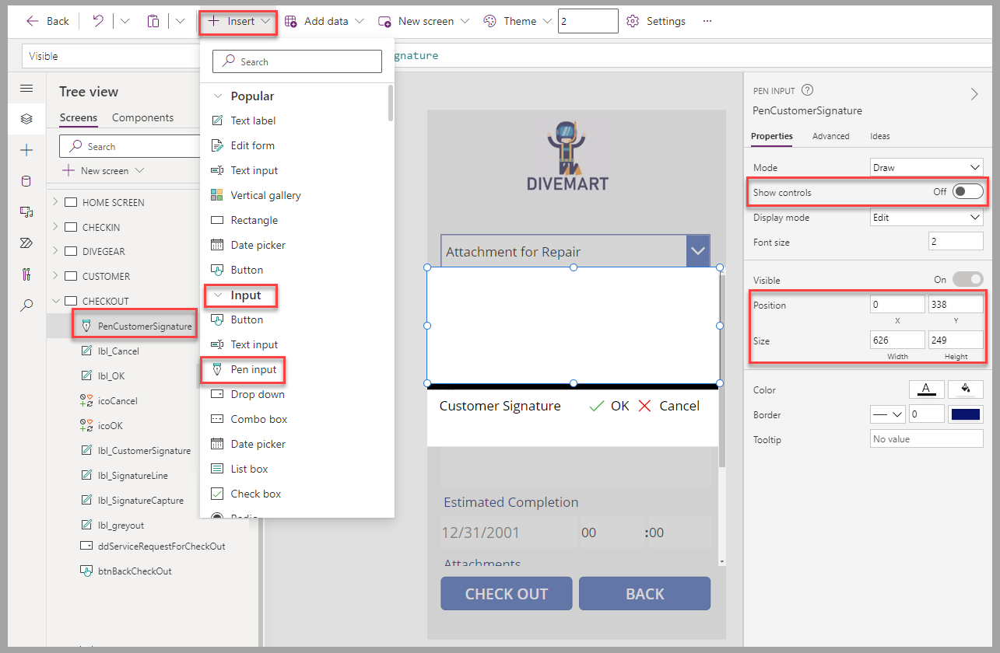](../media/pen-input.png#lightbox)

1. A variable is used to display and hide the signature-related controls based on the stage of the process. Replace the current **OnSelect** property of the **btnSaveCheckOut** button with the following PowerFx script:

   `Set(flgSignature, true);`

1. To display and hide the signature-related controls based on the status of the **flgSignature** variable, set the **Visible** property with the following PowerFx script:

   `flgSignature`

1. To provide the option to cancel the signature capture and get back to the **CHECKOUT** screen, set the **OnSelect** property of **icoCancel** with the following PowerFx script:

   `Reset(PenCustomerSignature);Set(flgSignature, false);`

1. To update the Service Request with the captured signature and complete the check-out process, set the **OnSelect** property of **icoOK** with the following PowerFx script:

   ```power-fx
   Patch('Service Requests',ddServiceRequestForCheckOut.Selected,{'Actual Completion':Now(),'Customer Signature':PenCustomerSignature.Image}); Reset(PenCustomerSignature); Set(flgSignature, false);
   ```

1. At this point, you can save and play the app to test the signature capture when checking out a service request.

### Create new customers feature

To let users create new customers from the **CHECKIN** screen, follow these steps:

1. Create a duplicate of the **CHECKIN** screen and rename it **CUSTOMER**. Rename the screen components and follow these steps:

    1. Edit the **frmCustomer** properties to use the **Contacts** table as the **Data source**

    1. Select the different fields that you want to provide to the users.

   > [!div class="mx-imgBorder"]
   > [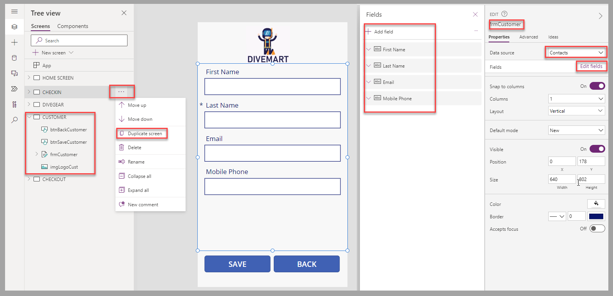](../media/duplicate-screens.png#lightbox)

1. To create the customer when the **btnSaveCustomer** button is selected and allow new customers to be created, enter the following PowerFx script in the **OnSelect** property of the button:

   `SubmitForm(frmCustomer); NewForm(frmCustomer); Refresh(Contacts);`

1. To navigate back to the **CHECKIN** screen when the **btnBackCustomer** button is selected, enter the following PowerFx script in the **OnSelect** property of the button:

   `Navigate(CHECKIN,ScreenTransition.Fade);`

1. To navigate from the **CHECKIN** to this one, unlock the properties of the data card for the **Customer** field of the **frmCheckIn** form. Resize the combo box of the data card to provide space to insert an **Add** icon next to it.

   > [!div class="mx-imgBorder"]
   > [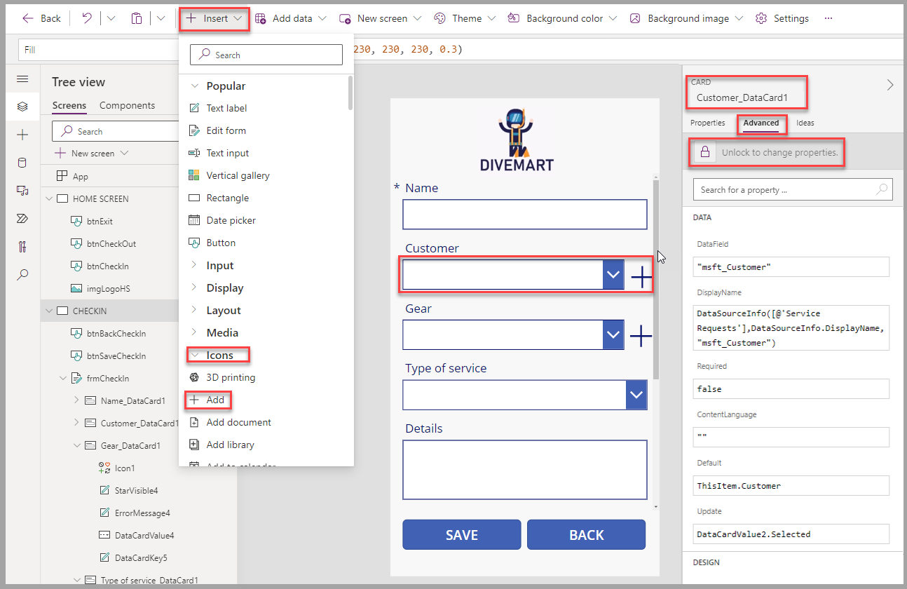](../media/customer-data-card.png#lightbox)

1. To navigate to the **CUSTOMER** screen, enter the following PowerFx script in the **OnSelect** property of the icon:

   `Navigate(CUSTOMER,ScreenTransition.Fade);`

1. To ensure that the list of customers is updated when a new customer is created, change the data source property of the Combo box to the **Contacts** table.

   > [!div class="mx-imgBorder"]
   > [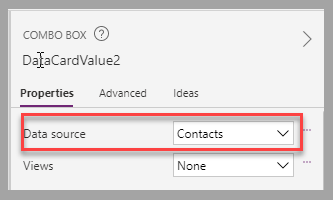](../media/data-sources.png#lightbox)

1. At this point, you can save and play the app to test the navigation between the screens and the creation of new dive gear.

## Next steps

You now have learned how to create a Dive Center canvas app. Next, you learn how to create a model-driven app.
