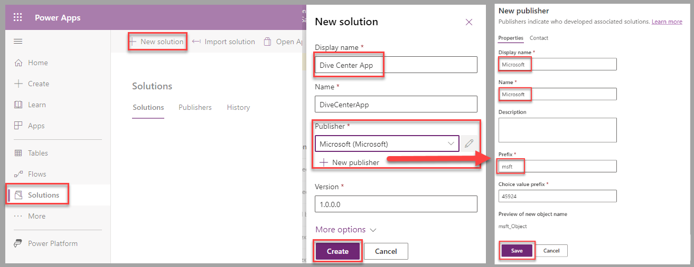
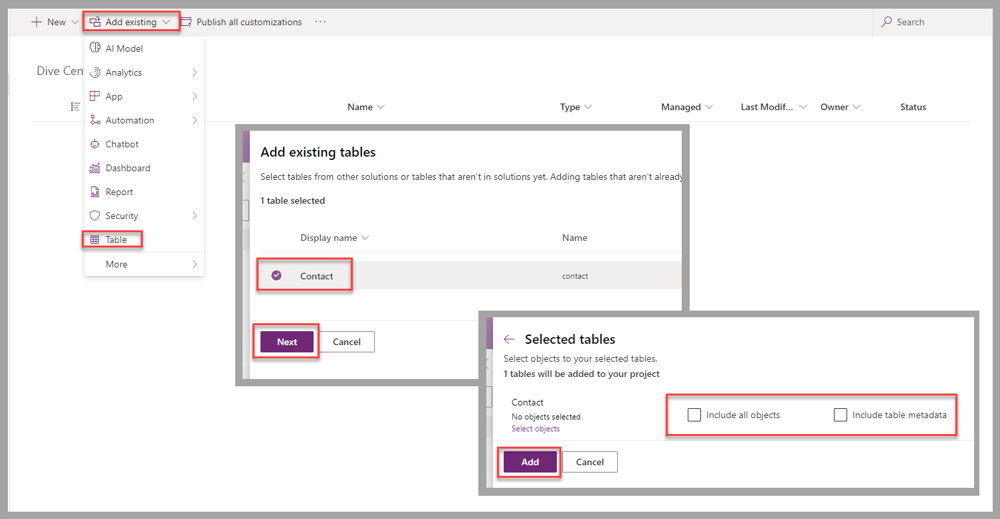
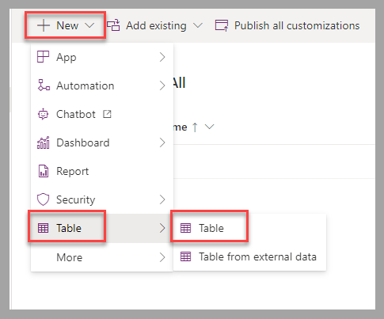
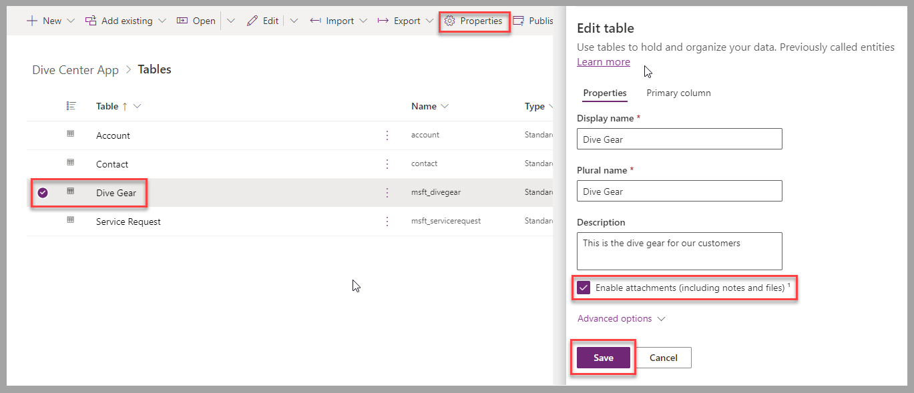

In this exercise, you apply your learned knowledge about the creation of Dataverse solutions and tables to prepare for the creation of the Dive Center canvas app.

## Scenario

You work at a dive center. You manage the organization's Dataverse environment.

The service department employees require a Power Apps app that allows them to proceed with the check-in and check-out processes for customers who bring in dive gear for repairs.

To support these processes, the employees require the following features:

- A list of customers for the repair services

- The ability to store check-ins

- A list of dive gear to identify the type of equipment to be registered

In consideration for more advanced functionalities that are covered in the "Make a canvas app" unit (next), you may also want to include the following features:

- Allow users to proceed with check-outs for completed service requests.

- Create new dive gear with picture, color, and gear type specified.

- Capture pictures and the type of service at time of check-in.

- Capture a signature to complete a check-out

- Create new customers.

## Exercise

In a Dataverse environment where you can modify tables, such as a dedicated training or development environment, follow these steps:

1. Create a new solution named **Dive Center App**. Select or create a new publisher named **Microsoft**, using the prefix **msft**.

   > [!div class="mx-imgBorder"]
   > 

1. To include the list of customers in the solution, select **Add existing**, and then select **Table** to search for the **contact** table. Only the table definition is required in the solution. You can leave the following checkboxes cleared: **Include all objects** and **Include table metadata**.

   > [!div class="mx-imgBorder"]
   > 

1. To create the **Dive Gear** and **Service Request** tables in the solution, select **+ New**, and then select **Table** on the **Table** menu.

   > [!div class="mx-imgBorder"]
   > 

1. Use the following table and column definitions to provide the required data source for the app.

   | Table | Display name | Plural Name | Other |
   |-------|--------------|-------------|-------|
   | | Dive Gear | Dive Gear | |
   | **Columns** | **Display name** | **Data type** | **Required** |
   | | Name | Single line of text | Business Required |
   | | Picture | Image | Optional |
   | **Table** | **Display name** | **Plural Name** | |
   | | Service Request | Service Requests | |
   | **Columns** | **Display name** | **Data type** | **Required** |
   | | Name | Single line of text | Business Required |
   | | Customer | Lookup (**Contact**) | Optional |
   | | Details | Multiple lines of text | Optional |
   | | Estimated Completion | Date and time | Optional |
   | | Gear | Lookup (**Dive Gear**) | Optional |

1. **Optional**: Select **Enable attachments** in the table properties to include pictures for the Service Request table.

   > [!div class="mx-imgBorder"]
   > 

1. **Optional**: Use the following column definitions to include more features for the app.

   **Feature**: Cover complete check-in/check-out process

   | Table name | Column display name | Data type | Required |
   |------------|---------------------|-----------|----------|
   | Service Request | Accepted On | Date and time | Optional |
   | Service Request | Actual Completion | Date and time | Optional |

   **Feature**: Capture signature for check-out process

   | Table name | Column display name | Data type | Required |
   |------------|---------------------|-----------|----------|
   | Service Request | Customer Signature | Image | N/A |

   **Feature**: Specify dive gear color

   | Table name | Column display name | Data type | Required |
   |------------|---------------------|-----------|----------|
   | Dive Gear | Color | Choice (create a new choice named **Gear Color**) | Optional |

   **Feature**: Group dive gear by type

   | Table name | Column display name | Data type | Required |
   |------------|---------------------|-----------|----------|
   | Dive Gear | Gear Type | Choice (create a new choice named **Gear Type**) | Optional |

   **Feature**: Group service requests by type

   | Table name | Column display name | Data type | Required |
   |------------|---------------------|-----------|----------|
   | Service Request | Type of service | Choice (create a new choice named **Type of service**) | Optional |

## Exercise steps (video)

The following video demonstrates the steps for this exercise.

> [!VIDEO https://www.microsoft.com/videoplayer/embed/RW12cmm]

## Next steps

You now have learned how to create the solution and tables required for the Dive Center canvas app. Next, you learn how to create the canvas app.
