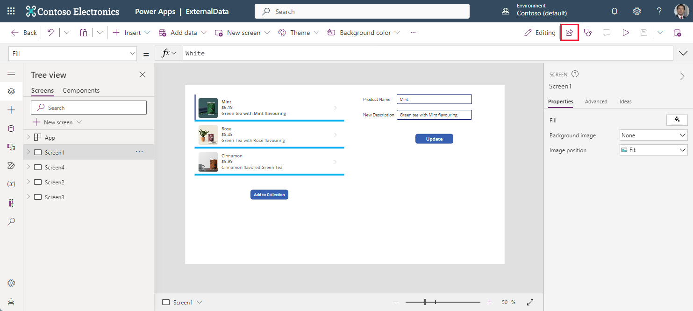
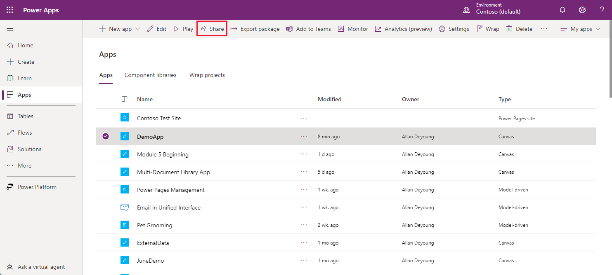
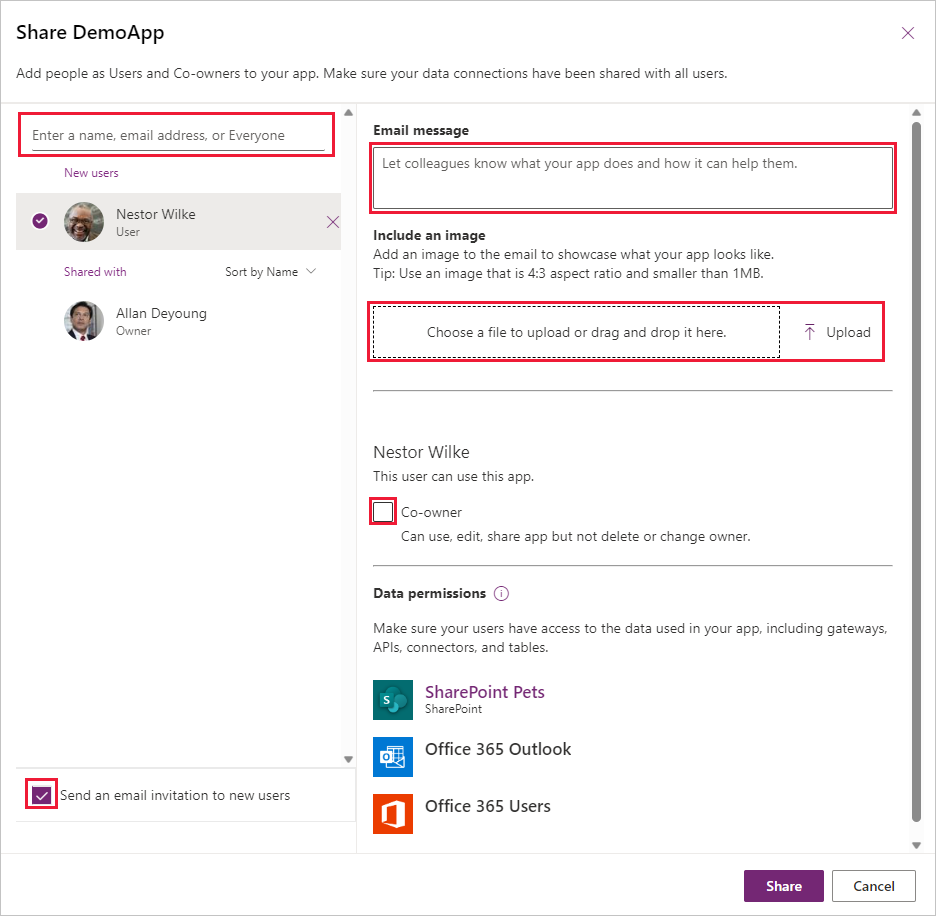

You can share an app with specific users, groups, or your whole organization. When you share an app with other people, they can run it in a browser or in Microsoft Power Apps Mobile for Microsoft Windows, Apple iOS, or Google Android.

Even better, you can give someone permission to update the app.

## Prepare to share an app

There are two basic ways to share an app. You can either open the app that you want to share in **Edit** mode or from the **Apps** tab in the maker portal.

1. If you want to share an app while editing In Power Apps Studio, select the **Share** button from the upper right side of the header ribbon. (Note: you can only share an app that has been saved)

   > [!div class="mx-imgBorder"]
   > 

    Alternatively, if you want to share an app from the **Apps** tab in the Power Apps Studio, you can select the app, and then select the **Share** button from the command ribbon.

   > [!div class="mx-imgBorder"]
   > 

    After you choose either option, the **Share** popup window appears on the right half of the screen and looks like this image below (note that your app has a different name after **Share**).

   > [!div class="mx-imgBorder"]
   > 

1. On the **Share** popup window, the top left portion allows you to use the entry field to specify the users or groups with whom you want to share the app. To add everyone in your organization, type **Everyone** and select **Everyone in [Company Name]**. If you need to share with a large group of users, a best practice is to share through a Microsoft Entra Security Group.

    Security-group considerations

    - If you share an app with a security group, existing members of that group, and anyone who joins it, have the permission that you specify for that group. Anyone who leaves the group loses that permission unless they belong to a different group that has access or if you give them permission as an individual.

    - Every member of a security group has the same permission for an app as the overall group does. However, you can specify greater permissions for one or more members of that group to allow them greater access. For example, you can give Security Group A permission to run an app, but you can also give User B, who belongs to that group, Co-owner permission. Every member of the security group can run the app, but only User B can edit it. If you give Security Group A Co-owner permission and User B permission to run the app, that user can still edit the app.

1. If you want the user to also be able to edit the app, then select the **Co-owner** check box. By default, the user receives the **User** permission. Here's a description of both permissions:

    - **Co-owner** - Users can use, edit, and share the app, but not delete or change the owner.

    - **User** - Users can use the app.

1. If your app includes any premium components such as map or address input components, your users need licensing in order to use the app. You see the option to **Request licenses**. Selecting this option sends a request to your admin. However, you can only use this option for users (not security groups or distribution lists).

1. You can also send your colleagues an email with a message including a link to the app. By default, the check box **Send an email invitation to new users** is selected for you.

1. You can add an **Email message** to your colleagues to tell them about the app by typing directly into the entry field.  You can also **Include an image** by uploading or by using drag and drop to place it into the image field.

1. Finally, select the **Share** button.

    If you make and save changes to a shared app, the people whom you shared it with see your changes as soon as you publish them. This can be useful if you improve the app, but it can also negatively affect users if you remove or significantly change features. Remember to create a notification plan for alerting your users of major updates.

## Permissions and licensing

Basic information about permissions and licensing that you should be aware of are:

- Users and contributors need permissions to any data connections and gateways that a shared app uses. Some permissions come implicitly with the app, but you must explicitly grant others. If you create an app based on Microsoft Dataverse, you must also ensure that the users you share the app with have the appropriate permissions for the table or tables on which the app relies. Specifically, those users must belong to a security role that can perform tasks such as creating, reading, writing, and deleting relevant rows. In many cases, you want to create one or more custom security roles with the exact permissions that users need to run the app. You can then assign a role to each user as appropriate.

- People who have **Co-owner** permission also need a Power Apps plan so that they can perform edits on the app.

Sharing an app is simple, and it's a great way to make an app that you find useful available to people across your organization.
