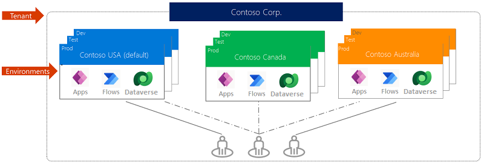

Inside of a tenant, usually at the company or organization level, reside environments. An environment is a container for apps and other resources, such as data connections and flows from Power Automate. It's a way for an organization to group items based on business requirements.

> [!div class="mx-imgBorder"]
> 

If you've followed along with this module, you've already been working in [make.powerapps.com](https://make.powerapps.com/?azure-portal=true). Therefore, you've been working in a specific environment the whole time. In the upper-right corner of the Power Apps studio, you can view your current environment. If you look just below the word "Environment," you can see which environment you're working in.

> [!div class="mx-imgBorder"]
> 

If you're new to Microsoft Power Apps, you might have only the default environment at this point. To see if there are other environments available, select the current environment name and a **Select environment** screen enables you to choose another environment.

> [!NOTE]
> If you want to work with Power Apps environments, you need a Power Apps Per app plan or Power Apps Per user plan. Additionally, if you want to work with Dynamics 365 restricted tables, you must have a Power Apps for Dynamics 365 license. To learn more, see [Licensing overview for Microsoft Power Platform](/power-platform/admin/pricing-billing-skus?azure-portal=true#licenses).

## Reasons to use environments

Reasons to create environments beyond the default one include:

- **Separate app development by department** - In a large organization, each department can work in a different environment. That way, department employees see only apps and company data that are appropriate to their needs.

- **Support application lifecycle management (ALM)** - Separate environments let you separate apps that are in development stages from ones that have already been shared. Common options include environments for development, testing and production. Additionally, you might want to use a trial environment so that you can receive feedback from employees before publishing the final app.

- **Manage data access** - Each environment can have its own source of business data.
Data connections can be made that are specific to an environment and can't be shared across environments.

> [!NOTE]
> Keep in mind that environments are relevant only to app creators and Power Apps admins. When you share an app with users, those users simply run the app, providing they have the correct permissions. In other words, they don't have to worry about what environment the app came from.

## Create an environment

Only an admin can create environments. If you aren't an admin, this information can still be helpful when you talk to your admin about setting up environments.

1. On the [make.powerapps.com](https://make.powerapps.com/?azure-portal=true) home page, select the gear (Settings) icon near the upper-right corner and then select **Admin center**.

    This action creates a new browser tab for the Power Platform admin center. You can also go directly to [https://admin.powerplatform.microsoft.com](https://admin.powerplatform.microsoft.com/?azure-portal=true)

1. From Microsoft Power Platform admin center home screen, select the **Environments** tab from the left-hand side rail. You then see a list of all of the Environments in your tenant.

1. Select **+ New** from the command bar.

1. In the **New environment** dialog box, enter a name for the environment and then select a region and an environment type.

1. To add Dataverse to your environment, toggle **Add a Dataverse data store** to **Yes**. This enables you to build apps with Dataverse data sources inside of the new environment. If you don't need Dataverse or Dynamics 365 in your new environment, you can leave it as **No**

1. As an admin, you can also select the **Pay-as-you-go with Azure** which enables you to link the new environment to your Azure subscription, as a way to pay for select Power Platform services such as Dataverse and Power Apps. This choice is optional.

1. Select **Next**.

1. Select the currency and language for the data that is stored in the database. You can't change the currency or language after the database is created.

   > [!NOTE]
   > There are tenant restrictions on capacity and environment creation. When you create an environment you must have, 1 GB available capacity, else you cannot create a new environment. You will either have to free up space or purchase additional capacity for your tenant.

1. Select **Save**.

    It might take several minutes to create the database on Dataverse. After the database is created, the new environment appears in the list of environments on the **Environments** page.

If you completed the steps above, you now have a new environment to work in. If you go back to [make.powerapps.com](https://make.powerapps.com/?azure-portal=true), you see it in the environments list.

## Manage access to an environment

By default, you can manage access to an environment in one of two ways:

- **System admin** - A system admin has full permissions to create and manage environments.

- **Environment maker** - An environment maker can view all apps in that environment, create apps, and work with Dataverse (other permissions apply).

Environment admins can create other security roles as needed. They can also add and assign users to these roles. Here are steps on how to assign security roles to individual users. This is done from the Power Platform admin center.

1. Start by going to [https://admin.powerplatform.microsoft.com](https://admin.powerplatform.microsoft.com/?azure-portal=true)

1. Select **Environments** from the left-side navigation rail.

1. Select the test environment that you created, and then select **Settings** at the top.

1. Select the **Users + permissions** dropdown and select **Users**.

1. Select **Add user** at the top and add the user by entering the email address of the user in your organization and then selecting **Add**.

   > [!NOTE]
   > There are user pre-requisites to being added to an environment, including the need to be enabled in Microsoft Entra ID, have an active license, and be a member of the environment's security group. If you receive errors on any of these as you attempt to add a user, you will need to ensure these prerequisites are met before attempting to add the user again. We will include a link the summary unit for how to do this.

1. Once the user is added to the environment, you can manage the roles and information of the user. Select the user’s **Name**. A new panel opens on the right side of your screen with a summary view of that user.

1. Select the **Manage Roles** link under **Roles**.

1. In the **Manage User Roles** panel that slides in over the user's panel, select the role(s) for the user. In this example, you can assign the user to the Environment Maker role.

1. Select **Save**.

1. The user's panel reappears with a notification at the top letting you know that the security roles for them have been updated. Once you're complete, you can select the close detail panel button at the top right of the panel.
