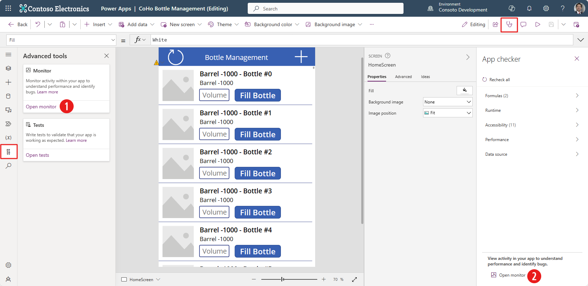
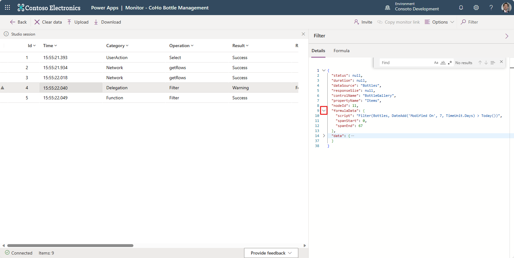
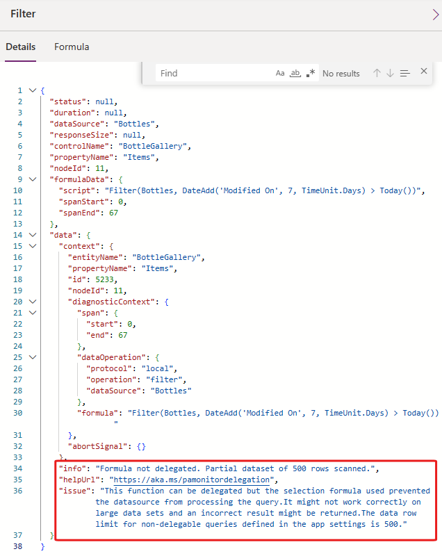

In this exercise scenario, you have created and published the Bottle Management application for your organization CoHo Winery.

You have received the following feedback:

- Users receive a warning whenever they start the application.

- An error if users try to submit volume that includes decimal numbers.

 > [!NOTE]
 > To successfully complete all steps in this lab, you will need
to have access to two users in your lab environment or work in pairs
with a classmate. If you don't have another user available, complete
the steps that you are able to and then read and review the paired activities.

## Tasks

In this exercise, you'll complete the following tasks:

1. Debug by using the Monitor tool.

2. Resolve the issues.

3. Test your solutions.

4. Publish changes.

## Objectives

The objectives for this exercise are to show you how to:

- Use the Monitor tool.

- Debug issues with your canvas application.

- Invite other users to debug sessions.

- Enable debugging for a published application.

- Debug a published application with a connected user.

## Exercise 1: Import a solution and run a flow

In this exercise, you'll import a solution into your environment and
then run a Power Automate cloud flow that will create sample date for you.

### Task 1: Import a solution

In this task, you'll import a solution into your environment.

1. You'll need to download the [zip file](https://github.com/MicrosoftDocs/mslearn-developer-tools-power-platform/blob/master/power-apps/troubleshoot-monitor/CohoVineyardMonitorModule_1_0_0_1.zip) to complete this exercise. Select download once the link opens.

1. Go to [Power Apps maker portal](https://make.powerapps.com/)
    and select the environment that you want to use for this lab.

1. Select **Solutions > Import solution**.

1. Select **Browse** from the **Import a solution** panel.

1. Find/select the
    CohoVineyardMonitorModule_1_0_0_1.zip solution file, and then select
    **Open**.

1. Select **Next**.

1. If prompted, select/create a connection.

1. Select **Import** and wait for the solution importing process to complete.
   Follow the step to establish the connection to Dataverse, if prompted.

1. Don't navigate away from this page. The process will take a few moments. You'll see an *information* message near the top of your screen: Currently importing solution "Coho Vineyard - Monitor Module".

    Once your solution is complete loading, the information message will change to a *success* message letting you know that the solution has imported successfully (you might need to refresh your screen to see it). You can now continue to the next step.

### Task 2: Run a flow

In this task, you'll run a Power Automate cloud flow that will add
sample data to your environment.

1. Select **Coho Vineyard - Monitor Module** from the list of solutions.

1. Locate and select the **Generate Test Data** cloud flow. If
    this cloud flow is the first one for this environment, you might need to
    accept terms and then select to open it again.

1. Select **Run** from the command bar.

1. Select **Run flow** from the right side panel.

1. Select **Done** and then wait for the flow run to complete. This process can take 3 to 6 minutes.

1. Select the **Back** button on your browser to return to the solution.

1. Locate and select the **CoHo Bottle Management** canvas app.

   The application should load, and the test data that was created by the cloud flow should display on the home screen, confirming that the flow has successfully created data.

## Exercise 2: Debug and fix a load issue

In this exercise, you'll monitor the application to determine what has
caused the failure when the application loads, and then you'll fix it.

### Task 1: Debug

In this task, you'll debug the application by using the Monitor tool.

1. If you don't already have the **CoHo Bottle Management** app open in Power Apps, locate and select it from the **Coho Vineyard - Monitor Module** solution, else continue on to the next step.

1. Select the **Advanced tools** tab (it looks like a wrench with a screwdriver pointing up) and then select **Open monitor** (#1 in the image below).

    >

   An alternate way to open **Monitor** is to select the **App checker** stethoscope icon from the command bar and then select **Open monitor** from the bottom of the App checker panel (#2 in the image above).

   Monitor should open in a new browser tab or window and connect to your application. You'll see "Power Apps | Monitor - CoHo Bottle Management" in the title and the notification in the center of the screen: "You have started a new Monitor session."

1. Don't close the Monitor browser. Return to the Power Apps browser tab and then select the **Preview** button from the command bar.

1. The application should open in preview mode. Select the **Refresh** button on the top left of the app header. You shouldn't notice any change on the app screen. Leave your app in preview mode and continue to the next step.

1. Return to the **Monitor** tab to review the events. Select the warning event of delegation category that appears.

1. A **Filter** properties panel should open on the right of the monitor screen. It starts on the **Details** tab. Select the carat to the left of the **formulaData** node to expand it. Notice how the lines of code expand/contract as you toggle it.

    >

1. Review the **formulaData** node and then, likewise, expand the **data** node.

1. Scroll down and read the issue. Towards the bottom of the code you'll see some important information about this warning:

    >

    In this case, Monitor provides us information on the error, a URL to seek help to solve this issue (you can hold the CTRL key and select the link to open the reference in another browser tab), and a longer description of the error.

1. You can download Monitor event logs and upload them later or share them with team members. Select **Download** from the command bar, to add it to your downloads.

1. Select **Clear data** from the command bar, and Monitor clears the event monitor.

1. Close the Monitor browser window or tab.

1. Return to the Power Apps editor and close the preview.

1. Don't navigate away from this page.

### Task 2: Fix the formula

In this task, you'll fix the formula.

1. Select **Tree view** and then select the **BottleGallery** control from the HomeScreen.

1. With the **Items** property displaying in the formula input field, select inside the formula input field. The warning also shows in the bar, with a double blue underline. If you hover over the double blue underline you'll see the warning: "The DateAdd part of this formula might not work correctly on large data sets."

    You might also notice that your gallery control has a yellow warning triangle on the top left corner on the app screen. Hovering over it displays the same warning. Selecting **Get help for this warning** opens a **Details** panel on the right side of the screen describing the issue and how to fix it.

1. Replace the current formula with the following formula.

    ```powerappsfl
    Filter(Bottles, 'Modified On' > DateAdd(Today(), - 7, TimeUnit.Days))     
    ```

   The warning should go away.

1. Select the **Advanced tools** tab located on the left navigation pane and then select **Open monitor**.

1. Leave the Monitor tool running.

1. Return to the Power Apps editor browser tab and select **Preview**.

1. Select the app's **Refresh** button.

1. Return to the monitor browser tab.

   There should be three Success results and no warning.

1. Select the **Clear data** button.

1. Select **Upload**.

1. Select the "PowerAppsTraceEvents" file that you previously downloaded and then select **Open**.

   The file should be uploaded, and previous event logs should display. This event log displays the warning from before.

1. We no longer need to view this warning event log, so you can close the Monitor browser tab.

1. Close the app designer preview.

1. Don't navigate away from the Power Apps editor.

## Exercise 3: Monitor and fix bottle fill issue

In this exercise, you'll monitor the application to determine what has
caused the bottle fill submission issue.

### Task 1: Debug fill bottle

In this task, you'll debug the application while you update a record
by using Monitor.

1. From the Power Apps edit screen, select the **Advanced tools** tab and then select **Open monitor**.

   Once again, Monitor should open in a new browser tab or window and connect to your application.

1. Leave the Monitor tool running.

1. Return to the Power Apps editor and select **Preview**.

1. Enter `28` for the **Volume** for a bottle and then select **Fill Bottle**.

    You might have noticed that the **Volume** input and the **Fill Bottle** button both disappeared from this row after a few moments, but you shouldn't see any error messages.

1. Go to Monitor and review the event logs. Make sure that no errors display, and then select the **patchRow** operation.

1. Within patchRow **Details**, expand and review the **formulaData** and **data** nodes. The **Details** tab shows all information that is shown on the
    **Formula**, **Request**, and **Response** tabs.

1. Select the **Formula** tab to review the formula. This is the Power Apps formula for the button that you selected in your app.

1. Select the **Request** tab and then review the body node. Today's date should show as **cv_bottledon** and **cv_volume** should show `28`.

1. Select the **Response** tab and make sure that a status of **200** shows.

1. You determine that everything seems to be working as expected. Select **Clear data**. Leave Monitor open.

1. Return to the designer, go to another bottle in your gallery and enter **28.5** for the **Volume** and then select **Fill Bottle**. Notice how your input field returns as it was before you input any data. Let's see what's going on.

1. Return to the Monitor tool, which now shows a **Bad Request** error for
    the **patchRow** operation. Select the **patchRow** operation.

1. Select the **Response** tab, expand the **body** node, and then scan the message. There's a lot of text in the error message, but it was caused by a type mismatch. The data is expecting an integer value, and we provided a decimal value. We'll head back to the app to fix this issue.

1. Select **Clear data** but leave the Monitor tool running.

1. Return to the Power Apps editor and close the preview. Notice how you now have a runtime error displaying above your button in the gallery.

1. Don't navigate away from this page.

### Task 2: Fix the mismatch issue

In this task, you'll fix the type mismatch issue.

1. Select the **Tree view** and then expand your **BottleGallery** control.

1. Select the **ButtonFillBottle** button. We're going to fix this issue by disabling the button, unless the user provides a whole number (or integer) value.

1. Select the **DisplayMode** property from the formula bar and then change the current value to the following formula. This formula will look for multiple digits in the input field.

    ```powerappsfl
    If(IsMatch(TextVolume.Text,Match.MultipleDigits),DisplayMode.Edit,DisplayMode.Disabled)     
    ```

1. Select **Preview**.

1. Enter **28** for one row's **Volume**. The **Fill Bottle** button should become enabled.

1. Change the **Volume** to **28.5**. The **Fill Bottle** button should
    now become disabled.

1. Type **28 oz** for **Volume**. The **Fill Bottle** button should
    stay disabled.

1. Change the **Volume** to **28**. The **Fill Bottle** button should
    become enabled.

1. Select the **Fill Bottle** button.

1. Go to the Monitor tool and make sure that there were no errors in the **Result** field.

1. Close the Monitor tool.

1. Close the preview.

## Exercise 4: Collaborate

In this exercise, you'll share a debugging session with a colleague,
and then you'll monitor a published application.

### Task 1: Share a debugging session

In this task, you'll share a session with a colleague.

 > [!NOTE]
 > The user whom you are sharing the session with must be a member of your
organization and have a Power Apps license.

1. If you still have the CoHo Bottle Management open in the Power Apps editor, you can skip to step **4**, else go to [Power Apps maker portal](https://make.powerapps.com/) and make sure that you are in the correct environment.

1. Select **Solutions** and then select to open the **CoHo Vineyard - Monitor Module** solution.

1. Locate and select to open the **CoHo Bottle Management** application.

   The application should open in the app editor.

1. Select **Advanced tools > Open monitor**.

1. Select **Invite** from the right side of the command bar.

1. Search for and then select the user whom you want to share the session with.

1. Copy the user session link.

1. Send the link to the user and then tell them to select the link.

   Selecting the link opens a browser window landing on Power Apps Monitor instance with a notification showing they are in a **Guest session**.

1. Return to Power Apps and select the **Preview** button for the Bottle Management app.

1. Select the **Refresh** button in the app.

1. Return to the Monitor tool, where event logs will display.

   Your guest session user should also see the same event logs.

1. Close the Monitor tool.

1. The session will be over; therefore, you'll need to invite your guest user again if you want to share another session.

1. Close the preview.

1. Don't navigate away from this page.

### Task 2: Debug a published application

In this task, you'll enable published debugging for the application,
publish the application, and then debug the application while other people are
using it.

1. In the app, select **Settings** from the command bar.

1. Scroll down within the **General** tab and toggle on the **Debug published app** switch.

1. Close the settings pop-up window.

1. **Save** your app (if required) and **Publish** your app, a Publish popup will appear.

1. Select **Publish this version**.

Your application is now published, and people who have access to it will be able to use it.

### Task 3: Share and debug a published application

To test the published debugging, your first task is to play the published
application. Then, you'll share the application with your colleague. Then you'll create a security role that allows users to view and update rows from the **Bottle** table, and you'll add your colleague to that role. Reminder, your colleague must be a member of your organization with a Power Apps license.

1. If you still have the Bottle Management app open, skip to Step 4 below, else go to [Power Apps maker portal](https://make.powerapps.com/) and make sure that you are in the correct environment.

1. Select **Apps**.

1. Select the **CoHo Bottle Management** application and then select **Share**.

1. Find and then select the user whom you want to share the application with.

1. Select **Share**.

    > [!IMPORTANT]
    > Your colleagues that you share the app with may need licensing to use the app. Selecting **Request licenses** sends a request to your Administrator.

1. Close the Share panel.

1. In the browser header, select the **Settings** gear icon and then select **Admin center** from the **Settings** panel.

1. Select **Environments** from the navigation panel on the left.

1. Select the environment that you're using for this lab, and when your Environment information page appears, select **Settings** from the command bar.

1. Expand the **Users + permissions** section and then select **Security roles**.

1. From the command bar of **Security roles**, select **+ New role**.

1. In the **Create New Role** panel on the right, enter "Bottle Filler" as the **Role Name**, select a **Business unit** from the dropdown and select **Save**.

1. In the **Security roles > Bottle Filler**, find the **Bottle** table. You can enter "bottle" in the search field at the top right of the screen to assist you.

1. Select the **Bottle** table under the **Custom Tables** list. Notice how dropdown controls appear under the permissions settings including **Create** through **Share**.

1. Change the access for each of these permission settings to **Organization**.

1. Select **Save + close** from the command bar.

1. In the list of **Security roles** find the **Bottle filler** role, and select the **More actions** ellipses. Then select **Members**.

1. Currently, the **Bottle Filler > Members** list is empty. Select **+ Add people**.

1. In the **Add people** panel, enter your colleague's name to search for them. Once their name appears, select it. Then select **Add** at the bottom of the panel. Their name should now appear under the **Bottle Filler > Members** list.

   Your colleague should now be able to use the application.

1. Return to the **Power Apps** home page.

1. Select **Apps**.

1. Select **CoHo Bottle Management > Details > Monitor**. You don't need to open the app in edit mode. You can select the **Commands** ellipses to find **Details > Monitor**, or you can select the radio button to the left of the name and then find the **Details** dropdown in the command bar.

    Monitor opens in a separate browser tab.

1. Within the **Monitor**, look for and select **Play published app** in the command bar.

1. The application should load in a new tab or window. Select the app **Refresh** button.

1. Go to the Monitor tool, to view session event logs.

1. Perform some actions in the application and then view the session event logs.

1. After you're done, close the application browser tab or window.

1. Back in **Monitor**, select **Clear data**.

1. From the **Monitor** command bar, select **Connect user**.

1. Find and then select your colleague.

1. Copy the link.

1. Share the link with your colleague, and then ask them to select that link.

1. Close the **Connect user** pane.

1. When the other user navigates to the link, a pop-up window will appear, asking if they want to join the debug session.

1. The application should load for the other user, and they'll know that other people can see the session data.

1. Go to the Monitor tool, where you can view event logs from the other user's interaction.

    With this capability at your disposal, you can see what issues another user is having with an app as they interact with the app.

1. Tell the other user to create and update rows and then watch the event logs in the monitor.

1. Close the Monitor tool when you're done. This action ends the session and disconnects your colleague from Monitor.

Hopefully, you've grasped the power of using Power Apps Monitor to assist you in debugging your app. The ability to monitor a colleague's interactions with the app can help you zero in on any issues with the app in real time.
