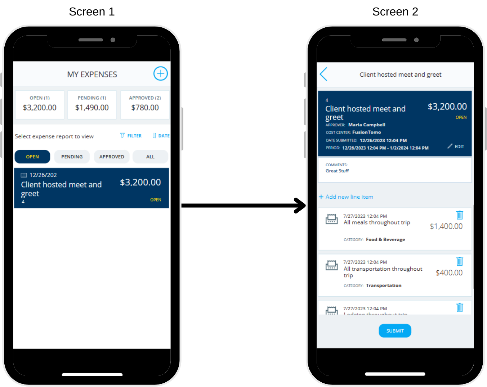
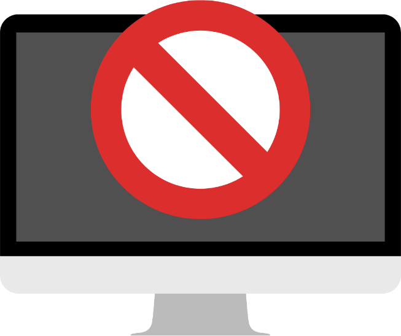

Many of the apps that you build in Power Apps have more than one screen, so it's essential to understand the two main navigation functions.

## Navigate function

The `Navigate` function allows users to go (or navigate) from one screen to another. For example, if your app has two screens and you want to give users a way to go to your second screen, you could add a `Button` control with the `OnSelect` property as follows:

`Navigate(Screen2)`

With the app in play or preview mode, users select the button and automatically go to Screen2. You could use this formula in an icon (`Icon`), such as an arrow, or you could use it in the `OnSuccess` property of a form. You can use the `Navigate` function anywhere you want to give users the ability to go to a specified screen.

> [!div class="mx-imgBorder"]
> 

The `Navigate` function also allows for an optional visual transition as users go to another screen. You can use the `ScreenTransition` parameter to accomplish this transition. A few types of screen transitions are available in Power Apps, and each one provides a slightly different user experience. For example, you could add a `Cover` screen transition to the preceding `Navigate` formula by entering:

`Navigate(Screen2,ScreenTransition.Cover)`

If you programmed this screen transition, you would see **Screen2** slide in from the right side of the app to cover your screen. This module covers more of this concept in later units.

You can also use `Navigate` to set one or more context variables to pass parameters to another screen. That's beyond the scope of this module, but just understand that it's possible to use `Navigate` to pass context variables from one screen to another as your users move through the app.

## Back function

The second screen navigation function is `Back`. The `Back` function takes your users to the last screen that they were using. The main difference between `Back` and `Navigate` is that with `Navigate`, you must designate a screen to go to. To work correctly, `Back` must include information about the previous screen, or it has no formula context for moving to a different screen.

The `Back` function also employs screen transitions. If you use `Navigate` with a transition to move a user to a particular screen, the `Back` function does the opposite of that transition to return the user to the original screen. It's an optional parameter, so you can specifically designate what type of transition you want to do. We'll cover this concept in the next unit.

## Hidden screens

> [!div class="mx-imgBorder"]
> 

You can add screens to your app without providing any navigation for users to get to those screens. You can use these hidden screens for a purpose such as:

- Documentation: Include notes for yourself or another developer on the app.

- Template: After you get the look and branding for certain controls, you can paste them to a hidden template screen and then copy them for use on other screens.

Hidden screens are a part of many apps because they provide a quick place for developers to capture important information without allowing users to change anything. They're hidden from your app's users but not from you.

Now that we've reviewed the navigation possibilities in Power Apps, let's cover the syntax and specifics of `Navigate` and `Back`.
