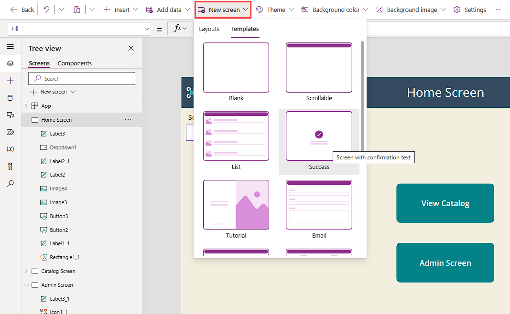

There are many ways to set up navigation in your app, other than simply using the `OnSelect` property of a button or icon control. This unit introduces you to three common techniques: the `OnSuccess` property of a `Form` control, the `OnTimerEnd` property of a `Timer` control, and the `OnChange` property a `Dropdown` control.

## OnSuccess navigation

For designers, a user experience consideration is providing some feedback to users who submit changes to data. Power Apps provides tools to give this feedback. If you insert a **Success** screen in your app, you'll want to land users on it only when Power Apps records updated data with success. So how do you do that?

First, find the **Success** screen in **New screen** > **Templates**. Then add it to your app.

> [!div class="mx-imgBorder"]
> [](../media/new-screen.png#lightbox)

Next, find your form and go to the `OnSuccess` property. It's important to send users to the **Success** screen only if Power Apps correctly writes their data. In the `OnSuccess` property, you can add a `Navigate` function with the name of your **Success** screen, such as:

`Navigate(‘Success Screen’, ScreenTransition.Fade)`

Then, you'll want your users to be able to go back to another screen. A good technique (other than making a selectable button or icon) is to add a `Timer` control.

## OnTimerEnd navigation

Using a `Timer` control is a way to help move your users through your app. When the time runs out, the `Navigate` function moves to the designated screen. In our example, the `Timer` control would let the user see the success message for a few seconds and then go back to the catalog screen.

The `Timer` control is visible when you add it to your app, and it's set to a duration of 60,000 milliseconds (60 seconds). The `AutoStart` property is turned off, so you need to start it by creating a trigger. In the default mode, with a few adjustments, you can make it behave as you want. You'll practice these adjustments in the next unit's exercise, but here's a summary of the steps:

1. Insert a `Timer` control.

1. Set the `AutoStart` property to `true`.

1. Set the `Duration` property to `4000` (four seconds).

1. Set the `OnTimerEnd` property to `Navigate('<yourScreenName>')`.

1. Set the `Visible` property to `false`.

With `AutoStart` set as `true`, the `Timer` control starts when the user lands on the screen in preview or play mode. In four seconds, the `Navigate` function fires and sends the user to another screen.

## OnChange navigation

Another good navigation technique is to add a menu to your app as a `Dropdown` control. You can add dropdown functionality to a single screen and then copy it to other screens of your app.

A `Dropdown` control uses a table of data (data type: `Table`). In the `Items` property, you can add any table of data that you want. If you have just two screens for navigation, you can put a table in the `Items` property of your `Dropdown` control like this:

`["","Catalog", "Admin"]`

The square brackets indicate a table of data, and the code means exactly the same thing as this example:

`Table({Value: ""},{Value: "Catalog"},{Value: "Admin"})`

The square brackets provide a simpler way to enter the same data.

You added an empty text string (`""`) as your first value in the table. You assign that as the `Default` property.

With the `Items` property defined, you can then change the `OnChange` property of the `Dropdown` control.

> [!TIP]
> Be careful to update the correct property of your `Dropdown` control. It's easy to make the mistake of updating the `OnSelect` property. Remember that you initiate the `OnSelect` property when you select the control, not when you change the control. Make sure that you update the `OnChange` property in an instance like this one.

The most efficient way to update the `OnChange` property for a `Dropdown` control is to use a `Switch` function, and to refer to the control by using the `Self` function. But you could also use an `If` function. `Switch` and `If` are both ways to evaluate a condition and then perform an action.

In the Contoso Coffee Machines app, for example, the `Dropdown` control would have the following code as the `OnChange` property:

```pfx
Switch(Self.SelectedText.Value,
"Catalog",Navigate('Catalog Screen',ScreenTransition.Cover),
"Admin",Navigate('Admin Screen',ScreenTransition.Cover)
);
Reset(Self)
```

The `Switch` statement evaluates a particular value to see if it matches one of the results, and then it performs an action. In the preceding example, `Self.SelectedText.Value` is the value selected in the `Dropdown` control. If this value is `Catalog`, the `Switch` function executes the navigation to the catalog screen. If the value is `Admin`, the `Switch` function executes the navigation to the admin screen.

`Switch` executes only a single condition that depends on the matched value. So it's ideal when you have many possible courses of action based on a single value.

Finally, you use the `Reset` function to reset the `Dropdown` control to the `Default` value of `""` (empty string).

If you didn't quite understand all of that information, don't worry. We'll walk through it again in the next unit's exercise.
