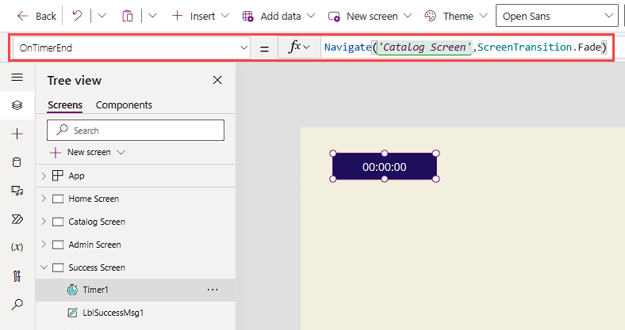

You're nearing the end of this module, so let's put everything together in an exercise.

In the following example, you're continuing to add screen transition functionality to the Contoso Coffee Machines app, but you can use any multiple-screen app. The following steps match the app that you've been working on in this learning path.

> [!NOTE]
> When you're entering formulas, it's better to type them into the formula (`fx`) versus using the copy/paste technique. Single and double quotation marks don't translate the same way in Power Apps.

1. Sign in to the Power Apps home page, and then open the **Contoso Coffee Machines** app in edit mode.

1. On the home screen, select the **View Catalog** button. In the `OnSelect` formula, change `Navigate('Catalog Screen')` to:

   `Navigate('Catalog Screen',ScreenTransition.Cover)`

1. Still on the home screen, select the **Admin Screen** button. In the `OnSelect` formula, change `Navigate('Admin Screen')` to:

   `Navigate('Admin Screen',ScreenTransition.Fade)`

1. Place the app in preview mode. Test how the transitions look and feel by selecting the buttons on the home screen to go to the respective screens, and then use your **Back** buttons to go back to the home screen.

1. Add a transition to a **Back** button. Place the app back in edit mode and go to the admin screen.

1. Select the arrow icon (or whatever icon you're using as a **Back** button) and change the formula for `OnSelect` from `Back()` to:

   `Back(ScreenTransition.UnCoverRight)`

1. Go back to the home screen and put your app in preview mode. Select the **Admin Screen** button, and then select the **Back** button. Did you notice the difference in the transition?

1. Return to edit mode. Add a **Success** screen by selecting **New screen** > **Templates** > **Success**.

1. Rename the screen **Success Screen**.

1. Go to the catalog screen and select your `Form` control. You can select it on your **Tree view** panel.

1. In the `OnSuccess` property for the form, enter the following code:

   `Navigate(‘Success Screen’,ScreenTransition.Fade)`

1. Now that you've added `OnSuccess` to your form, move to your success screen by selecting **Success Screen** on the **Tree view** panel.

1. On the success screen, insert a `Timer` control.

1. Adjust the following properties for your `Timer` control:

   - `AutoStart`: `true`

   - `Duration`: `4000`

   - `OnTimerEnd`: `Navigate(‘Catalog Screen’,ScreenTransition.Fade)`

   - `Visible`: `false`

   > [!div class="mx-imgBorder"]
   > [](../media/timer-control.png#lightbox)

1. To test the functionality of your success screen timer, return to the catalog screen and place your app in preview mode. Select any item and make a change to the item on the form.

1. Select the **Save changes** button at the bottom of the form. If you do it correctly, the app shows the success screen for four seconds and then returns to the catalog screen, where you can continue to make changes.

1. Close preview mode and return to the home screen from the **Tree view** panel. Now you'll make a dropdown navigation menu.

1. Insert a `Dropdown` control onto the home screen and position it under the upper-left corner of the header rectangle.

1. Insert a `Text label` control and update the `Text` property to `Screen Navigation`. Place it just above the `Dropdown` control.

1. Select your `Dropdown` control. Update the `Default` property to:

   `""`

1. Still on your `Dropdown` control, update the `Items` property to:

   `["", "Catalog", "Admin"]`

1. Enter the following formula for the `OnChange` property of the `Dropdown` control:

   ```pfx
   Switch(
       Self.SelectedText.Value,
       "Catalog",
       Navigate(
           'Catalog Screen',
           ScreenTransition.Cover
       ),
       "Admin",
       Navigate(
           'Admin Screen',
           ScreenTransition.Cover
       )
   );
   Reset(Self)
   ```

1. Place the app back in preview/play mode and test the `OnChange` functionality of your `DropDown` control to go to the other screens.

1. Add a **Home** icon to your catalog screen. Put the app back in edit mode and select **Catalog Screen**.

1. Select the **Back** icon control on the upper right of the catalog screen, and then copy it by using Ctrl+C or by right-clicking and then selecting **Copy**.

1. Paste the copy of your **Back** icon (Ctrl+V) and reposition it to the upper left of your header rectangle.

1. With the pasted **Back** icon selected, use the **Icon** button on the command bar and change the icon to the **Home** icon.

1. Change the `OnSelect` property to:

   `Navigate('Home Screen', ScreenTransition.CoverRight)`

   Now you have a way to return to the home after you successfully save changes to your data.

1. On the catalog screen, place your app in preview mode. Ensure that selecting the home icon control takes you to the home screen.

You successfully added some navigation functionality to an app:

- Screen transitions for the `Navigate` and `Back` functions.
- A **Success** screen that you go to by using a form's `OnSuccess` property.
- A `Timer`control that goes back to the catalog screen by using the `OnTimerEnd` property.
- A `Dropdown` control that goes to other screens by using the `OnChange` property.
- A **Home** icon to enable users to return to the home screen.

Next, you'll complete a knowledge check.
