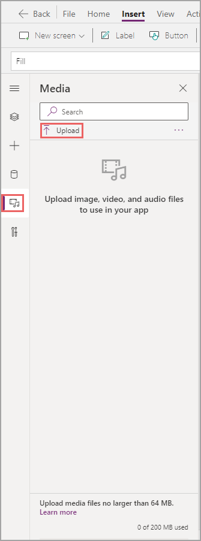
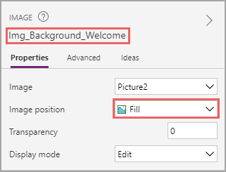
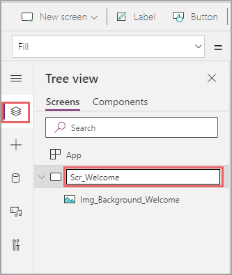
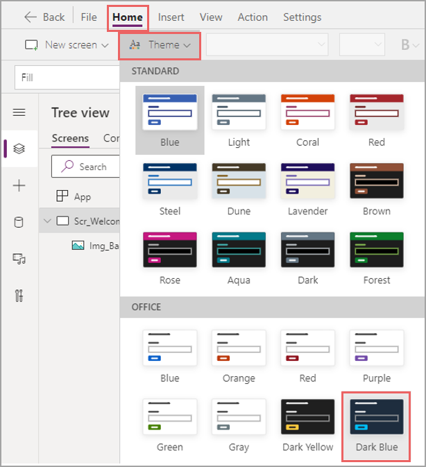
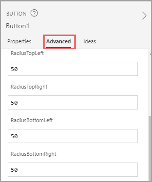
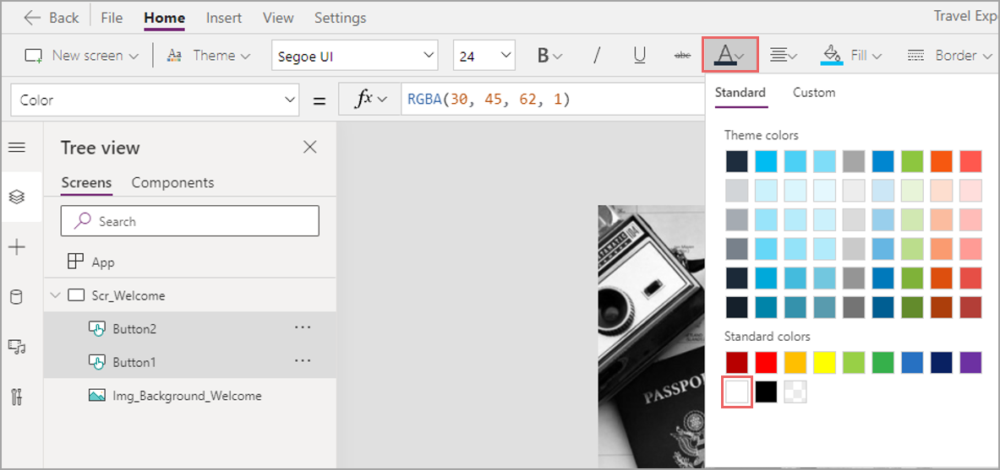
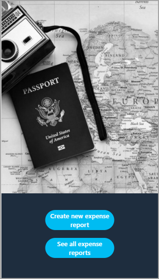

Now that you've planned, started, and saved your app, you can get started building. The first screen in your tree view (the left pane) is your welcome screen, which is the first screen that displays when users open your app. Therefore, the screen needs to be dynamics and it should instruct or direct users to other places.

To start, add an image for visual impact by following these steps:

1. Select the **Media** button on the menu to the left of the tree view, and then select **Upload**.

   > [!div class="mx-imgBorder"]
   > 

   You can right-click and save this image as **Picture2.png** to upload into your app.

   > [!div class="mx-imgBorder"]
   > 

   When the image is in your app, you might notice that nothing has changed on your screen. While you can access the image, you have yet to add a control.

1. Select the **Insert** tab, select **Media**, and then select **Image**.

   > [!div class="mx-imgBorder"]
   > 

   You have an image control, but it's not referencing the media that you've uploaded.

1. Select your uploaded image from the **Image** dropdown menu on the **Properties** pane.

   > [!div class="mx-imgBorder"]
   > 

   Now, you have the appropriate image on your welcome screen.

1. Drag the corners of the **Image** control to resize the app and then position it to occupy about two thirds of the screen. You might notice an extra space above and below the picture because the image is a different size than the screen. To correct this issue, change the **Image position** value from **Fit** to **Fill** on the **Properties** pane.

1. Double-click the name of the image at the top of the **Properties** pane to rename the control to **Img_Background_Welcome**.

   > [!div class="mx-imgBorder"]
   > 

   Your screen should appear similar to the following image.

   > [!div class="mx-imgBorder"]
   > 

   It's important to rename all controls to something that's easy to remember. A typical nomenclature follows the pattern of *control_purpose_screen*. To shorten this phrasing, many developers have a few letters to represent each control. The image control follows this naming convention perfectly by using **Img** for Image, **Background** to state the purpose of the control, and **Welcome** to state the screen. Frequently, you might reference other controls, so following a predetermined nomenclature will help you recall the various controls without interrupting your formulas to double check. 
   
Accordingly, your next step is to rename your screen:

1. Return to the **Tree view** by selecting the appropriate **Menu** button, and then double-click the screen name to change it to **Scr_Welcome**.

   > [!div class="mx-imgBorder"]
   > 

   As you go through the process, you might notice that many different ways are available to complete the same tasks, such as changing the name of a control. These options exist to help make it simpler for you to build. Furthermore, the options won’t result in differences to your app.

   For the next step, you could do the intensive work of design by adding other controls, such as shapes or changing the colors of various controls. Instead, for this exercise, you will change the theme and then let Power Apps make your app extraordinary with little effort.

1. To set a new theme, return to the **Home** tab and then select the **Theme** dropdown menu. Typically, you can choose whatever you want, but for this design, select **Dark Blue**.

   > [!div class="mx-imgBorder"]
   > 

   The screen background should immediately change. The small theme preview shows that other components appear changed as well. Next, add more controls that you need and then observe how the theme has affected them.

   One user requirement from the previous use case was the ability to choose between adding a new expense report and editing a draft or viewing old expense reports. You'll need new screens to meet that requirement, and to navigate, you'll need buttons.

1. Select the **Insert** tab and then select **Button** twice.

   > [!div class="mx-imgBorder"]
   > 

1. Drag and drop the two buttons on your screen to rearrange them how you want. To ensure that your buttons are in the exact middle of your app, you can use the alignment options. Make sure that one of your buttons is selected, and then go to the **Home** tab, select the **Align** dropdown menu, and select **Align center**. This approach will ensure that your button is centered on your screen. If you select both buttons simultaneously, it will ensure that both are centered with one another and not the screen.

   > [!div class="mx-imgBorder"]
   > 

Now that you have your buttons, you can learn about properties that change the way that they appear. For example, you might prefer that the buttons have a more rounded appearance.

1. Select one of the buttons and then select **Advanced** on the **Properties** pane.

1. Scroll down until you find the four radius properties: **RadiusTopLeft**, **RadiusTopRight**, **RadiusBottomLeft**, and **RadiusBottomRight**. Replace the **10** with **50**. Radius is the amount of curvature for every corner. Your button should appear more rounded now.

   > [!div class="mx-imgBorder"]
   > 

1. Select your other button. Instead of making changes in the **Properties** pane, you can use the property dropdown menu immediately below the ribbon. Use this dropdown menu to find **RadiusBottomLeft** and then change it to **50**.

   > [!div class="mx-imgBorder"]
   > 

   Continue to do this action with the remaining three radius properties in the **Advanced** tab of the **Properties** pane or in the property dropdown menu. As mentioned previously, changing these properties in different places doesn't cause changes in your app. The buttons are the same wherever you altered the radius properties. Most developers prefer to make quick changes in the **Properties** pane and will rely on the properties dropdown menu for large formulas.

   Your app should appear similar to the following image.

   > [!div class="mx-imgBorder"]
   > 

1. Select one of your buttons and hold down the **Ctrl** key while selecting the other button. This action should allow you to select both buttons at once.

   Not all controls have the same properties. However, if controls have similar properties, you can select multiple controls and set them at once.

1. With both buttons still selected, change the font color to white by pressing the color selector on your ribbon.

   > [!div class="mx-imgBorder"]
   > 

1. Double-click the first button and then enter **Create new expense report**.

   > [!div class="mx-imgBorder"]
   > 

1. Select the other button and then change the **Text** property on the **Properties** pane to **See all expense reports**.

1. Select both buttons (by holding down the **Ctrl** key) and then set the **Height** to **80** and the **Font size** to **20** so that you can read the text on the buttons.

   > [!div class="mx-imgBorder"]
   > 

1. Rename your buttons to **Btn_NewExpense_Welcome** and **Btn_AllExpense_Welcome** so that you can recall them later if necessary.

Your app should now appear similar to the following image.

   > [!div class="mx-imgBorder"]
   > 

You've now designed your welcome screen. In the next unit, you'll learn how to build in functionality.
