The second screen is where users compare the selected machines and then choose the one that they want to submit for approval. This screen includes:

-   A back button for navigating back to the main screen.

-   A list of selected machines for comparison (carried over from the main screen).

-   Other details for each machine.

-   Highlighting of the selected machine.

In a subsequent lab, you create the database tables to store the machine orders, add an edit form to this screen to enter extra information, and then submit the request.

> [!NOTE]
> To complete the exercises, you'll need to use a few
> files. Download the [App in a Day files](https://github.com/MicrosoftDocs/mslearn-developer-tools-power-platform/raw/master/in-a-day/AIAD/AppinADayStudentFiles.zip)
> for use in this module. The file folders that are in
> this download include:
>
> - **Completed modules with instructions** - Package files to import the completed exercise steps. 
> - **Machine-Order-Data.xlsx** - File used in the exercises.

## Task: Add a screen
Your first task is to add a new screen by following these steps:

1.  From the Tree View pane, select **+ New screen** and then choose **Blank**.

	> [!div class="mx-imgBorder"]
	> [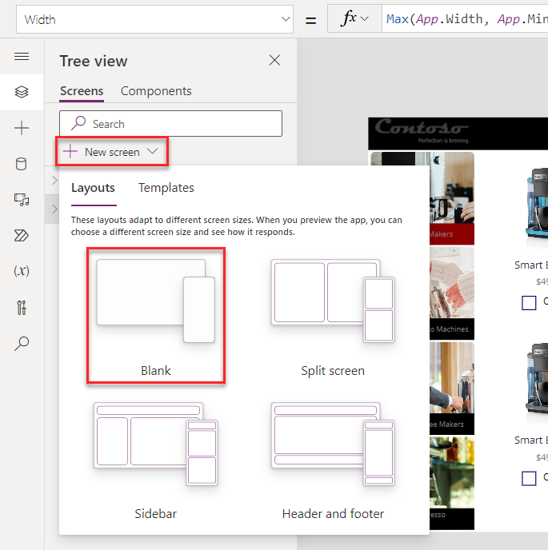](../media/blank-new-screen.png#lightbox)

1.  Rename the screen to `Compare Screen`.

	> [!div class="mx-imgBorder"]
	> [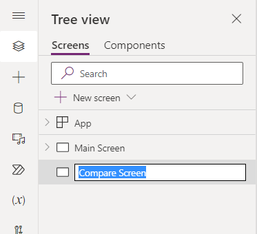](../media/compare-screen.png#lightbox)

1.  From the Tree view pane, select the **Main Screen**,  then select the **+ Insert** drop-down. Expand the **Popular** group, and then choose **Button**.

	> [!div class="mx-imgBorder"]
	> [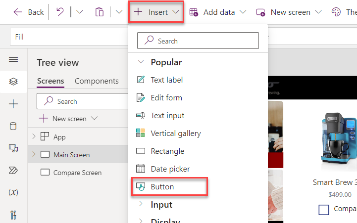](../media/button.png#lightbox)

1.  Rename the button within the Tree view pane to `btnCompare`.

1.  Select the **btnCompare** within the Tree view pane.

1.  Set the button's **Text** property to the following: 

	`"Compare " & CountRows(CompareList) & " item(s)"`

	> [!div class="mx-imgBorder"]
	> [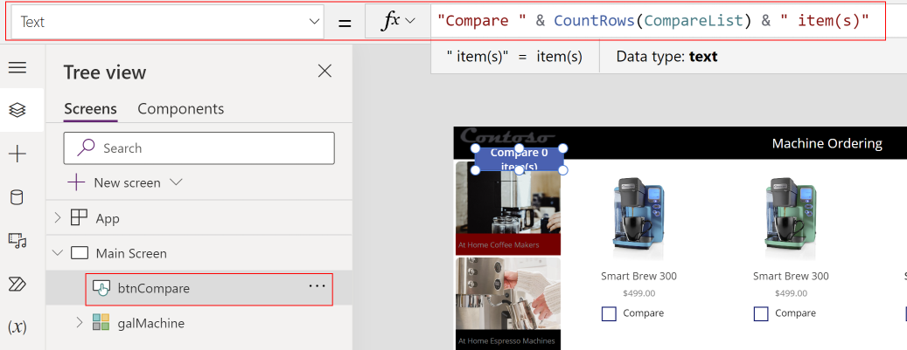](../media/button-text-value.png#lightbox)

1.  Set the **Fill** value of the Compare Button to `Color.Black`.

1. Set the **X** value of the Compare Button to `1130`.

1. Set the **Y** value of the Compare Button to `720`.

1.  Set the **Width** value of the Compare Button to `220`.

1.  Set the **Height** value of the Compare Button to `40`.

1. Set the **DisplayMode** property of the Compare Button to the following formula. This Power Fx formula disables the button if no items are selected and will enable it if at least one item is selected.

	`If(CountRows(CompareList) > 0, DisplayMode.Edit, DisplayMode.Disabled)`

1. Select the **btnCompare**, and within the **Properties** pane, set the **Border radius** to `0`.

	> [!div class="mx-imgBorder"]
	> [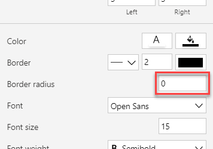](../media/border-radius.png#lightbox)

1. Select the **btnCompare** and then copy it by pressing the **Ctrl+C** keyboard shortcut.

1. Paste the button on the same screen by using the **Ctrl+V** keyboard shortcut.

1. Rename the button as `btnClear`.

1. Set the **X** value of the new **btnClear** to `210`. Ensure that the **Y** value of the **btnClear** is set to `720`.

	> [!div class="mx-imgBorder"]
	> [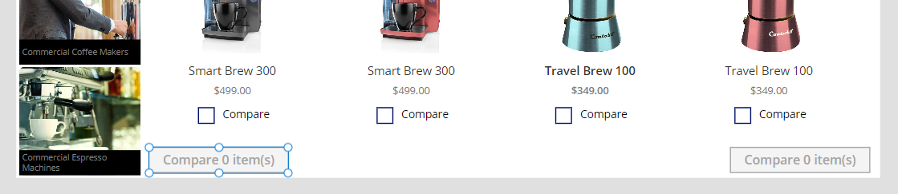](../media/button-placements.png#lightbox)

1. Change the **Text** value of the **btnClear** to `"Clear Selection"`.

1. Set the **OnSelect** value of the Clear Button to the following formula. This Power Fx formula removes all items in the CompareList collection.

	`Clear(CompareList)`

	> [!div class="mx-imgBorder"]
	> [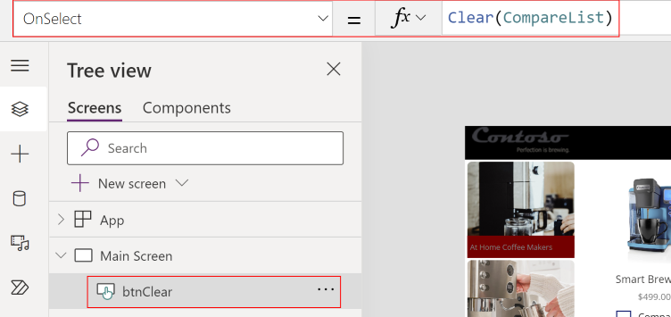](../media/onselect-value.png#lightbox)

1. Select the **btnCompare** and then change the **OnSelect** value to the following formula:

	`Navigate('Compare Screen')`

	> [!div class="mx-imgBorder"]
	> [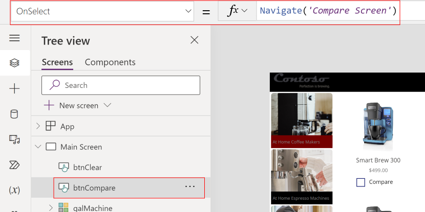](../media/onselect-formula.png#lightbox)

1. Select **Preview the app**.

1. Select a couple of machines, select the **Compare** button, and then verify that it takes you to the second screen.

	> [!div class="mx-imgBorder"]
	> [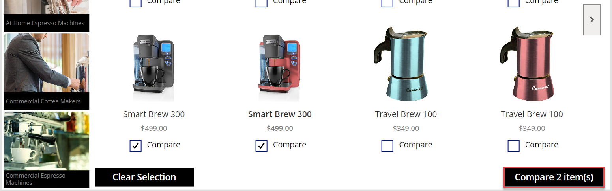](../media/device-preview.png#lightbox)

1. You should be directed to the new empty screen. Close the preview.

	> [!div class="mx-imgBorder"]
	> [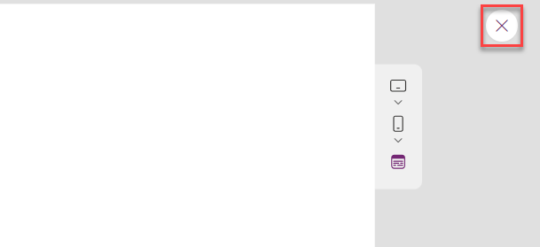](../media/close.png#lightbox)

1. Select the **Main Screen** in the tree view.

1. Muli-select **imgLogo**, **lblUser**, and **lblHeader** from the Tree View pane. Right-click and select **Group**.

	> [!div class="mx-imgBorder"]
	> [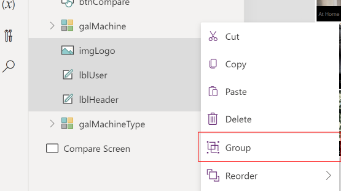](../media/group.png#lightbox)

1. Rename the group as `Header`.

1. Select the ellipsis (**...**) button of the **Header** and then select **Copy**.

	> [!div class="mx-imgBorder"]
	> [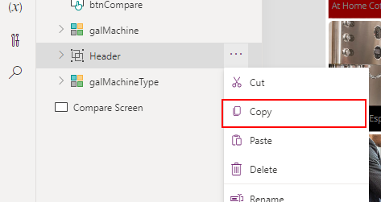](../media/copy-control.png#lightbox)

1. Right-click the **Compare Screen** option and then select **Paste**.

	> [!div class="mx-imgBorder"]
	> [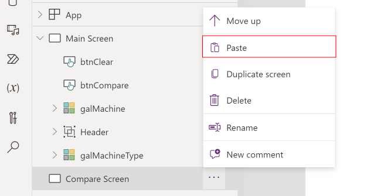](../media/paste.png#lightbox)

   The **Header** in the **Compare Screen** should resemble the following image.

	> [!div class="mx-imgBorder"]
	> [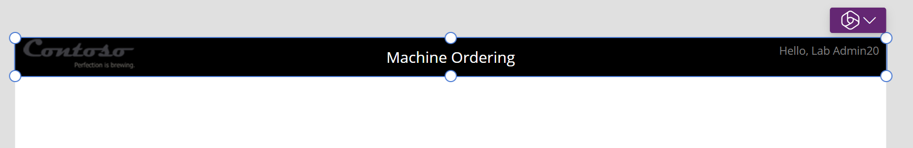](../media/header-text.png#lightbox)

1. **Rename** the control of the copied `Header` and the child controls of the copied `Header` to match the screen shot below.
    > [!div class="mx-imgBorder"]
	> [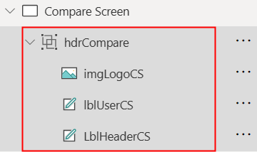](../media/header-label-compare.png#lightbox)

1. Copy **galMachine** from the **Main Screen** and then paste it in the **Compare Screen**.

1. Rename the gallery in the Compare Screen as `galCompareList`.

1. Set the **X** value of the Compare List Gallery to `0`.

1. Set the **Width** value of the Compare List Gallery to `840`.

1. Set the **Height** value of the Compare List Gallery to `708`.

   The gallery should now resemble the following image.

	> [!div class="mx-imgBorder"]
	> [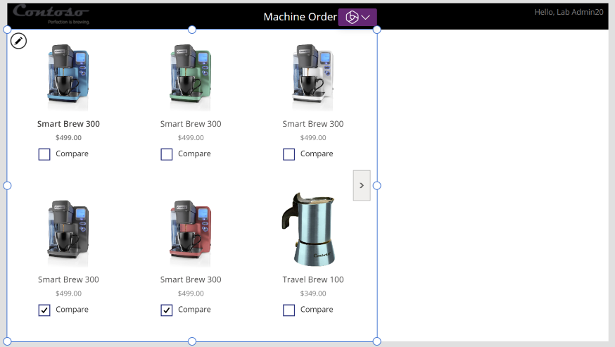](../media/machine-list.png#lightbox)

## Task: Set up the gallery

In this task, you set up the gallery to show machines that were selected from the comparison gallery on the Main Screen.

1.  Select the new **galCompareList** from the Tree view pane.

1.  Within the **Properties** pane, change the **Wrap count** to `1`.

	> [!div class="mx-imgBorder"]
	> [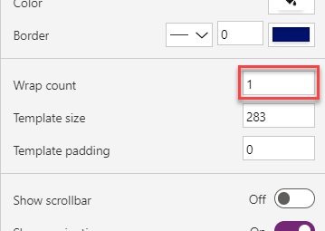](../media/wrap-count-gallery.png#lightbox)

1.  Select **Items** from the property value dropdown list, then change the value within the formula bar to `CompareList`.

The gallery will now show the selected items from the Main Screen.

> [!div class="mx-imgBorder"]
> [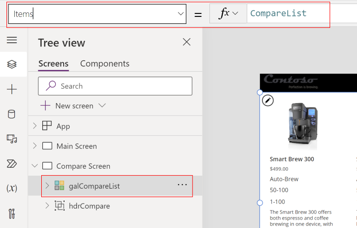](../media/two-machine-preview.png#lightbox)

## Task: Remove and add controls to the gallery

In the **Compare Screen**, you're selecting a given item to get approved, so you don't need a **Compare** checkbox.

1.  From within the **galCompareList** in the Tree view pane, select the **Compare** checkbox and then press the **Delete** key to delete the checkbox.

1.  Add a few labels to display other attributes about the machine. A method is to copy and paste. Select the first label in the gallery that's displaying the machine name. **Copy** the label (**Ctrl+C**) and then **paste** it (**Ctrl+V**). Rename these labels so that you can easily identify them later.

1.  Move the new label so that it's below the price. Set the **Text** property to: 

	`ThisItem.Feature`

	> [!div class="mx-imgBorder"]
	> [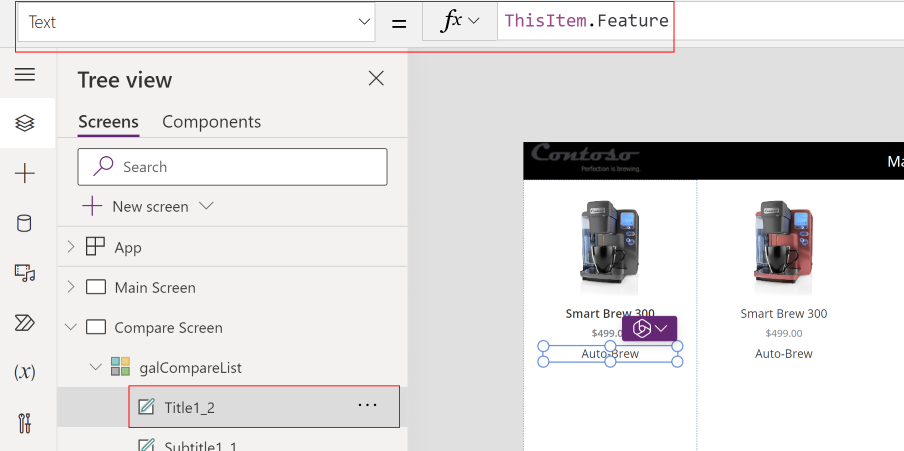](../media/machine-feature-setting.png#lightbox)

1.  Use the ribbon tool bar at the top of the page to change the font weight from **Semibold** to **Normal**. Then change the **Size** property to `14`.

	> [!div class="mx-imgBorder"]
	> [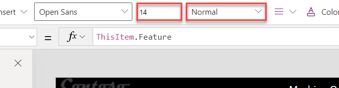](../media/font-settings.png#lightbox)

1.  Copy and paste this label and then move the new fourth label below the third label. Set the **Text** property to: 

	`ThisItem.'Avg. Cups/Week'`

	> [!div class="mx-imgBorder"]
	> [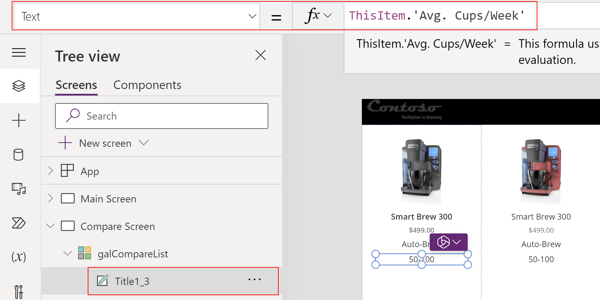](../media/average-setting.png#lightbox)

1.  Repeat the previous steps to add text boxes to display the other machine properties, the **Avg. Espressos/Week** value, and the **Description**. You can customize the labels by changing their Size, Color, Fill, and Font Weight properties.

1.  Select the **Description** label inside the gallery.

1.  Change the **Size** of the Description to `12`.

1.  Change the **AutoHeight** value, located within the Properties pane, of the Description to `on`.

1. Multi-select all of the  labels inside the gallery within the Tree view pane.

	> [!div class="mx-imgBorder"]
	> [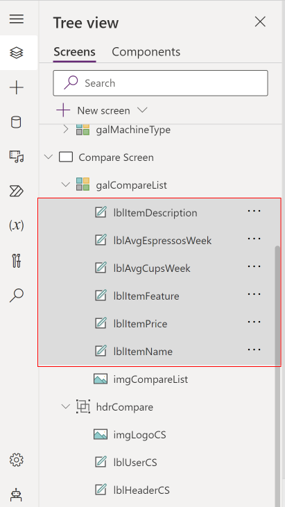](../media/multiple-labels.png#lightbox)

	> [!NOTE]
	>  Within the image above, you will notice that each label has been renamed to correspond with the purpose of the label within the app.  

1. Go to the Properties pane and set the **Text alignment** to **Align left**.

	> [!div class="mx-imgBorder"]
	> [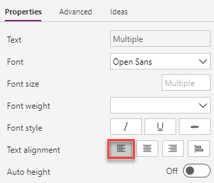](../media/alignment-text.png#lightbox)

The gallery should now resemble the following image.

> [!div class="mx-imgBorder"]
> [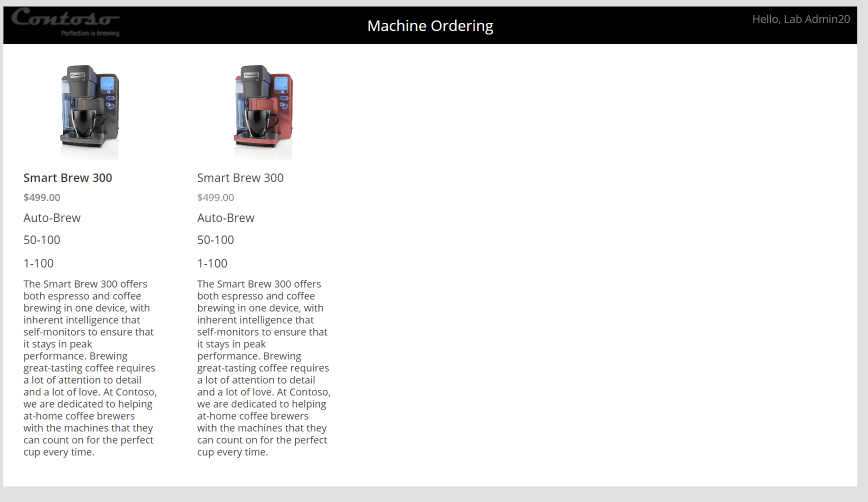](../media/coffee-machines.png#lightbox)

> [!NOTE]
>  To save time in this lab, you can add one or two of these extra properties and then skip adding the other machine properties.

## Task: Highlight the selected machine
To highlight the selected machine, follow these steps:

1.  Select the **galCompareList**.

1.  With the gallery selected, set the **TemplateFill** property to:

	`If(ThisItem.IsSelected,ColorFade(lblHeaderCS.Fill,75%))`

	> [!div class="mx-imgBorder"]
	> [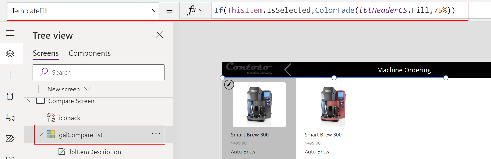](../media/template-fill.png#lightbox)

	This step will conditionally set a Fill color if the cell is selected.

	You could have set a specific color or RGB value, but we recommend that you use the ColorFade function so that it matches the header label with a 75 percent fade. If you change the fill color of header label, this template fill color will automatically change.

1.  While pressing the **Alt** key, select a different item in the gallery. Notice that the selected item is highlighted in a light gray color.

## Task: Add an icon to navigate to the first screen
In this task, you add an icon to navigate to the first screen.

1.  Select the **Compare Screen**.

1.  Select the **+ Insert** drop down, search for `left`, and then choose the **Left** icon.

	> [!div class="mx-imgBorder"]
	> [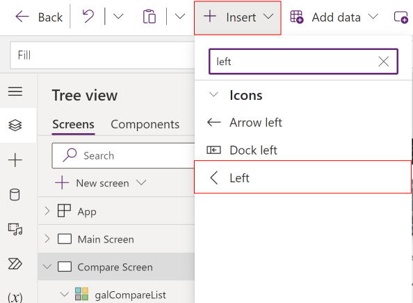](../media/left.png#lightbox)

1.  Set the **Color** of the icon that you added to `Color.Gray`.

1.  Set the **X** of the icon to `220`.

1.  Set the **Y** of the icon to `5`.

1.  Set the **Height** of the icon to `50`.

1.  Set the **Width** of the icon to `50`.

1.  Set the **OnSelect** action for the icon to `Back()`, which will cause navigation back to the previous screen.

	> [!div class="mx-imgBorder"]
	> [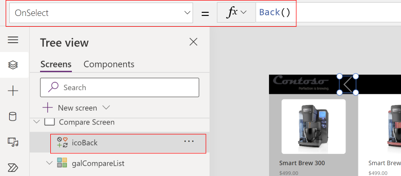](../media/icon-value.png#lightbox)

## Optional UI enhancement

Add **padding around the icon** by using the Properties pane. Set the padding values to `10` for the **Top**, **Bottom**, **Left**, and **Right** settings. As a result, the icon looks smaller but will still have a larger hit target for the select action. This pattern is optimal for most icons.

## Task: Test the app

Select **Save** to save your app. It's a good idea to save your app regularly. You can also test your app directly on the canvas by holding down the **Alt** key to activate buttons and other controls and then double-clicking to type into controls.

1.  Go to the **Main Screen** and **Preview** the app by selecting the **Play** button in the upper right.

1.  Clear any selected machines, if necessary.

1.  Select one of the machine types.

1.  Select the **Compare** checkbox on a few machines on the main screen.

1.  Select the **Compare** button to go to the compare screen.

1.  Tap or select a different machine in the gallery and then verify that the selection highlight works.

1.  Select the **Back** button and then confirm that you return to the main screen.

	> [!div class="mx-imgBorder"]
	> [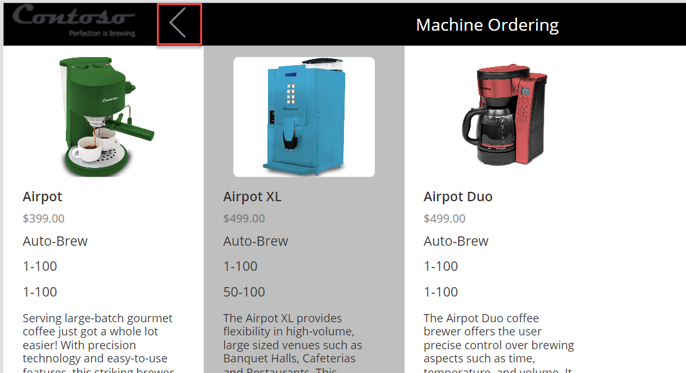](../media/back.png#lightbox)

1.  Select **Clear Selection**.

	> [!div class="mx-imgBorder"]
	> [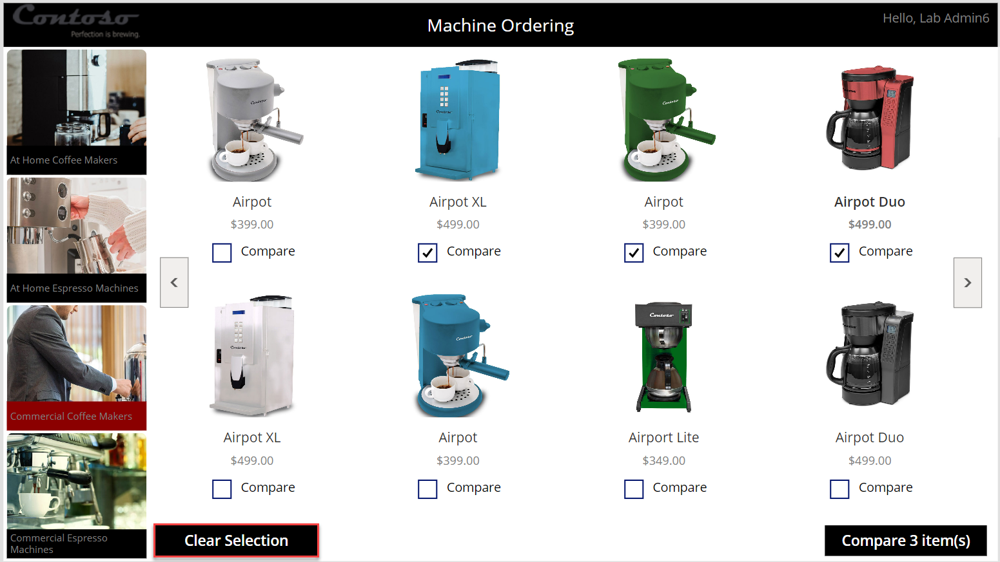](../media/clear-selection.png#lightbox)

    The **CompareList** should clear, and the **Compare** button should become disabled.

	> [!div class="mx-imgBorder"]
	> [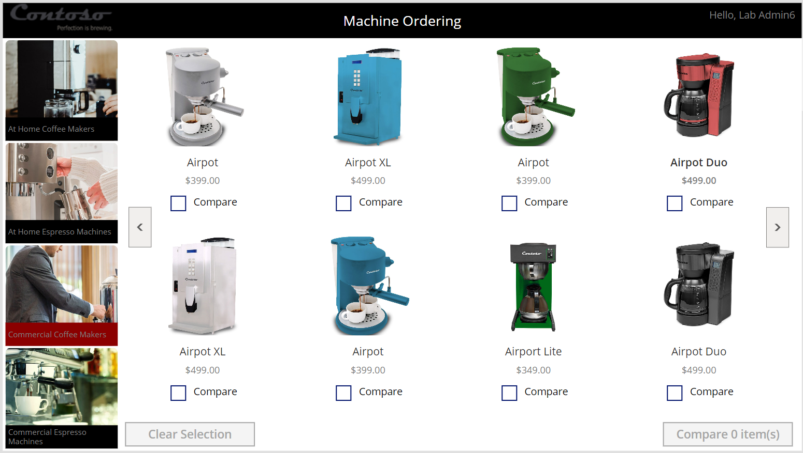](../media/disabled-buttons.png#lightbox)

1. Close the preview.

## Task: Test the app on a mobile device

Congratulations, you've created your Power Apps application. Now, you can publish and test it on a mobile device.

1.  Select the **Publish** button located in the top right corner of the screen.

	> [!div class="mx-imgBorder"]
	> [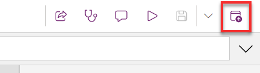](../media/publish-button.png#lightbox)

1.  Select **Publish this version** on the confirmation prompt.

	> [!div class="mx-imgBorder"]
	> [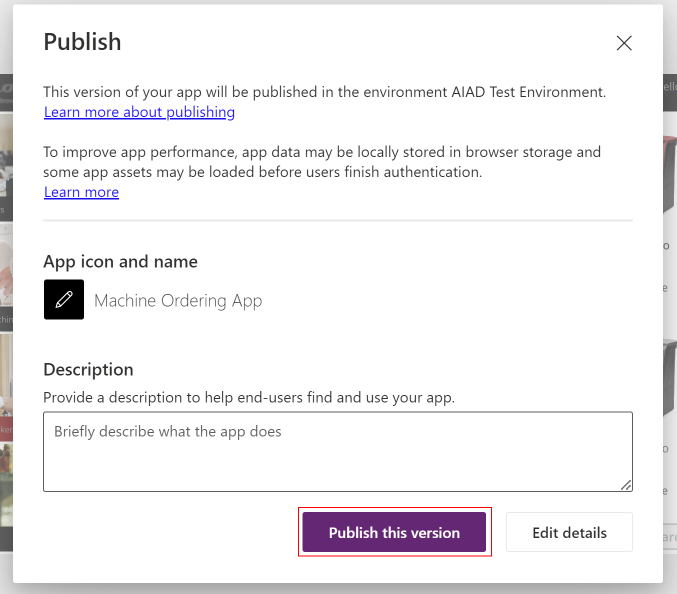](../media/publish-version.png#lightbox)

	This action publishes the latest saved version of the app.

1.  Go to your device's app store application. Search for **Power Apps** and install the Power Apps application. Launch the app.

1.  When the app starts, it prompts for your business or school account credentials. Sign in with the same account that you used to create the Power Apps application. The app that you created should appear in the list of apps. Select to **Run the app**.

## New Feature: Copresence within Canvas Studio

Microsoft is thrilled to announce the General Availability launch of **Copresence** within Power Apps Studio that allows you to collaborate with others in canvas apps. Copresence only supports one editor at a time, but other makers can enter the canvas app as readers in read-only mode. This allows readers to debug codes, review screens, and interact with comments all together in the same session. This feature doesn't have to be turned on as for it's already enabled by default for your ease of use. 

The following are the benefits of using **Copresence** within the Power Apps Canvas Studio:

- Only one editor allowed, but other makers can now access the app within the Power Apps Canvas Studio in read-only mode.
- Icons and names of people who have the app open are displayed with indicators to show who is editing the app and who's viewing it. 
- Read-only labels are displayed to indicate to makers that they're in read-only mode.
- While in read-only mode, makers receive notification for saved changes made from the current editor. Then, they'll be prompted to refresh the app to stay up to date on the latest version so they won't lose work or overwrite other's work later.

> [!NOTE]
>  When you are entering the email of the users in which you wish to share the app, you can choose to make them a **User** or a **Co-owner**. Depending on which you choose to enter them as, this will determine what their availibitity is as to what they can do within the app canvas.

The image below shows what the canvas would look like if you were viewing the app in **Read-only** mode. 

1. At the top of the screen, you can see whether you are in **Edit** mode or **Read-only** mode. Here's also where you can view everyone that is currently viewing the app canvas.

1. Within the **Tree view** pane in the canvas, you can see what screen everyone is viewing within the app.

	> [!div class="mx-imgBorder"]
	> [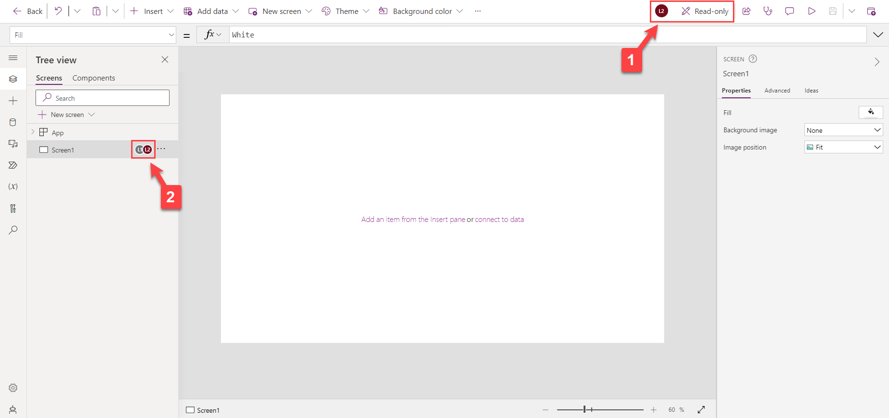](../media/copresence-read-only.png#lightbox)

> [!NOTE] 
> For more information, see [Copresence](/power-apps/maker/canvas-apps/copresence-power-apps-studio).
