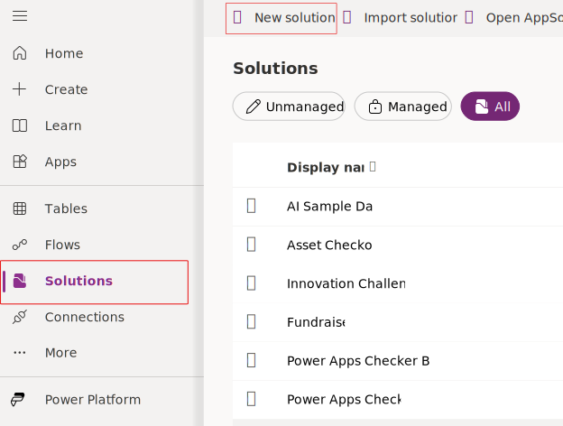
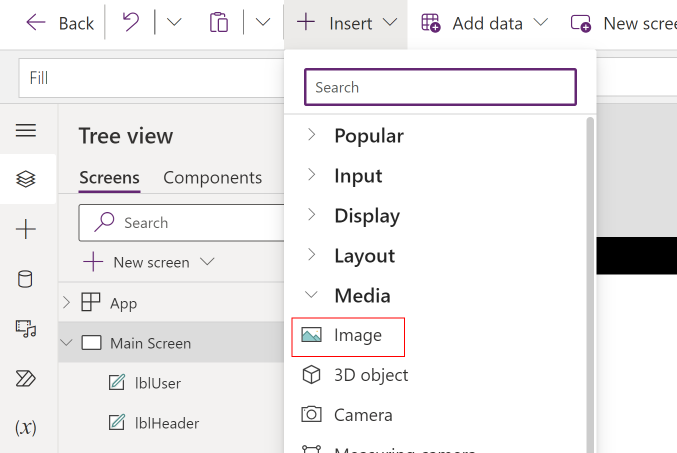

In this exercise, you create a solution to hold your customizations, create your canvas app, and complete the first screen of the app.

> [!NOTE]
> This module is designed for use with the App in a Day instructor-led course. For more information on attending this free, instructor-led course, see [Microsoft Power Platform instructor-led training](https://powerplatform.microsoft.com/instructor-led-training/). On that page, you can [Register for an event](https://events.microsoft.com/allevents/?search=App%20in%20a%20Day&view=list&language=English&clientTimeZone=1&startTime=06:00&endTime=11:00).

> [!NOTE]
> To complete the exercises, you'll need to use a few
> files. Download the [App in a Day files](https://github.com/MicrosoftDocs/mslearn-developer-tools-power-platform/raw/master/in-a-day/AIAD/AppinADayStudentFiles.zip)
> for use in this module. The file folders that are in
> this download include:
>
> - **Completed modules with instructions** - Package files to import the completed exercise steps. 
> - **Machine-Order-Data.xlsx** - File used in the exercises.

## Task: Sign in to Power Apps web studio
Your first task is to sign in to Power Apps web studio.

1.  Go to [Power Apps](https://powerapps.microsoft.com/?azure-portal=true) and select **Sign in**. You can also go to [Make Power Apps](https://make.powerapps.com/?azure-portal=true).

	> [!div class="mx-imgBorder"]
	> 

1.  Sign in with your training account.

1.  Before creating an app, you need to switch to the correct environment. Select the **Environment** dropdown menu in the upper-right corner of the screen to switch to the new environment. (If your environment doesn't show, try signing out and then signing in again.)

	> [!div class="mx-imgBorder"]
	> 

## Task: Create a new solution

In this task, you create a new solution and a publisher. The solution will contain and track all your work.

1.  Select **Solutions > + New solution**.

	> [!div class="mx-imgBorder"]
	> 

1.  Enter `Contoso Coffee` for the **Display name** and then select the **+ New publisher** button.

	> [!div class="mx-imgBorder"]
	> 

1.  Enter `Contoso` as the **Display name**, `Contoso` as the **Name**, and `contoso` for **Prefix**. Select **Save**.

	> [!div class="mx-imgBorder"]
	> 

1.  Select the **Contoso** publisher that you created for **Publisher** and then select **Create**.

	> [!div class="mx-imgBorder"]
	> 

1.  Select the **Contoso Coffee** solution that you created.

1.  Don't navigate away from this page.

## Task: Create a new application
In this task, you create a new application by following these steps:

1.  Make sure that you're in the **Contoso Coffee** solution.

1.  Select **+ New** and then select **App > Canvas app**.

	> [!div class="mx-imgBorder"]
	> 

1.  Enter `Machine Ordering App` in the **App name** field, select the **Tablet** option under **Format**, and then select **Create**.

	> [!div class="mx-imgBorder"]
	> 

1.  If prompted, select your region and then select **Get started**.

1.  Select **Skip** if you receive the **Welcome to Power Apps Studio** prompt.

## Task: Rename the screen

In this task, you'll rename Screen1 to Main Screen.

1.  Select the screen by selecting the **Screen1** tile in the **Tree view**.

1.  Select the ellipsis (**...**) next to **Screen1** (or right-click **Screen1**) and then select the **Rename** option.

	> [!div class="mx-imgBorder"]
	> 

1.  Change the name to `Main Screen`.

	> [!div class="mx-imgBorder"]
	> 

	> [!NOTE]
	> You can also rename the screen by selecting the screen name in the right pane and then selecting the edit icon, or you can double-click the edit icon.

	> [!TIP]
	> It's a good practice to rename screens and controls as you create them so that they're easier to locate as you work with Power Fx formulas that reference different controls. In this lab, you'll be prompted to rename screens and some controls. For  other labs, you can rename them as you want on your own. However, make sure that you rename screens as prompted in this lab because future steps might rely on specific screen names.

View the full [renaming instructions and best practices](https://pahandsonlab.blob.core.windows.net/documents/PowerApps%20canvas%20app%20coding%20standards%20and%20guidelines.pdf) here.

## Task: Add a header containing the app name and signed-in user's name
Follow these steps to add a header that contains the app name and the signed-in user's name

1.  With **Main Screen** selected, select the **+ Insert** button.

	> [!div class="mx-imgBorder"]
	> 

1.  Drag **Text label** from the Insert pane and then drop it on the Main Screen.

	> [!div class="mx-imgBorder"]
	> 

1.  Select the **Tree view** tab.

	> [!div class="mx-imgBorder"]
	> 

1.  Rename **Label1** to **lblHeader** (refer to the previous task on renaming controls).

	> [!NOTE]
	> Make sure that you rename this label correctly so that subsequent instructions in the lab will work as expected.

	> [!div class="mx-imgBorder"]
	> 

1.  Select **Text** from the property dropdown list and then enter `"Machine Ordering"` in the formula bar. You can also type directly in the label.

	> [!div class="mx-imgBorder"]
	> 

1.  Set the **X** and **Y** values of the Header Label to `0`.

1.  Set the **Width** of the Header Label to `1366`.

	> [!div class="mx-imgBorder"]
	> 

1.  Select **Color** from the property dropdown list and set the **Color** value of the Header Label to `Color.White`.

1.  Set the **Fill** value of the Header Label to `Color.Black`.

1.  Set the **Size** value of the Header Label to `18`.

1.  Set the **Height** value of the Header Label to `60`.

1.  Go to the Properties pane and select **Align center** for the **Text alignment** value.

	> [!div class="mx-imgBorder"]
	> 

   The header label should now resemble the following image.

> [!div class="mx-imgBorder"]
> 

> [!TIP]
> You can also use the formula bar or the **Advanced** tab to enter specific values, or you can use Power Fx formulas for any property on a control.

13. Select the **+ Insert** button and then add another **Text label** to the Main Screen. You use this label to display the signed-in user's name.

	> [!div class="mx-imgBorder"]
	> 

1. Rename the label to `lblUser`.

1. Select the User Label, select **Align**, and then select **Align right**.

	> [!div class="mx-imgBorder"]
	> 

1. Set the **X** value of the User Label to `1160`.

1. Set the **Y** value of the User Label to `0`.

1. Set the **Width** value of the User Label to `200`.

1. Set the **Color** value of the User Label to `Color.Gray`.

1. Set the **Text** value of the User Label to the following formula:

	`"Hello, " & User().FullName`

	> [!div class="mx-imgBorder"]
	> 

	> [!NOTE]
	> All functions in Power Apps are case sensitive. As you start typing "User," a dropdown menu of available choices will appear. It's a good idea to pick from the autocomplete options. Additionally, help text will display in the upper part of the screen, showing the required parameters. In this case, no input parameters are required.

21. Select **+ Insert**, expand the **Media** group, and then select **Image**.

	> [!div class="mx-imgBorder"]
	> 

22. Rename the image `imgLogo`.

1. Set the **Image** value of the Logo Image to the following URL:

	 `"https://images-us-prod.cms.commerce.dynamics.com/cms/api/qbvttlwqcm/imageFileData/MA20RY?ver=c4b6&m=6&q=100"`.

	> [!div class="mx-imgBorder"]
	> 

24. Set the **X** and **Y** values of the Logo Image to `0`.

1. Set the **Height** value of the Logo Image to `60`.

1. Set the **Width** value of the Logo Image to `200`.

1. The upper part of the screen should now resemble the following image.

	> [!div class="mx-imgBorder"]
	> 

	> [!NOTE]
	> The **User()** function in Power Apps allows you to retrieve the email, full name, and picture for the currently signed-in user. App users will always be signed in with their business or school account (Microsoft Entra ID credentials), so this information will always be available for any Power Apps application.

## Task: Save the application

In this task, you save an initial version of the app. It's a good practice to keep saving app updates at regular intervals.

1.  Check if errors have occurred in the app by selecting the **App Checker** icon.

	> [!div class="mx-imgBorder"]
	> 

1.  The App Checker pane appears, displaying errors that have occurred.

1.  Close the App Checker pane.

1.  From the tool bar at the top of the screen, select **Settings**.

	> [!div class="mx-imgBorder"]
	> 

	> [!NOTE]
	> **Settings** may be located within the tool bar at the top of the page, or within the drop-down after selecting the **ellipsis** (...) within the tool bar. 

1.  Change the **Background fill** value to `Black`.

	In the application settings page, you can:

	-   Change your app name.

	-   Customize the app icon by choosing a background color and icon.

	> [!div class="mx-imgBorder"]
	> 

1.  Select the **Display** tab to view the available screen orientation and aspect ratio settings. For this app, you leave it at the default setting of Landscape with 16:9 aspect ratio.

	> [!div class="mx-imgBorder"]
	> 

1.  Close the **Settings** dialog.

1.  Select **Save** within the top right corner of the screen and wait for the application to be saved.

	> [!div class="mx-imgBorder"]
	> 

> [!TIP]
> In Power Apps, when you save a version of your app, the first version will be published by default and will be available to everyone whom you share the app with. Subsequent saves are only visible to the app maker in the studio. You'll need to explicitly publish it so that all app users to get the update.
