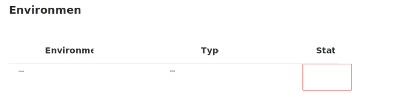

This module has three exercises:

**Exercise 1** - Create the app in Microsoft Power Apps. In this exercise, you create a solution to hold your app and any related customizations. Then, you create your canvas app and complete the first screen of the app.

**Exercise 2** - Add a machine gallery and connect to a data source. In this exercise, you add a gallery of all available machines, which helps make it easier for users to browse the list and get a quick overview of the available machines.

**Exercise 3** - Add a compare screen. The second screen is where users compare the selected machines and then choose the one that they want to submit for approval.

## Coffee Machine Ordering Scenario

Imagine an organization where every few years the employees request an updated coffee machine for their employee break room. The organization would like to build a customized app that runs on the web and mobile devices, which helps streamline the machine order and approval process. Moreover, they don't have traditional development resources available, such as a .NET, Xamarin, or custom website developer, to create this application.

## Solution overview

The Microsoft Power Platform technologies enable tech-savvy business users to build a customized machine ordering solution. The application user interface and interaction logic are built in Power Apps, the approval workflow is automated using Power Automate, and the machine order data is stored in Microsoft Dataverse.

## Key features of the solution

- Ability to browse through a selection of coffee machines
- Select machines to compare
- View detailed specs for the selected machines on a second comparison screen
- Select a machine to order
- Enter order details into a customized form, including an image
- By default, have the approver set to the logged in user’s manager
- Capture other default properties, such as the date of the request
- Store machine orders in a secure and scalable Cloud database
- Enable an admin to view all machine orders
- Follow a customized procurement process to place purchase orders for machines
- Send an automated approval request email when the order is placed
- Allow the approver to approve or reject an order and add comments without leaving their email inbox
- View all sent and received approval requests on the web and mobile
- Notify the user via email when their order is approved or rejected

> [!NOTE]
> You will need an environment with a licensed user to complete these exercises. It is not recommended to use your production> > (live environment for work or school) user/tenant for completing these exercises.

If you need a learning environment, follow these steps. If you have one being provided to you, such as by a trainer, move on to the next module in this series.

## Start a trial of Power Apps

Usage of Microsoft Dataverse requires a Power Apps premium license. Go to Power Apps Pricing and select the "Try free" option to start a free 30-day trial. For more detailed information, see [Explore Power Apps for free for 30 days](/powerapps/maker/signup-for-powerapps).

1. You need to add a free trial of Office E3 and Power Automate per user. After you have the Power Apps trial set-up, navigate to the [Microsoft 365 admin center](https://admin.microsoft.com) and select **Purchase Services** from the left navigation area of **Billing**.

1. Search for and select **Office E3**. Select **details**. Find and select **start your free trial**.
1. Search for and select **Power Automate per user** and **start your free trial**.
1. **Assign licenses** for each of these to your **Power Apps user**. Select **Active Users** from the left navigation area of Users. Select your user, then select **Licenses and Apps**. Select the desired licenses and **Save** changes. You might need to refresh your browser to see the changes take effect.

You must have a newly created Microsoft Dataverse environment and database instance that was created just for this training. If you don’t have a new environment or have an older environment, follow the steps below to create the environment and provision the database instance.

1. Open the [Power Platform admin center](https://admin.powerplatform.com).
1. In the Admin center, select **Environments** and select **+New**.
1. Provide a name for the environment. A common practice is to use your name followed by “Test” so it's clear this is a test environment.
1. Select your **Region**, select **Trial**, make sure **Add a Dataverse data store** is set to **Yes**, and select **Next**.
	> [!div class="mx-imgBorder"]
	> 
1. If you get an **Edit security group** window, select **None** in the **Open access** section.
1. Select your **Language** and your **Currency**. Select **Yes** for **Deploy sample apps and data**, and then select **Save**.

   > [!NOTE]
   > You can choose your local language and currency. However, the lab manuals were created using US dollars and English language configurations.
1. You see a screen listing all environments that show the newly created environment.
   > [!IMPORTANT]
   > You need to wait for the database to finish provisioning before trying to create an application. The **Status** will change to **Ready** when done.

   	> [!div class="mx-imgBorder"]
	> 
1. This might take few minutes to complete. Wait for it to complete before proceeding with creating an app. If it takes over two minutes, try refreshing the browser. Once the database is created, you should no longer see the **Preparing Instance** message. You can then proceed with the lab.
