In this exercise, you add a business process flow to the Machine Order table to help guide the back-office worker through the task of managing procurement of the requested device.

In discovery meetings with the back-office staff, you've learned that a machine request goes through the following tasks as the staff gets the requestor their machine.

-   **Machine Requested** - Currently, this task involves sending an email to back-office personnel about the machine request. In the new Power Apps system, this task involves a Machine Order row in Microsoft Dataverse.

-   **Place Order** - After the back-office personnel receive the request, they'll place an order with a supplier and get an order ID.

-   **Receive Machine** - This task occurs when the machine is received, and the back-office workers send it to the technician to be set up with the standard configuration.

-   **Distribute Machine** - After the machine has been set up, it needs to be sent to the employee who requested it. Additionally, the back-office worker needs to survey the employee to make sure that they're satisfied with the machine.

Each task represents a milestone and will become stages in the business process flow. In a more complex scenario, you'd likely compress or potentially reimagine the business process to make it more optimal than the current process that the staff performs with their existing process.

For this lab, the **Receive Machine** and **Distribute Machine** stages are marked as optional. While you'd need to create these stages for a full implementation of the scenario, to save time, you can skip them or do them as a take-home exercise.

The completed business process flow resembles the following image.

> [!div class="mx-imgBorder"]
> [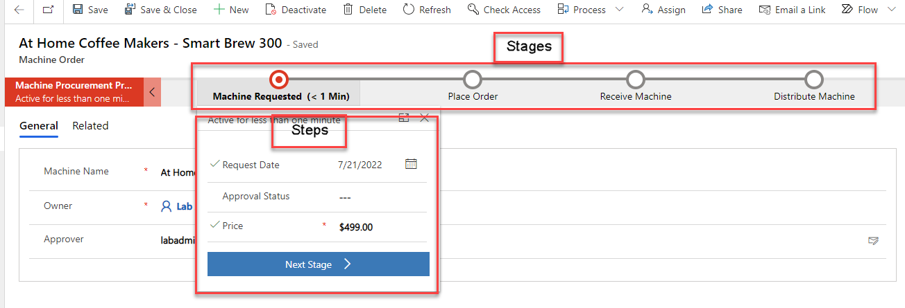](../media/business-process-flow.png#lightbox)

> [!NOTE]
> To complete the exercises, you'll need to use a few
> files. Download the [App in a Day files](https://github.com/MicrosoftDocs/mslearn-developer-tools-power-platform/raw/master/in-a-day/AIAD/AppinADayStudentFiles.zip)
> for use in this module. The file folders that are in
> this download include:
>
> - **Completed modules with instructions** - Package files to import the completed exercise steps. 
> - **Machine-Order-Data.xlsx** - File used in the exercises.

## Task: Create business process flow
To create a business process flow, follow these steps:

1.  Select **Solutions** and then open the **Contoso Coffee** solution.

1.  Select **+ New** and then select **Automation > Process > Business process flow**.

	> [!div class="mx-imgBorder"]
	> 

1.  Enter `Machine Procurement Process` in the **Display name** field, select **Machine Order** from the **Table** dropdown menu, and then select **Create**. When you create the business process flow behind the scenes, it creates another table with the same name as the business process flow to track the progress of each business process on the row. Therefore, make sure that you choose your name carefully; for example, you wouldn't want to use the same name as your table (such as Machine Order). For this exercise, enter the name as `Machine Procurement Process`. 

	 > [!Note] 
	 > After you select **OK**, a new window will be loaded with the designer. If you have pop-up blockers enabled, this window might be blocked. Additionally, the window might not immediately have focus, so you might need to manually bring it into focus.

	> [!div class="mx-imgBorder"]
	> 

1.  Select the **Machine Order New Stage**, change the **Display Name** to `Machine Requested`, and then select **Apply**.

	> [!div class="mx-imgBorder"]
	> [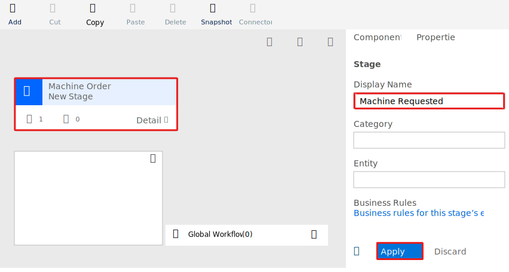](../media/display-name.svg#lightbox)

1.  Select the **Details** drop down within the step.

	> [!div class="mx-imgBorder"]
	> 

1.  Select the **Data Step**, select **Request Date** from the **Data Field** dropdown menu, and then select **Apply**. The **Step Name** field is filled in for you automatically.

	> [!div class="mx-imgBorder"]
	> [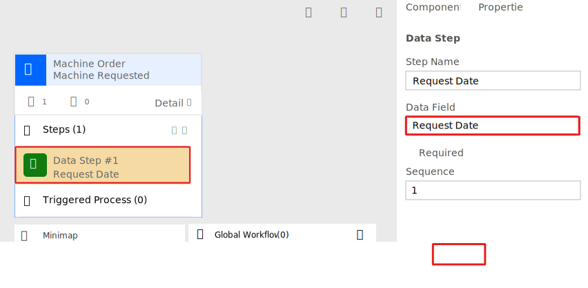](../media/apply.svg#lightbox)

1.  Select **Add** and then select **Add Data Step**.

	> [!div class="mx-imgBorder"]
	> [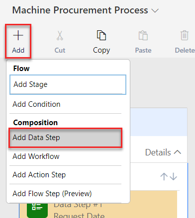](../media/add-data-step.png#lightbox)

1.  Select the plus (**+**) icon under **Data Step 1**.

	> [!div class="mx-imgBorder"]
	> [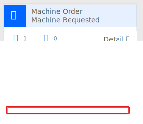](../media/add.svg#lightbox)

1.  Select **Approval Status** from the **Data Field** dropdown menu and then select **Apply**.

1. Add another data step, select **Price** from the **Data Field** dropdown menu, and then select **Apply**.

	> [!div class="mx-imgBorder"]
	> [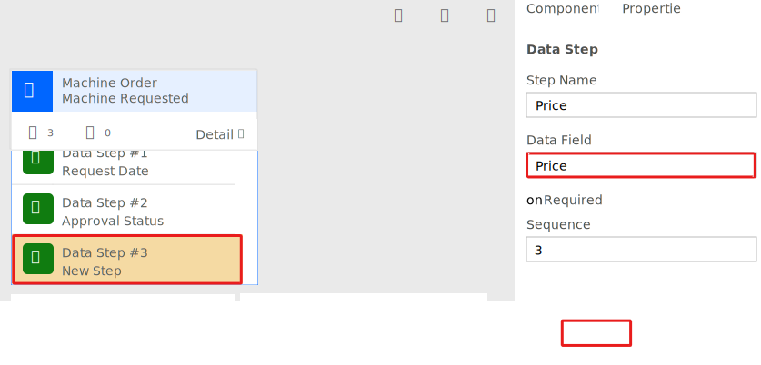](../media/apply-button.svg#lightbox)

1. Select the **Components** tab.

	> [!div class="mx-imgBorder"]
	> 

1. Drag **Stage** to the canvas and then place it to the right of the **Machine Requested** stage.

	> [!div class="mx-imgBorder"]
	> [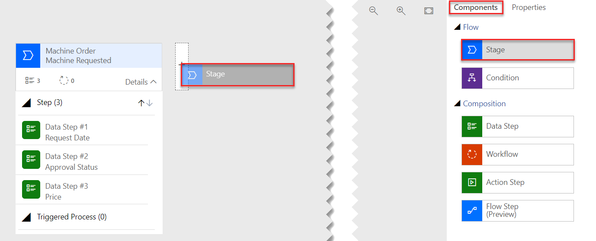](../media/stage.png#lightbox)

1. Select the new stage, change the **Display Name** to `Place Order`, and then select **Apply**.

	> [!div class="mx-imgBorder"]
	> [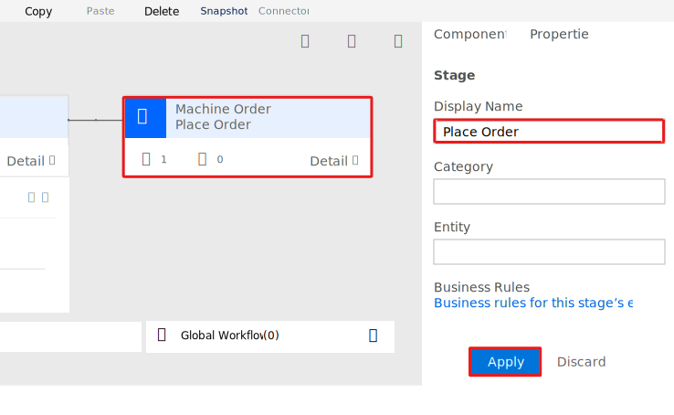](../media/button-apply.svg#lightbox)

1. Select **Details**.

1. Select the existing **Data Step**, select **Estimated Ship Date** from the **Data Field** dropdown menu, and then select **Apply**.

	> [!div class="mx-imgBorder"]
	> [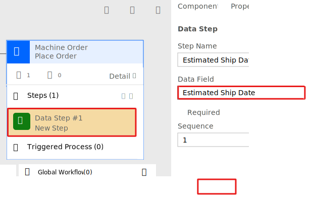](../media/apply-highlighted.svg#lightbox)

1. Select the **Components** tab, and then drag **Data Step** to the canvas and place it under the **Estimated Ship Date** step.

	> [!div class="mx-imgBorder"]
	> [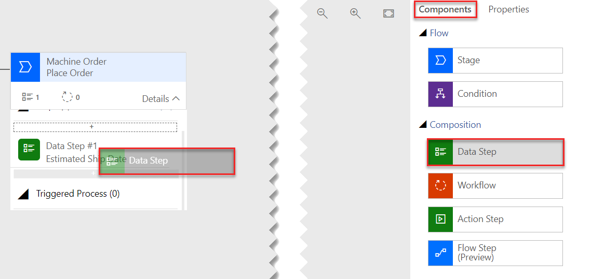](../media/data-step.png#lightbox)

1. Select **Supplier Order ID** from the **Data Field** dropdown menu, select the **Required** checkbox, and then select **Apply**. This column isn't required; however, by selecting it at this point, you'll require users to fill out the column before they can advance to the next stage. However, the column won't block saving the row if a data value hasn't populated, as it would if the column was marked as **Required** on the column definition.

	> [!div class="mx-imgBorder"]
	> [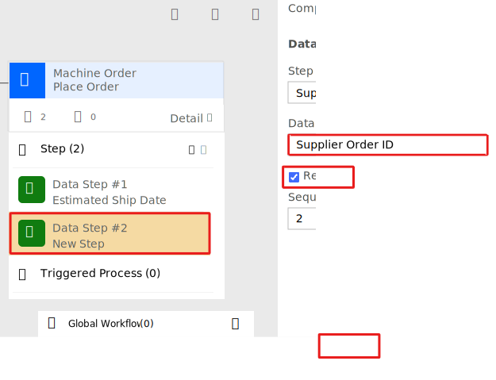](../media/required.svg#lightbox)

	> [!NOTE]
	> All steps from hereon, until you reach **Task: Add a branch condition**, are optional. These steps add two more stages to the business process by using the same technique that you've already learned. You can skip ahead to **Task: Add a branch condition**.

1. Select the **Components** tab and then drag **Stage** to the right side of the **Place Order** stage.

	> [!div class="mx-imgBorder"]
	> [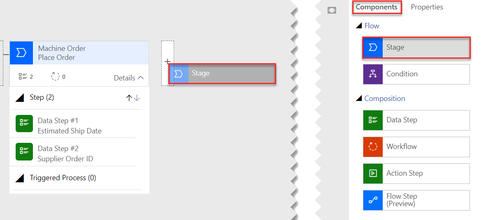](../media/stage-location.png#lightbox)

1. Select the new stage, change the **Display Name** to `Receive Machine`, and then select **Apply**.

	> [!div class="mx-imgBorder"]
	> [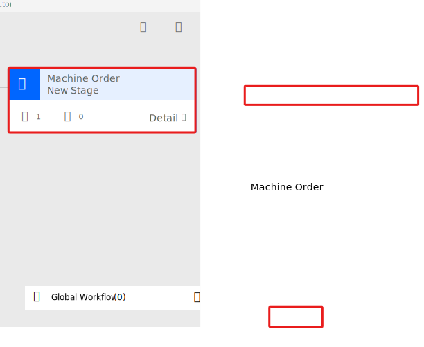](../media/receive-machine-apply.svg#lightbox)

1. Select the **Details** drop-down within the **Receive Machine** stage.

1. Select the existing Data Step, select **Machine Received** from the **Data Field** dropdown menu, and then select **Apply**.

1. Select the **Components** tab, and then drag **Data Step** to the **Receive Machine** stage and place it under the **Machine Received** step.

1. Select **Machine Configured** from the **Data Field** dropdown menu and then select **Apply**.

	> [!div class="mx-imgBorder"]
	> [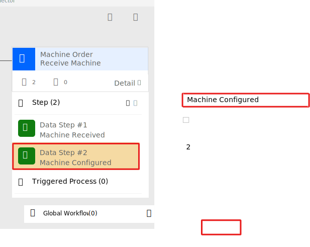](../media/machine-configured-apply.svg#lightbox)

1. Add another **stage** to the right of the **Receive Machine** stage, and name it `Distribute Machine`.

1. Add two data steps: **Machine Delivered** and **Send Survey**.

	> [!div class="mx-imgBorder"]
	> [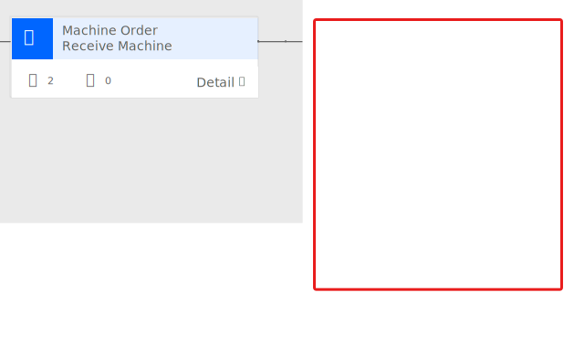](../media/data-steps.svg#lightbox)

## Task: Add a branch condition 

In this task, you add a conditional branch to your business process flow. When you did the discovery, you learned that if the price was greater than \$10K, then other steps would be in place to get capital approval prior to placing the order. In this task, you determine how to modify the flow that you built to accommodate this scenario.

1.  Select the **Components** tab, and then drag **Condition** and place it between **Machine Requested** and **Place Order**.

	> [!div class="mx-imgBorder"]
	> [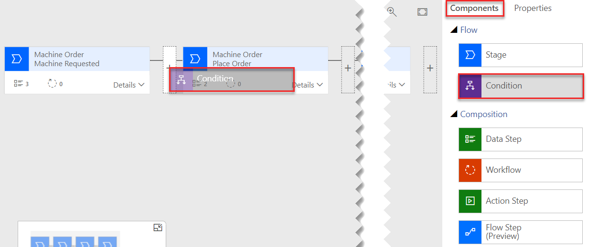](../media/condition.png#lightbox)

1.  Select the **Condition** and change the **Display Name** to `Check Price`.

	> [!div class="mx-imgBorder"]
	> [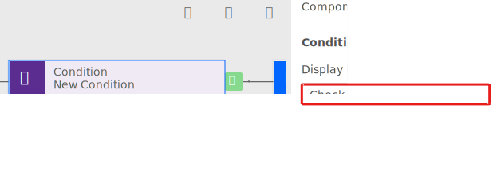](../media/check-price.svg#lightbox)

1.  In the **Rules** section, select **Price** from the **Field** dropdown menu, select **Is greater than** for the **Operator**, select **Value** for **Type**, enter `10,000.00` in the **Value** field, and then select **Apply**. Columns that you use in the rules on the condition must be in the prior Stages steps, which is one reason the price was entered previously.

	> [!div class="mx-imgBorder"]
	> [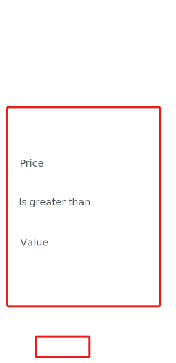](../media/condition-apply.svg#lightbox)

1.  Select **Save** from the tool bar at the top of the screen.

	> [!div class="mx-imgBorder"]
	> 

    A new stage is added.

	> [!div class="mx-imgBorder"]
	> [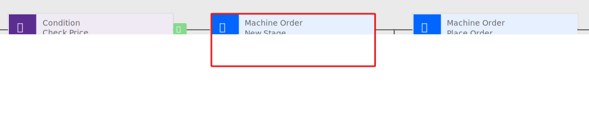](../media/new-stage.svg#lightbox)

1.  Select the new stage, change the **Display Name** to `Capital Approval`, and then select **Apply**.

1.  Select **Details** within the new **Capital Approval** stage.

	> [!div class="mx-imgBorder"]
	> [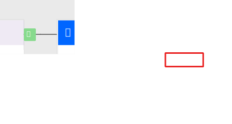](../media/details-menu.svg#lightbox)

1.  Select the existing data step within the stage, choose **Capital Approved** from the **Data Field** dropdown menu, and then select **Apply**.

	> [!div class="mx-imgBorder"]
	> [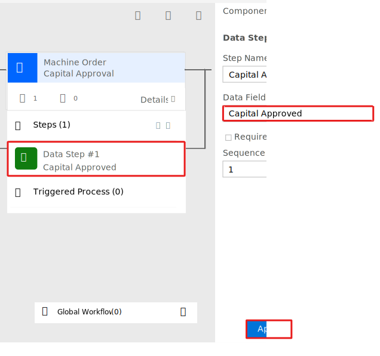](../media/capital-approved-apply.svg#lightbox)

1.  Select **Save** again from the tool bar.

1. Then, select **Activate** from the same tool bar.

	> [!div class="mx-imgBorder"]
	> 

1. Confirm the activation.

	> [!div class="mx-imgBorder"]
	> [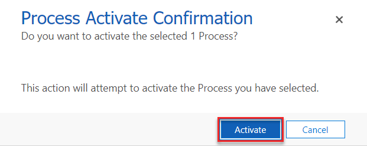](../media/activate-confirmation.png#lightbox)

1. Close the process editor.
