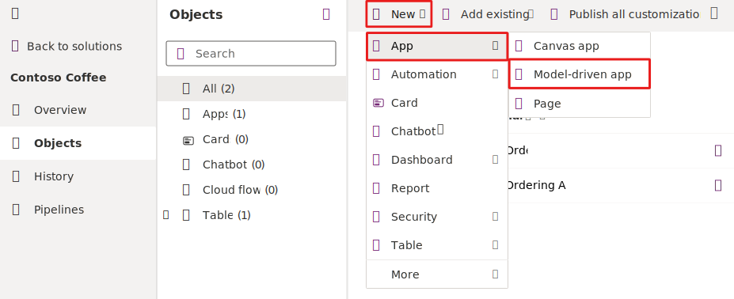
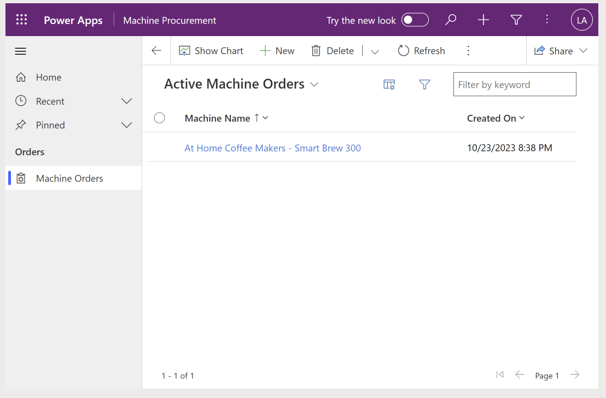
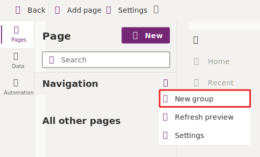
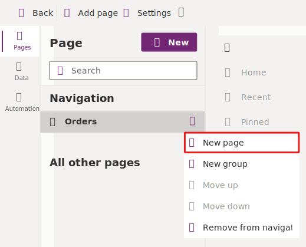
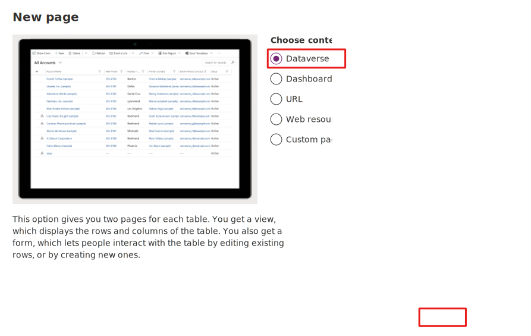
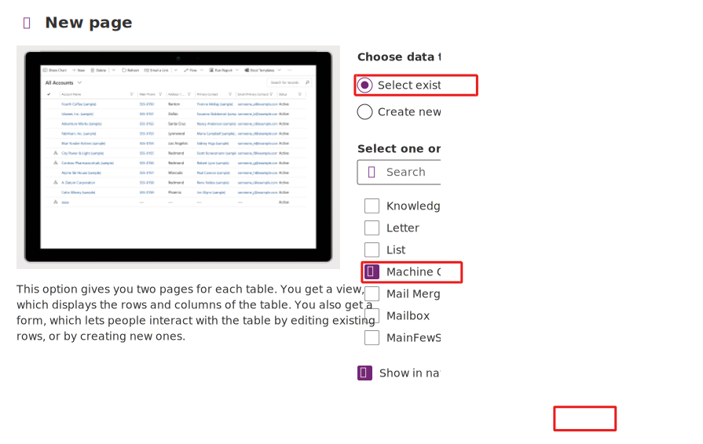
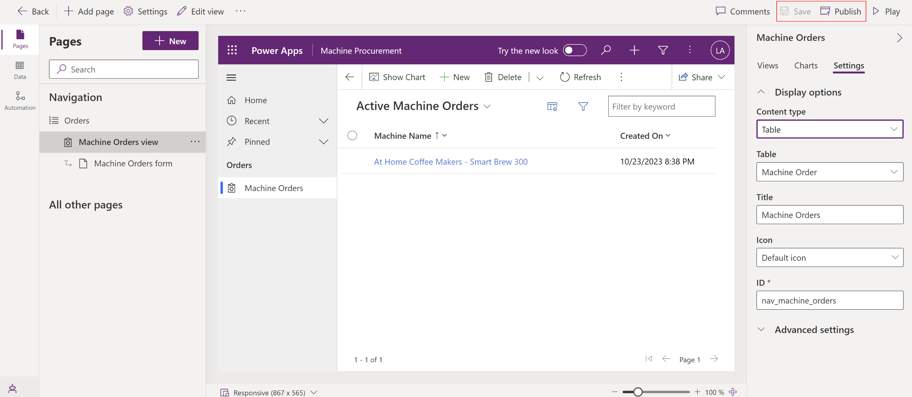
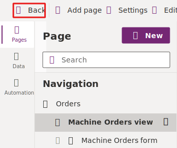
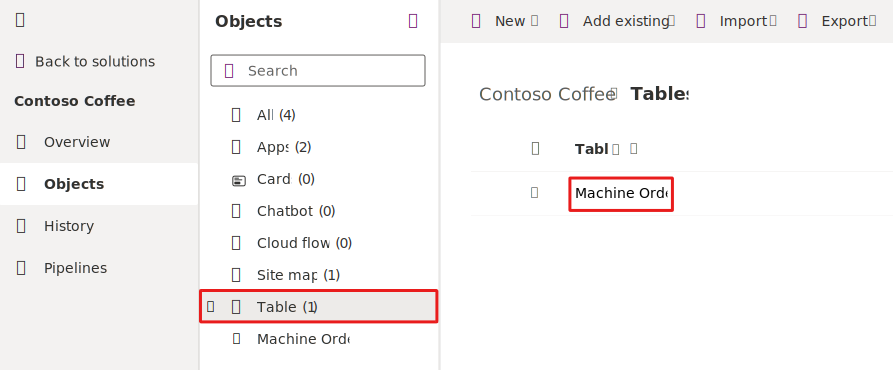
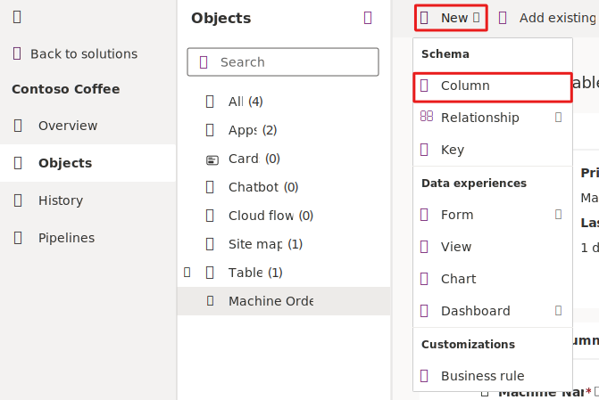

In this exercise, you create a standalone model-driven application that uses the same Machine Order table that you created in Microsoft Dataverse.

> [!NOTE]
> This module is designed for use with the App in a Day instructor-led course. For more information on attending this free, instructor-led course, see [Microsoft Power Platform instructor-led training](https://powerplatform.microsoft.com/instructor-led-training/). On that page, you can [Register for an event](https://events.microsoft.com/allevents/?search=App%20in%20a%20Day&view=list&language=English&clientTimeZone=1&startTime=06:00&endTime=11:00).

> [!NOTE]
> To complete the exercises, you'll need to use a few
> files. Download the [App in a Day files](https://github.com/MicrosoftDocs/mslearn-developer-tools-power-platform/raw/master/in-a-day/AIAD/AppinADayStudentFiles.zip)
> for use in this module. The file folders that are in
> this download include:
>
> - **Completed modules with instructions** - Package files to import the completed exercise steps. 
> - **Machine-Order-Data.xlsx** - File used in the exercises.

## Task: Create an application

Your first task is to create a model-driven application. This application serves as a container to identify all components that make up the application. It will also include a site map that defines the custom navigation that people use to navigate between the components (table views, dashboards, and other visual components).

1.  Go to [Make Power Apps](https://make.powerapps.com/?azure-portal=true) and select the environment that you created.

1.  Select **Solutions** and then open the **Contoso Coffee** solution.

1.  Select the **+ New** drop down from the tool bar at the top of the screen and then select **App > Model-driven app**.

	> [!div class="mx-imgBorder"]
	> 

1.  In the **New model-driven app** form, enter `Machine Procurement` in the **Name** field and then select **Create**.

	> [!div class="mx-imgBorder"]
	> 

	Next, in the following steps, you'll build a site map for the application. When it's completed, the site map will resemble this image.

	> [!div class="mx-imgBorder"]
	> 

1.  Within the **Pages** pane to the left of the screen, hover over **Navigation**. Then, select the **ellipsis** and choose **New group** from the menu.

	> [!div class="mx-imgBorder"]
	> 

1.  Within the **New Group** pane to the right of the screen, under the **Display options** section, enter `Orders` in the **Title** field and `nav_ordersgroup` in the **ID** field.

	> [!NOTE]
	> The properties panel on the right will only show if you have the **New Group** selected from the pane to the left.

	> [!div class="mx-imgBorder"]
	> 

1.  Select the **ellipsis** (...) next to the **Orders** group from the Navigation pane and select **New page**.

	> [!div class="mx-imgBorder"]
	> 

	> [!NOTE]
	> The properties panel on the right will only show if you select **New page** on the left.

1.  Within the **New page** dialog, select **Dataverse Table** from the **content** option list. Then, select the **Next** button in the bottom corner of the dialog.

	> [!div class="mx-imgBorder"]
	>  

1. Ensure that **Select existing table**  is selected for the data table option. From the list of tables, select the checkbox for **Machine Order**. Then, select **Add**.

	> [!div class="mx-imgBorder"]
	>  

1. Within the **Machine Orders** pane to the right of the screen, under the **Display options** section, enter `nav_machine_orders` in the **ID** box.

	> [!div class="mx-imgBorder"]
	> 

1.  The application should now resemble the following image. Select **Save** and **Publish**.

	> [!div class="mx-imgBorder"]
	> 

1. Select the **Back** button to navigate back to your solution.

	> [!div class="mx-imgBorder"]
	> 

## Task: Add procurement columns to the Machine Order table

In this task, you add new columns to the Machine Order table. The columns that you'll add will support the business process flow, which you'll build in the next exercise. When you use a business process, it consists of stages, which you can consider major milestones in completing the work. Each stage has one or more steps. These steps help users keep track of what they need to do before advancing to the next stage. Steps are simply columns on the table. To accelerate the process of creating the business process in this task, you'll first create the columns that you need.

To support this scenario, you add the following columns to the table:

- **Capital Approved** - You use this column in the flow to capture that the machine order has received capital approval.

- **Send Survey** - You use this column in the final stage. Currently, the team plans on manually sending a survey to determine how the user's ordering experience was, and they'll manually verify this fact after they've sent the survey. However, the team wants a future update to automate sending a survey in a future release.

1.  Go to [Make Power Apps](https://make.powerapps.com/?azure-portal=true).

1.  Select **Solutions** and then open the **Contoso Coffee** solution.

1.  Select **Tables** and then open the **Machine Order** table.

	> [!div class="mx-imgBorder"]
	> 

1.  Select **+ New > Column**.

	> [!div class="mx-imgBorder"]
	> 

1.  Enter `Capital Approved` in the **Display name** field, select **Choice** then  **Yes/No** from the **Data type** dropdown menu, and then select **Save**. A **Yes/No** data type is used in this case because, when you use it as a step in the business process, you want the ability to mark it as completed. The **Yes/No** column type is similar to a true or false column.

	> [!div class="mx-imgBorder"]
	> 

1.  Create four more **Yes/No** columns and name them **Machine Received**, **Machine Configured**, **Send Survey**, and **Machine Delivered**.

	> [!div class="mx-imgBorder"]
	> 

	> [!div class="mx-imgBorder"]
	> 

	> [!div class="mx-imgBorder"]
	> 

	> [!div class="mx-imgBorder"]
	> 

1.  Add another column with the name of `Supplier Order ID`, select **Single line of text** from the **Data type** dropdown menu, select **Text** from the **Format** menu, and then select **Save**. Notice that you're not making this column required. You make it a required column in the business process later in the lab.

	> [!div class="mx-imgBorder"]
	> 
