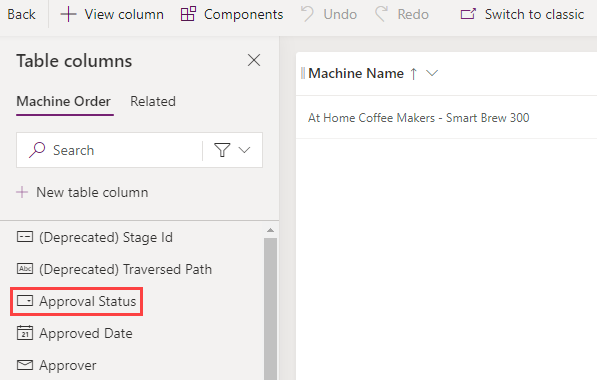

In this exercise, you modify the Machine Order form to add other columns. When you create a table in Microsoft Dataverse, it also creates a main form for that table with a few basic columns on it. In addition to the form, views are created for the table. Views are used in a model-driven app whenever a list of the table rows are displayed. You would modify the view to add more columns or change the placement. You can also create other views. For example, you might provide a view to show all machine requests that are waiting to be received.

> [!NOTE]
> To complete the exercises, you'll need to use a few
> files. Download the [App in a Day files](https://github.com/MicrosoftDocs/mslearn-developer-tools-power-platform/raw/master/in-a-day/AIAD/AppinADayStudentFiles.zip)
> for use in this module. The file folders that are in
> this download include:
>
> - **Completed modules with instructions** - Package files to import the completed exercise steps. 
> - **Machine-Order-Data.xlsx** - File used in the exercises.

## Task: Modify the form
To modify the form, follow these steps:

1.  Select **Solutions** and then open the **Contoso Coffee** solution.

1.  Select **Tables** and then open the **Machine Order** table.

	> [!div class="mx-imgBorder"]
	> 

1.  Go to the **Data experiences** section and select **Forms**.

	> [!div class="mx-imgBorder"]
	> 

1.  Select the **Information Main** form and then select **Edit > Edit in new tab**.

	> [!div class="mx-imgBorder"]
	> 

	> [!NOTE]
	> The form designer is being modernized. For more information, see [Overview of the model-driven form designer](/powerapps/maker/model-driven-apps/form-designer-overview/?azure-portal=true).

1.  If you're required to sign in again, do so.

1.  From the **Table columns** pane to the left of the screen, search for the **Approver** column and then drag it to the form.

1.  Place the **Approver** column above the **Machine Name** column.

	> [!div class="mx-imgBorder"]
	> 

1.  The new form designer lets you reposition columns. Drag the **Approver** column and place it between the **Machine Name** and **Owner** columns.

1.  The new form designer lets you cut and paste columns. Select the **Approver** column and then select the **Cut** button.

1. Select the **Owner** column and then select **Paste**.

	> [!div class="mx-imgBorder"]
	> 

   The **Approver** column is moved to the bottom.

	> [!div class="mx-imgBorder"]
	> 

1. Select **Save and Publish**.

	> [!div class="mx-imgBorder"]
	> 

1. Close the **Form Designer** tab.

1. Select **Done**.

## Task: Modify the view
To modify the view, follow these steps:

1.  Select **Solutions** and then open the **Contoso Coffee** solution.

1.  Select **Tables** and then open the **Machine Order** table.

1.  Go to the **Data experiences** section and select **Views**.

	> [!div class="mx-imgBorder"]
	> 

1.  Open the **Active Machine Orders** option.

	> [!div class="mx-imgBorder"]
	> 

1.  Select the **Approval Status** column (you don't need to double-click).

	> [!div class="mx-imgBorder"]
	> 

    The new column is added to the view.

	> [!div class="mx-imgBorder"]
	> 

1.  Select the **+ View column** button.

	> [!div class="mx-imgBorder"]
	> 

1.  Select **Estimated Ship Date**.

	> [!div class="mx-imgBorder"]
	> 

1.  Using the same steps, add the **Price** and **Status** columns to the view.

	> [!div class="mx-imgBorder"]
	> 

1.	Select the **Save and Publish** button.

1.  Then, select the **Back** button.

	> [!div class="mx-imgBorder"]
	> 
