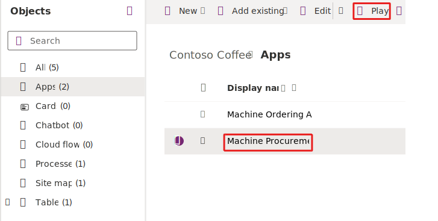
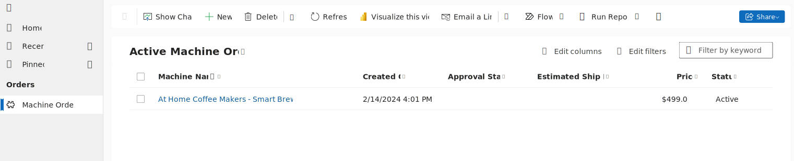
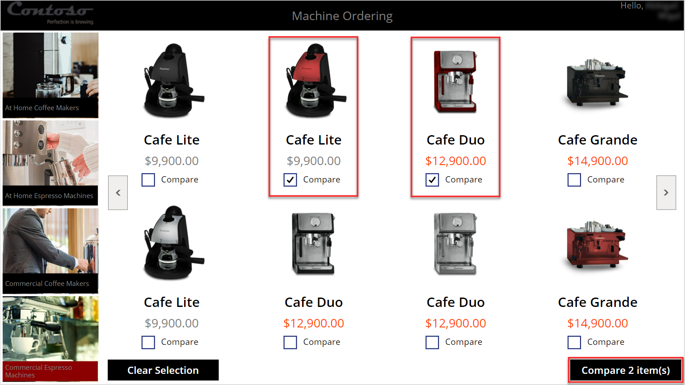
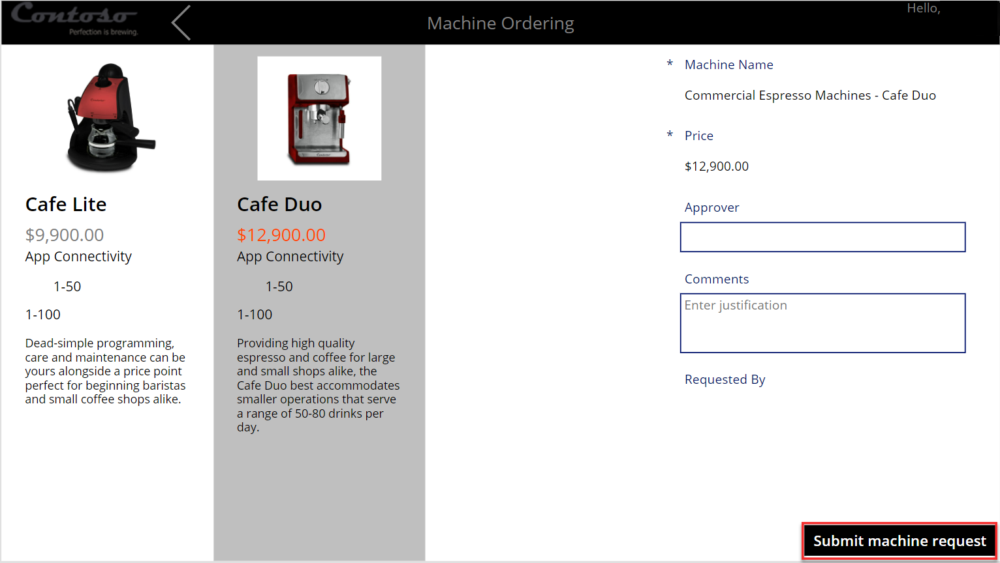
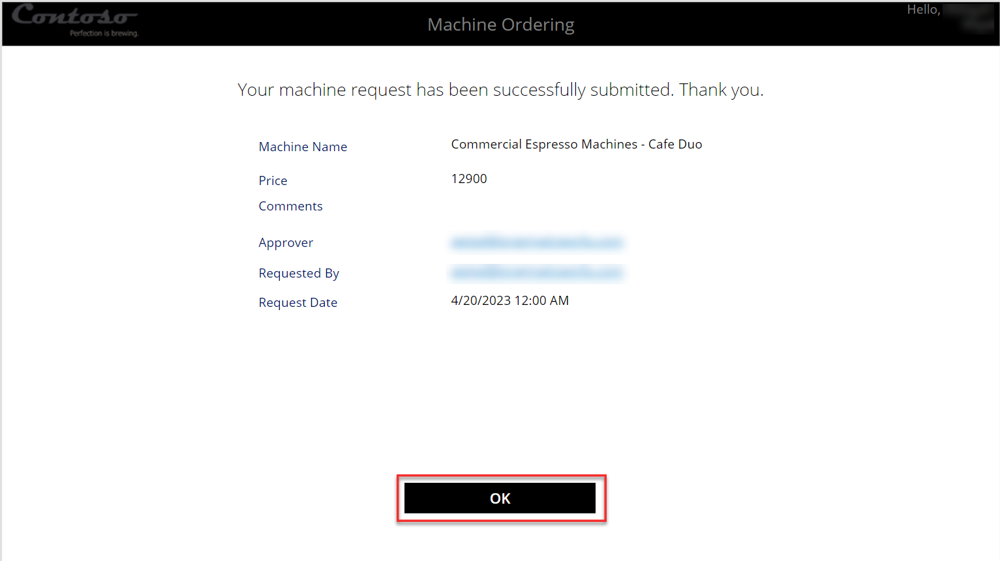
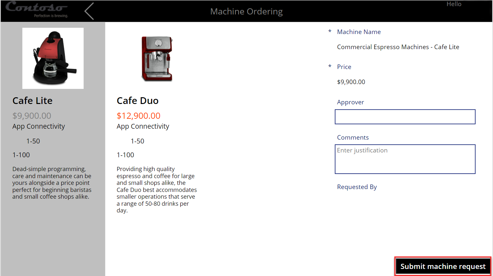
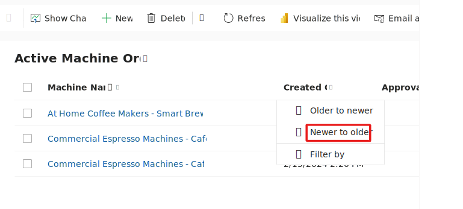
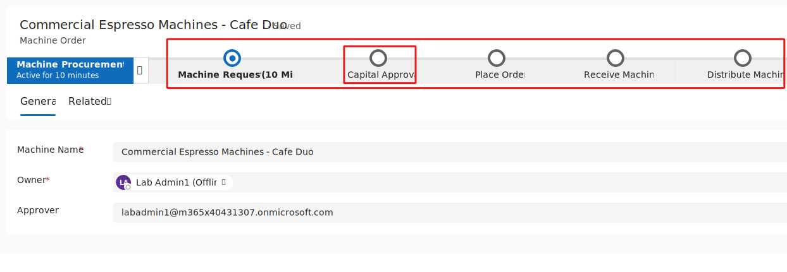
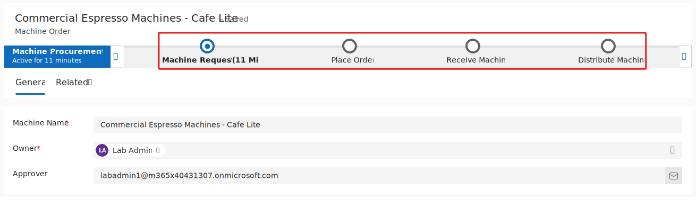

In this exercise, you test the application that you built.

> [!NOTE]
> To complete the exercises, you'll need to use a few
> files. Download the [App in a Day files](https://github.com/MicrosoftDocs/mslearn-developer-tools-power-platform/raw/master/in-a-day/AIAD/AppinADayStudentFiles.zip)
> for use in this module. The file folders that are in
> this download include:
>
> - **Completed modules with instructions** - Package files to import the completed exercise steps. 
> - **Machine-Order-Data.xlsx** - File used in the exercises.

## Task: Test the application
To test the application, follow these steps:

1.  Select **Apps**, select the **Machine Procurement** application, and then select **Play**.

	> [!div class="mx-imgBorder"]
	> 

    The application should start, and the **Active Machine Orders** view should load.

	> [!NOTE]
	> If your data doesn't show in the list, run the Machine Ordering canvas app that you built and then submit some orders.

	> [!div class="mx-imgBorder"]
	> 

1.  Start a new web browser instance and then go to [Make Power Apps](https://make.powerapps.com/?azure-portal=true). Don't close the model-driven application.

1.  Select **Apps**, select the Machine Ordering canvas application that you created in module 2, and then select **Play**.

1.  Select two machines. Make sure that one of the machines is priced over \$10,000 and then select **Compare**.

	> [!div class="mx-imgBorder"]
	> 

1.  Select the machine with the price over \$10,000 and then select **Submit machine request**.

	> [!div class="mx-imgBorder"]
	> 

1.  Select **OK**. If you didn't choose to create the submission success screen in a previous module, this option won't exist. You need to complete steps 3 and 4 again and then move to step 8.

	> [!div class="mx-imgBorder"]
	> 

1.  Select two more machines and then select **Compare**.

1.  Select a machine with a price under \$10,000. Provide an approver email (or leave in the autopopulated manager email) and then select **Submit**.

	> [!div class="mx-imgBorder"]
	> 

1. Return to the model-driven application that you created and refresh the view. Sort the orders by the **Created On** column from **newer to older**. The two machines that you ordered by using the Power Apps canvas app should display.

	> [!div class="mx-imgBorder"]
	> 

1. Open the machine name record that's priced **over $10,000**.

   The business process flow should now have five stages because this order costs more than $10,000 and needs **Capital Approval**.

	> [!div class="mx-imgBorder"]
	> 

1. Navigate back to the **Active Machine Orders**.

1. Select the other recent order that you created that is priced **below $10,000**.

1. The business process flow for this order should have four stages because this order doesn't require **Capital Approval**.

	> [!div class="mx-imgBorder"]
	> 

