You'll start this exercise by creating your data model in Microsoft Dataverse. This task includes creating your tables and columns for the data users who will be interacting with your app.

> [!NOTE]
> To complete the exercises, you'll need to use a few
> files. Download the [Dataverse exercise files](https://github.com/MicrosoftDocs/mslearn-developer-tools-power-platform/raw/master/in-a-day/dataverse/dataverse-teams-exercise-files.zip)
> for use in this module. The file folders that are in
> this download include:
>
> - **Completed modules with instructions** - Package files to import the completed exercise steps. 
> - **Student materials** - Files that are used in the exercises.

## Task: Set locale to US English

To begin, you'll set the locale of Teams to US English to make the experience in the rest of the labs more convenient.

1.  In your browser, go to [Teams](https://teams.microsoft.com/) and sign in with the account that you're using for the labs.

1.  In the upper-right corner, select the ellipsis (**...**) and then open **Settings**.

	> [!div class="mx-imgBorder"]
	> [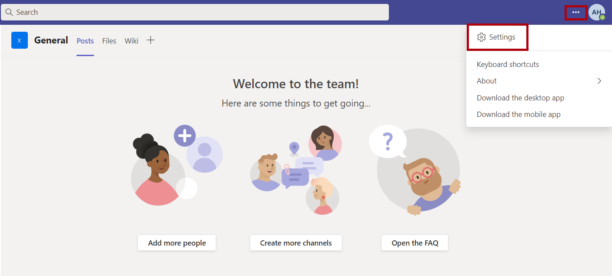](../media/teams-settings.png#lightbox)

1.  In the **General** settings tab, in the **Language** section, set both settings to **English (United States)** and then close the pop-out window.

	> [!div class="mx-imgBorder"]
	> [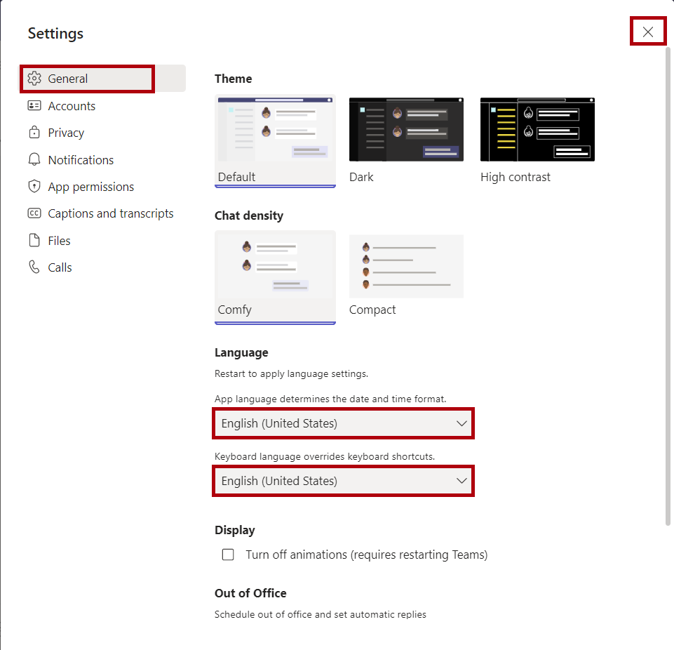](../media/general-settings.png#lightbox)

1.  If you made a change to the language setting in the previous step, you'll need to restart Teams to apply the setting. Close your Teams browser. Launch the browser again and then go to [Teams](https://teams.microsoft.com/). Sign in with the account that you're using for the labs.

## Task: Create a new team 

To create a new team, follow these steps:

1.  Select **Join or create a team**, located in the lower left of the screen. You might need to select the **Teams** option from the left navigation menu to view this option.

	> [!div class="mx-imgBorder"]
	> [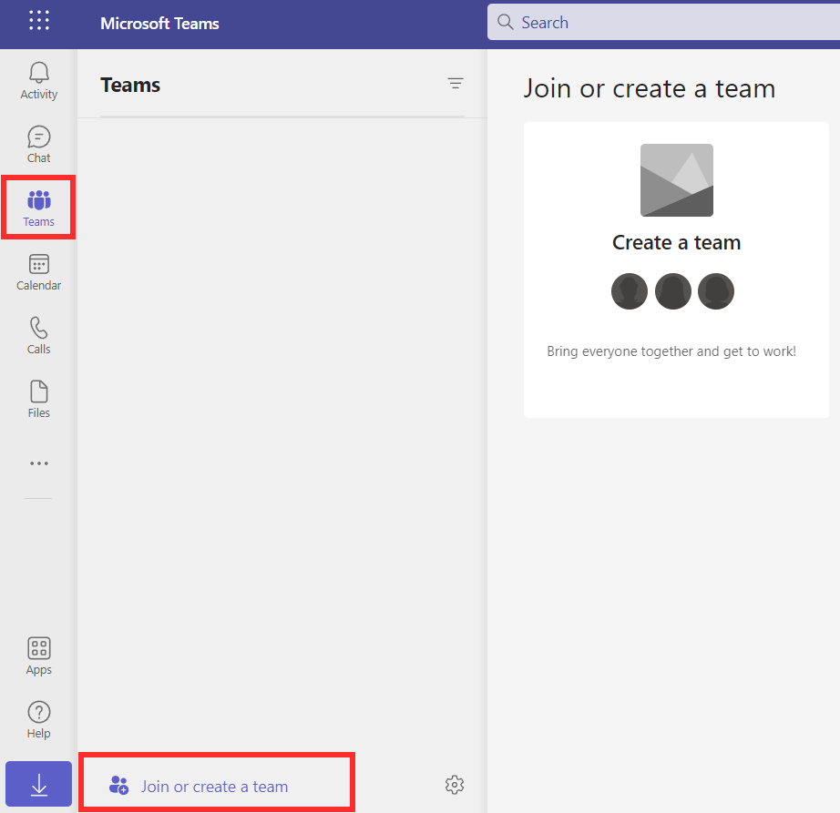](../media/new-team.png#lightbox)

1.  Select **Create team** and then select **From scratch**.

	> [!div class="mx-imgBorder"]
	> [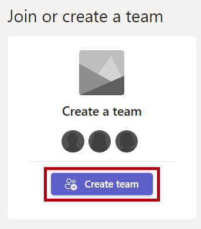](../media/teams-creation.png#lightbox)

	> [!div class="mx-imgBorder"]
	> [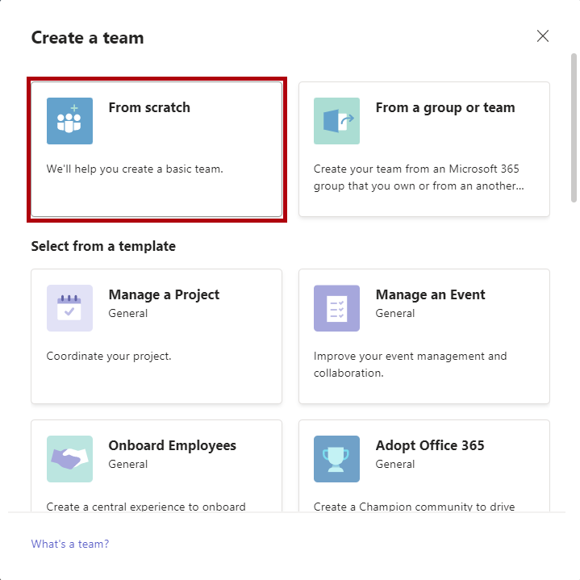](../media/scratch.png#lightbox)

1.  Set the team as **Public**.

	> [!div class="mx-imgBorder"]
	> [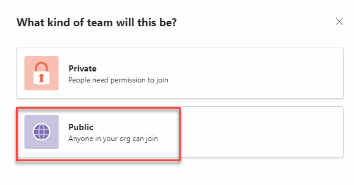](../media/public.png#lightbox)

1.  Give your team a unique name, such as **Office - \<your name\>**, and then select **Create**.

	> [!IMPORTANT]
	> Give your team a unique name because other users in your tenant will be creating a team also. This precaution is to help you identify your team.

	> [!div class="mx-imgBorder"]
	> 

1.  You can **skip** adding members into the team.

## Task: Discover and add Power Apps to Teams

In this task, you'll pin the Microsoft Power Apps application to your Teams toolbar for easier access.

1.  Select the **Apps** icon on the left toolbar, and then search for Power Apps.

	> [!div class="mx-imgBorder"]
	> 

1.  Select the **Power Apps** application when you find it in the search results.

	> [!div class="mx-imgBorder"]
	> 

1.  A pop-up window will display, containing information about the Power Apps application for Microsoft Teams. Select the **Add** button.

	> [!div class="mx-imgBorder"]
	> 

1.  The Power Apps application will display in the left navigation. Right-click that icon and select **Pin**, which will pin the app to the navigation bar. Pinning the app will help make it easier for you to return to it when needed.

	> [!div class="mx-imgBorder"]
	> 

## Task: Create a new app

One way to get started creating your data model in Dataverse is to create a new app from Power Apps. By starting this way, your app will automatically have a template for you to view, edit, delete, and submit new data.

1.  In the Teams left pane, select **Power Apps** and then select **Start now**.

    *If the screen appears blank, wait a few minutes and then refresh the page*.

	> [!div class="mx-imgBorder"]
	> 

1. In the **Select a team for this app** dialog, select the team that you previously created and then select **Create**.

    *It might take a few minutes for the app, so be prepared. You'll get a notification in Teams when the process has completed*.

	> [!div class="mx-imgBorder"]
	> [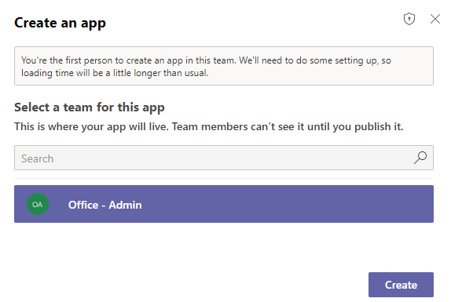](../media/select-team.png#lightbox)

1. When the app is ready, you'll be directed to the editing canvas for the app. Name the app as **Swag Request App** and then select **Save**.

	> [!div class="mx-imgBorder"]
	> 

	> [!NOTE]
	> If your app has been in the **Saving** process for longer than five minutes, a problem might have occurred in its creation. To try again, refresh the page.

	> [!div class="mx-imgBorder"]
	> [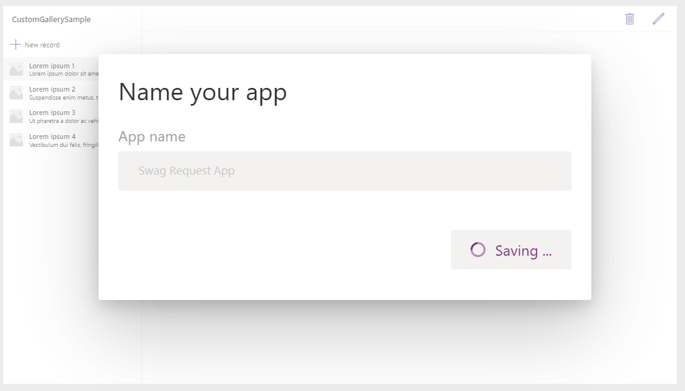](../media/save-name.png#lightbox)

	After you refresh the page, the new name should be listed under the **Recent apps** section. Select **See more**.

	> [!div class="mx-imgBorder"]
	> [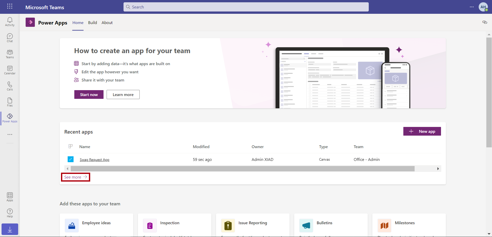](../media/see-more.png#lightbox)

1. Select **See more**. Delete the app that you attempted to make. Retry creating the app by selecting **New > Canvas app > Tablet form factor**.
	
	> [!div class="mx-imgBorder"]
	> [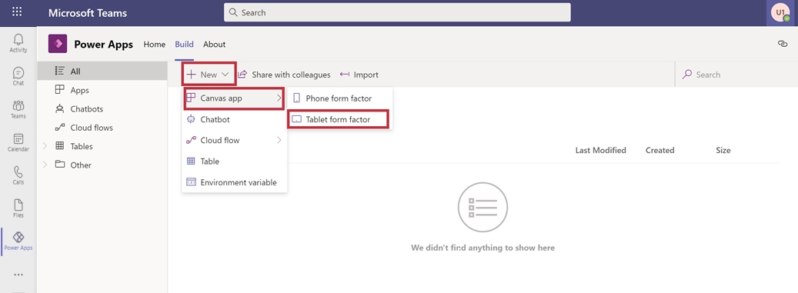](../media/tablet-form-factor.png#lightbox)

## Task: Create tables in Dataverse for Teams

To create tables in Dataverse for Teams, follow these steps:

1.  From the menu to the left of your app canvas, select the **Data** (cylinder) icon and then select **Create new table**.

	> [!div class="mx-imgBorder"]
	> [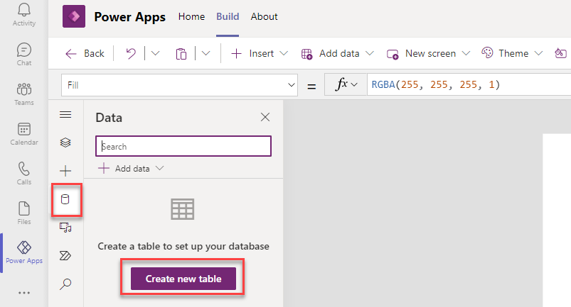](../media/create-new-table.png#lightbox)

1.  Name the table **Request** and then select **Create**.

	> [!div class="mx-imgBorder"]
	> 

1.  Create the columns for your table and assign a data type to each. In the Requests table, select **+ New column**.

	> [!div class="mx-imgBorder"]
	> 

1.  Enter **Request Number** in the **Display name** field, select **Autonumber** from the **Data type** dropdown menu, and then select **Save**.

	> [!div class="mx-imgBorder"]
	> [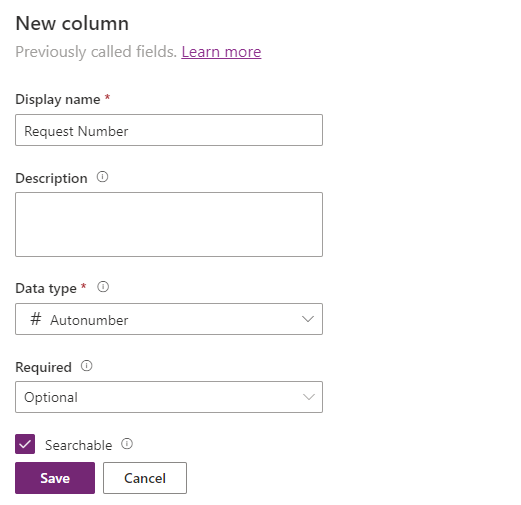](../media/column-properties.png#lightbox)

1.  Following the same process, add another column named **Comment**. From the **Data type** dropdown menu, select **Single line of text**, and in the **Format** dropdown menu, select **Text**.

	> [!div class="mx-imgBorder"]
	> [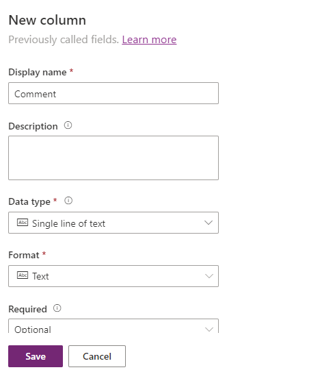](../media/comment.png#lightbox)

1.  Add another column. Enter **Approval Status** in the **Display name** field, select **Choice** from the **Data type** dropdown menu, and then select **No** for **Sync with global choice**.

	> [!div class="mx-imgBorder"]
	> [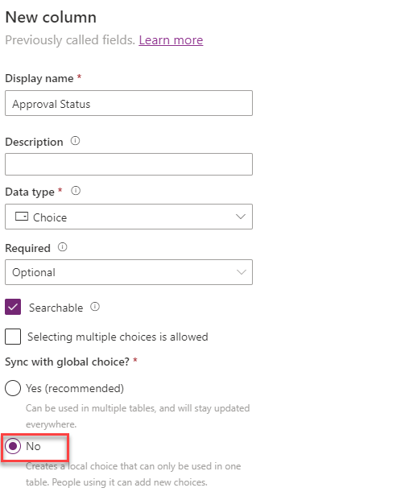](../media/choice.png#lightbox)

1.  Enter **Approved** for the first choice **Label** and then select **+ New choice**.

	> [!div class="mx-imgBorder"]
	> 

1.  Enter **Rejected** for the second choice **Label**.

1. Select the color pick icon next to the choice, and then select the color for **Approved** as light green and the color for **Rejected** as light red. Then, select **Save**.

	> [!div class="mx-imgBorder"]
	> [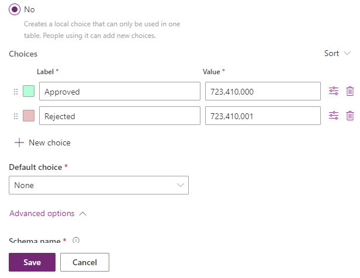](../media/choices.png#lightbox)

	If you need to edit a column, you can select the column heading and then select **Edit column**.

1. Your table should now appear as shown in the following image. Select **Close** to close the table.

	> [!div class="mx-imgBorder"]
	> 

1. Back on the editing canvas of your app, select **With data** and then select the **Requests** table. A form will display on your app containing fields that you created in the Requests table.

	> [!div class="mx-imgBorder"]
	> [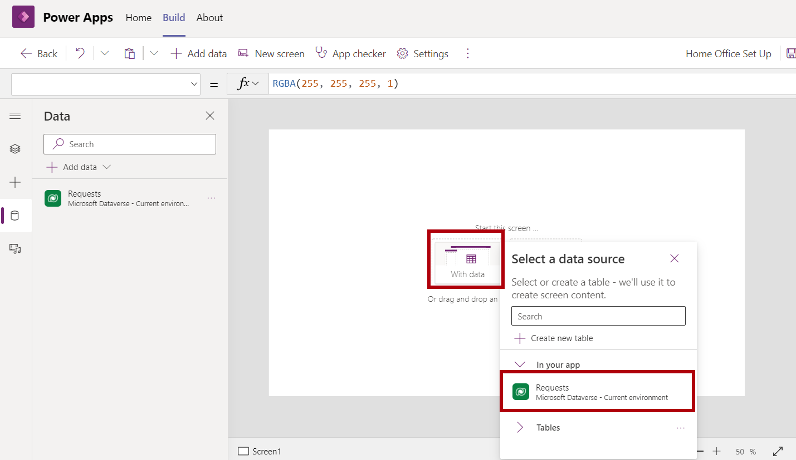](../media/requests.png#lightbox)

1. You'll create another table to store asset category information. Select **Add data** from the ribbon and then select **+ Create new table**.

	> [!div class="mx-imgBorder"]
	> [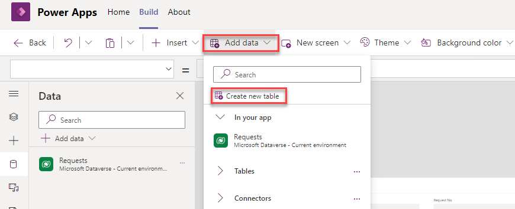](../media/add-data-create-new-table.png#lightbox)

1. Name the table **Asset Category** and then select **Create**.

	> [!div class="mx-imgBorder"]
	> [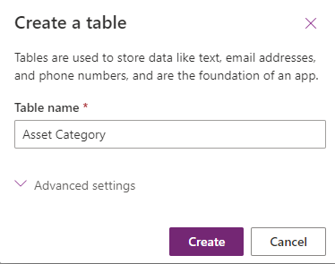](../media/create-table-name.png#lightbox)

1. In the **Asset Category** table, enter the following data into each row in the **Name** column. When you've finished, press the **Enter** key or the **Tab** key (you might need to press **Tab** a second time to get to the next row) on your keyboard to create a new row.	

	- Apparel
		
	- Accessory

1. Your table should appear as shown in the following image. Select **Close**.

	> [!div class="mx-imgBorder"]
	> 

1. Select **Add data > Create new table**.

1. Enter **Assets** for the name and then select **Create**.

1. In the Assets table, select the **Name** header and then select **Edit column**.

	> [!div class="mx-imgBorder"]
	> 

1. Enter **Asset Name** in the **Display name** field and then select **Save**.

1. Select **+ New column**.

1. Enter **Category** in the **Display name** field, select **Lookup** from the **Data type** dropdown menu, select **Asset Category** from the **Related table** dropdown menu, and then select **Save**.
    
	> [!NOTE]
	> It can take a few seconds for the new lookup column to appear on the screen. Pause and wait for that to happen.

	> [!div class="mx-imgBorder"]
	> [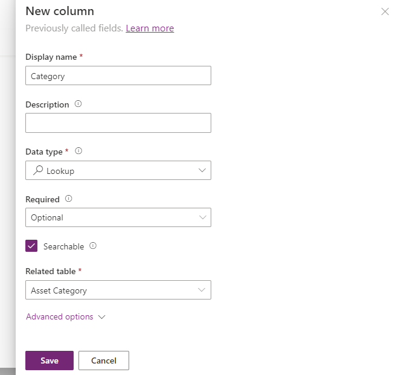](../media/category.png#lightbox)

1. Select **+ New column**.

1. Enter **Price** in the **Display name** field, select **Currency** from the **Data type** dropdown menu, and then expand the **Advanced options** section.

	> [!div class="mx-imgBorder"]
	> [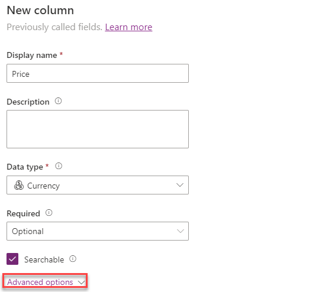](../media/advanced-options.png#lightbox)

1. Enter **0** in the **Minimum value** field and then select **Save**.

	> [!div class="mx-imgBorder"]
	> [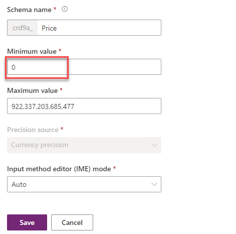](../media/minimum-value.png#lightbox)

1. Select **+ New column** again.

1. Enter **Image** in the **Display name** field, select **Text** from the **Format** dropdown menu, and then expand the **Advanced options** section.

	> [!div class="mx-imgBorder"]
	> 

1. Enter **200** in the **Maximum character count** field and then select **Save**.

	> [!div class="mx-imgBorder"]
	> 

1. Your Assets table should resemble the following screenshot. Select **Close**.

	> [!div class="mx-imgBorder"]
	> 

1. Add lookup fields into the Requests table. Select the **More actions** ellipsis (**...**) of the Requests table and then select **Edit data**.

1. Select **+ New column**.

1. Enter **Asset Category** in the **Display name** field, select **Lookup** from the **Date type** dropdown menu, select **Asset Category** from the **Related table** dropdown menu, and then select **Save**.

	> [!div class="mx-imgBorder"]
	> [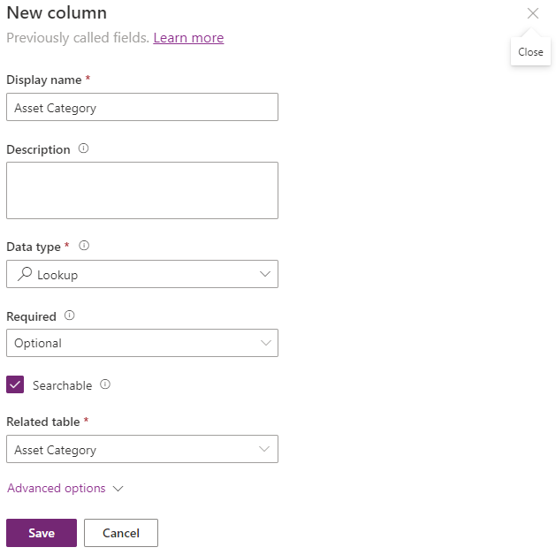](../media/asset-category-properties.png#lightbox)

1. Select **+ New column** again.

1. Enter **Asset** for **Display name**, select **Lookup** for **Data type**, select **Asset** for **Related table**, and then select **Save**.

1. Select and drag the two columns that you've created to reposition them after the **Name** column. Select **Close**. You might need to zoom out of your screen if the columns that you created aren't visible.

	> [!div class="mx-imgBorder"]
	> 
