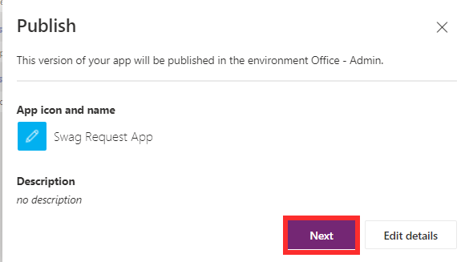
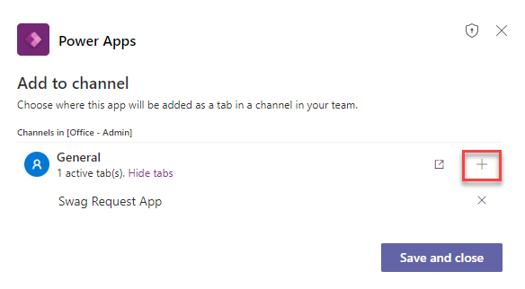
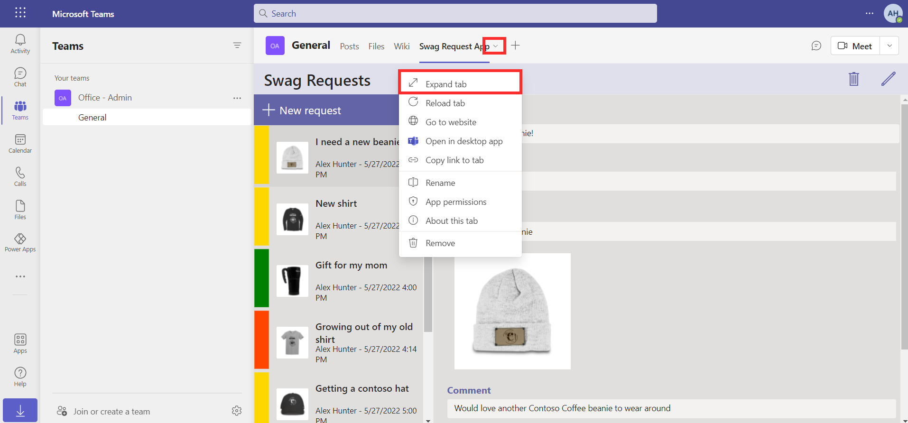

The app is now ready to be published to Teams. After it's been published, it will be available for team members to use within Microsoft Teams on desktop and on web and mobile clients.

> [!NOTE]
> To complete the exercises, you'll need to use a few
> files. Download the [Dataverse exercise files](https://github.com/MicrosoftDocs/mslearn-developer-tools-power-platform/raw/master/in-a-day/dataverse/dataverse-teams-exercise-files.zip)
> for use in this module. The file folders that are in
> this download include:
>
> - **Completed modules with instructions** - Package files to import the completed exercise steps. 
> - **Student materials** - Files that are used in the exercises.

## Task: Publish the app

Follow these steps to publish the app:

1.  After you've finished previewing the app, select the **Publish to Teams** icon.

	> [!div class="mx-imgBorder"]
	> 

1. Select **Next**.

	> [!div class="mx-imgBorder"]
	> 

1. Select the channel that you want to add the app to. Select the plus (**+**) icon next to **General**, and then select **Save and close**.

	> [!div class="mx-imgBorder"]
	> 

## Task: Interact with the app on Teams

Now, you can go to the team where your app is published and interact with your app. Test it out by submitting at least three more requests. If you want to view the app's full screen, you can select the arrow button beside the app name and then select **Expand tab**.

> [!div class="mx-imgBorder"]
> 

## Task: Interact with the app on Teams mobile app (Optional)

The app that you've published is also available to users through the Microsoft Teams mobile app.

1.  Install the Microsoft Teams app from the app store on your mobile device.

1.  Sign in to the app by using your **lab credentials**, and then go to the channel where your app has been published.

1.  Select **More** and then select **Swag Request App** to launch the app.

	> [!div class="mx-imgBorder"]
	> 

1.  You can interact with the app on this screen. The interface should have been optimized to the size of your device screen.

	> [!div class="mx-imgBorder"]
	> 
