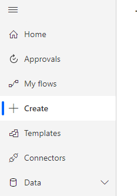
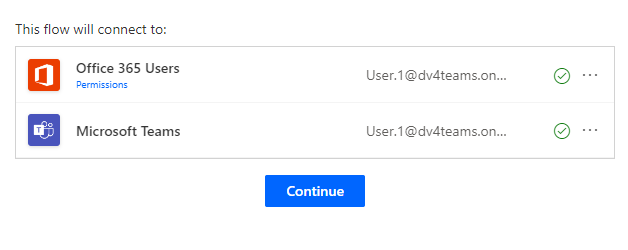
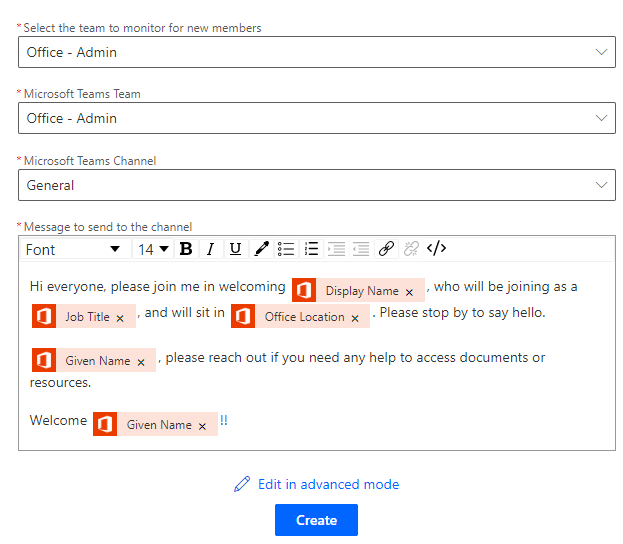
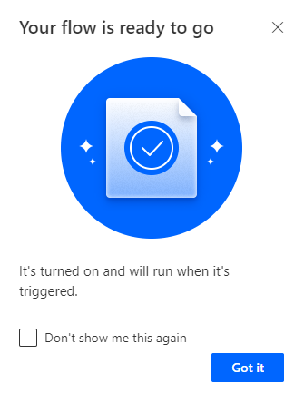
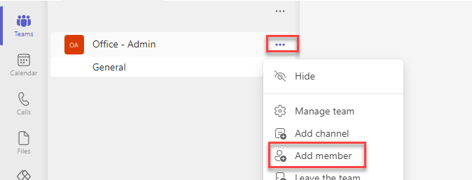
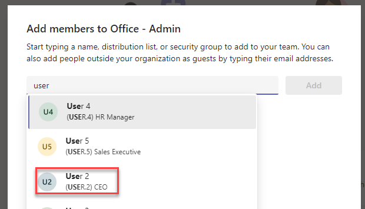

In this exercise, you'll learn how to create Power Automate flows outside of Teams.

You'll create a flow that will welcome new team members. In this flow, someone being added to your team is the trigger. You'll add other people from your lab group into your team during this exercise. You'll collaborate in these teams throughout the later labs to experience using Teams for collaboration with colleagues.

> [!NOTE]
> To complete the exercises, you'll need to use a few
> files. Download the [Dataverse exercise files](https://github.com/MicrosoftDocs/mslearn-developer-tools-power-platform/raw/master/in-a-day/dataverse/dataverse-teams-exercise-files.zip)
> for use in this module. The file folders that are in
> this download include:
>
> - **Completed modules with instructions** - Package files to import the completed exercise steps. 
> - **Student materials** - Files that are used in the exercises.

## Task - Welcome new team members

Your first task is to welcome new team members by following these steps:

1. Go to [Power Automate](https://make.powerautomate.com/?azure-portal=true) and select the Teams environment that you created.

    > [!div class="mx-imgBorder"]
    > 

1. Select **Create**.

    > [!div class="mx-imgBorder"]
    > 

1. Search for the word **welcome** and then select the **Welcome new team members** template.

    > [!div class="mx-imgBorder"]
    > 

1. This flow uses two connectors. You're already signed in to both connectors, so now you'll select **Continue**. If you haven't already signed in to a connector, then you'll need to select the **Sign-in** button beside the connector. When the green check mark appears, confirming sign-in, select **Continue**.

    > [!div class="mx-imgBorder"]
    > 

1. The next step in the template will ask you to select some options.

    - From the **Select the team to monitor** and the **Microsoft Teams Team** dropdown menus, select the team that you've created for the lab. (In a real business scenario, you might have someone joining one team and want to make a welcome announcement in another team, which is why two options are available.)

    - From the **Microsoft Teams Channel** dropdown menu, select the **General** channel.

    - You can edit the message. When you're done, select **Create**.

    > [!div class="mx-imgBorder"]
    > 

1. A confirmation message will appear, verifying that your workflow has been created. Select **Got it**.

    > [!div class="mx-imgBorder"]
    > 

## Task - Add a member to your team to trigger the flow

Follow these steps to add a member to your team to trigger the flow.

1. Return to your team on [Microsoft Teams](https://teams.microsoft.com/?azure-portal=true).

1. Select the **Teams** icon.

1. Select the **More options** button (**...**) next to the **Office - Admin** name and then select **Add member**.

    > [!div class="mx-imgBorder"]
    > 

1. Search for the person's name and then select **Add**.

    > [!div class="mx-imgBorder"]
    > 

1. Close the dialog.

1. After the member that you added joins the team, the flow will post the welcome message to the **General** channel. This process can take few minutes.

    > [!div class="mx-imgBorder"]
    > 
