You can also create your own flows from blank and use them to connect with your Dataverse for Teams tables. To create flows, you'll need to work in the Power Apps application. In this exercise, you'll build a flow that will trigger an approval process when someone submits a new request for swag through the app that you built in the previous lab.

> [!NOTE]
> To complete the exercises, you'll need to use a few
> files. Download the [Dataverse exercise files](https://github.com/MicrosoftDocs/mslearn-developer-tools-power-platform/raw/master/in-a-day/dataverse/dataverse-teams-exercise-files.zip)
> for use in this module. The file folders that are in
> this download include:
>
> - **Completed modules with instructions** - Package files to import the completed exercise steps. 
> - **Student materials** - Files that are used in the exercises.

## Task - Create a flow from blank

To create a flow from blank, follow these steps:

1. Go to the Power Apps application by using the left navigation bar. Go to the **Build** tab. Select your team and then select **See all** at the bottom of the list of items created.

    > [!div class="mx-imgBorder"]
    > [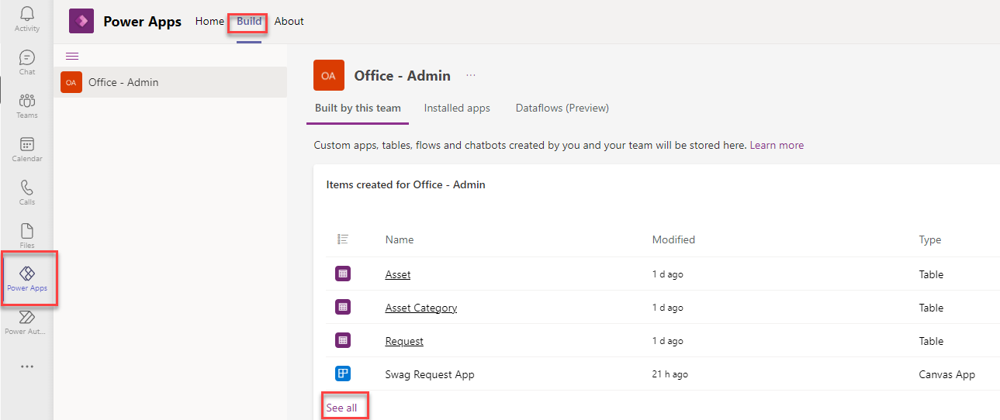](../media/see-all.png#lightbox)

1. Select **Cloud flows** from the left menu and then select **New > Cloud flow > Automated**.

    > [!div class="mx-imgBorder"]
    > 

1. In the **Flow name** field, enter **Request approval**.

1. Search for the phrase **when a row is added** and then select **When a row is added, modified or deleted Microsoft Dataverse**. Select **Create**.

    > [!div class="mx-imgBorder"]
    > [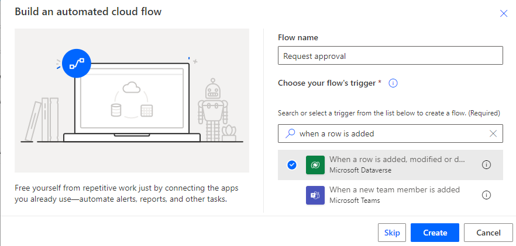](../media/request-approval.png#lightbox)

1. You're now in the full Power Automate editor where you can build your own flow. The flow starts with a trigger which, in this case, is when a request is created in your Dataverse for Teams table. In the trigger action, select the following options:

   - **Change type** - Create

   - **Table name** - Requests

   - **Scope** - Organization

1. Select **+ New step**.

    > [!div class="mx-imgBorder"]
    > 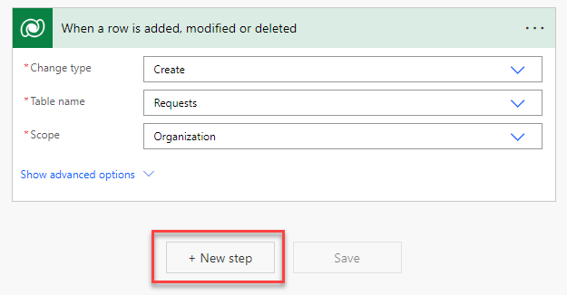

1. Add a step to get the name of the asset that the person requested. The asset is in a related table, so you'll need to use a **Get row by ID** action to retrieve all details of that asset. Search for the phrase **get a row by id** and then select the **Get a row by ID Microsoft Dataverse** action.

    > [!div class="mx-imgBorder"]
    > 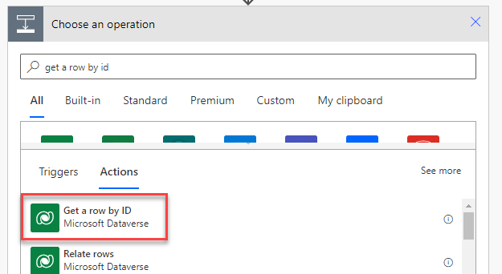

1. In the **Table name** dropdown menu, select **Assets**. In the **Row ID** section, select **Asset (Value)** from the **Dynamic content** pane.

    > [!div class="mx-imgBorder"]
    > 

1. Select **+ New step**.

1. Search for **approval** and then select **Start and wait for an approval**.

    > [!div class="mx-imgBorder"]
    > 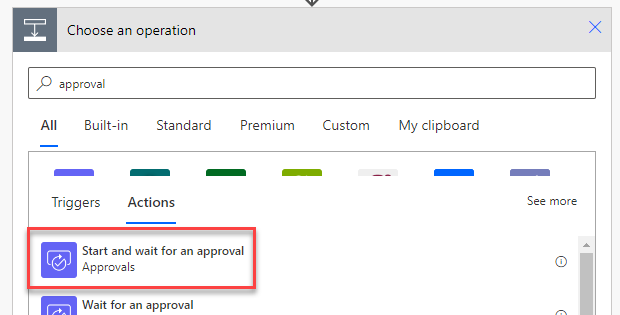

1. A brief message will appear while the connection to the **Approvals** connector is being established. When the process is complete, select **Approve/Reject - First to respond** in the **Approval type** dropdown menu.

    > [!div class="mx-imgBorder"]
    > 

1. Fill in the rest of the **Start and wait for an approval** action as follows:

    - **Title** - Swag request
    - **Assigned to** - Enter the email address that you used to sign in for the lab and then select the name of the user when it appears

    > [!NOTE]
    > For training purposes, you'll approve or reject your own requests. In a real-world scenario, you would enter the name of the approving manager at this point, or you'd use the Office 365 connector to dynamically retrieve the name of the manager of the person who's making the request.

    > [!div class="mx-imgBorder"]
    > 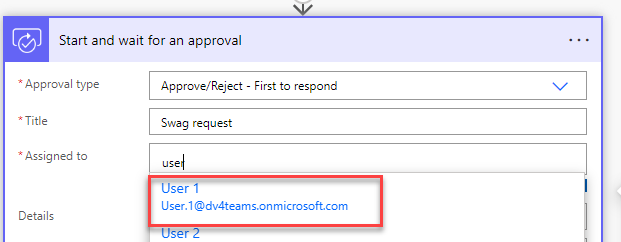

1. Enter **Swag requested:** in the **Details** box. 

1. In the **Dynamic content** pane, select **Asset Name**.

    > [!NOTE]
    > The grey shaded label above the list of columns is from the previous step: **Get a row by ID**.

    > [!div class="mx-imgBorder"]
    > 

1. In the **Details** box, press the **Enter** key on your keyboard to add a new line. Enter **Comments:** below **Swag requested**.

1. In the **Dynamic content** pane, search for and then select **Comment**.

    > [!NOTE]
    > The grey shaded label above the list of columns is from the first step: **When a row is added, modified or deleted** (because the comments are from the Request table).

    > [!div class="mx-imgBorder"]
    > 

1. Set up a condition to check the outcome of the approval. Select **+ New step**.

1. Select **Condition Control**.

    > [!div class="mx-imgBorder"]
    > 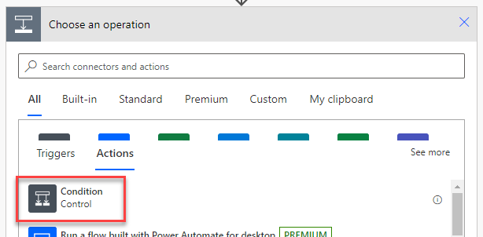

1. In the left box where you're asked to choose a value, select **Outcome** from the **Dynamic content** pane.

    > [!div class="mx-imgBorder"]
    > 

1. In the right box, enter **Approve**.

    > [!div class="mx-imgBorder"]
    > 

1. In the **If yes / If no** steps under the condition, you'll update the request in your Dataverse for Teams table as approved or rejected, depending on the outcome of the approval. In the **If yes** box, select **Add an action**.

    > [!div class="mx-imgBorder"]
    > 

1. Search for **update a row** and select **Update a row Microsoft Dataverse**.

    > [!div class="mx-imgBorder"]
    > 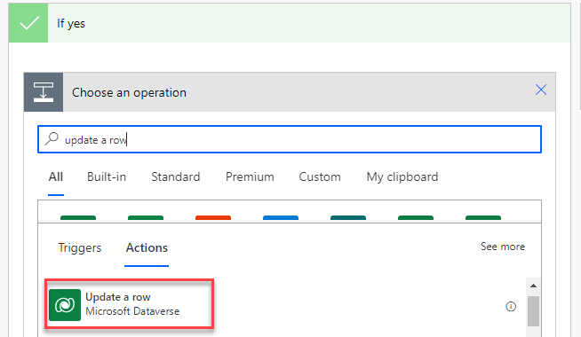

1. You're updating the request record from the step where you triggered the approval process. In the **Table name** box, select **Requests**, and in the **Row ID** box, go to the **Dynamic content** pane and search for **request**. Select **Request**, which is from the **When a row is added, modified or deleted** step.

    > [!div class="mx-imgBorder"]
    > [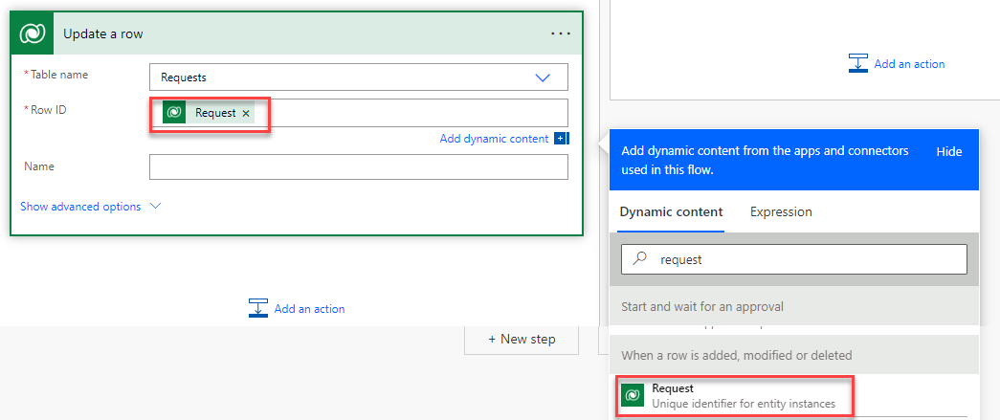](../media/request.png#lightbox)

1. Select **Show advanced options** to view the rest of the items that you can update in this record.

    > [!div class="mx-imgBorder"]
    > 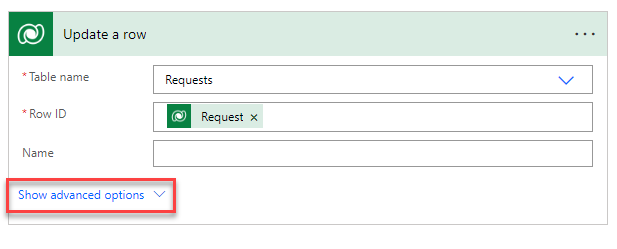

1. In the **Approval Status** dropdown menu, select **Approved**.

    > [!div class="mx-imgBorder"]
    > 

1. Repeat these steps for the **If no** path. In the **If no** box, select **Add an action**.

    > [!div class="mx-imgBorder"]
    > 

1. Search for **update a row** and select **Update a row Microsoft Dataverse**.

    > [!div class="mx-imgBorder"]
    > 

1. In the **Table name** box, select **Requests**, and in the **Row ID** box, go to the **Dynamic content** pane and search for **request**. Select **Request**, which is from the **When a row is added, modified or deleted** step.

    > [!div class="mx-imgBorder"]
    > [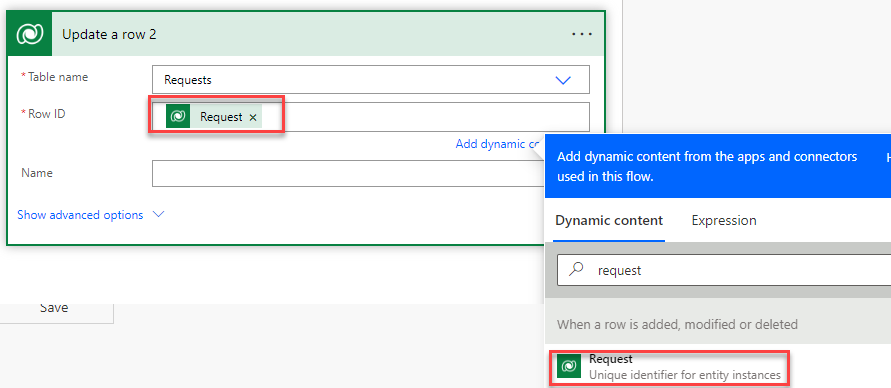](../media/update-request.png#lightbox)

1. Select **Show advanced options** to view the rest of the items that you can update in this record. In the **Approval Status** dropdown menu, select **Rejected**.

    > [!div class="mx-imgBorder"]
    > 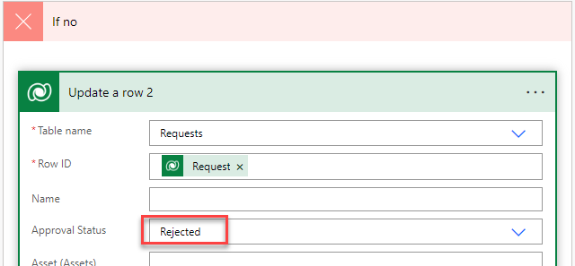

1. Save your flow by selecting the **Save** button.

    > [!div class="mx-imgBorder"]
    > 

    > [!NOTE]
    > You might get the following warning message. This message is informing you that the functionality for approvals needs to be provisioned. The provisioning will happen automatically in the background and is a one-off process the first time you create an approval flow. You can ignore this message and move on to the next step.
    >
    > [!div class="mx-imgBorder"]
    > 

1. Congratulations, you've finished building your first flow. Now, you can observe it in action. When your flow is saved, a confirmation message will display next to the name of the flow. After the flow has been saved, you can return to the team that you've been working on by selecting the main Teams icon in the left navigation bar.

    > [!div class="mx-imgBorder"]
    > 

1. Open your **Swag Request App** in the tab and then submit a new request.

    > [!div class="mx-imgBorder"]
    > 

1. Open a new tab in your browser and go to [Outlook](https://outlook.office365.com/?azure-portal=true) to open Outlook for your lab user account. An email with the approval request will display. You'll also receive a Teams notification with the same request.

1. Select **Approve**, provide a comment, and then select **Submit**.

    > [!NOTE]
    > The approval connector can take up to 15 minutes to work the first time because it installs a solution behind the scenes. If the email doesn't appear immediately, take a break for 15 minutes and then return to it. After this first installation is complete, other approvals will come through almost instantly.
    >
    > [!div class="mx-imgBorder"]
    > 

1. Return to Teams in the other browser tab. Refresh the app by selecting the **Reload tab** button. The updated request will appear, showing the **Approval Status** as **Approved**.

    > [!div class="mx-imgBorder"]
    > 
