In this exercise, you'll learn how to connect to Microsoft Dataverse and transform data.

> [!NOTE]
> To complete the exercises, you'll need to use a few
> files. Download the [Dataverse exercise files](https://github.com/MicrosoftDocs/mslearn-developer-tools-power-platform/raw/master/in-a-day/dataverse/dataverse-teams-exercise-files.zip)
> for use in this module. The file folders that are in
> this download include:
>
> - **Completed modules with instructions** - Package files to import the completed exercise steps. 
> - **Student materials** - Files that are used in the exercises.

## Task: Discover and add the Power BI app to Teams

Your first task in this exercise is to search for and add the Microsoft Power BI app to Microsoft Teams.

1.  In Microsoft Teams, select the **Apps** icon on the left toolbar and then search for Power BI.

	> [!div class="mx-imgBorder"]
	> 

1.  Select the Power BI app when you find it in the search results.

	> [!div class="mx-imgBorder"]
	> 

1.  A pop-up window will appear with information about the Power BI app for Microsoft Teams. Select the **Add** button.

	> [!div class="mx-imgBorder"]
	> [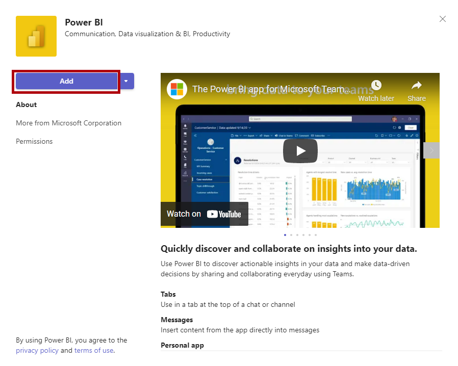](../media/add.png#lightbox)

1.  The Power BI app will display in the left navigation bar. Right-click that icon and select **Pin**. Pinning the app to the navigation bar will help make it easier for you to return to it when necessary.

	> [!div class="mx-imgBorder"]
	> [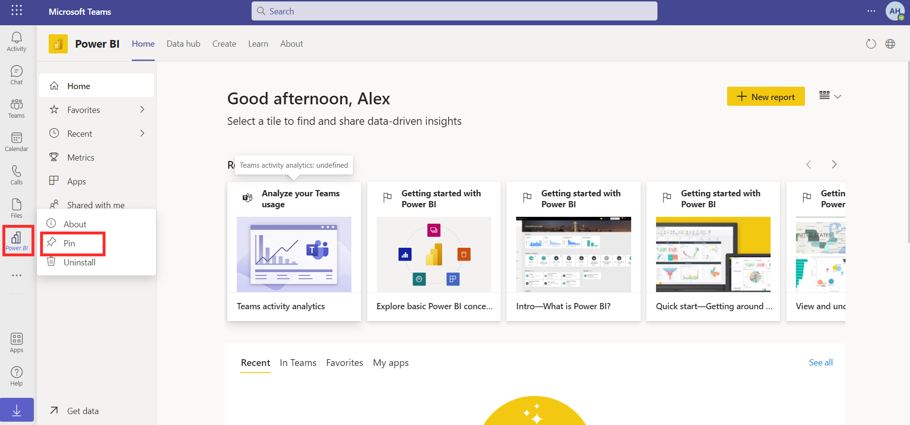](../media/pin.png#lightbox)

## Task: Create a workspace

In this task, you'll create a workspace by following these steps:

1.  In the left navigation menu within the Power BI app, select the **Workspaces** icon and then select **Create a workspace**.

	> [!div class="mx-imgBorder"]
	> [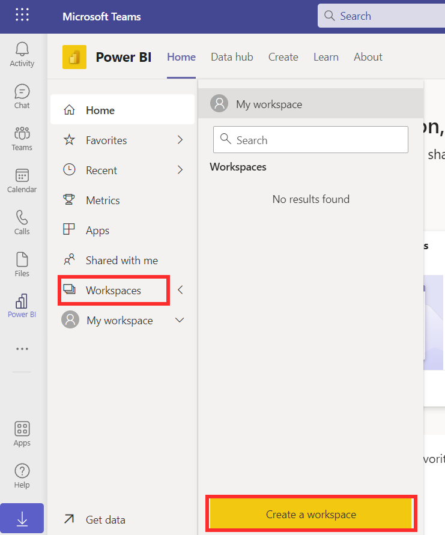](../media/workspaces.png#lightbox)

1.  In the **Workspace name** field, enter the name of the team that you've been using, such as **Office -\<your name\>**, and then select **Save**.

	> [!div class="mx-imgBorder"]
	> 

1.  In your new workspace, select **Access**.

	> [!div class="mx-imgBorder"]
	> 

1.  In the **Enter email address** field, start typing the name of your team, such as **Office-\<your name\>**. An email address should appear using your team name. Select that email. Now, all members of your team will have access to the workspace, which will contain the Power BI report that you'll create.

	> [!div class="mx-imgBorder"]
	> [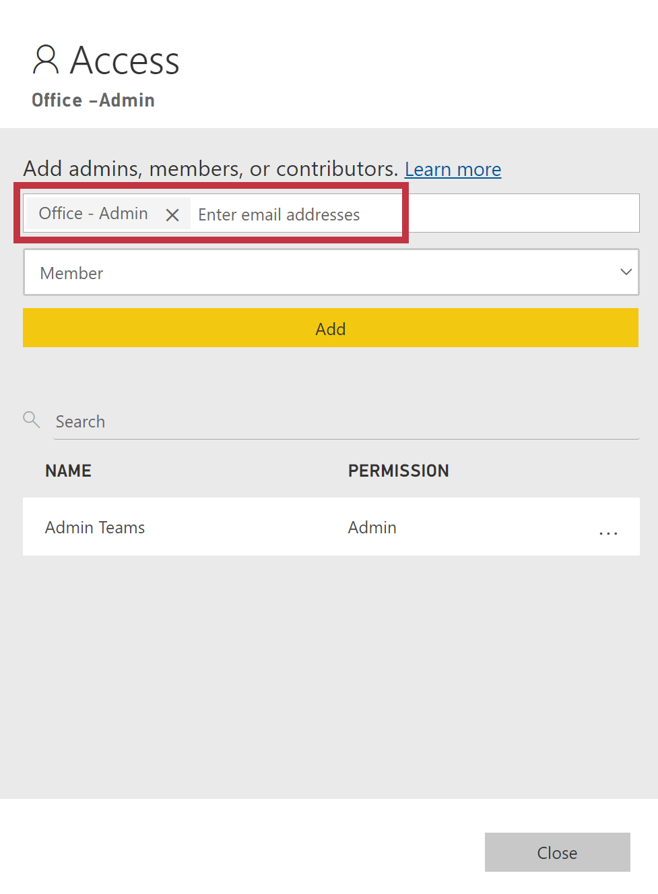](../media/access-settings.png#lightbox)

1.  Set the access level to **Viewer** and then select **Add**. Select **Close**.

	> [!div class="mx-imgBorder"]
	> [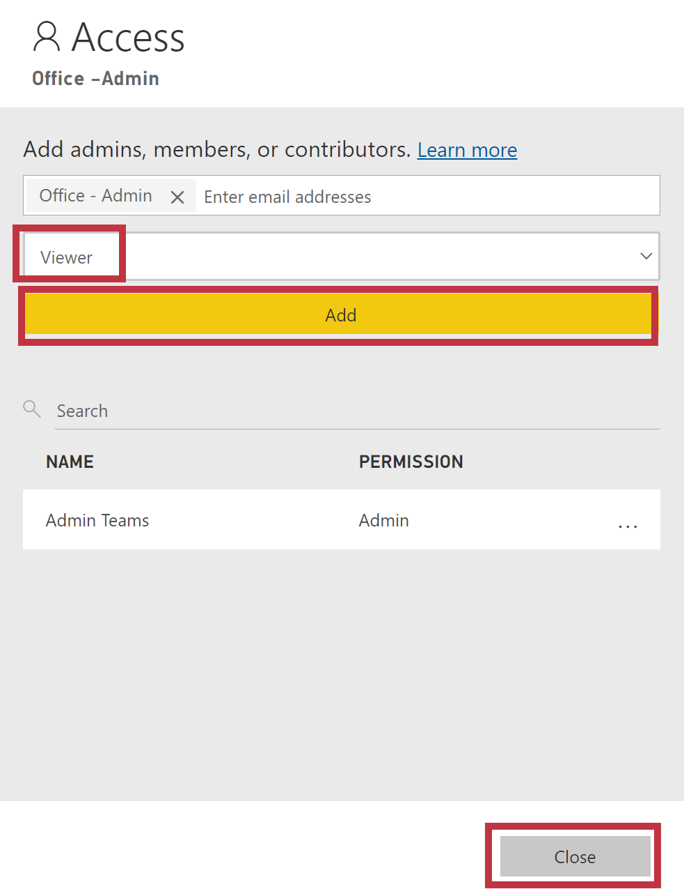](../media/viewer-level.png#lightbox)

## Task: Connect to Dataverse

In this task, you'll connect to the Dataverse tables that you created in a previous lab in this learning path.

1.  Launch Microsoft Power BI Desktop on your computer. Sign in with the account that you're using for the labs. If you're automatically signed in with your work account, select your username in the upper-right corner of the screen and then select **Sign out**.

	> [!div class="mx-imgBorder"]
	> [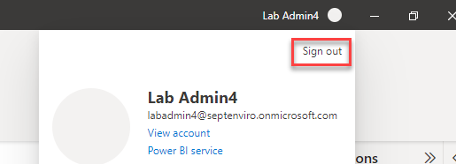](../media/sign-out.png#lightbox)

1.  After you've signed in with your lab account, select **Dataverse** from the ribbon.

	> [!div class="mx-imgBorder"]
	> 

    > [!NOTE]
    > If you experience sign in errors, check the **Global** security settings for **Security**. Mark the box for **Use my default web browser**.

1.  Select **Sign in** and then sign in with your lab account. Select **Connect**.

	> [!div class="mx-imgBorder"]
	> [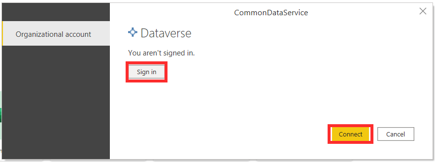](../media/connect.png#lightbox)

1.  Your team name should appear in the list. Select the arrow to expand it.

	> [!div class="mx-imgBorder"]
	> [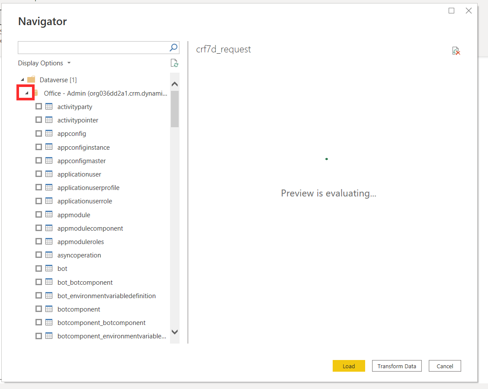](../media/expand-list.png#lightbox)

1.  Load the three tables that you created in a previous lab. Scroll down the list until you find the Request, Asset, and Asset Category tables. Your table name will be in a format such as crf7d_asset. Your tables will begin with a unique prefix (which you identified in the previous lab), which is likely different than this example. Select the checkbox next to your three tables and then select **Transform Data**. This action will launch Power Query Editor in another window.

	> [!div class="mx-imgBorder"]
	> [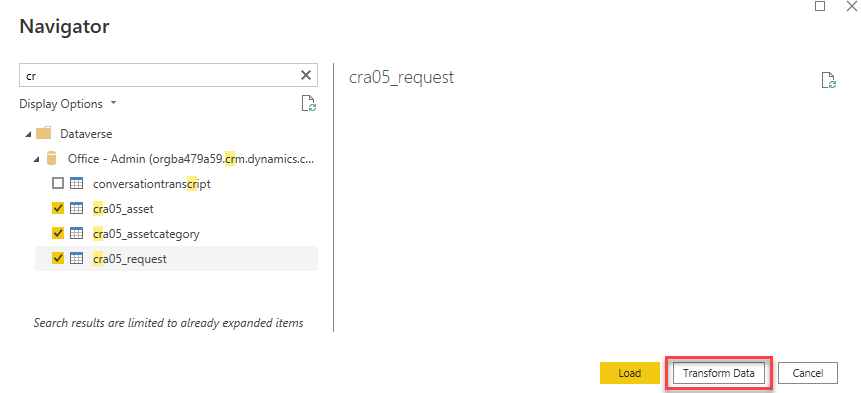](../media/transform-data.png#lightbox)

1.  In a moment, you'll get the following message. Select **DirectQuery** then select **OK**.

	> [!div class="mx-imgBorder"]
	> 

## Task: Transform data

Now that you've connected to your Dataverse tables, the next step involves cleaning or *transforming* your data so that it's optimized for reporting. You can do these transformations in Power BI by using the Power Query Editor tool.

1.  You should have Power Query Editor open in another window. From the **Queries** menu on the left side of the screen, double-click the **x\_asset** query. Rename the query to **Asset**.

	> [!div class="mx-imgBorder"]
	> [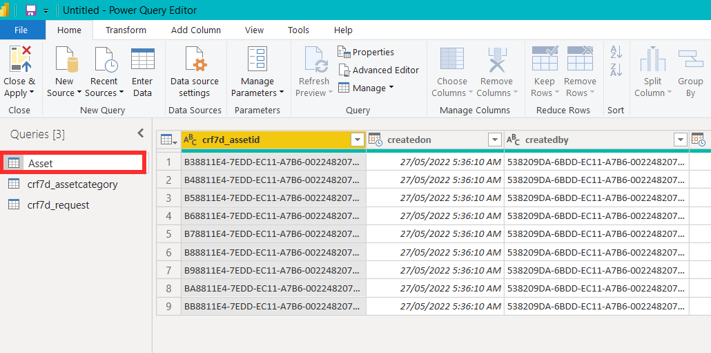](../media/asset-query.png#lightbox)

1.  Rename the **x\_assetcategory** query to **Asset Category**.

1.  Rename the **x\_request** query to **Request**. Your queries should now appear as shown in the following image.

	> [!div class="mx-imgBorder"]
	> 

1.  Select the **Asset** query and then select **Choose Columns** from the ribbon.

	> [!div class="mx-imgBorder"]
	> [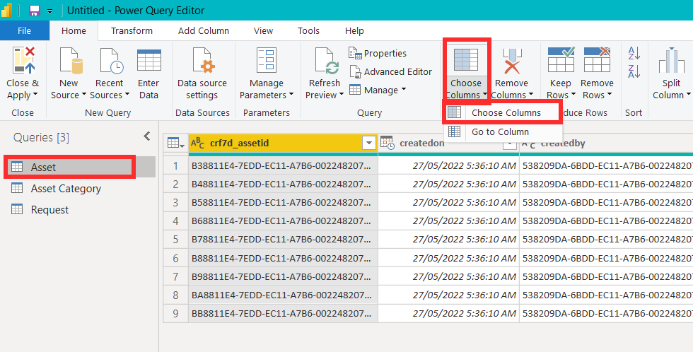](../media/choose-columns.png#lightbox)

1.  Clear the **(Select All Columns)** option to remove all columns from selection. Select the following six columns to bring in:

	x\_assetid *(this selection will be at the top of the list)*
	
	x\_name
	
	x\_category
	
	x\_categoryname
	
	x\_price
	
	x\_image

1.  Select **OK**.

	> [!div class="mx-imgBorder"]
	> [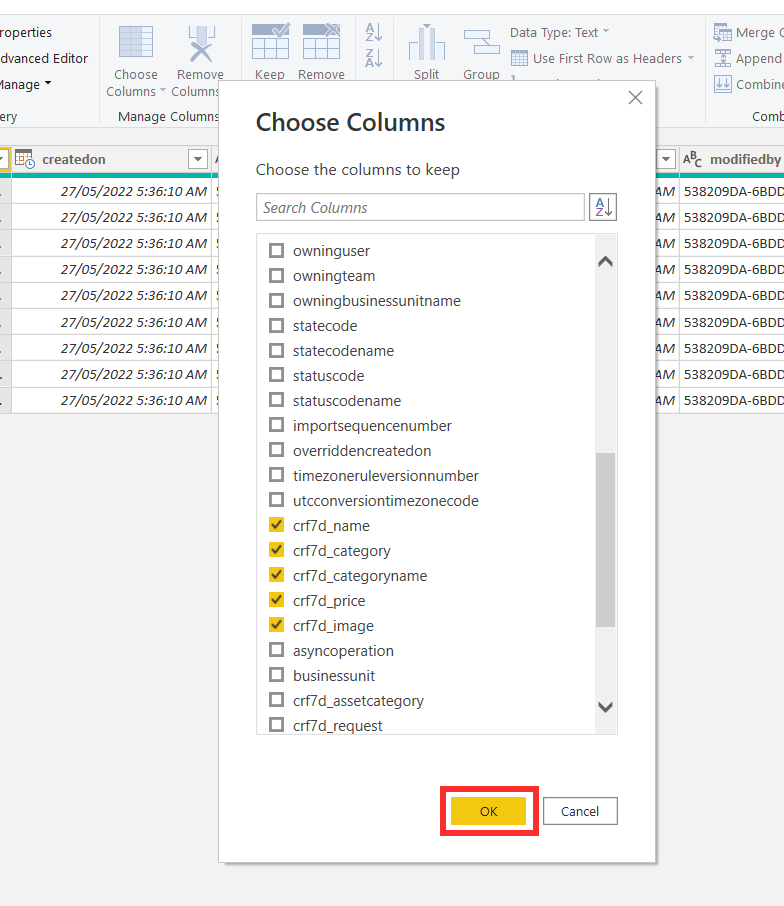](../media/columns-selected.png#lightbox)

1.  Rename the columns in the **Asset** query. To rename a column, double-click the column header. Alternatively, you can right-click the column header and then select **Rename**. Rename each column to the following new names

	|     x_assetid              |     Asset ID         |
	|----------------------------|----------------------|
	|     x_name                 |     Name             |
	|     x_category             |     Category ID      |
	|     x_assetcategoryname    |     Category Name    |
	|     x_price                |     Price            |
	|     x_image                |     Image            |

	> [!div class="mx-imgBorder"]
	> [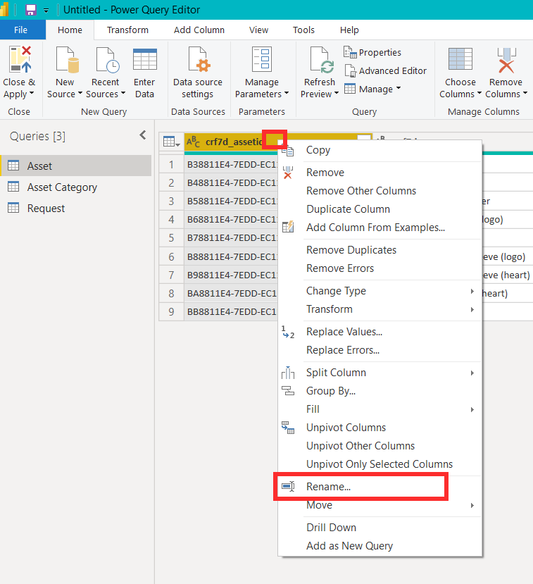](../media/rename.png#lightbox)

	> [!div class="mx-imgBorder"]
	> 

1.  Select **Asset Category** and then select **Choose Columns** from the ribbon. Choose the columns that you want displayed in the **Asset Category** query, as you did previously in the **Asset** query. Clear the **(Select All Columns)** option to remove all columns from selection. Select the following two columns to bring in:

	x\_assetcategoryid *(this column will be at the top of the list)*
	
	x\_name
	
1.  Select **OK**.

	> [!div class="mx-imgBorder"]
	> [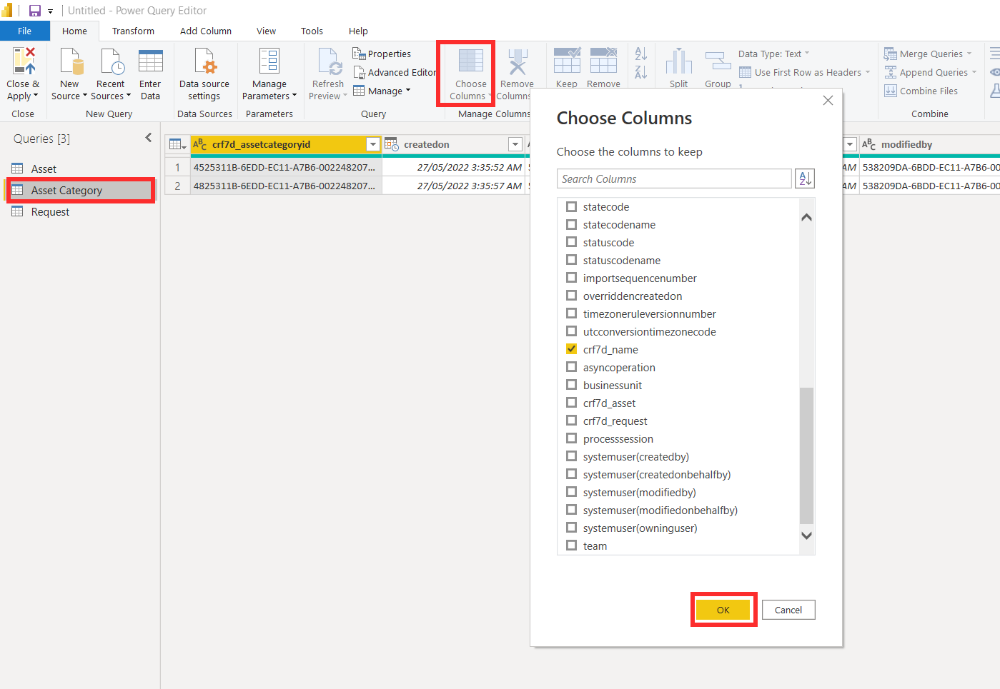](../media/columns-ok.png#lightbox)

1.  Rename the columns in the **Asset Category** query. To rename a column, double-click the column header. Alternatively, you can right-click the column header and then select **Rename**. Rename each column to the following new names

	|     x_assetcategoryid    |     Category ID      |
	|--------------------------|----------------------|
	|     x_name               |     Category Name    |

	> [!div class="mx-imgBorder"]
	> [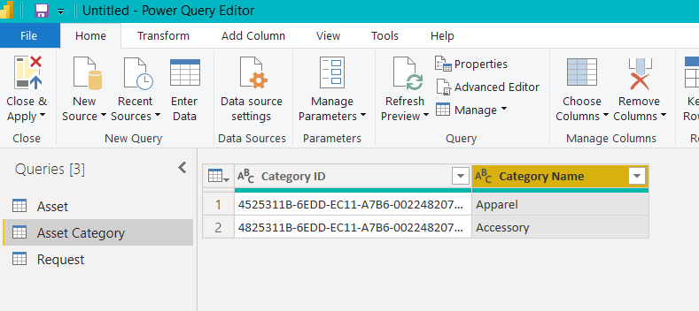](../media/columns-renamed.png#lightbox)

1.  Select **Request** query and then select **Choose Columns** from the ribbon. Choose the columns that you want displayed in the **Request** query. Clear the **(Select All Columns)** option to remove all columns from selection. Select the following eight columns to bring in:

	x\_requestid *(this column will be at the top of the list)*
	
	x\_name
	
	x\_requestnumber
	
	x\_comment
	
	x\_approvalstatusname
	
	x\_assetcategory
	
	x\_asset
	
	x\_asset(x\_asset)
	
	Select **OK**.

	> [!div class="mx-imgBorder"]
	> [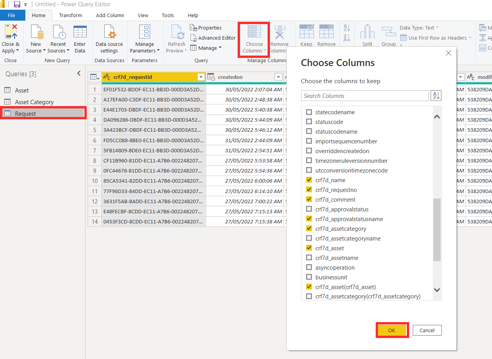](../media/columns-checked.png#lightbox)

1. Bring the **Price** column from the **Asset** query into the **Request** query. In the **Request** query, go to the last column **x_asset(x_asset)** and then select the **expand** button. Clear the **(Select All Columns)** option to remove all columns from selection. Find the **x\_price** column to select it and then select **OK**.

	> [!div class="mx-imgBorder"]
	> [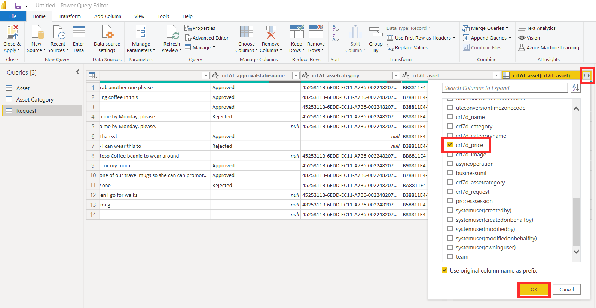](../media/price.png#lightbox)

1. In the **Requests** query, rename each column to the following new name.

	|     x_requestid             |     Request ID         |
	|-----------------------------|------------------------|
	|     x_name                  |     Request Name       |
	|     x_requestnumber         |     Request Number     |
	|     x_comment               |     Comment            |
	|     x_approvalstatusname    |     Approval Status    |
	|     x_assetcategory         |     Category ID        |
	|     x_asset                 |     Asset ID           |
	|     x_asset(x_asset)        |     Price              |

1. The **Approval Status** column will contain blank values if the request hasn't been approved or rejected. Select the **Approval Status** column and then select **Replace Values** from the ribbon.

	> [!div class="mx-imgBorder"]
	> 

1. Enter the following details then select **OK**:

	**Value to find** - null

	**Replace with** - Pending

	> [!div class="mx-imgBorder"]
	> [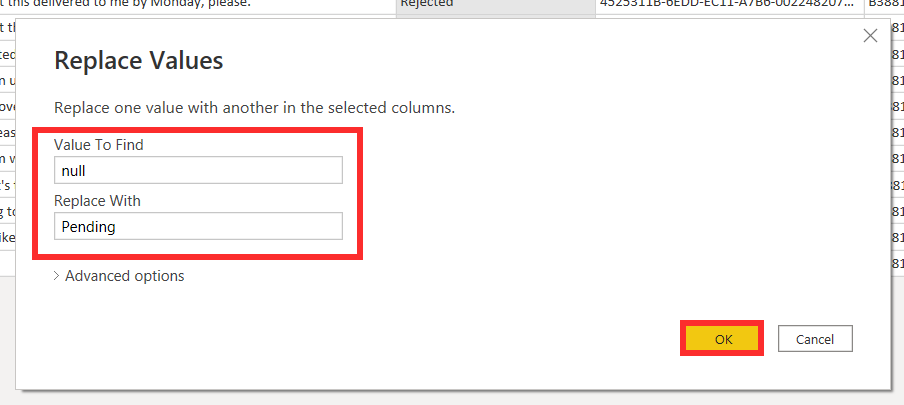](../media/find-replace.png#lightbox)

1. Now that you've finished with the transformation steps, you can apply your changes. In the ribbon, select the **Home** tab and then select **Close & Apply**.

	> [!div class="mx-imgBorder"]
	> 

1. After the changes have finished applying, you'll be returned to your Power BI Desktop window, where you can view your three tables in the **Fields** pane on the right side of your screen.

	> [!div class="mx-imgBorder"]
	> [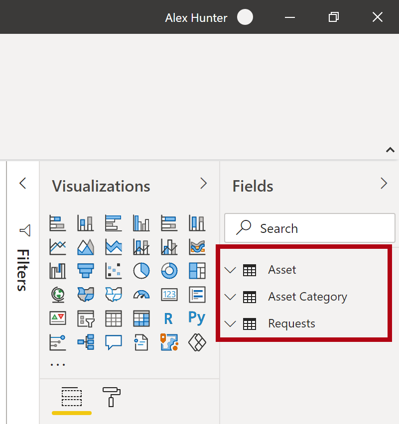](../media/tables.png#lightbox)

1. To save your Power BI file, select the **Save** icon in the upper-left corner of the screen. Name your file **Contoso Coffee Swag Request Report** and then save it in a location of your choice.

	> [!div class="mx-imgBorder"]
	> [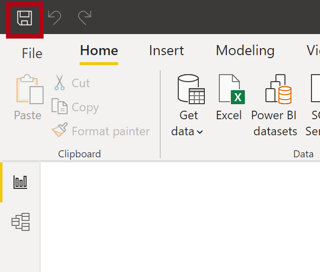](../media/save.png#lightbox)

## Task: Change the report theme

You can customize the theme of your report to make designing easier. In this task, you'll customize the theme to ensure consistency across the colors that are used in the report.

1.  In your Power BI Desktop file, select the **View** tab of the ribbon. Select the **Themes** dropdown menu and then select **Classic**.

	> [!div class="mx-imgBorder"]
	> [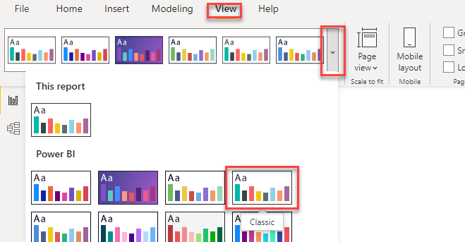](../media/theme.png#lightbox)

1.  **Save** your file.

## Task: Create an asset category hierarchy

A hierarchy allows you to drill down into data in your report. In this task, you'll create a hierarchy in the Asset table, which will allow you to drill into asset names based on the asset category. You'll use this hierarchy for a visual later in the lab.

1.  From the **Fields** pane, expand the Asset table so that you can view the fields. Select the **More options** menu (**...**) on the **Category Name** field and then select **Create hierarchy**.

	> [!div class="mx-imgBorder"]
	> [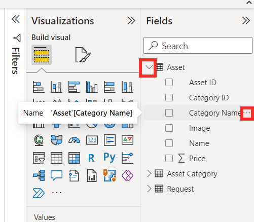](../media/create-hierarchy.png#lightbox)

	You can expand the size of the pane to view the field names better if they've been cut off. Select the border of the pane to resize it.

	> [!div class="mx-imgBorder"]
	> [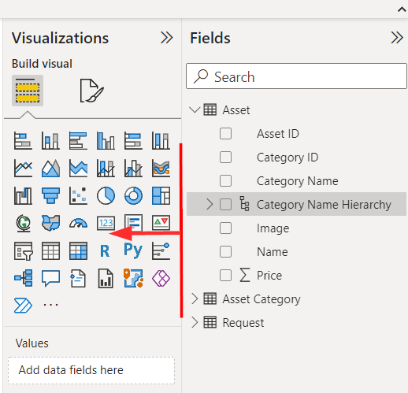](../media/expand-menu.png#lightbox)

1.  Select the **More options** menu (**...**) on the **Name** field and then select **Add to hierarchy**. Select the **Category Name Hierarchy**.

	> [!div class="mx-imgBorder"]
	> [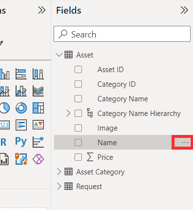](../media/hierarchy.png#lightbox)

    Your Category Hierarchy is now created.

	> [!div class="mx-imgBorder"]
	> [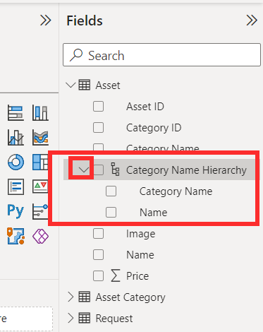](../media/hierarchy-created.png#lightbox)

1.  **Save** your file.
