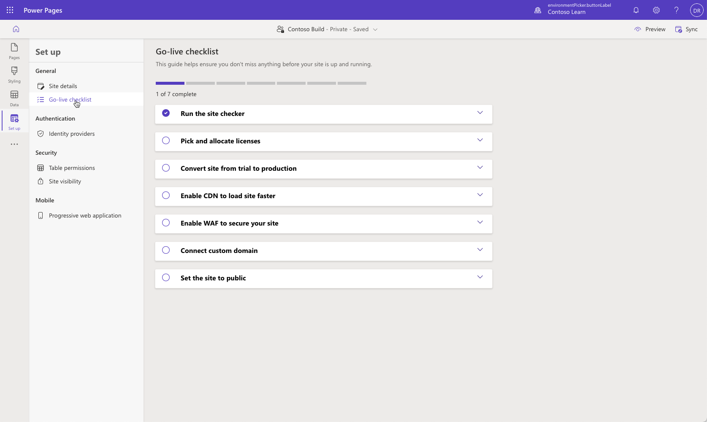

Making a site live for production use is an important business step. The **Go-live checklist** includes interactive tasks that guide you in reviewing and completing the recommended actions before the site goes live. In this exercise, you'll complete some steps of the **Go-live checklist**.

At the end of these exercises, you'll be able to:

- Access the **Go-live checklist**.
- Run the Portal Checker.
- Respond to the mitigation advice.
- Rerun the Portal Checker to confirm that the issue has been addressed.
- Switch the site from private to public access.

For this exercise, you'll need to have the following components set up in your environment:

- A provisioned Power Pages site. If you don't have a Power Pages site available, follow the [Create and manage Power Pages sites](/power-pages/getting-started/create-manage) instructions to create one.
- Access to the Power Pages design studio
- Access to the **Portal Management** app.

## Scenario

Your company has completed the Power Pages site development and wants to make the site available to the public. Prior to going live, they want to ensure that the site passes all site checker tests. 

## Steps

In this exercise, you'll make a few changes to your site configuration. Next, you'll run the Portal Checker tool from the Power Apps admin center and then evaluate the results. After you've addressed the issue, you'll rerun the Portal Checker to ensure that the issue has been resolved. The final step is to switch the site access from private to public and verify that the site is open to the public.

The high-level steps are as follows:

1. In the **Portal Management** app, locate the `Header/OutputCache/Enabled` site setting and then update the value to **False**.
1. Synchronize site settings and run the Portal Checker. Note the warning message for the Header output cache.
1. Locate the `Header/OutputCache/Enabled` site setting and then update the value to **True**.
1. Synchronize site settings and run the Portal Checker. Note that the warning for the Header output cache has been cleared.
1. Verify that site visibility is set to **private**. Test access to the site by using InPrivate mode.
1. Set site visibility to **public** and then test site availability.  

### Disable header output cache
Your first task is to disable the header output cache:

1. Sign in to [Power Pages](https://make.powerpages.microsoft.com/?azure-portal=true).

1. Select a target environment by using the environment selector in the upper-right corner.
1. Select the overflow (**...**) menu for the target portal and then select **Portal Management**.
   
   The **Portal Management** app will open in a new window. 
1. Select **Site Settings**.
1. Locate the `Header/OutputCache/Enabled` site setting.

   > [!TIP]
   > Use the search functionality and look for **header** to quickly locate the row.

   
1. Open the setting, update the value to **False**, and then select **Save**.

   

1. Leave the **Portal Management** app open.

### Launch Power Pages Go-Live checklist
To launch the Power Pages **Go-live checklist**, follow these steps:

1. Switch to the Power Pages Home window.

1. Select your site and then select **Edit** to launch the design studio.

1. Select the **Set up** workspace.

1. Select **Go-live checklist** under **General**.

### Run the site checker
Next, you'll run the site checker:

1. Select the **Sync** button in the upper-right corner to flush the cache and synchronize site configuration. 

1. Expand the **Run the site checker** dropdown menu.

1. Select the **Run site checker** button.

1. In the **Site checker results** panel, the **Header output cache** entry should have a warning. Expand the message for more details.

   > [!div class="mx-imgBorder"] 
   > 

### Enable header output cache
To enable the header output cache, follow these steps:

1. Return to the **Portal Management** app.

1. Update the `Header/OutputCache/Enabled` site setting to **True** and then select **Save**.

### Check the issue resolution
To check the issue resolution, follow these steps:

1. Repeat the preceding steps to flush the cache and synchronize configuration. 

1. Run the **Portal Checker** tool.

1. Verify that the header output cache issue has been resolved.

   > [!div class="mx-imgBorder"]
   > 
   
   > [!NOTE]
   > Warnings and errors are prioritized and are always displayed first in the list. The **Header output cache** entry is no longer a warning and might be in a different position in the list than previously.

### Check site availability
Your next step is to check site availability:

1. In the Power Pages design studio, select **Site details**.

2. Verify that the site header shows as **&lt;Site name&gt; &ndash; Private &ndash; Saved**.

3. Locate the site **URL** and then right-click and select **Open in InPrivate Window**.

   

   The new window should open and display the Microsoft Entra ID authentication prompt.

   > [!TIP]
   > If the site visibility doesn't change, synchronize site settings, wait a few moments, and then try again.

5. Close the window.

### Set public site visibility
To set public site visibility, follow these steps:

1. Return to the Power Pages design studio.
2. Select **Site visibility** under **Security**.
3. Select **Public** under **This site is**.
4. Select the **Set to public** button when prompted.
5. Wait for the operation to complete. The site header should change from  **&lt;Site name&gt; &ndash; Private &ndash; Saving** to **&lt;Site name&gt; &ndash; Public &ndash; Saved**.

   

### Verify public site access
Your last task is to verify public site access:

1. In the Power Pages design studio, select **Site details**.
2. Verify that the site header shows as **&lt;Site name&gt; &ndash; Public &ndash; Saved**.
3. Locate the site **URL** and then right-click and select **Open in InPrivate Window**. The new window should open with the site home page displayed.
4. Repeat the previous steps and then set the site visibility back to **private**.
