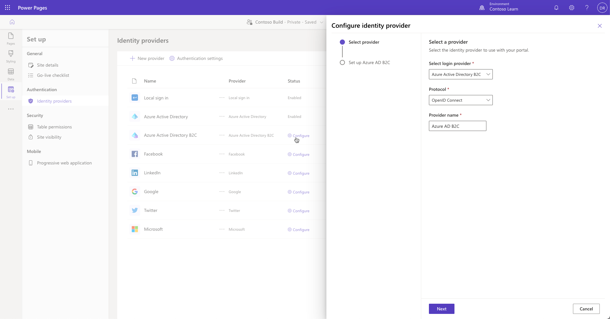
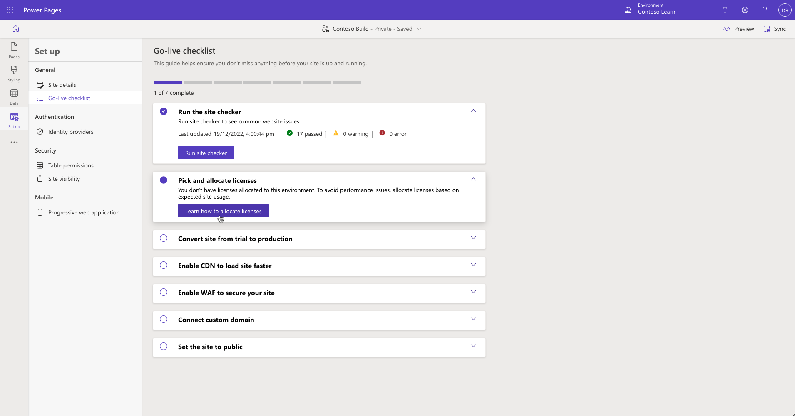
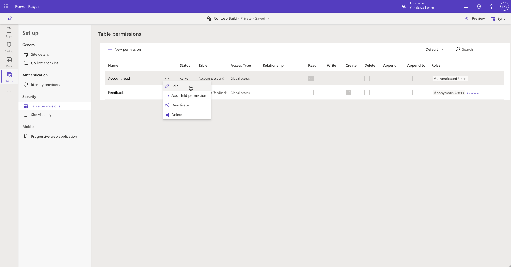
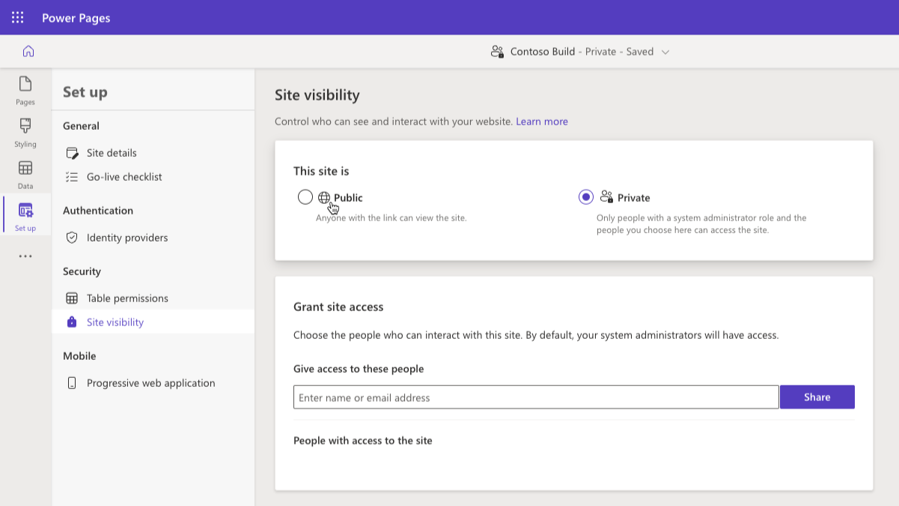
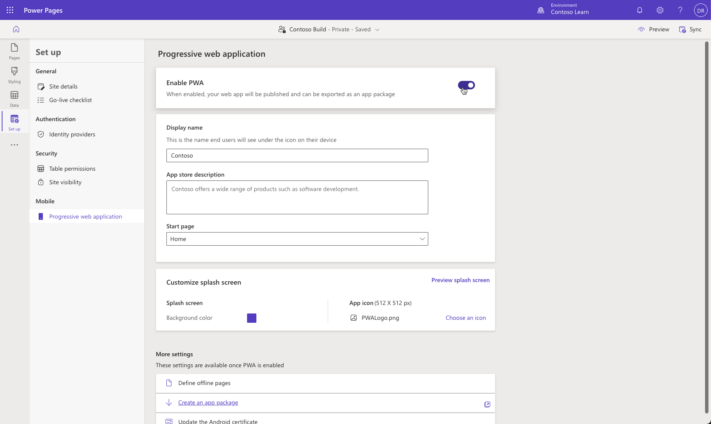

The **Set up** workspace in Power Pages design studio allows you to manage key aspects of your Power Pages site: authentication, table permissions, site visibility, progressive web application, and more.

## Authentication

Setting up authentication is a core customization in any business website. Simplified identity provider configuration in the Power Pages **Set up** workspace provides in-app guidance for identity provider setup and removes setup complexities. 

In the **Set up** workspace, select **Identity providers** under **Authentication** and then select **Configure** next to the required provider. 

> [!div class="mx-imgBorder"]
> 

You can set up the site for supported identity providers by following the steps that are outlined in the [Simplified authentication and identity provider configuration](/power-apps/maker/portals/configure/use-simplified-authentication-configuration/?azure-portal=true) document.

## Go-live checklist

Making a site live for production use is an important business step. The **Go-live checklist** includes interactive tasks that guide you in reviewing and completing the recommended actions before the site goes live. 

In the **Set up** workspace, select **Go-live checklist** and then follow the steps to ensure that you don't miss anything before your site is up and running. 

For more information, see [Go-live checklist](/power-pages/go-live/checklist).

## Table permissions

You can control access to specific pages by using [page permissions](/power-pages/security/page-security). You'll also want to secure custom web applications that are built with forms, lists, and portals Web API. To help secure these features, you can use table permissions to allow granular rights to be granted.

> [!div class="mx-imgBorder"]
> 

In the **Set up** workspace, select **Table permissions**, select the ellipsis (**...**) menu, and then select **Edit** for an individual table permissions row. A new panel will open, where you can manage table permissions and assign web roles to them.

For more information, read how to set up [table permissions in Power Pages](/power-pages/security/table-permissions).

## Site visibility

During the design and build stages, you can restrict site access to authorized users only. You can make the site **private** to restrict access to specific people in an organization, or you can make it **public** so that anyone with the link has access.

All new sites that are created in Power Pages are private by default. When a website is ready to go live, you can change the site visibility to **public**. 

In the **Set up** workspace, select **Site visibility** under the **Security** section. Switch visibility between public and private as required. For a private site, you can also specify users who have access to the site.

For more information, see [Site visibility in Power Pages](/power-pages/security/site-visibility).

## Progressive web application

Power Pages supports progressive web app technology that enables you to use a Power Pages site as an app that works on all platforms (Android, iOS, macOS, Windows, and Chromebooks) and form factors (mobile, desktop, and tablet). Progressive web apps are built to provide users with a native app–like experience.

After you've set up the application properties, the site will become an app that's installable from the browser and mobile app stores. 

For more information, see [Power Pages sites as progressive web apps (PWAs) overview](/power-pages/configure/progressive-web-apps).
