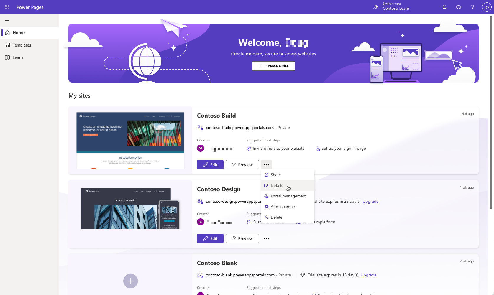
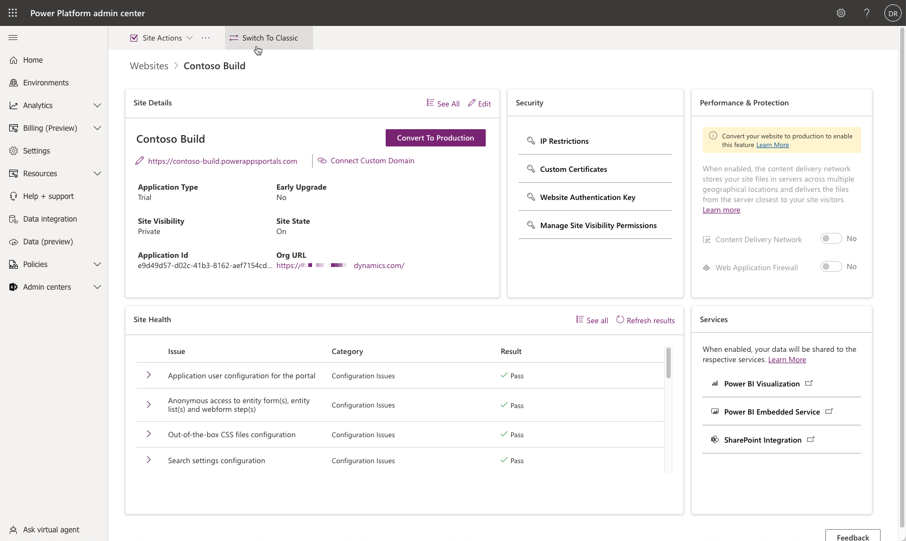

Microsoft Power Platform provides a set of tools to help you administer, set up, and customize a Power Pages site to meet specific business requirements.

## Power Pages design studio

Power Pages design studio allows you to quickly create and customize a website and to perform administrative functions. You can use the **Set up** workspace to manage key site settings of your Power Pages site.

To launch Power Pages design studio directly in the **Set up** workspace, sign in to [Power Pages Home](https://make.powerpages.microsoft.com/), select the overflow (**...**) menu next to the site record, and then select **Details**.

## Portal Management app

Not all site configuration features are available in the Power Apps design studio. The **Portal Management** app is a Microsoft Power Apps model-driven app that allows makers to add, modify, or delete metadata that defines the site functionality and appearance. You can use the **Portal Management** app for setting up multiple languages, editing site settings, creating and editing content snippets, setting up HTTP headers, and other advanced configuration tasks.

> [!NOTE]
> To use the Portal Management app, you'll need to be assigned the [system administrator role](/power-platform/admin/assign-security-roles) in the same Microsoft Dataverse environment as your site.

You can access the **Portal Management** app directly from the Power Pages Home screen by selecting **Portal management** on the overflow menu for the selected site.

> [!WARNING]
> Incorrectly modifying the portal metadata might have undesirable effects on the operation and appearance of your portal.

For more information, see [Portal Management app overview](/power-pages/configure/portal-management-app).

## Power Pages admin center

The Power Pages admin center provides a series of functions for administration, such as setting up custom URLs, enabling diagnostic logging, managing custom certificates, and more. 

You can use the Power Pages admin center to complete advanced administrative actions, such as network configuration, logging and troubleshooting, and more. To access the admin center, go to the Power Pages Home screen and select **Admin center** on the site overflow menu. 

For more information, see [Use the admin center](/power-pages/admin/admin-overview).

## Classic Portals admin center

For other administrative functions that aren't available in the admin center, you can use the classic Power Apps admin center. Select the **Switch To Classic** button in the Power Pages admin center to open Power Apps portals. 

For more information, see [Power Apps portals admin center](/power-apps/maker/portals/admin/admin-overview) for more information.

## Other tools

In addition to the tools and admin centers previously described, Power Pages administrators have access to the following tools: 

- **Microsoft Power Platform admin center** - To view and manage all Power Pages sites across all environments and to access capacity consumption reports. For more information, see [Administer Microsoft Power Platform](/power-platform/admin/admin-documentation) and [Site capacity consumption reports](/power-pages/admin/portal-consumption-reports).

- [Power Pages admin API](/power-pages/admin/admin-api) - To automate some administrative tasks.

- [Microsoft Power Platform Center of Excellence toolkit](/power-platform/guidance/coe/starter-kit) - To access tools and guidance for managing Power Pages sites. For more information, see [Power Pages governance](/power-pages/admin/coe-portals).
