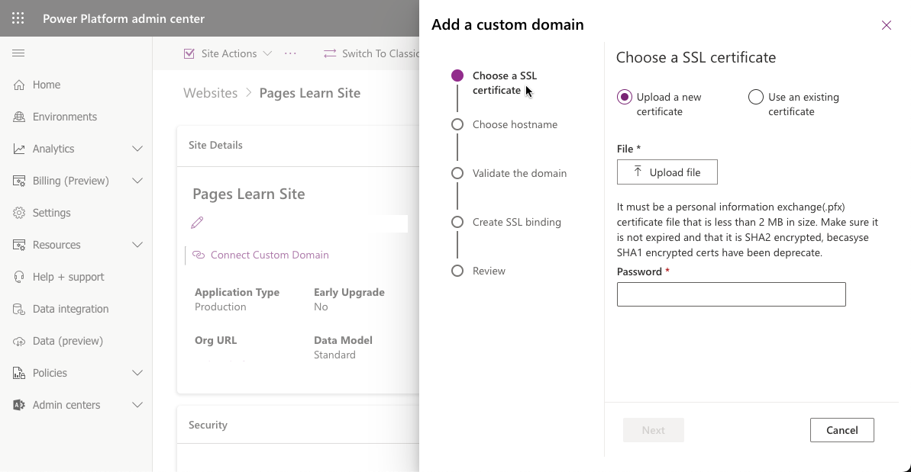

Managing network configuration is important aspect of Power Pages administration. It includes the following:

* Control website network configuration details such as URL and custom domain. 
* Manage website security aspects like keys and certificates, set up IP address restrictions. 
* Configure performance and protection features like Content Delivery Network and Web Application Firewall.  

When a website is provisioned, it will have a URL that is a subdomain of `powerappsportals.com`, for example, `contoso.powerappsportals.com`. A common task for a Power Pages administrator is to configure a custom URL for the website to reflect the domain naming conventions of an organization, such as `https://www.contoso.com`.  

> [!NOTE]
> You can have only one custom URL for each portal.

The following sections describe how to add a custom URL to a Power Pages website.

## Prerequisites

* The organization needs to have a valid SSL certificate for the domain. The SSL certificate must be in PFX format, signed by a trusted certificate authority, and meet many other security requirements (see [Add a custom domain name](/power-pages/admin/add-custom-domain?azure-portal=true) for the full certificate requirements list).
* The domain name needs to have a CNAME record set up in DNS pointing to the `contoso.powerappsportals.com` domain that was configured during the website provisioning process.
* The website must be in **Production** mode (that is, not **Trial** or **Suspended**) when you're adding a custom domain.

To configure a custom domain name:

1. Sign in to the [Microsoft Power Platform admin center](https://admin.powerplatform.microsoft.com/?azure-portal=true).
2. In the left pane, expand **Resources** and then select **Power Pages sites**.
3. Click on the target website name to open the website admin page.
4. In the **Site Details** section select **Connect Custom Domain**.

A wizard will open to walk you through the steps required to configure a custom domain.

> [!div class="mx-imgBorder"]
> 

Once the process is complete, visitors should now be able to browse the website using the custom domain name.

For more information, see [Add a custom domain name](/power-pages/admin/add-custom-domain?azure-portal=true).
