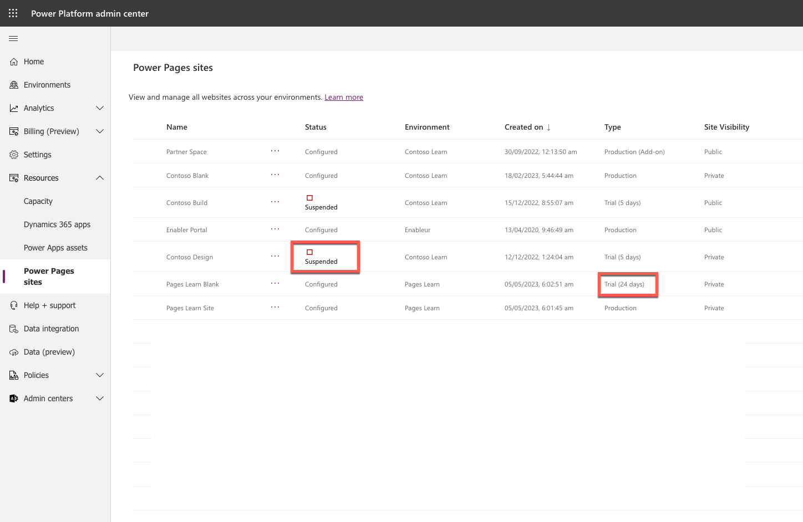
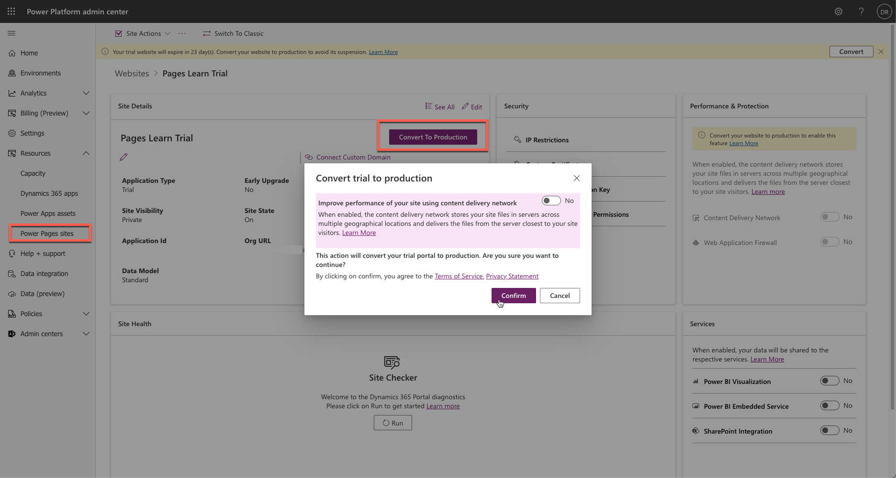
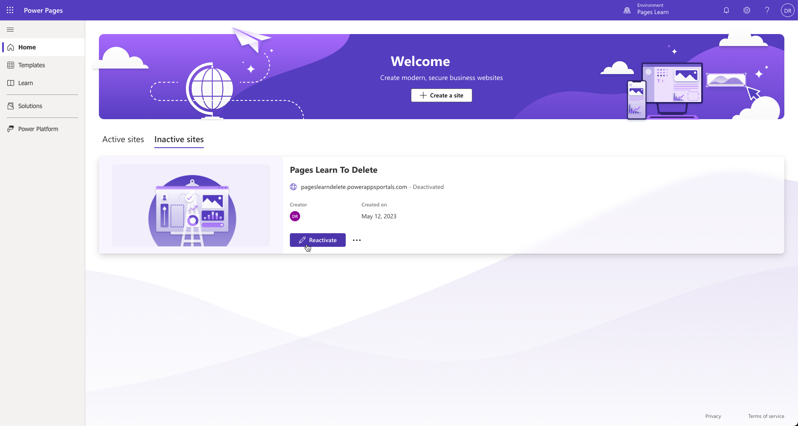
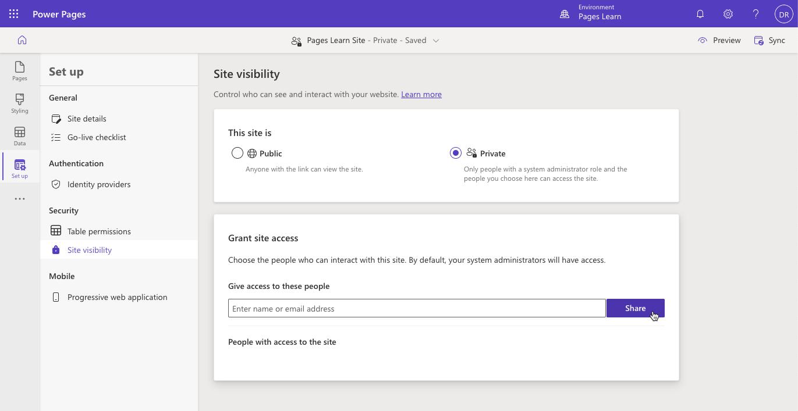

As a Power Pages administrator, you'll have several responsibilities in managing your organization's websites. Some of the key areas of responsibility include:

* creating and deleting websites
* converting websites from trial to production
* controlling website visibility

## Manage website lifecycle

You can create and delete websites using [Power Pages Home](https://make.powerpages.microsoft.com/). A Power Pages website is always created as a 30 days trial. After it expires, the website is suspended and shut down. Seven days after it's suspended, the trial website host is deleted. You can check the website status in Power Platform admin center under **Resources > Power Pages sites**.

> [!div class="mx-imgBorder"]
> 

The following limitations apply to a trial website:

- The trial environment is available to you for 30 days. After that, you can request an extension for another 30 days.
- If your trial site is created in a trial environment, your trial site is only available until your trial environment is available. If your environment expires before the trial site expires, you'll lose access to your trial site.
- Custom domains aren't supported.
- Performance and protection features like Content Delivery Network (CDN) and Web Application Firewall (WAF) aren't available.
- Scalability and performance may be affected.

### Trial conversion

You can convert a trial to a production website from the Power Platform admin center. 

1. Sign in to the [Microsoft Power Platform admin center](https://admin.powerplatform.microsoft.com/?azure-portal=true).
2. In the left pane, expand **Resources** and then select **Power Pages sites**.

3. Select on the target website name to open the website admin page.
4. In the **Site Details** section, select **Convert to Production**.
5. Optionally enable content delivery network and select **Confirm** to start the conversion. 

> [!div class="mx-imgBorder"]
> 

More information: [Convert a website from trial to production](/power-pages/admin/convert-site#convert-a-website-from-trial-to-production).

### Delete website

When site is no longer required, it can be deleted to free up the resources.

1. Sign in to the [Microsoft Power Platform admin center](https://admin.powerplatform.microsoft.com/?azure-portal=true).
2. In the left pane, expand **Resources** and then select **Power Pages sites**.

3. Select on the target website name to open website admin page.

4. Select **Site Actions** menu then select **Delete this site**.

This action won't affect any portal configurations or solutions present in your environment and they remain as it is. [Learn More](https://go.microsoft.com/fwlink/p/?linkid=873393)

> [!IMPORTANT]
> Deleting your website removes the hosted resources of your website and website URL will no longer be accessible. It doesn't remove the configuration or solutions present in your instance and they will remain as is. 

Deleted website appears in the **Inactive sites** list on Power Pages Home. You can create a new website using the existing configuration by selecting **Reactivate** button and following the prompts to provision a new copy of hosted resources and a new URL for the website.

> [!div class="mx-imgBorder"]
> 

For more information, see [Delete a website](/power-pages/admin/delete-website).

## Website visibility

The Power Pages site visibility feature is useful when a website is in development and you want to limit site access. This feature allows you to manage who has access to your website. You can restrict access to specific people in your organization by making the website private. If you choose to make the site public, anyone with the link has access.

> [!IMPORTANT]
> All new sites created in Power Pages are private by default. When the website is ready to go live, you can change the site visibility to public.

1. Sign in to [Power Pages Home](https://make.powerpages.microsoft.com/).
2. Select the target environment using the selector in the top right-hand corner.
3. Select the overflow (ellipsis) menu next to the website record.
4. Select **Details** to open **Set up** workspace. 
5. Select **Site visibility** tab under **Security** section.
6. Select **Public** to make the site public, or **Private** to make the site private.
7. Use **Grant site access** section to manage the list of users with access to the site.

> [!div class="mx-imgBorder"]
> 

Only site makers and organization users whom the maker granted access can view private sites. Website visitors need to authenticate using the organization's [Microsoft Entra ID](/azure/active-directory/fundamentals/active-directory-whatis) identity provider to open the site.

For more information, see [Site visibility in Power Pages](/power-pages/security/site-visibility).

### Maintenance mode

Another feature that allows you to control access to the website is maintenance mode. There might be times when your website is under scheduled maintenance or is down because of temporary outage. 

As a website administrator, you can configure your site to display a proper message to customers whenever a maintenance activity is going on. You can benefit from this capability by enabling the maintenance mode on your website. When the maintenance mode is enabled, a message is displayed, and the customers are restricted from browsing any webpages.

For more information, see [Maintenance mode for a website](/power-pages/admin/enable-maintenance-mode).

