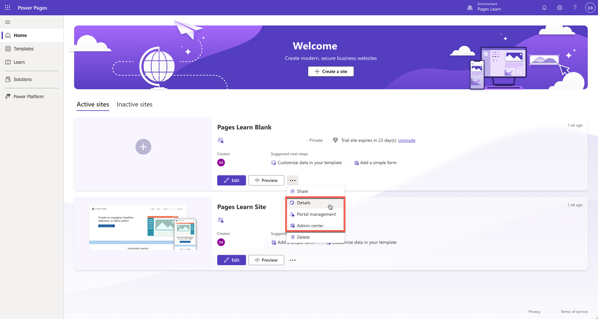
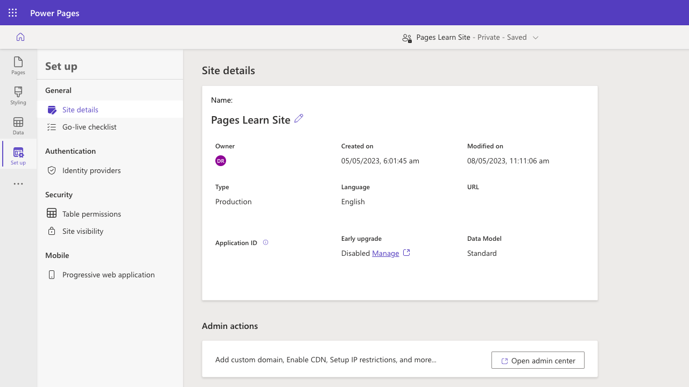
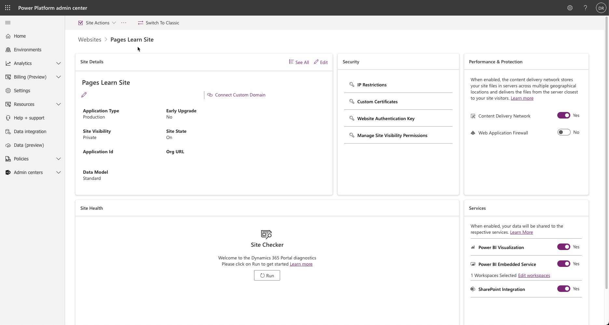
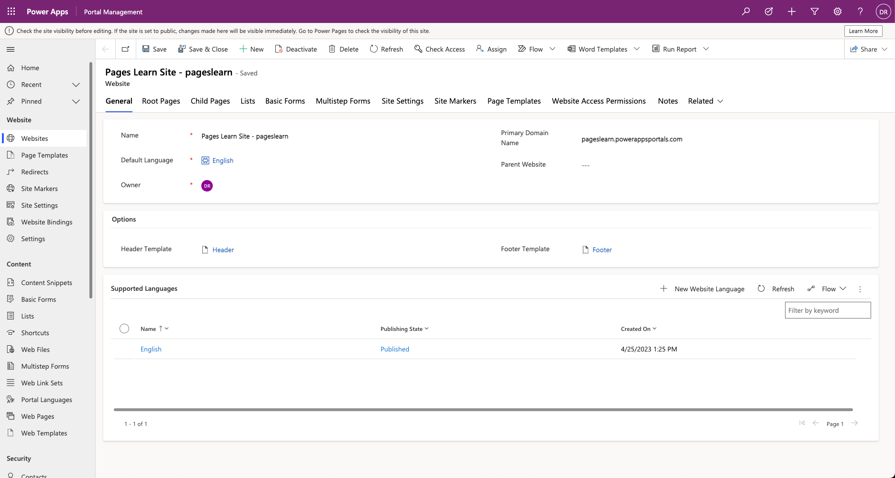

Microsoft Power Platform provides a set of apps to help you administer, configure, and fine-tune a Power Pages website to meet specific business requirements. The primary set of tools for a Power Pages administrator consists of:

* Set up workspace in Power Pages design studio
* Power Pages admin center
* Portal Management App

These apps can be accessed directly from [Power Pages Home](https://make.powerpages.microsoft.com/) by selecting the overflow (ellipsis) menu next to the website record and then selecting **Details** for Set-up workspace, **Admin center** for Power Pages admin center, or **Portal management** for Portal Management App.

> [!div class="mx-imgBorder"]
> 

## Power Pages design studio

Power Pages design studio allows you not only to quickly create and customize a website but also to perform basic administrative functions. You can use the **Set up** workspace to configure key settings of your Power Pages website. The workspace can be accessed from Power Pages Home by selecting **Details** on the website overflow menu.

> [!div class="mx-imgBorder"]
> 

## Power Pages admin center

**Power Pages admin center** provides access to advanced administration functions such as network configuration, logging and troubleshooting, updates management, and more. Admin center can be accessed from Power Pages Home by selecting **Admin center** on the website overflow menu.

> [!div class="mx-imgBorder"]
> 

For more information, see [Use the admin center](/power-pages/admin/admin-overview).

## Portal Management app

Not all website configuration features are available in the Power Apps design studio or Power Pages admin center. **Portal Management app** is a Power Apps model-driven app that allows administrators to add, modify, or delete any of the metadata that define the website functionality and appearance. The Portal Management app can be used for setting up multiple languages, editing website settings, creating and editing content snippets, setting up HTTP headers, and other advanced configuration tasks.

>  [!NOTE]
> To use the Portal Management app, you will need to be assigned the [system administrator role](/power-platform/admin/assign-security-roles) in the same Microsoft Dataverse environment as your website.

Portal Management app can be accessed directly from Power Pages Home screen by selecting **Portal management** on the overflow menu for the selected website.

> [!div class="mx-imgBorder"]
> 

> [!WARNING]
> Incorrectly modifying the portal metadata might have undesirable effects on the operation and appearance of your portal.

For more information, see [Portal Management app overview](/power-pages/configure/portal-management-app).

## Additional tools

In addition to the tools described, Power Pages administrators can also use the following: 

* Power Platform admin center to view and manage all Power Pages websites across all the environments, and access capacity consumption reports. For more information, see [Manage websites from the Power Platform admin center](/power-pages/admin/power-platform-admin-center) and [Website capacity consumption reports](/power-pages/admin/portal-consumption-reports).
* Power Platform Command Line Interface (CLI) to support Application lifecycle management (ALM) tasks. See [Power Platform CLI support for Power Pages](/power-pages/configure/power-platform-cli) for more information.
* [Power Pages admin API](/power-pages/admin/admin-api) to automate some of the administrative tasks.

* [Power Platform Center of Excellence toolkit](/power-platform/guidance/coe/starter-kit) to access tools and guidance for managing Power Pages websites. See [Power Pages governance](/power-pages/admin/coe-portals) documentation for more information.

