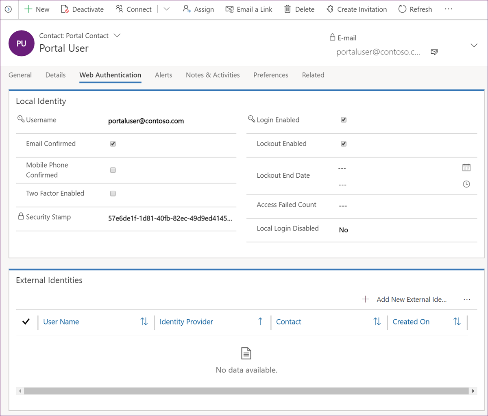
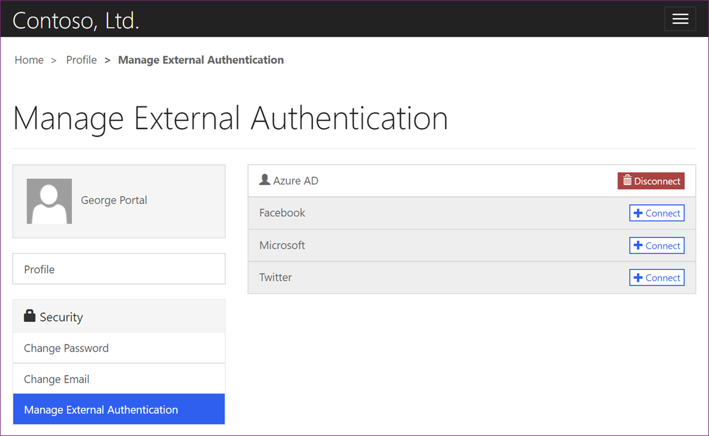

Power Pages administrators have several options for controlling authentication behavior for website users. You can access these options through the **Web Authentication** tab on the **Portal Contact** form.

> [!div class="mx-imgBorder"]
> 

The following table explains various options that are available on the **Web Authentication** tab.

| Column                 | Description                                                  |
| ---------------------- | ------------------------------------------------------------ |
| Username               | The username is for local authentication. You can reset the password by running the **Change password for portal contact** task: [Change password for a contact from the Portal Management app](/power-apps/maker/portals/configure/configure-contacts?azure-portal=true#change-password-for-a-contact-from-the-portal-management-app). |
| Email Confirmed        | This flag indicates if the email has been confirmed. Essentially, a validation code has been emailed to and confirmed by the user. Unless the email is confirmed, it can't be used for password resets or two-factor authentication. If necessary, the administrator can set it manually. |
| Mobile Phone Confirmed | This column is similar to the **Email Confirmed** column, except that text messaging is used for confirmation and other operations. Messaging providers aren't included out of the box, but if an organization has one, the authentication flows can be extended to include text as a valid confirmation channel. |
| Two Factor Enabled     | Defines if two-factor authentication has been enabled for the contact. A confirmed email address is required for two-factor authentication to be used. |
| Login Enabled          | Clearing this checkbox (or setting the column value in a workflow) will disable all forms of authentication for the contact, including external providers. |
| Lockout Enabled        | Defines if the contact can be locked after a preconfigured number of failed attempts. |
| Lockout End Date       | When the contact is locked out, this column defines when it will be unlocked automatically. A common use of this value is to lock out a contact for a number of minutes (which is controlled in website settings) after a preconfigured number of failed sign-in attempts. |
| Local Login Disabled   | Defines if the local authentication option is available for the user. Website settings might disable local authentication for all users, in which case, this flag has no effect. |

For more information, see [Local authentication, registration, and other settings](/power-pages/security/authentication/set-authentication-identity?azure-portal=true).

## External Identities

The **External Identities** list includes all external providers that are registered for a specific user. Multiple external identities permit user sign-in with any registered provider. Entries in this list shouldn't be edited manually; they're added/removed when the user connects/disconnects the providers by using the **Manage External Authentication** link on their **Profile** page on the website.

> [!div class="mx-imgBorder"]
> 
