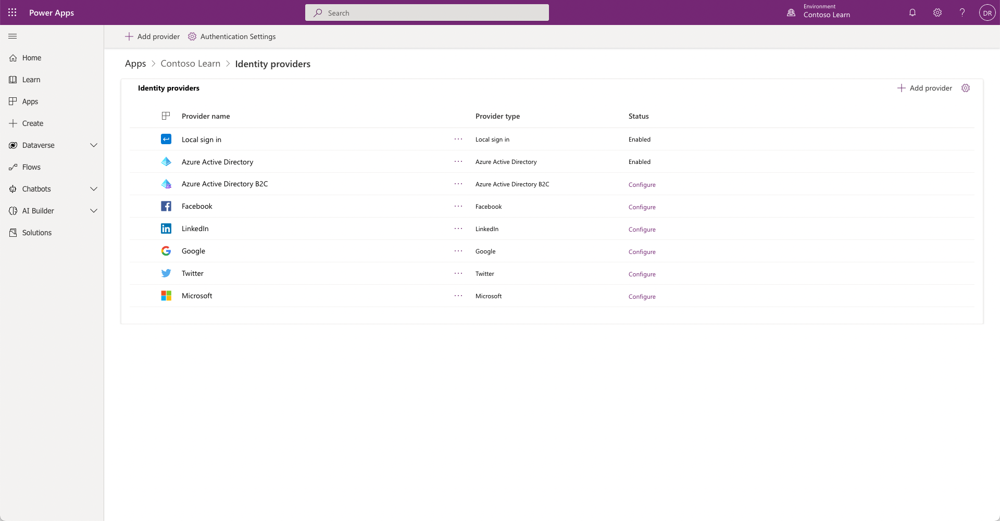

## Local authentication

Local authentication is the common forms-based authentication that uses contact rows for authentication. You can set up local authentication settings by using site settings, including disabling local sign-in options for the entire website: [Local authentication, registration, and other settings](/power-pages/security/authentication/set-authentication-identity?azure-portal=true).

## External authentication

When you use external authentication, external identity providers will handle credentials and password management. Supported authentication protocols include:

- WS-Federation and SAML 2.0

- OAuth2 (Microsoft, Twitter, Facebook, Google, LinkedIn, Yahoo)

- OpenID Connect (Microsoft Entra ID, Microsoft Entra ID B2C)

## Authentication and provider configuration

Setting up authentication is a core customization for any website. Simplified identity provider configuration in Power Pages provides in-app guidance for identity provider setup and abstract setup complexities. Makers and administrators can set up the website for supported identity providers by following steps that are documented at [Configure Power Pages site authentication](/power-pages/security/authentication/configure-site?azure-portal=true).

> [!div class="mx-imgBorder"]
> 

## Azure Active Directory B2C

A website owner can set up the website to accept Azure Active Directory B2C (Microsoft Entra ID B2C) as an identity provider. Microsoft Entra ID B2C enables external customer sign-ins through local credentials and federation with various common social identity providers.

> [!IMPORTANT]
> Microsoft Entra ID B2C identity provider is the recommended provider for authentication. If external provider support (such as Facebook) is required, then you can set up the provider in Microsoft Entra ID B2C instead of the website.

The advantages of using Microsoft Entra ID B2C are that it's:

- Customer identity and access management, not only authentication.

- Customizable, where you can use built-in templates or build sophisticated custom policies.

- A branded experience for your customers.

- Platform-agnostic and supports external providers.

- Identity protection through security controls and multifactor authentication.

- Supporting open standards and all technology stacks.

- Scalable and reliable, and built and supported by Microsoft, backed by SLA.

### Migration to Microsoft Entra ID B2C

Power Pages supports a configurable security system that lets your customers support multiple authentication systems. Going forward, we recommend that you use only Microsoft Entra ID B2C identity provider for authentication and that you deprecate other identity providers.

You can set up your website to mark other identity providers as deprecated and allow users to migrate to Microsoft Entra ID B2C identity provider. If a specific provider (such as Twitter) is required to be supported, Microsoft Entra ID B2C can still support it instead of the website.

The steps that are involved in migration are:

1. Mark other identity providers as deprecated.

1. Migrate deprecated identity providers to Microsoft Entra ID B2C.

1. Disable local sign-in.

Following these steps ensures an uninterrupted authentication experience for users. For more information, see [Migrate identity providers to Microsoft Entra ID B2C](/power-apps/maker/portals/configure/migrate-identity-providers/?azure-portal=true).
