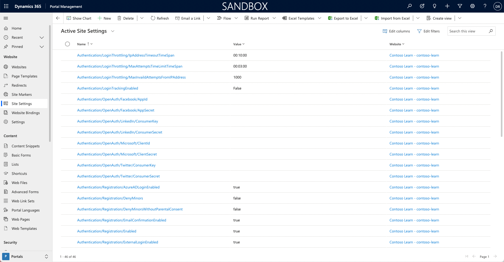
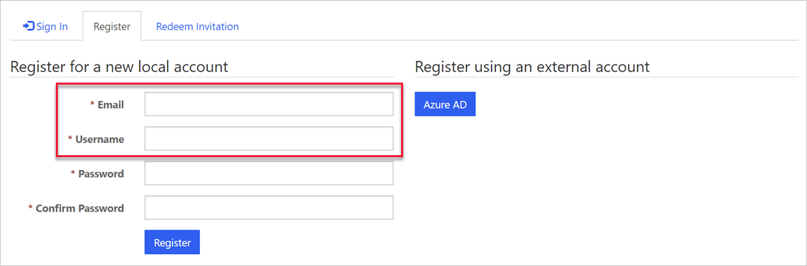
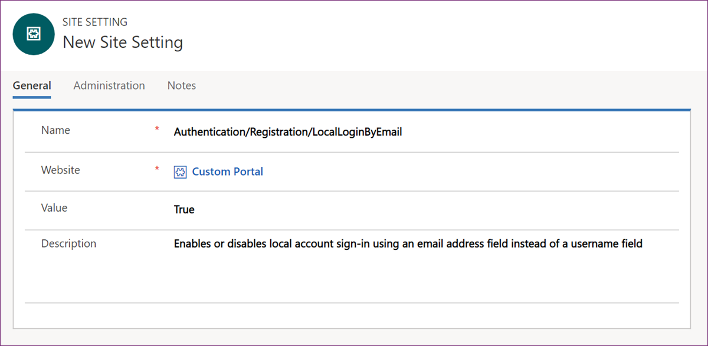
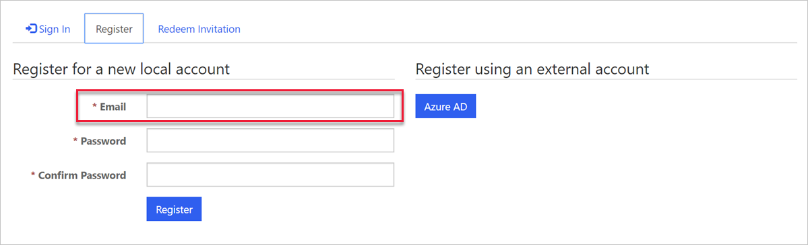
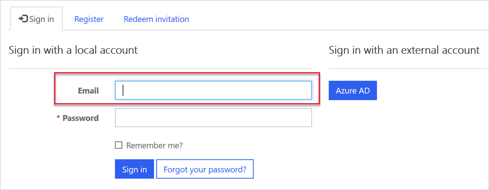

You can use website settings to set up many authentication options that are supported by Power Pages. Website settings are stored in the **Site Settings** table, where each setting is defined as a name/value pair.

To view website settings, follow these steps:

1. Sign in to [Power Apps](https://make.powerapps.com/?azure-portal=true).

1. Select a target environment by using the environment selector in the upper-right corner.

1. On the left menu, select **Apps**.

1. Select the **Portal Management** app.

1. In the app, select **Site Settings** in the navigation panel.

> [!div class="mx-imgBorder"]
> 

> [!NOTE]
> If a Dataverse instance has more than one Power Pages website provisioned, some rows might contain identical names and values, one for each website.

Only a few of the many available authentication-related website settings are installed when you provision a website. Settings that aren't created have their documented default values.

## Example of a setting

When you provision a website, the form for registering a new local account requires an email address and a username.

> [!div class="mx-imgBorder"]
> 

To enable a local account sign-in by using an email address instead of a username, you can add the `Authentication/Registration/LocalLoginByEmail` setting and then set it to **True**.

> [!div class="mx-imgBorder"]
> 

As a result, the form and the process for registering a new local account will now require an email address only.

> [!div class="mx-imgBorder"]
> 

Also, the sign-in form will now refer to **Email** instead of **Username**.

> [!div class="mx-imgBorder"]
> 

> [!NOTE]
> Where a function is enabled by default, a site setting needs to be created to disable that function. For example, adding the `Authentication/Registration/ResetPasswordEnabled = False` setting is required to disable the password reset feature for local authentication.

## Authentication settings categories

All authentication-related site settings start with **Authentication**.

You can group authentication settings into three broad categories, each covering settings that control various aspects of authentication processes.

| Group                                | Description                                                  |
| ------------------------------------ | ------------------------------------------------------------ |
| **Authentication/Registration**      | The most extensive group of settings that cover options, such as enabling/disabling specific authentication methods, controlling invitation behaviors, password resets, confirmation emails, two-factor authentication, and more. |
| **Authentication/UserManager**       | [User credential validation](/power-apps/maker/portals/configure/set-authentication-identity?azure-portal=true#user-credential-validation) are settings for adjusting username and password validation parameters. Validation occurs when users sign up for a new local account or change a password. [User account lockout settings](/power-apps/maker/portals/configure/set-authentication-identity?azure-portal=true#user-account-lockout-settings) are also included. |
| **Authentication/ApplicationCookie** | Commonly, enterprise requirements will be in place for specific cookie behaviors, such as an expiration time span. This group defines [Cookie authentication site settings](/power-apps/maker/portals/configure/set-authentication-identity?azure-portal=true#cookie-authentication-site-settings) for modifying the default authentication cookie behavior. |

For more information, see [Local authentication, registration, and other settings](/power-pages/security/authentication/set-authentication-identity?azure-portal=true).
