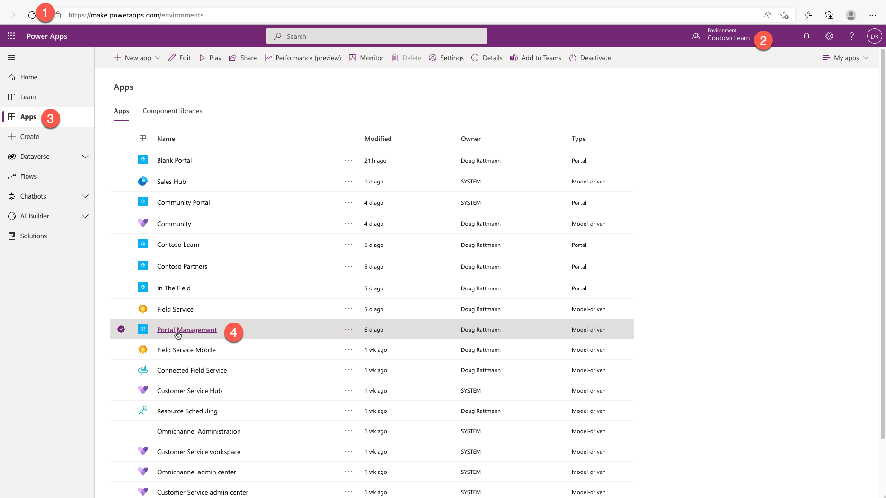

The purpose of this hands-on lab is to introduce the Power Pages invitation-based user registration process.

The exercises work best when you have sample data to work with. Depending on the environment that you're working with, you might want to install sample data to assist with the exercises. Dataverse provides you with the ability to add sample data as needed. If the environment that you're working in doesn't have sample data installed, follow the steps in the [Add or remove sample data](/power-platform/admin/add-remove-sample-data/?azure-portal=true) documentation to install the sample data into your environment.

## Learning objectives

By the end of these exercises, you'll be able to:

- Create a Power Automate flow to email invitations to contacts.

- Create and send invitations to contacts to register.

- Redeem invitations.

### Prerequisites

The prerequisites for this exercise are as follows:

- System Administrator access to a Dataverse or Microsoft Dynamics 365 environment.

- A provisioned Power Pages website in that environment.

- Maker access to Power Automate.

- An Office 365 email account or any other email account that you can access in Power Automate by using a connector.

## Scenario

Your organization has been using Power Apps for some time and has been recording information about customers and suppliers. You've provisioned and set up a Power Pages website. You want to invite a supplier who's assisting you with the website management to register as an administrative website user so that they're able to sign in, access administrator-only content, and perform administrator-specific, front-end functions like previewing draft content.

## High-level steps

To send invitations to your customers and for them to redeem the invitations, complete the following tasks:

- Create a Power Automate flow to send a single invitation.

- Select a contact and create an invitation.

- Ensure that the invitation contains the required information.

- Send the invitation to the contact.

### Create a test contact

To create a test contact, follow these steps:

1. Sign in to [Power Apps](https://make.powerapps.com/?azure-portal=true).

1. Select a target environment by using the environment selector in the upper-right corner.

1. On the left menu, select **Apps**.

1. Select the **Portal Management** app, which will open in a new tab. Don't close the Power Apps maker environment window.

   

1. In the app, select **Contacts** in the **Security** section and then select **New**.

1. Create a new row for Nancy Davolio. Fill in the first name, last name, and email address information (use an email address where you can receive the email).

1. Select **Save**.

   

1. Don't close this window.

### Create an invitation flow

Power Pages is provisioned with a classic workflow to send the invitation email. This example uses a modern approach instead and creates a Power Automate flow to accomplish the same task.

1. Switch to the Power Apps maker environment tab.

1. Select **Solutions** and then locate and select **Common Data Services Default Solution**.

   > [!TIP]
   > Use search to locate the solution.

   

1. Select **New > Automation > Cloud flow > Instant**.

   

1. Enter **Send Invitation** as the **Flow name**.

1. Select the **When a row is selected** Dataverse trigger.

1. Select **Create**.

   > [!div class="mx-imgBorder"]
   > 

1. Enter details for the **When a row is selected** step.

   1. Select the **Default** environment.

   1. Select the **Invitations** table.

1. Add the **Get a row by ID** action from the **Microsoft Dataverse** connector.

   1. Select the ellipsis (**...**) on the step and then select **Rename**. Change the step name to **Get Contact**.

   1. Select **Contacts** as the table.

   1. Insert **Invite Contact** dynamic content as the **Row ID**.

1. Select **Save**. Your flow should resemble the following example.

    

1. Add a **Compose** action from the **Data Operation** connector.

   1. Set **Inputs** to `<a href="https://siteurl/register/?invitation=CODE">this link</a>`.

   1. Replace **siteurl** with your website address, such as `contoso.powerappsportals.com`.

   1. Select **CODE** and replace it with **Invitation Code** dynamic content.

      An invitation link expression will be created that you can now use inside an HTML email.

   

1. Add the **Send an email (V2)** action from the **Office 365 Outlook** connector.

   > [!NOTE]
   > In this step, you can use any connector that supports sending HTML emails. For example, if you have a SendGrid subscription, you can use the SendGrid connector.

   1. Insert **Email** dynamic content from the **Get Contact** step in the **To** field.

   1. Enter **Join our community** as the **Subject**.

   1. Insert the following text as the email body:

	     > Dear FIRSTNAME,
	     >
	     > Please accept our invitation to join the Contoso community. To redeem your invitation, please follow LINK.
	     >
	     > Best regards,
	     > Contoso Team

   1. Replace FIRSTNAME with **First Name** dynamic content from the **Get Contact** step.

   1. Replace LINK with **Outputs** from the **Compose** step.

1. Select **Save**. Your flow should resemble the following screenshot.

   

1. Add the **Update a row** action from the **Microsoft Dataverse** connector.

   1. Select the ellipsis (**...**) on the step and then select **Rename**. Change the step name to **Set status as sent**.

   1. Select **Invitations** as the table.

   1. Select the **Invitation** dynamic content from the **When a record is selected** step as the **Row ID** value.

   1. Expand **Show advanced options**.

   1. Select **Sent** as the **Status Reason**.

   

1. Select **Save** and then select the **Back** arrow in the upper-left corner.

    

### Create and send the invitation

To create and send the invitation, follow these steps:

1. Switch to the Power Pages app. Open Nancy Davolio's contact row if it's not already open.

1. Select **Create Invitation** on the command bar.

1. The invitation is prepopulated. Select **Save**.

1. Under **Assign to Web Roles**, select **Add Existing Web Role**.

1. Search for and add the **Administrators** role.

1. Select **Flow > Send Invitation**.

   

   > [!TIP]
   > If the **Send Invitation** option doesn't show under the **Flow** menu, select **See your flows** first, refresh the window, and then try accessing the **Flow** menu again.

### Redeem the invitation

To redeem the invitation, follow these steps:

1. Open the mailbox for the email that you used for Nancy Davolio.

1. Locate and open the invitation email.

1. Select the link in the email. The **Redeem Invitation** page will open.

1. Select **Register**.

1. Enter **nancyd** as the username and then enter a password of your choice.

   > [!TIP]
   > By default, passwords must be at least eight characters. Passwords must contain characters from at least three of the following four classes: uppercase, lowercase, digit, and non-alphanumeric (special).

1. Select **Register**. Your account is now registered, and you're signed in automatically and redirected to the profile page.

1. Switch to the Power Pages app.

1. Select **Invitations** and then select the **Completed Invitations** view.

1. Confirm that the **Nancy Davolio** invitation is listed.

1. Open the invitation and confirm that **Status Reason** is now **Redeemed**.

