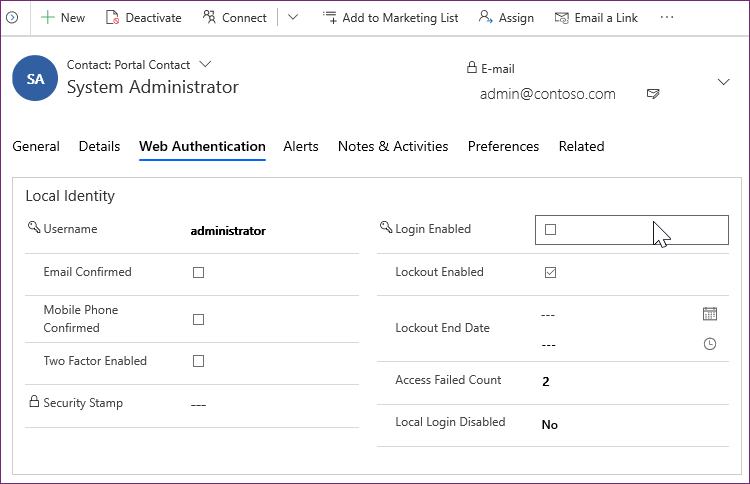
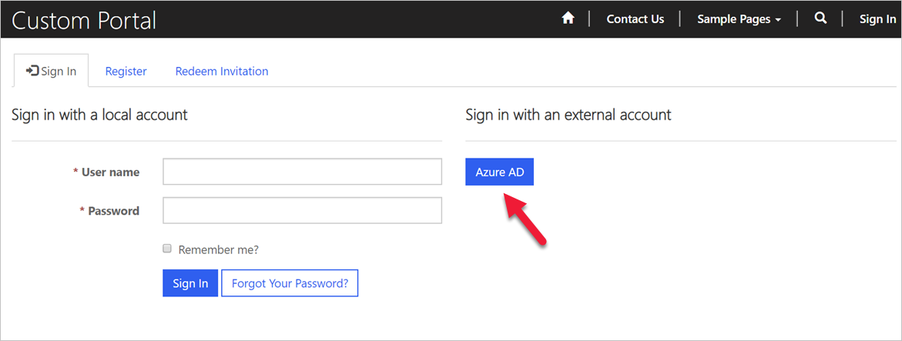
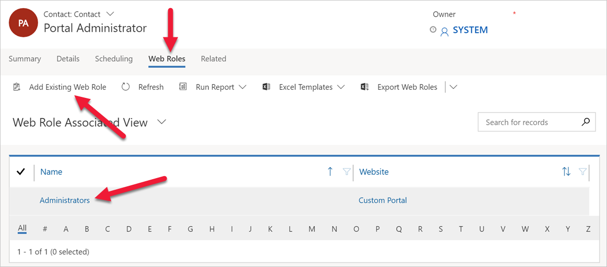

Microsoft Power Pages extends model-driven Microsoft Power Apps solutions to internal and external audiences, such as communities, customers, partners, and employees. As part of this process, website visitors can access the website as anonymous or authenticated users.

For authenticated users, accessing and using a website involves a two-part process:

- **Authentication** - The process of validating the user's identity. This process is a verification of "they are who they say they are."

- **Authorization** - The process of verifying that a user has access to something, such as a specific website page or a row in a Microsoft Dataverse table. This process determines if "User A is allowed to do X."

The following sections discuss authentication in more detail.

## Track users as contacts

Authenticated users are always tracked in Dataverse as contacts, regardless of the template that's used to provision the website. The process is the same whether the user is external or an employee, and it's not dependent on the authentication method that's used.

Website users can authenticate with the following methods:

- **Local authentication** - Common forms-based authentication with usernames and password hashes that are stored in the Dataverse contact row.

- **External authentication** - Credentials and password management are handled by external identity providers, such as Microsoft Azure Active Directory B2C (Microsoft Entra ID B2C), Microsoft, Twitter, and so on.

Website administrators can choose to enable or disable any combination of authentication options through the site settings.

All interactions that a website user takes (for example, leaving comments on a page) are tied to their contact row in Dataverse.

## Contact extensions

To support authentication, the Power Pages solution adds the **External Identity** table and extends the **Contact** table by adding several columns and Power Pages-specific forms.

These extensions allow administrators to complete the following actions:

- Control parts of the authentication process, such as whether sign-in is enabled for the contact or not.

- Access website-specific contact information.

- Provide registration and profile management forms for the website.

- Support password-based local authentication.

- Enforce password and lockout policies.

- Manage user identities when external providers are used.

> [!div class="mx-imgBorder"]
> 

## Administrator as a website user

Website users aren't created when a Power Pages website is provisioned. The person who provisioned the website already has access to Dataverse as a system administrator. It's common practice to ensure that they can access the website as an external user as well.

1. Sign in to the Power Pages website by using Microsoft Entra ID authentication. If **Open Registration** is enabled (it is by default), a contact row is created as required.

   > [!div class="mx-imgBorder"]
   > 

1. If it's the first time that you're using Microsoft Entra ID authentication, you might be prompted to provide consent for the Power Pages web app to access user information. You can consent on behalf of the organization so that individual users won't be prompted.

1. Locate and open the contact row that was created. The contact row has the same email address as the signed-in Microsoft Entra ID user.

1. Go to **Related > Web Roles**. Verify that the contact is associated with the **Administrators** web role. Select the **Add Existing Web Role** command button to associate the **Administrators** web role with the contact if necessary.

> [!div class="mx-imgBorder"]
> 

These steps ensure that this Microsoft Entra ID user has full administrative permissions when they're accessing the website as an external user.
