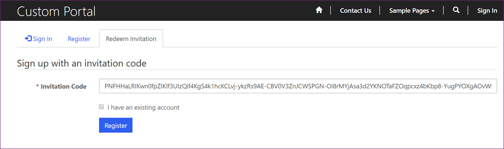
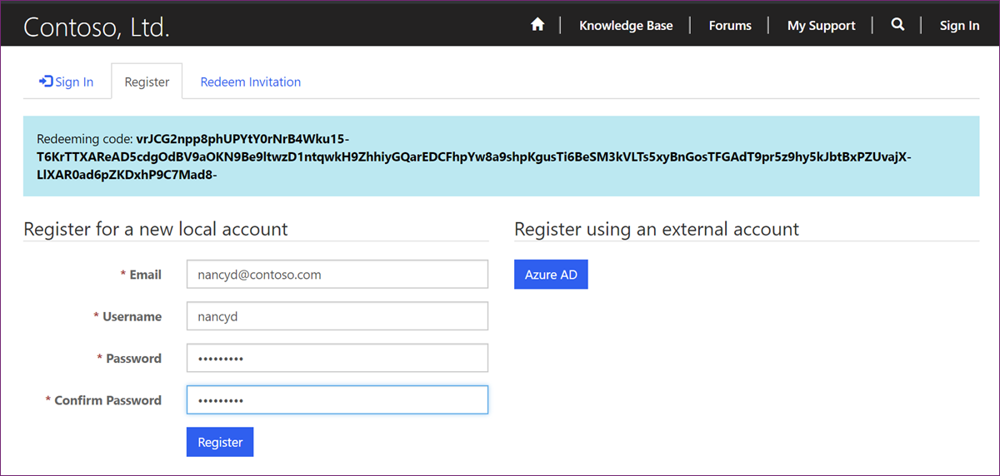

Before website visitors can sign in to a Power Pages website, they need to be registered as website users. All website users are tracked as contacts, and they can register in two ways:

- **Open registration** - Allows visitors to register directly on the website.

- **Invitation-based registration** - Requires users to provide an invitation code.

The decision about which option is more appropriate depends on the target audience of your website and whether the members of the audience are known in advance.

Regardless of the registration configuration, local and external accounts participate equally in the registration workflow. Specifically, users have the option to choose which type of account that they want to register.

Registration is enabled by default. The `Authentication/Registration/Enabled` site setting controls the overall registration process, and adding this setting with the value of `False` disables all forms of user registration. Any other registration setting is ignored until the registration is enabled. You can use [Enable or disable user registration](/power-apps/maker/portals/configure/set-authentication-identity?azure-portal=true#enable-or-disable-user-registration) settings to control individual registration options.

## Open registration

Open registration allows visitors to register directly on the website by using the **Register** tab on the website **Sign In** page. It's the least restrictive sign-up configuration, where the website allows a user account to be registered by providing a user identity. When open registration is enabled, any user who completes the registration form is immediately registered and authenticated.

Because users aren't validated prior to sign-up, this option works well in more open environments, such as community websites, where website visitors aren't known in advance. Organizations run these websites for the communities where the users might have some common interests, such as the area where they live, their hobbies, and the industries that they work in. In other words, open registration works best when it's not easy to discover and validate the users in advance.

## Invitation-based registration

Invitation-based registration is the process where an existing contact is validated by an invitation code.

This registration is useful in scenarios when contacts are known in advance. It's commonly used to register customers, partners, or employees. Invitation-based registration works in situations where users can be *prevalidated*, such as when you've collected contact information from the visitors of your exhibition booth.

Invitations contain many [Invitation columns](/power-apps/maker/portals/configure/invite-contacts?azure-portal=true#invitation-attributes) or attributes that allow you to complete the following actions:

- Send single or group invitations. Group invitations use the same invitation code for all invitees, and they work well with a restriction on the number of invitations to redeem. For example, a software company can send a promotional email, inviting all their users to participate in a beta program; however, intake is limited to the first 100 registrations.

- Specify an expiry date, if desired.

- Specify a website contact as the inviter. You can use this information to customize invitation emails and in the post-registration workflows.

- Assign the invited contact(s) automatically to an account on invite redemption. This option is useful in partner portal scenarios where all invitees are from the same company.

- Implement a classic workflow automatically on invite redemption. For example, you might want to send a "Thank you" email to the contacts who accepted the invitation.

- Assign the invited contact(s) automatically to web roles on redemption. You can use this feature to grant users who accept the invitation with special access rights in your website.

> [!IMPORTANT]
> Email integration must be enabled in your Microsoft Dataverse instance for the email invitations to work.

The ensuing sections explain the process of sending and redeeming invitations.

### Set up automation

The classic workflow process of sending the invitation email is generic, and you'll need to customize it prior to use. When you're customizing the invitation email, make sure that the link to the **Invite Redemption Page** includes the invitation code. The default link should resemble this sample: `https://yoursiteurl/register/?returnurl=%2f&invitation={Encoded Invitation Code(Encode Invitation Code)}`

After the invitation code has been generated, you can distribute it through other channels. For example, if you have a text messaging solution in place, you might want to replace the steps of creating and sending the invitation email with the custom step of sending a text message instead.

> [!IMPORTANT]
> Microsoft Power Automate has significant advantages over the classic workflow model. You should consider using Power Automate to automate your Send Invitation process instead of using the classic workflow.

### Create Invitation

**Create Invitation** is a unique invitation code that is generated when an **Invitation** row is created. You can create the **Invitation** row manually by selecting the **New** command on the **Invitations** view or by using the **Create Invitation** command on a contact row. For more information, see [Invite contacts to your Power Pages site](/power-pages/security/invite-contacts?azure-portal=true#create-invitations-from-portal-management-app).

### Redeem Invitation

When the contact receives the email invitation and follows the URL, they're directed to the **Redeem Invitation** tab of the **Sign In** page.

On this page, the contact can select the **I have an existing account** option, which opens some automation opportunities where the existing website users can be sent an invitation code. After the code has been accepted and an existing account is used, you can run a workflow that could, for example, grant user access to other protected content.

> [!div class="mx-imgBorder"]
> 

### Register user

If the user doesn't select the **I have an existing account** option, they'll be presented with the registration page. Similar to open registrations, users have the option to register by using any provider that's enabled on the website. The selected registration is associated with the invited contact, showing the invitation as redeemed.

> [!div class="mx-imgBorder"]
> 

After the registration process is complete, depending on the invitation options, you can associate the website user with the predefined account, or you can run another classic workflow.

For more information, see [Invite contacts to your Power Pages site](/power-pages/security/invite-contacts?azure-portal=true).
