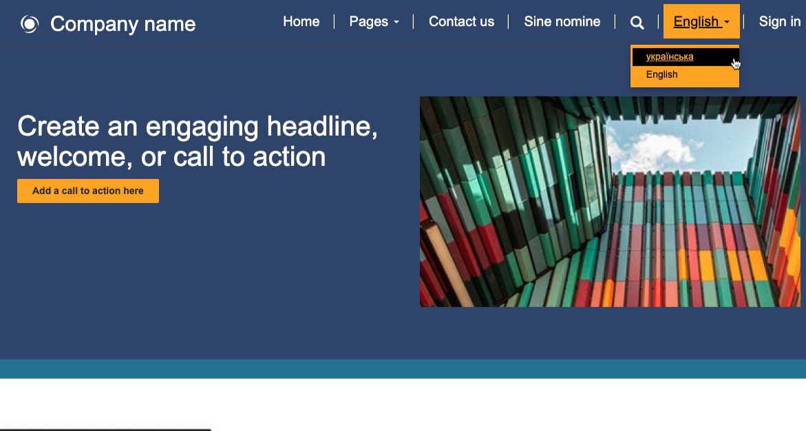
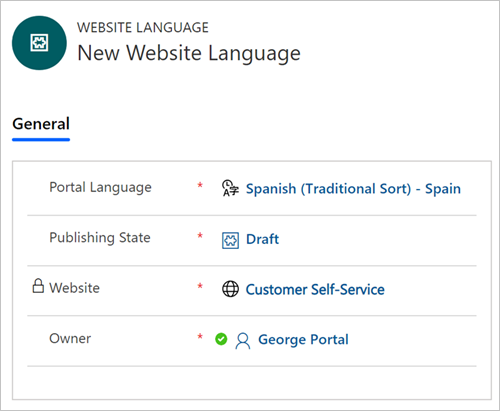
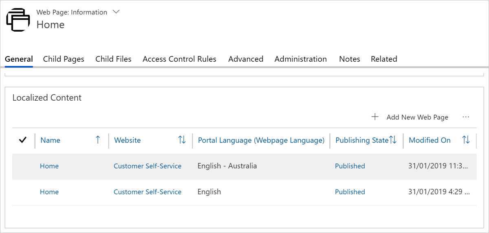

Often, organizations need to serve audiences of different languages or are required by law to provide multilingual content. A Power Pages website can deliver content in multiple languages. You can support multiple languages by creating versions of your content structure for each extra language, which helps make it easier to translate and maintain. When a website user selects a language, they're selecting a specific language version of your content structure.

> [!div class="mx-imgBorder"]
> 

## Set up more languages

You can set up more languages by using the Portal Management app. The **Website** row has a **Supported Languages** section, where you can select the **Add New Website Language** option. When you add a new language to a website, make sure that you select **Portal Language** and **Publishing State**.

> [!div class="mx-imgBorder"]
> 

> [!IMPORTANT]
> Website language will only allow you to select languages that are already enabled in your Microsoft Dataverse environment. If a language isn't visible in the view, the system administrator would need to enable the language in the environment.

## Create language-aware content

You can create language-aware content through localized content on webpages by providing corresponding web link sets in the language and by offering language-specific or language-agnostic content snippets.

### Webpages

Webpages have the concept of localized content pages. The **Localized Content** page is where the actual content of the webpage is created or modified. You can select different templates for each of the content pages, rendering them differently depending on the language.

> [!div class="mx-imgBorder"]
> 

However, after you've enabled multiple languages, a single page hierarchy structure will still exist for webpages. In each language of the website, parent and child pages have the same relationship, and they inherit the same security and web files as they would in a single language website.

### Web link sets

Each supported language of a website should have corresponding web link sets in the language. Web link sets are specific to the chosen language, meaning that the site navigation can vary for different languages of the website. If a web link set doesn't exist for a language, the navigation links won't appear in that language.

### Content snippets

Content snippets can be language-specific or language-agnostic. When a content snippet exists with no supported language value, then it's available in the context of all languages. You can use language-agnostic snippets to deliver content that doesn't require translation, such as a company logo or JavaScript processing instructions.

Alternatively, if a content snippet has a language value, then the value of the content snippet is only available when the website context is in that specific language.

## Browse the multilingual website

The `MultiLanguage/DisplayLanguageCodeInURL` (true or false) site setting controls whether the system determines the language by URL or by a session cookie. When a URL-based approach is selected, the **Code** property of the website language is used as part of the URL `https://website_url/<code>/page/`, such as `https://www.contoso.com/en-au/contact-us/`.

## Language considerations

Multilingual design and localization are important considerations for adding website languages.

### Multilingual design

Language can affect certain areas of site design:

- Text length might vary significantly between the languages, so you'll need to reserve appropriate space.

- Typography elements, such as fonts, might differ and affect the layout rendering.

- Dates and currency are displayed differently depending on the locale and the language used.

- Some ethical or culturally sensitive aspects might exist when you're designing site appearance. For example, the use of certain images might be considered offensive by the target audience.

Work with the template designers and use different templates to render the content pages depending on the language.

### Localization

Other than translating the site content and navigation, make sure that you consider the following factors for the multilingual deployment:

- You'll need to be disciplined in identifying and localizing every string and phrase that could appear to the site visitor. If you're working with developers, and JavaScript is used, it would involve translation of error messages, status bar messages, alert boxes, dialog boxes, and so on. You should use content snippets extensively because they allow the translation of pieces of information, such as an error message, without changing the rest of the site.

- Images for buttons that contain text would also need to be localized. You might create an image map or directory file that lets you find images for the appropriate culture by using a key.

- Communications with website users need to consider their preferred language (which they can set on their user profile).

- If your Microsoft Dataverse is customized, ensure that all custom tables, columns, choice(s) column values, messages, and descriptions are translated.

- If your deployment uses other solutions, work with vendors to ensure that their solutions are localized into the required languages.

- For deployments that use knowledge articles, ensure that the relevant articles are translated, or you can at least create placeholders that direct visitors to the base language versions where they can use browser-based translation tools such as [Bing Translate](https://www.bing.com/translator/?azure-portal=true).
