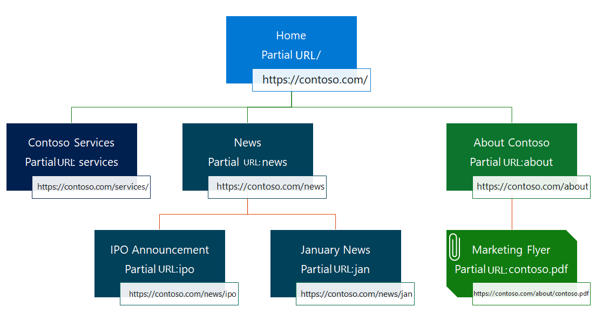
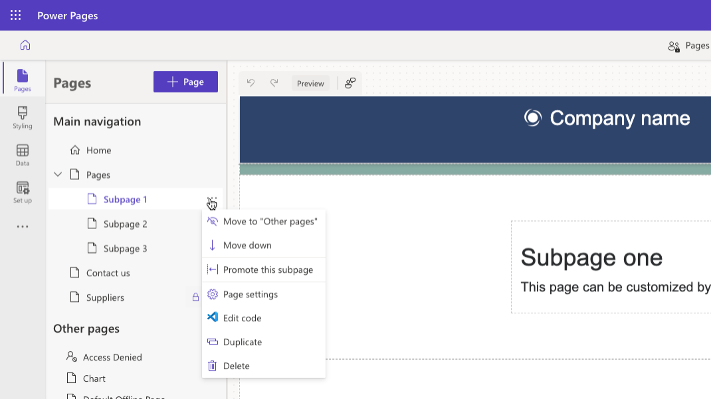
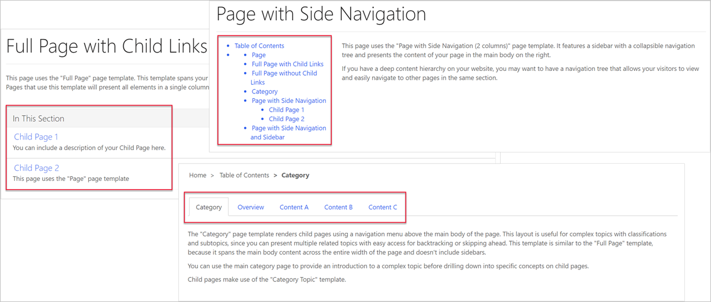

Webpages represent most of a website's content. A webpage represents a particular URL in a website. A website structure is hierarchical, and all webpages have a parent page, except for the single root (Home) page of a website.

Webpages also form the basis for including specialized table types, such as web files, shortcuts, forums, ideas, and blogs. Each row has a relationship with a parent page. Through parent and child relationships, these tables form the hierarchy of the website, that is, its site map.

> [!div class="mx-imgBorder"]
> 

## Child pages

You can view the parent-child relationships for a particular page by selecting the **Pages** workspace, which displays the ordered list of the site pages. You can rearrange the page order and add, edit, delete, promote, and demote pages. Additionally, you can determine whether the particular page is visible in the main navigation.

> [!div class="mx-imgBorder"]
> 

## Web links

A web link can link to any URL or to a webpage within the website. It's similar to a shortcut but doesn't participate in the site hierarchy. In fact, web links don't exist on their own; they're always part of a web link set. After you've defined a web link set, templates can use the set to build navigational elements, such as the main menu, footer menu, and wherever else you can use the ordered, hierarchical list of links.

When you link a web link to a webpage, the security and publishing state of the webpage applies to the web link as well. You can disable this feature with the **Disable Page Validation** option of the web link.

For example, if a **Partners Only** page requires the user to sign in, it isn't visible in the navigation for anonymous visitors. However, you might want to display the link on the page, regardless of the security, so that the **Partners Only** link is visible to anonymous visitors, but when they select it, they're redirected to a sign-in page.

For more information, see [Manage web links](/power-pages/configure/manage-web-links?azure-portal=true).

## Other navigation

The web link sets aren't the only way to navigate the website. Page templates that display links to child pages can also use the hierarchical relationship between parent and child webpages.

How the child links are rendered is entirely up to the template. Website templates include many pages that demonstrate different rendering techniques for navigation.

> [!div class="mx-imgBorder"]
> 
