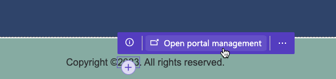
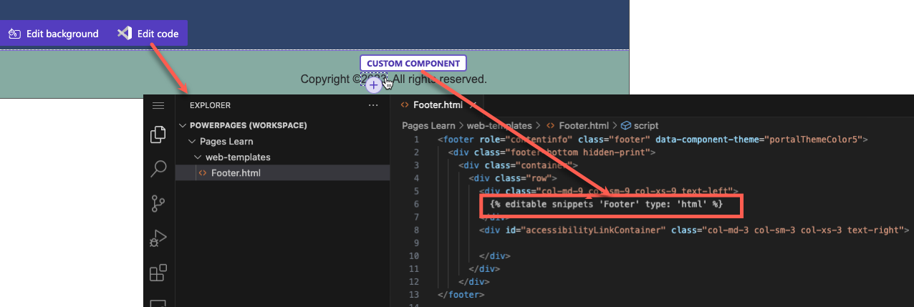
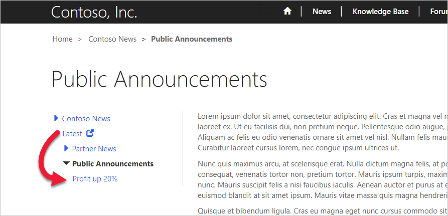

Blocks of content that you can copy and reuse can help you maintain the design and consistency of your website. Power Pages offers a few ways to reuse content.

## Content snippets

Content snippets are small chunks of editable content that a template maker can place on a page template, allowing for customizable content to populate any portion of a page, including headers and footers.

You can only create and edit snippets in the Portal Management app. If a template maker inserts a snippet as editable, then the Power Pages design studio will highlight the snippet area and enable selection mode when a user hovers their cursor over the snippet. Select **Open portal management** to open the content snippet row in the Portal Management app.

> [!div class="mx-imgBorder"]
> 

By using Visual Studio Source editor, you can add snippets to the page source as `` Liquid tag.

> [!div class="mx-imgBorder"]
> 

Content managers who are editing a snippet should be aware if the snippet is used in only one place. An example of this scenario is when you're defining the title on the website home page, or if you've used the snippet in multiple templates throughout the site, such as an official business trading name (that can change). In the latter scenario, changing the content in one place will update it wherever the snippet is used.

Snippets can contain more than text content; they can also contain HTML, layout elements, styles, or Liquid code template processing instructions. You can use a snippet wherever the need exists to make part of a website (that's not necessarily even visible) customizable and reusable.

Using snippets creates a consistent appearance and behavior for the site. Snippets help make it easier for you to translate the multilingual context, and they allow for focused editing of the parts of a page without affecting the overall content.

## Shortcuts

You can use the front-side content editor to create the hierarchical structure of your website by adding child pages, child files, and child shortcuts to a webpage. A shortcut can be a link to an external URL, another webpage or web file, or a forum on your website. Shortcuts allow you to modify the site map without actually moving content.

For example, consider scenarios when you have a **News** page that contains news categories. You might decide to list the latest company announcement as part of the news navigation. To accomplish that task, you would define a **Latest** shortcut (with the **News** page as a parent) that points to the latest announcement (which could be "buried" in the hierarchy and have a URL such as `https://www.contoso.com/news/2022/Q1/profit-up-20-percent`). As a result, your navigation would place a shortcut on a page from the hierarchy directly below the top-level news categories.

> [!div class="mx-imgBorder"]
> 

Typically, the security target defines the shortcut security. Select **Disable target validation** to define shortcut visibility by the security that's assigned to the parent page. This action determines whether the shortcut is visible in the site map or not.

## Redirects

Redirects are useful in two scenarios:

- When you want to have a simple URL that redirects to a page that's deeper in the site. For example, if a customer support page is located at `https://www.contoso.com/customer-engagement/customer-service`, you might want to publish a URL that's simpler to remember and quicker to type, such as `https://www.contoso.com/help`.
- When you want to allow for a legacy or erroneous URL to be used with the site and automatically redirect to a new URL in the site.

With page redirects, you can specify a URL that, when requested, redirects on a permanent or temporary basis to a specific webpage or web file. These redirect URLs are managed separately from the page content so that they don't have to fit directly in the web hierarchy.

> [!NOTE]
> You can only define redirects by using the Portal Management app.
