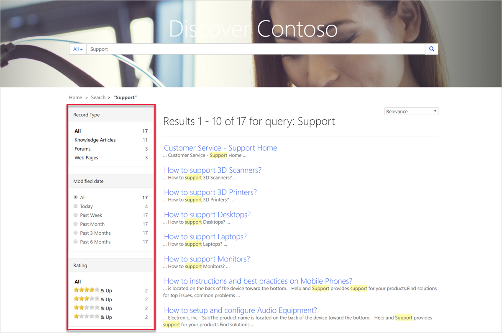

In Power Pages, you can search for rows across multiple tables by using its global search functionality. You can also search within rows of lists by using the list search functionality.

For new websites, Power Pages search uses the search capability in Dataverse to deliver results from multiple tables and columns for new websites. For existing websites, you can enable Dataverse search by setting the value for the **Search/EnableDataverseSearch** site setting to **true**.

> [!IMPORTANT]
> Power Pages search needs the Dataverse search feature to be enabled on the Dataverse environment settings.

To enable Dataverse search, follow these steps:

1. In the [Microsoft Power Platform admin center](https://admin.powerplatform.microsoft.com/?azure-portal=true), select an environment.

1. Select **Settings > Product > Features**.

1. Under **Search**, set **Dataverse search** to **On**.

1. Select **Save**.

## Global search

In Power Pages, global search allows you to search for rows across multiple tables. It also allows you to search across multiple columns and set up what columns of a table would be searchable.

Among the benefits of global search are its ability to:

- Find matches to any word in the search term in any column in the table. Matches can include inflectional words like stream, streaming, or streamed.
- Return results from all searchable tables in a single list, sorted by relevance, based on factors such as the number of words matched or their proximity to each other in the text.
- Highlight matches in the search results.
- Provide facet options that you can use to further filter search results.

### Searchable tables

The aim of global search is to locate information within the website content. All content is located within the tables that install with Dynamics 365 portals solutions. Depending on the website template that has been selected, you can search the following tables: **Web Page**, **Web File**, **Knowledge Article**, **Forums**, **Blogs**, **Ideas**, **Incident (Case)**. Directly related tables are also searched, for example, a *blog* search also includes the **Blog Post** and **Blog Comment** tables.

Each of the mentioned tables includes a **Portal Search** view that defines a set of columns that are searchable within the table. You can change the columns that are defined in these views and publish the changes to modify the scope of the search.

Knowledge articles have a feature that allows you to mark an article as **Internal Only**. Articles are searchable only if they're published and their **Internal Only** column is set to **false**.

Notes and attachments on knowledge articles and web files are searchable as well. For more information, see [Search within file attachment content](/power-pages/configure/search/file-attachment/?azure-portal=true).

In addition to the system tables that are preconfigured for search, you can now include extra tables. For more information, read [Configure additional tables for global search](/power-pages/configure/search/additional-tables/?azure-portal=true).

## Faceted search

You can search website content by using filters based on the characteristics of the content. The filters that are implemented by a faceted website search allow customers to find the content that they want in a quicker way than a traditional search.

Faceted search enables websites to have search filters that allow you to choose between items, such as forums, blogs, pages, and knowledge articles. More filters are available for specific search types. For example, you can filter knowledge articles by Record Type, Modified date, Rating, and Products to help customers find the content that they need.

> [!div class="mx-imgBorder"]
> 

You can enable or disable faceted search by using the `Search/FacetedView` site setting. Additionally, you can group similar tables together. For example, the search result type **Documents** describes knowledge article attachments and web files.

For more information, see [Faceted search](/power-pages/configure/search/faceted/?azure-portal=true).

## Configuration

Global search is highly configurable, and configuration is available for functionality and the user interface for the search results.

### Related site settings

You can set up every aspect of the global search functionality by using the site settings that are described in detail in [Related site settings](/power-pages/configure/search/overview?azure-portal=true#related-site-settings).

### Content snippets

To set up the visual aspects of the global search functionality, you can use relevant content snippets, which define elements of the search user interface, including faceted search. The configurable elements include captions, titles, tooltips, buttons, and others. Because content snippets are language-aware, you can adapt the appearance and behavior of the search for a multilingual audience.

For more information, see [Related content snippets](/power-pages/configure/search/overview?azure-portal=true#related-content-snippets).

### Attachment search

Power Pages allows you to index and search knowledge article and web file attachments. By default, this search is switched off, but you can enable it by using site settings.

> [!IMPORTANT]
> You'll need to enable **Dataverse search** for attachment search. For more information, see [Dataverse search](/power-apps/user/relevance-search/?azure-portal=true).

You can exclude individual web files from the search by setting the **Exclude From Search** column to **Yes**.

Additionally, you can modify other aspects of attachment search by using other site settings or templates. For more information, see [Search within file attachment content](/power-pages/configure/search/file-attachment/?azure-portal=true).
