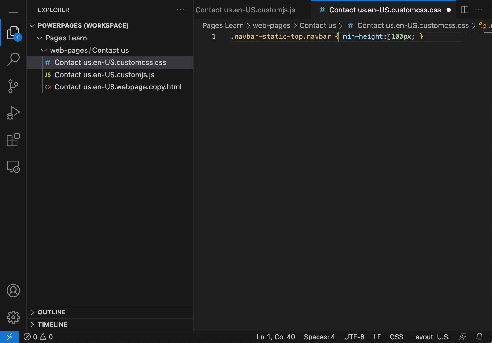
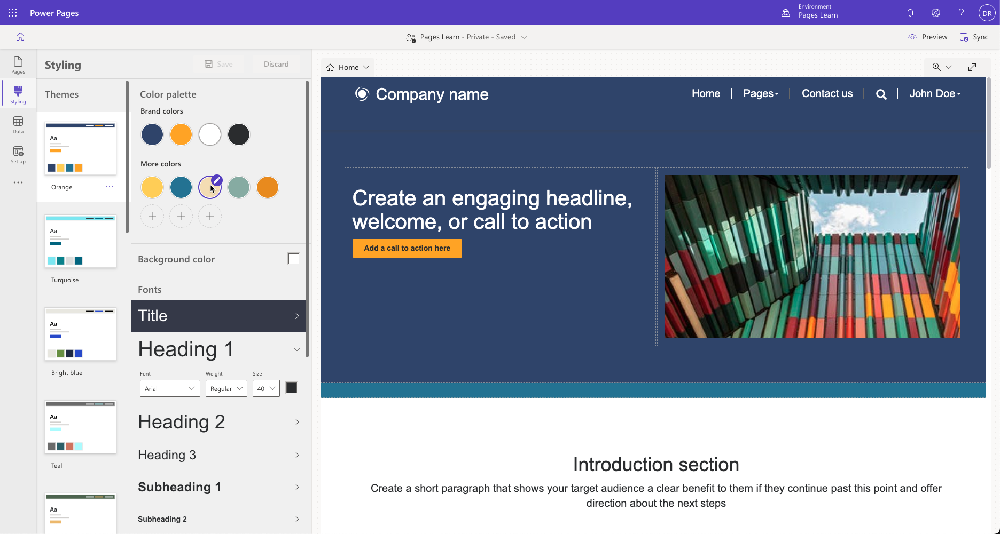

Power Pages uses the [Bootstrap front-end framework](http://getbootstrap.com/?azure-portal-true) to control the design and layout of the website. Bootstrap is a package of HTML and Cascading Style Sheets (CSS) design templates for typography, forms, buttons, navigation, and other elements, in addition to optional JavaScript extensions. One of many appealing features that Bootstrap offers out of the box is its responsive layout, which automatically adjusts your website to have an aesthetically pleasing appearance on all devices, from small phones to large desktops.

## Theme fundamentals

A theme determines the appearance of all webpages in your website to ensure visual consistency. The theme controls navigational structure, the banner, colors and fonts, and other visual elements of a webpage.

You can implement the web templates that are included in Power Pages by using standard Bootstrap components with minimal other custom styles. Therefore, the websites that are based on these templates can take advantage of the customization options that are provided by Bootstrap. You can customize the theme in a way that's applied consistently to the entire website.

### CSS on webpages

Cascading Style Sheets (CSS) is a language that determines the style of a webpage by describing how its HTML elements display, including text, fonts, colors, backgrounds, borders, and margins.

Making changes to the style of your website pages can be as simple as applying CSS statements directly to a page. When you edit page content by using Visual Studio Code, CSS is available as a separate file. The content of that file is then stored in the **Custom CSS** column of the webpage row. That CSS is included and part of the page, and styles are applied automatically. For example, if you need to increase the height of the navigation bar in the upper part of a home page to fit a logo, you can edit the CSS file and add a custom CSS statement.

```css
.navbar-static-top.navbar { min-height: 100px; }
```

> [!div class="mx-imgBorder"]
> [](../media/page-css.png#lightbox)

> [!NOTE]
> CSS statements that are added directly to a webpage apply to that webpage only.

This process works for small adjustments on a single page or when a page requires unique design, for example, a specific event landing page. A better and more flexible approach is to record customizations in one or more CSS files and then apply them to the entire website or parts of it.

## Apply customizations

Power Pages offers a comprehensive collection of themes and tools for designing your website. Select from several themes to use on your website and further personalize them by using the styling options.

The **Styling** workspace in Power Pages design studio controls what CSS styles are applied to the website and enables you to implement universal site designs. You can incorporate company branding modifications and view the alterations in the app window's right preview pane. Styling provides multiple predesigned themes, and for each, you can modify the color scheme, background color, font types, button designs, and section spacing.

### Themes

Themes create an overall appearance and behavior for the site by defining styles for various text elements, buttons, links, and section layouts. If the site requires more customizations, you can use the **Manage CSS** feature.

In the **Styling** workspace, you can choose from the available themes. After selecting a theme, you can further customize individual elements to create the desired styling.

> [!div class="mx-imgBorder"]
> [](../media/theme-selection.png#lightbox)

### Manage CSS

To access the **Manage CSS** feature, select the ellipsis (**...**) menu and then select **Manage CSS** on the theme tile.

All Power Pages websites have the following files already included on all pages: `bootstrap.min.css`, `theme.css`, and `portalbasictheme.css`. These files define styles for your entire website. You can upload more CSS files by using the **Upload** link and then edit them in Visual Studio Code editor. For more information, see [Manage CSS files in Power Pages](/power-pages/configure/manage-css/?azure-portal-true).

You need to consider which approach to take for style modifications for your website:

- Create complete styling for the entire site and then replace the content of a CSS file. This process works well if you have access to good designers who can ensure that all relevant elements are defined. This approach creates centrally controlled styling and ensures consistency throughout the website.
- Redefine only the elements that require modifications, such as colors and font size. Create and upload the CSS file that contains only these incremental adjustments. This process works well if your target design is close to the design that's included with the selected template and only minor styling modifications are required. This approach allows incremental modifications that you can undo.

> [!WARNING]
> If you decide to overwrite `bootstrap.min.css` or `theme.css` files, make sure that you download a backup copy of these files prior to replacing them. If your replacement CSS is invalid or incomplete, you might not be able to undo the replacement. Consequently, you'll need to restore the content of these files if the website is rendered non-functional.

### Localized CSS modifications

Instead of applying CSS to the entire site, you can upload CSS as web files by using the Portal Management app. The CSS that's contained in the web file applies to the file's parent page and all descendants of that page, which makes it possible for you to build fully customized sections of your site.

For example, if you want to apply different styling to your **News** section and all the new articles beneath it, go to **News**, create a child web file with a **.css** extension, and then upload your CSS file (the name doesn't matter). Then, the style will apply to the **News** section and its content only.

> [!IMPORTANT]
> The partial URL must end in **.css** for the website to recognize it and apply it to the webpage and its child pages.

### Customize bootstrap

The standard way to create a custom version of Bootstrap is [through the official Bootstrap site](http://getbootstrap.com/?azure-portal-true). However, due to the popularity of Bootstrap, many other source sites have also been created for this purpose. These sites might provide a more user-friendly interface for Bootstrap customization or predesigned versions of Bootstrap for you to download. [The official Bootstrap customize](http://getbootstrap.com/customize/?azure-portal-true) site has more information about Bootstrap customization.

> [!TIP]
> When you're customizing Bootstrap, only select elements that require modification. For example, if you only want to replace the fonts with your corporate standard fonts, then select the typography components of Bootstrap, which reduces the chances of accidentally rewriting other CSS elements.

After you've set up Bootstrap, it will generate one or more files that you would want to upload as web files. Unless your intent is to completely *replace* the original styles, make sure that you don't use `bootstrap.css`, `bootstrap.min.css`, `theme.css`, or `theme.min.css` in your partial URLs because of how Power Pages handles multiple CSS files.
