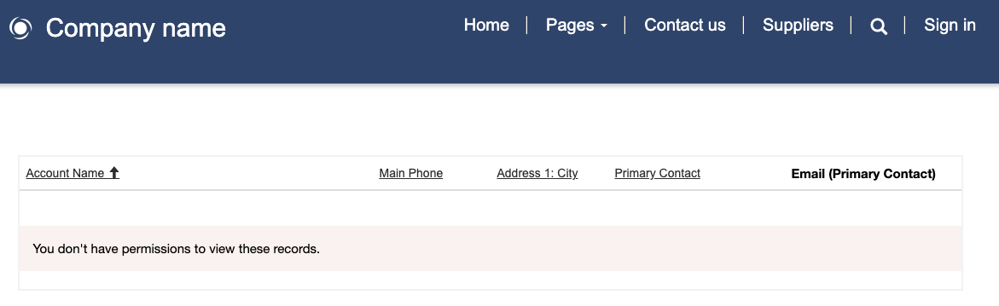
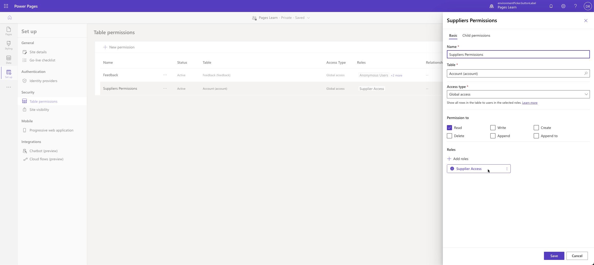

The purpose of this hands-on lab is to set up table permissions to help secure access to Microsoft Dataverse table rows.

The exercises work best when you have sample data to work with. Depending on the environment that you're working with, you might want to install some sample data to assist with the exercises. Microsoft Power Platform allows you to add sample data as needed. If the environment that you're working in doesn't have sample data installed, follow the steps in the [Add or remove sample data](/power-platform/admin/add-remove-sample-data/?azure-portal=true) documentation to install the sample data into your environment.

## Learning objectives

The goal for these exercises is for you to learn how to:

- Use the Power Pages design studio to set up table permissions.

- Create and assign a web role.

- Create a table permission row.

- Link the table permission to the web role and then associate the web role to a Dataverse contact.

## Prerequisites

For this exercise, you need to have the following parameters set up in your environment:

- A provisioned Power Pages website. If you don't have a website available, follow the [Create a site with Power Pages](/power-pages/getting-started/create-manage/?azure-portal=true) instructions.

- Access to the Power Pages design studio.

## Scenario

Your organization has provisioned a Power Pages website and wants to create a directory of supplier organizations. After initial provisioning of the website pages and of the list to manage the supplier directory, administrators have discovered that no users have access to the data, regardless of their security roles.

Your organization wants to provide access to the data to the specific authenticated users but not to anonymous visitors.

### High-level steps

To finish the exercise, complete the following tasks:

1. Add a webpage with a list component that shows the Account table.

1. Register a new user on the website by using local authentication.

1. Create a new **Web Role** row for the supplier list access.

1. Create a **Table Permission** row, providing global read access to the Accounts table to the users who have the supplier list access role.

1. Link the website user to the web role and then link the web role to the table permission.

1. Confirm that the user who has the supplier list access role has access to the list of accounts.

## Detailed steps
Follow the detailed steps in the following sections to complete this exercise.

### Launch Power Pages design studio

Follow these steps to launch Power Pages design studio:

1. Sign in to [Power Pages](https://make.powerpages.microsoft.com/?azure-portal=true).

1. Select the correct environment in the upper-right corner.

1. Select the website and then select **Edit**. 

### Create the Suppliers webpage

To create the **Suppliers** webpage, follow these steps:

1. Select the **Pages** workspace.

1. Select **+ Page**.

   - Enter **Suppliers** as the page name.

   - Select the **Start from blank** template.

   - Select **Add**.

### Add a list
To add a list, follow these steps:

1. On the page canvas, in the empty section, select the **List** component.

    > [!NOTE]
    > If the **List** component isn't visible, select the ellipsis (**...**) menu to show more components.

1. Enter the following information in the **Add a list** dialog. If prompted, select **+ New list**.

    - **Choose a table** - Account

    - **Select the data views** - Active Accounts

    - **Name your list** - Suppliers

1. Select **Done**.

1. Select **Preview > Desktop site** to view the page. You'll receive a message indicating that you don't have permission to view the rows.

### Add a website user
Follow these steps to add a website user:

1. Select the **Sign in** menu item.

1. Select the **Register** tab.

1. Fill in the **email**, **username**, and **password** information.

1. Select **Register**. The profile page will appear.

1. Fill in the **First Name** and **Last Name** columns and then scroll down and select **Update**.

1. Close the page.

### Add a web role and assign a contact
Follow these steps to add a web role and assign a contact:

1. In Power Pages design studio, select the ellipsis (**...**) menu and then select **Portal Management**. 

1. In the Portal Management app, in the **Security** area, select **Web Roles**.

1. Add a new **Web Role** row and then enter the following values:

    - **Name** - Supplier List Access

    - **Website** - your website

1. Save the row.

1. Select the **Related** tab and then select **Contacts**.

1. Select **Add Existing Contact**.

1. From the list on the right, select the contact that you registered on the website and then select **Add**.

1. Keep the Portal Management app open.

### Create the table permission
Next, create the table permission by following these steps:

1. Switch to Power Pages design studio.

1. Select the **Set up** workspace and then select **Table permissions**.

1. Select **+ New permission** and then enter the following values:

   - **Name** - Suppliers Permission

   - **Table Name** - Account

   - **Access type** - Global access

   - **Permission to** - Read

1. Select **Save**.

### Link web role and table permissions
To link web role and table permissions, follow these steps:

1. Switch to the Portal Management app.

1. On the **Web Role** form, select the **Related** tab and then select **Table permissions**.

1. Select **Add Existing Table Permission**.

1. From the list on the right, select **Suppliers Permission**.

1. Select **Add**.

1. Switch to design studio, select the ellipsis (**...**) menu, and then select **Edit** for the **Suppliers Permission** row. 

1. The **Properties** panel should now show the associated **Supplier List Access** role.
   
   > [!div class="mx-imgBorder"]
   > 

1. Select **Cancel**.

### Verify access
Your last task is to verify access by following these steps:

1. Select **Preview > Desktop**.

1. Select **Sign in** and then enter the username and password for the website user that you previously created.

1. Go to the **Suppliers** page, where you should be able to view the list of account rows.

    > [!div class="mx-imgBorder"]
    > 

1. Select the username and then select **Sign out**. The page should display a message about not having permission to view the rows.
